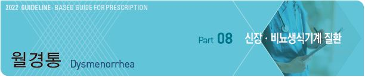
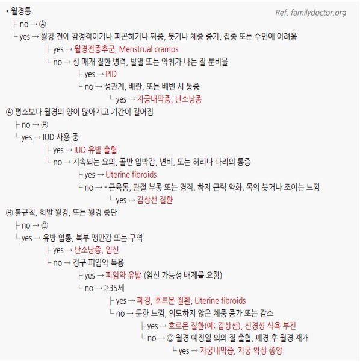
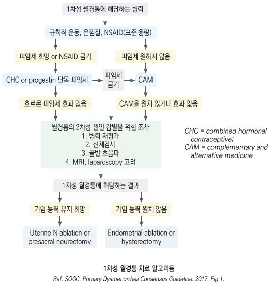
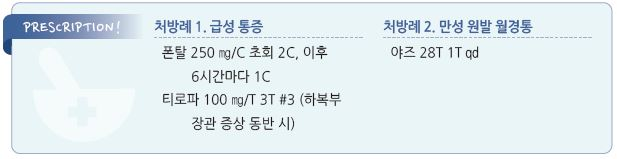

# 월경통 Dysmenorrhea

## 일반 사항
- 다른 병리가 없는 상태에서 골반에서 기원하는, 월경 시작 시기에 시작되어 12~72시간 동안 지속되는 하복부 통증

- 여성 골반통의 가장 흔한 원인 중 하나; 월경 여성의 50%가 영향을 받으며, 10% 정도에서 심각한 증상 경험; 20~24세에

    가장 흔함

- 원발성 : 기질적 질환 없이 사춘기(초경 후 6~12개월째)에 시작. 나이가 들수록 완화, 통증 기간 감소

- 2차성 : 기저 질환에 의해 발생. 초경 후 어느 연령에서나 발생 가능(보통 초경 수년 후에 발생); 2차성 월경통 의심 시 의뢰 고려

## 원인

#### 원발성 월경통
- estrogen 및 progesterone의 연속적인 자극과 관련된 prostaglandin 전구물질 저장 증가

    → 자궁근 및 혈관 수축, 통증에 대한 과민 반응

#### 2차성 월경통
- 기저 골반 병리로 발생 : 자궁내막증, 난소낭종, 유착, 골반내감염

### 위험 인자

#### 원발성
- 불규칙 월경, 과다 월경

- 빠른 초경(＜12세)

- 젊은 연령(＜30세)

- 우울, 불안, 스트레스

- 흡연, 음주

- 출산력 없음

- 가족력

#### 2차성
- 골반 감염

- 자궁 내 장치

- 골반 기형

- 자궁내막증 가족력

## 임상 양상
※ 원발성 월경통과 2차성 월경통은 같은 임상 양상을 보임

- 하복부/치골 상부의 경련 또는 통증; 간혹 허리, 대퇴부 방사통

  • 통증은 월경 출혈 직전 또는 시작과 함께 발생, 경증~중증 강도로 간헐적으로 발생; 1~3일에 걸쳐 점차 감소(3일 넘게

    지속되는 경우는 드묾)

- 구역, 설사, 복부 팽만감/복통

- 불안, 피로감, 두통, 어지럼, 몸살

## 진단

### 검사
- 보통 필요 없음

- 검사 항목 : 임신 검사, 성매개질환(임질, 클라미디아), 골반 초음파/MRI, laparoscopy

#### 대상
- 초경 첫 6개월 및 무배란 환자에서의 월경통(예: 생식관폐쇄)

- 수년간 증상이 없다가 갑자기 발생

- 관습적 치료로 호전되지 않음

- 2차성 월경통 또는 기질적 이상, 병리적 질환이 의심됨

### 증상/병력에 따른 월경 주기 문제의 감별
    

---

## Management

## 비-약물 치료
- 국소 온열 치료(온찜질), 고주파 TENS, 규칙적 운동, 영양 섭취

- 요가, 침, 마사지 : 증거 불충분

## 약물 치료
- NSAID or 호르몬제 → 2~3개월 내 반응하지 않으면 교체 또는 병용 투여 고려

    → 병용 투여에도 반응하지 않으면 2차성 월경통 감별

### NSAID
- 작용 : prostaglandin 합성을 억제시켜 통증 및 월경량을 줄임

- 월경 예정일 1~2일 전 또는 월경 출혈이 발생하자마자 투약을 시작하여 2~3일간 규칙적 투여

- 보통 COX-1 억제제가 acetaminophen이나 COX-2 억제제보다 효과적

- 효과가 적으면 다른 종류의 NSAID로 교체

- ibuprofen : 400 ㎎ tid [부루펜]

- naproxen : 275 ㎎ tid [아나프록스]

- mefenamic acid : 500 ㎎ 1회 이후 250 ㎎ qid [폰탈]

### 호르몬 피임제
- 자궁내막증에 의한 월경통 치료의 1차 선택제

- 특히 원발성 월경통에 유효

- 피임을 원하는 여성에서 선호

- 첫 복용 주기부터 효과가 나타날 수 있지만 충분한 효과 발현까지 수개월이 소요됨

- 연속 투여 또는 위약 투여 기간을 짧게 하는 것이 초기 통증 조절에 효과적이며(6개월 후에는 비슷) 출혈이 적을 수 있음

- 2차성 월경통의 경우 복합 호르몬제를 1차로 선택(프로게스틴 단독제도 가능)

- 복용 중 간헐적 출혈 발생 가능(특히 치료 시작 2~3개월간)

- 중단 시 금단 출혈 및 월경통 발생 가능

- 호르몬제 금기 및 부작용에 대하여 유의 (☞ p.700)

- [야즈] (28T)(비보험) : 24일간 연분홍색 → 4일간 흰색(위약) 복용

- [야스민] (21T)(비보험) : 21일간 복용 → 7일간 휴약

- [미레나] 자궁 내 장치 : levonorgestrel 20 ㎍ 자궁 내 삽입; 삽입 후 5년간 유효

### 기타
- 오메가-3 [오마코], Mg [마그네스], 저지방 채소 식이, 생강(750~2,000 ㎎ 월경 첫 3~4일), 호로파, fish oil, 쥐오줌풀,

    Vit B1(100 ㎎), zataria, Zn : 일부에서 효과, 고품질의 증거는 불충분

## 예방
- 원발성 : 동물성 지방 섭취를 줄임

- 2차성 : 성 매개 감염 주의

    

> **질병코드**
N94 여성생식기관 및 월경주기와 관련된 통증 및 기타 병태

