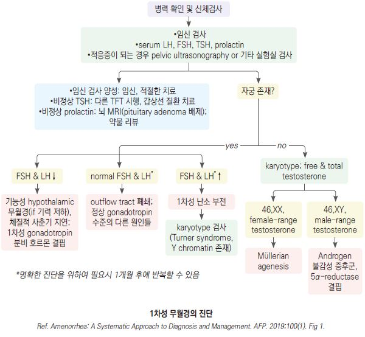
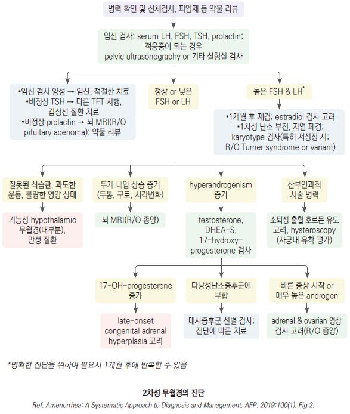

# 무월경 Amenorrhea

## 분류 및 원인
1차성 무월경

- 정의 : 15세까지 초경이 없거나(15세까지 98%에서 초경 출현), 유방 발달 시작(thelarche) 후 3년(~4년) 내 초경(menarche) 없음

- 빈도 ＜1%

- 원인 : 타고난 사춘기 지연, 염색체 이상(예: gonadal dysgenesis), hypogonadotropic hypogonadism, 생식기 발달 장애,

    transverse vaginal septum/imperforate hymen, pituitary Dz

#### 2차성 무월경
- 정의 : 초경 이후 3개월(~6개월) 연속 월경 없음

- 빈도 5(3~7)%

- 원인

  • physiologic : 임신/수유, 폐경

  • Hypothalamic Dz : 심한 비만, 영양 장애(예: 다이어트, IBD, 영양 흡수 장애, 소모성 질환), 심한 운동(스포츠 무월경), 우울, 스트레스

  • 내분비 질환 : 갑상선저하증, hyperprolactinemia, 비조절 당뇨병, 쿠싱증후군

  • 난소 질환 : 다낭성난소증후군, 난소 부전, 난소 종양

  • 약물 : 항우울제, 항정신병제, 화학요법, 피임제

## 진단
- 임신 배제

- BMI, 식이 습관, 육체적/정신적 스트레스, 병력

### 검사
- 대상 : ① 13세까지 유방 발달 등 2차 성징이 없거나 신장 하위 ≤3%, ② 15세까지 무월경

- 실험실 검사 : s/u-hCG, LH, FSH, prolactin, TSH, CBC, ESR

 •선택 : hyperandrogenism 의심 시 testosterone, 17α hydroxyprogesterone; 염색체 이상 의심 시 karyotyping

- 영상 검사 : 골반 초음파, MRI(뇌, 골반)

- 복강경 검사, hysterosalpingogram

    

    

---

## Management

### 치료 방침
- 원인 질환 치료(예: 갑상선 질환, hyperprolactinemia) 

- 영양, 적정 체중 관리 : 비만인 경우 감량, 체중이 너무 적은 경우 증량

- 심한 운동/활동을 하는 경우 운동량을 줄이고(25~50% 감량) 칼로리 섭취를 늘림

- 스트레스 관리

- 호르몬제 치료(예: hypogonadism, ovarian insufficiency)

- 저용량 corticosteroid(예: adult onset congenital adrenal hyperplasia)

- 수술적 치료(예: Mullerian agenesis, malignancy)

- 합병증으로서의 골다공증 평가 및 관리 (☞ p.804)

### 호르몬제
    (☞ p.700)

- estrogen(경구 피임제) : 불규칙한 주기에 대하여 투여

- medroxyprogesterone acetate(MPA) : 10 ㎎/d ×10d [프로베라]

  •hypothalamic–pituitary–gonadal axis가 유효하면 마지막 투여 7일 내 소퇴성 출혈 발생

- 복합 경구 피임제 : estrogen 50 ㎍ 또는 conjugated estrogen 0.625 ㎎ ×25d with progesterone 최소 10d [야스민](비보험)

  •uterus and lower genital tract이 정상이고 HPG axis에 이상이 있으면 소퇴성 출혈 발생

- 호르몬제 금기 및 부작용에 대하여 유의

- 호르몬 보충 요법 적용 시 6개월 후에 중단하고 자발적 월경 재개를 평가

> **질병코드**
N91.0 원발성 무월경

N91.1 이차성 무월경
