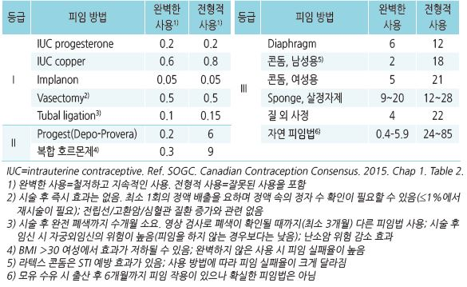
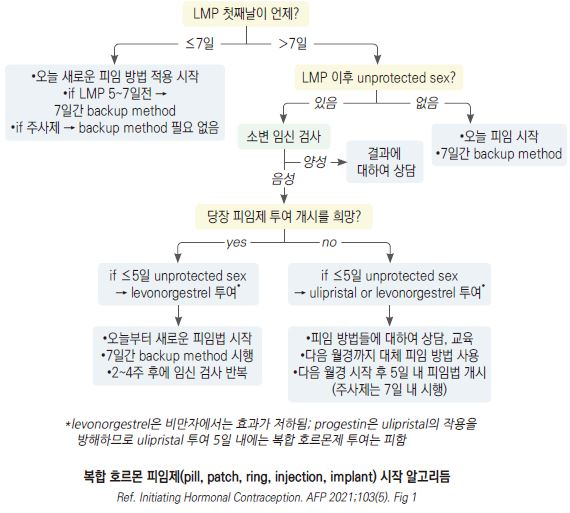
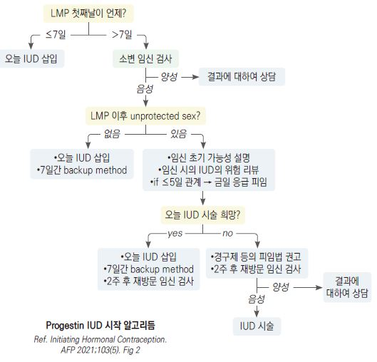
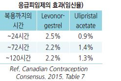

# 피임 Contraception

## 일반 사항
- 호르몬제를 이용한 피임은 월경 주기의 어느 지점에서나 시작할 수 있음

- 임신 중 호르몬 피임제의 사용은 임신이나 태아에 문제를 일으키지 않음

- 호르몬제 피임제 사용을 위한 Pap test는 권고하지 않음

#### 피임법 사용 중 1년 내 의도하지 않은 임신율
    

## Estrogen/Progestin 복합제 (combined hormonal contraceptive, CHC)
- 작용 : 배란 억제, 자궁 경부 점막 비후, 자궁내막 변화(정자의 이동 및 착상 방해)

### Estrogen 금기증
- ≥35세의 흡연자(≥15개비/d)

- 활동성 간질환

- 6주 이내의 수유 여성

- 조절되지 않는 고혈압(SBP ≥160, DBP ≥100)

- 유방암 과거력

- 큰 수술 후 장기간의 부동 상태

- 응고 장애 병력

- 응고 돌연변이 유전자

- CAD 위험 인자 중복

- 전신홍반루푸스

- 증상이 있는 편두통

- 판막 심장병

- DVT/폐색전증 병력 및 항응고제 치료 중

- 혈관 질환/망막/신경/신장병증이 있는 당뇨병

- 복합 경구피임제와 관련한 담즙 정체 병력 또는 현재 담낭 질환

- 혈관 질환/망막병증/신경병증/신장병증이 있는 당뇨병

### 경구제
- 작용 : 주로 배란 억제

- 장점 : 효과적, 규칙적 월경 유도, 월경량/월경통/배란통 감소, 난소암/자궁내막암/기능성 난소낭종/골다공증 위험 감소,

    여드름 개선

- 부작용 : 질 출혈, 무월경, 유방통, 우울, 다모증, 구역, 복부 팽만, 두통; 초기 수개월간 심함

  •중증 부작용 : stroke, thromboembolism, 고혈압, 심근경색, cholestatic jaundice

  •저용량(ethinyl estradiol ＜50 ㎍) 투여 시 심혈관 사고 위험의 증가는 없음

- 약물 상호 작용 : phenytoin, barbiturates, topiramate, carbamazepine, rifampin, antiretroviral

- 임신 직전 또는 임신 중 복용으로 태아에 유의미한 위험이 증가하지는 않음

- 28일 주기법에 있어서 ‘4일간 위약 투여법’이 ‘7일간 위약 투여법’보다 배란 억제, 월경 기간 단축, 호르몬 소퇴 증상(예: 두통,

    피로, 월경통, 복부 팽만) 감소의 장점이 있을 수 있음

- 월경 횟수를 줄이기 위하여 위약을 3개월에 한 번만 복용하거나 위약 투여 기간 없이 복용하는 방법을 사용할 수 있음

#### 용법
- 월경 주기 첫날(또는 월경 시작 후 첫 일요일)부터 복용, 매일 같은 시간에 복용

  •복용 1주차에 7일 이상 지속 복용할 때까지 다른 피임법 사용 또는 성관계 중지

- 2, 3주차 미복용 시 대처

  •1일간 미복용 : 가능한 한 속히 복용

  •2일간 미복용 : 2일 동안 2배 용량씩 복용

  •3일간 미복용 : 새로운 주기로 복용 시작 또는 7일 연속 복용할 때까지 다른 피임법 사용(해당 주기의 hormone-free interval은

    두지 않음)

#### 제품 예
- [야스민] (21T) : ethinyl estradiol(EE) 30 ㎍ + drospirenone 3 ㎎, 21일간 복용 → 7일간 휴약

- [머시론] (21T) : EE 20 ㎍ + desogestrel 0.15 ㎎, 21일간 복용 → 7일간 휴약

- [야즈] (28T) : EE 20 ㎍ + drospirenone 3 ㎎, 24일간 연분홍색 → 4일간 흰색(위약) 복용

- [Seasonale] (91T) : EE 30 ㎍ + levonorgestrel 0.15 ㎎, 12주간 복용 → 1주간 위약 복용

- [Lybrel] (28T) : EE 20 ㎍ + levonorgestrel 0.09 ㎎, 위약 없이 연속 복용

### 주사제
- medroxyprogesterone acetate 25 ㎎ + estradiol cypionate 5 ㎎ IM, 1개월 마다

- 부작용 : 불규칙한 자궁 출혈(반복 사용 시 감소)

### 패취
- 용법 : 주 1회 같은 요일에 1매씩 교체 부착, 3주 부착 후 1주 휴약; 작용 기간이 최장 10일이므로

교체가 1~2일 늦어져도 지장 없음 (✽시판 제품 없음)

- 부작용 : 경구제와 같은 부작용, 국소 피부 반응; 유방통, 구역/구토, 월경통, 정맥혈전색전증(VTE) 위험이 경구제보다 많음;

    질 출혈은 보다 적음

- 비만(＞90 ㎏) 시 효과 감소

### 자궁 내 장치
- 용법 : 삽입 3주 후 제거 및 1주 휴약; 작용 기간이 최장 35일로써 약간의 지연 교체는 허용

  •사용 중 빠져 나오면 씻어서 재 삽입

- 부작용 : 경구제와 같은 부작용(유방 불편감/구역/구토는 보다 적음). 질염/질 분비물 증가

- EE 2.7 ㎎, etonogestrel 11.7 ㎎ : 매일 EE 15 ㎍, etonogestrel 0.12 ㎎ 방출

    

## 프로게스틴 단독

### 일반 사항
- 작용 : 배란 억제, 자궁 경부 점막 비후, 자궁내막 변화(thinning)

- 장점 : 수유에 대한 영향이 없음, 복합제보다 두통/위장 장애 부작용이 적음, 월경 실혈 및 월경통 적음,

    estrogen 금기 환자에서 사용할 수 있음(stroke, MI, VTE 위험을 증가시키지 않음)

- 대상 : 비만, DVT 병력, 장시간 움직일 수 없는 경우, estrogen을 복용할 수 없는 경우, 항전간제 복용(lamotrigine), 수유 중

- 부작용 : 불규칙 월경/무월경, 점상 질 출혈(복용 시작 후 수개월간), 공복감(체중 증가), 유방통

- 금기 : 절대 금기증은 없음

### 경구제 (progestogen only pill, POP)
- 용법 : 월경 주기 첫날에 시작하여 중단 없이 매일 같은 시간에 지속 복용

- 복용을 중단하면 즉시 임신 가능

- 3, 4세대 progestin은 높은 선택성이 있고 androgen 특성이 적음

- 1세대 : norethindrone, ethynodiol

- 2세대 : norgestrel, levonorgestrel

- 3세대 : desogestrel, norgestimate; 혈액 응고 위험 가능성이 1,2세대보다 높음

- 4세대 : drospirenone; 17a-spironolactone 유도체; 여드름/부종 부작용이 1,2세대보다 적음

>   ✽복합제로 판매되며 경구 단독 제품은 응급 피임약만 있음

### 주사제 : Depo-medroxyprogesterone acetate (DMPA)
- 효과 : 경구제와 비슷

- 용법 : 3개월마다 150 ㎎ IM 또는 104 ㎎ SC; 4개월까지 효과

- 마지막 주사 후 평균 10개월(~18개월) 이후 임신 가능 상태로 회복

- 항전간제 대사에 영향을 주지 않으며 약간의 발작 감소 효과가 있어 발작 환자에서 유용

- 부작용 : 경구제와 비슷; 불규칙 출혈 후 점차 무월경, 두통, 체중 증가, 골밀도 감소(골밀도 감소는 혈중 estradiol 수준 감소와

    관련되며 투약 중단 후 회복되고 골절 위험 증가는 입증되지 않음)

>   ✽FDA에서는 2년 이내의 사용을 권고, WHO는 기간을 제한하지 않음

### 자궁 내 장치 : Levonorgestrel IUD
- 작용 : 자궁 경부 비후, 자궁내막 탈락/위축, 배란 장애, 정자/난자에 대한 독성 작용(염증 반응)

- 월경량 감소 및 자궁내막증에 의한 통증 감소 효과가 있음 (✽과다 월경에 대하여 FDA 승인)

- 용법 : 월경 기간 또는 월경 시작 7일 이내 삽입

- 부작용 : 불규칙 월경(주로 첫 3~6개월, 이후 호전)

- 금기 : septic abortion, postpartum sepsis, uterine cavity 기형, 임신영양모세포병, 자궁경부암, 자궁내막암, 설명할 수 없는

    질 출혈, symptomatic PID, 최근의 화농성 자궁경부염

- [미레나] : levonorgestrel 52 ㎎, 매일 20 ㎍ 방출, 5년간 작용

- [제이디스] : levonorgestrel 13.5 ㎎, 매일 14 ㎍~(차츰 감소) 5 ㎍ 방출, 3년간 작용; 미레나보다 출혈 기간이 긺

    

### 이식제 : Etonogestrel
- 작용 : 경구제와 동일

- 부작용 : 경구제와 유사; 불규칙 월경(주로 첫 6~12개월, 이후 호전)

- [임플라논 엔엑스티 이식제] : etonogestrel 68 ㎎, 팔 안쪽에 삽입, 3년간 유효

## 살정자제 (Spermicide)

### 자궁 내 장치 : Copper IUD
- [노바-티] : 삽입 후 5년마다 교체

- 부작용 : 출혈, 경련

### 좌제 : nonoxynol
- [노원 질좌제] : nonoxynol-9 100 ㎎, 성교 10분~1시간 전 질 깊숙이 삽입

- 부작용 : 질 상피를 손상시키고 HIV 등의 감염 위험을 증가시킬 수 있음

## 응급 피임제

### 일반 사항
- 작용 : 강력한 androgen 작용, 배란 억제, 착상 방해

- 성교 후 가능한 한 빨리 복용해야 효과적; 배란 또는 착상 후 복용 시 효과 없음

- 부작용 : 구토, 복통, 설사, 피로, 두통, 어지럼, 유방통, 월경 변화 (✽복용 3시간 내 구토 시 재복용)

- 임신 중 복용 시의 위험 보고는 없으나 임신 중에는 복용하지 않음

- 응급 피임 방법으로 경구 응급 피임제 + Copper IUD(성교 5일 내) 삽입이 가장 효과적이며, 단일 방법으로는 copper IUD가

    가장 효과적임

- levonorgestrel 복용 후 24시간 내/ulipristal acetate 복용 5일 후 호르몬 피임을 시작할 수 있으며, 호르몬 투여 후

    levonorgestrel 복용자는 7일간/ulipristal acetate 복용자는 14일간 다른 방법으로 피임 또는 성관계 중지

- 응급 피임 후 다음 월경 예정일 또는 21일 내 월경을 하지 않는 경우 임신 여부 확인

### 약제

#### Levonorgestrel
- 작용 : 대용량 progesterone

- BMI ≥25에서 효과가 저하될 수 있음

- 용법 : 성교 72시간 내(가능한 한 12시간 내) 복용; [노레보원] 1.5 ㎎/T 1T 1회

#### Ulipristal acetate
- 작용 : 선택적 progesterone 수용체 조절제로서 progesterone의 배란 및 자궁에

     대한 작용을 방해

- 용법 : 성교 120시간(5일) 내 복용; [엘라원] 30 ㎎/T 1T 1회

#### Mifepristone
- 작용 : progesterone receptor에 결합하여 progesterone 작용을 차단 → 자궁 내막 파괴, 유산 유도

- 부작용 : 복통, 피로감, 질 출혈; 허가 안 됨

## 출산 후 피임

### 수유하지 않는 경우
- 출산 후 ＜21일 : combined hormonal contraceptive(CHC) 금지

- 21일~42일 : VTE 위험이 없는 경우 CHC 사용 가능; VTE 위험이 있는 경우 CHC 금지

- ＞42일 : CHC 사용 제한 없음

- ＜6주 : progestogen only pill(POP) 사용

### 수유 중인 경우
- 출산 후 ＜6주 : POP 사용 가능, CHC 금지

- ≥6주 : POP 사용 제한 없음, CHC 회피

- ≥6개월 : CHC 사용 가능

- 수유 중 경구 응급 피임제 사용 제한 없음; copper or progestin IUD는 출산 직후 삽입 가능

## 일시적 월경 조절

### 지연시킴
- progesterone : 다음 월경 예정일 2주(최소 5일) 전부터 복용. 가능한 한 매일 같은 시간에 복용;

    복용 중단 2~3일 내에 월경 시작 [프로베라]

### 앞당김
- 복합 경구용 피임제 : 앞선 월경이 끝난 날부터 10일 이상 매일 정해진 시간에 복용;

    복용 중단 2~3일 내에 월경 시작 [야스민]
