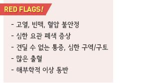
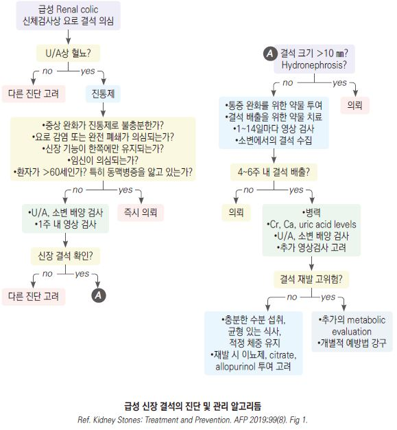
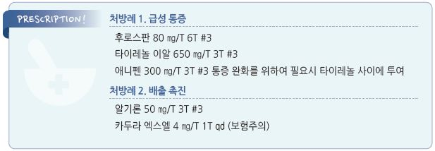

# 요로 결석 Urolithiasis

## 일반 사항
- 신장부터 요도까지의 요로 계통의 결석

- urinary crystal이 결합하여 nidus를 만들고 calculus로 성장

  •supersaturation과 dehydration이 salt 농도를 높이고 응집시킴

- 대부분 신장 유래, 드물게 bladder stone

  •bladder stone 원인 : 장기간의 방광 도뇨관 유치, 약물

- 호발 : 중년 남성; 여성에서의 발생률도 증가 추세

- 경과 : ≤5 ㎜ 시 ⅔, ≤10 ㎜ 시 ½에서 자연 배출. 평균 12일 소요

  •4주 이내 배출되지 않으면 자연 배출 가능성 낮으며 의뢰 고려

- 유병률 : 일생 동안 10%에서 경험. 30~50%에서 재발 •재발률 : 5년- 25~50%, 10년- 50%

### 위험 인자
- 가족력

- 신장 결석 병력

- 식이 : 많은 단백질, 정제 탄수화물, 소금, 탄산음료 섭취

- 신장 기형 : 말굽콩팥, 요관신우접합부 폐쇄

- 불완전 방광 비움 : 신경인성 방광, BPH

- 비만, 좌식 생활/직업

- 여름철(높은 습도, 고온)

- 흡수 장애 질환 : 크론병, 위장 우회술, 셀리악병

- 심혈관 질환, 인슐린 저항성, 나쁜 혈압 또는 당 조절

- 약물 : carbonic anhydrase inhibitor(topiramate, zonisamide, acetazolamide), steroid, antiretroviral protease

    inhibitor(indinavir), 통풍 치료제(probenecid), 이뇨제(furosemide, bumetanide, torsemide, triamterene),

    충혈제거제(guaifenesin, ephedrine)

## 종류
- Ca oxalate, Ca phosphate, struvite, uric acid, cystine; mixed stone

### Calcium stone
- ＞80% 차지; 주로 Ca oxalate, 드물게 Ca phosphate

#### 원인
- 소변 : 적은 소변량, 소변 Ca↑, 소변 oxalate↑(CaOx stone), citrate↓, pH ＞7.5(CaP stone)

- 해부학적 이상 : medullary sponge kidney, horseshoe kidney

- 식이 섭취 : 수분↓, Ca↓, oxalate↑, K↓, Na↑, sucrose↑, fructose↑, phytate↓, Vit C↑

- 기저 질환 : 부갑상선항진증, 통풍, 비만, 당뇨병, distal renal tubular acidosis, IBD, 흡수 억제(비만) 수술,

    short bowel syndrome

### Uric acid stone
- 10~15% 차지

- 원인 : 산성뇨(pH ＜5.5), hyperuricemia, 요산 배설 증가

### Struvite stone (Magnesium ammonium phosphate)
- 5~10% 차지

- 원인 : urease 생성 균(예: Proteus, Klebsiella )에 의한 만성 UTI (pH ＞7.2)

### Cystine stone
- ＜1% 차지

- 원인 : cystinuria(autosomal recessive disorder에 기인)

## 임상 양상
- 무증상 : 요로의 폐쇄가 발생하기 전까지는 증상 없음

- 신장 결석 : 폐쇄 발생 시 간헐적인 극심한 급성 편측 옆구리 통증/압통

- 결석이 하강함에 따라 통증 부위도 하강

  •ureter로 하강하면 → 사타구니 방사통 발생

  •요관방광접합부에 끼어 있으면 → 방광 자극 증상(빈뇨, 절박뇨), 음경 방사통 발생

  •방광으로 들어가면 → 통증 감소

- 혈뇨 : 95%에서 육안 또는 현미경적 혈뇨 관찰

- 구역, 구토, 빈맥, 식은땀, 미열(감염 시 고열)

- 결석의 크기와 증상 정도는 비례하지 않음; 결석이 지속되거나 반복적으로 재발하면 통증의 강도는 약해짐

## 진단
- 첫 번째 결석 발생 시 병력 평가 및 선별적 검사 시행

### 실험실 검사
- 소변 검사 : 혈뇨(혈뇨 음성으로 요로 결석을 배제할 수는 없음), 배양 검사

- 혈액 검사 : CBC(WBC↑ 시 전신 감염 고려), Cr(상승 시 요로 폐쇄, 탈수 고려)

- 대사 이상 검사 : 일률적인 대사 이상 검사는 권고 안 함

#### 대사 이상 검사 (결석 평가)
- 검사 대상 : 재발 또는 재발 위험이 높은 환자; 가족력 등 위험 인자, 다발성, 기존 결석의 확대

- 식사 및 생활에 영향을 받으므로 회복 후 주중 및 주말에 각각 실시

- 검체 : 결석 채취 및 성분 분석, 소변, 혈액

- 24시간 소변 : 요량, Cr, pH, Ca, P, Na(＞150 m㏖/d-Na 섭취 과다), uric acid, oxalate, citrate,

    sulfate(＞20 mEq/d-동물성 단백질 섭취 과다)

- 혈액 : Na, P, Ca, uric acid, Cr, PTH(칼슘 증가 시)

### 영상 검사
- 통증이 해소된 환자의 25%에서는 체내에 결석이 남아 있으므로 육안으로 결석 배출이 확인되지 않았으면

    후속 영상 검사를 요함

- 복부 X선

  •radiopaque : Ca stone, struvite stone, cystine stone(ground-glass appearance)

  •radiolucent : uric acid stone(Ca이 혼합되면 radiopaque)

- 초음파, CT (✽IVP는 정확도가 제한적이라 선호하지 않음)

### 감별
- dysuria : interstitial cystitis(pelvic pain syndrome), 전립선염, 요로 감염, 질염

- 발열, 오한 : 신우신염

- 혈뇨 : BPH, 사구체 질환, 요로 감염, 전립선 종양

- 구역, 구토 : 위장관 질환, 위장관 또는 요로 폐쇄, 통증에 대한 비특이적 반응

- 통증, 압통

  •복부 : 위장관 질환, 담낭염 •옆구리 : 월경통, 대상포진, 근골격 염증/경직, 신우신염, 담낭 연관통(우측), 난소 낭종 비틀림

  •사타구니/골반 : 자궁외임신, 탈장, 난소 질환, PID, pelvic pain syndrome, 전립선염, 고환 질환, 요도염, 질염

  •치골 상부 : interstitial cystitis, 복막염, 전립선염, 요로 감염

- 빈뇨 : BPH, bladder spasms, 수분 과다 섭취, 고혈당, 요로 감염

    

---

## Management

### 치료 방침
- 통증 대증 치료 : 진통제(NSAID), 배출 촉진제(α-차단제)

- 충분한 수분 섭취

- 수술 : 비수술적 방법으로 치료 실패 시 고려

## 비-약물 치료
- hydration : 목표 소변량 2~2.5 L/d (소변 SG ＜1.010; 맑거나 옅은 노란색 소변), 수분 섭취량 2.5~3 L/d

    (비만한 경우 더 많이 필요할 수 있음)

  •음식을 통하여 0.5~1 L/d를 섭취하므로 이를 고려하여 추가 수분 섭취량을 권고

  •한계 : 수분 섭취를 늘리는 것으로 통증이 완화되거나 결석의 통과가 빨라지지 않음, 지나친 수분 섭취는

    전해질 균형을 해칠 수 있음

  •맥주는 많은 oxalate를 함유하고 있으므로 hydration 음료로 적당하지 않음

## 약물 치료

### 배출 촉진
- 요관 평활근 이완 : 결석 배출 촉진(자연 배출을 30% 향상시킴), 통증 완화

#### α1-차단제
    (☞ p.668)

- tamsulosin : 0.4 ㎎/d [하루날 디]

- doxazosin : 4 ㎎/d [카두라]

### 통증 완화

#### NSAID
- ibuprofen : 400~800 ㎎ tid [부루펜]

- naproxen : 500 ㎎ bid [낙센]

#### 진경제
    (☞ p.371)

- tiropramide : 100 ㎎ tid [티로파]

- phloroglucinol : 160 ㎎ tid [후로스판]

- cimetropium 50 ㎎ tid [알기론]

- scopolamine : 10~20 ㎎ tid~qid [부스코판]

#### 마약성 진통제
- ibuprofen/codeine/acetaminophen [마이폴]

- hydrocodone/acetaminophen [하이코돈]

- 진경제와 병용 시 부작용이 늘어날 수 있음; meperidine [데메롤]은 구역 부작용으로 피함

### 구역, 구토 조절
- 위장관 운동 촉진제(진경제의 효과를 약화시킬 수 있음을 유의) (☞ p.370)

## 수술
- 대상 : 폐쇄 지속, 자연 배출 실패, 산통 완화 실패 또는 증가

#### ESWL
- 신결석에 적용; 제거율 45%~92%

- 금기 : 임신, 출혈 경향, 항응고제 투여, 패혈증, 요로 폐쇄

- 잔류 결석이 새로운 결석의 원인이 될 수 있으므로 완전히 제거될 수 있도록 추적 관리해야 함

#### 요관경제거술 (Ureteroscopy)
- 요관 및 일부 신결석에 적용; 제거율 88%~100%

- 시술 후 1~2주간 stent 유치

#### Percutaneous nephrolithotomy
- 대상 : ＞1.5~2 ㎝, complex calculi(예: staghorn calculi), cystine stone, 해부학적 이상(예: horseshoe kidney,

    ureteropelvic junction obstruction), calyceal diverticula 내 결석

## 예방
- 충분한 수분 섭취; 재발 감소 효과가 있는 것으로 알려져 있으나 증거는 불확실함

- 균형잡힌 식단 : 충분한 식이 섬유 섭취, 적정 칼슘(1~1.2 g/d), 소금 제한(4~5 g/d)

  •동물성 단백질 섭취 제한 : 계란, 생선, 육류, 가금류 등; 0.8~1 g/㎏/d; 동물성 단백질은 소변 pH↓,

    Ca/oxalate/uric acid 배출↑, citrate 배출↓를 유발함

### Calcium stone

#### 식이
- Ca oxalate stone

  •제한 : oxalate(녹색 잎채소, 대황, 땅콩, 초콜릿, 맥주), meat protein, 소금, sucrose, fructose, Ca 보충제, Vit C 보충제

  •권고 : 적당한 식이 Ca, K, phytate

>   ✽Ca 섭취 부족 → 장에서의 Ca 흡수률↑, Ca에 결합된 oxalate가 변으로 배출되지 못하고 함께 흡수됨 →

>     소변 내 oxalate 농도↑ → 요로 결석 형성↑; 식이 칼슘 섭취는 신장 결석의 빈도를 감소시킴
- Hypo-citraturia

  •권고 : citrate 함유 주스 섭취(예: 오렌지, 레몬, 라임)

#### 약물
- Hypercalciuria : 급성기에만 고려

  •hydrochlorothiazide : 25 ㎎ qd [다이크로짇] AND/OR

  •potassium citrate : 10~20 mEq bid [유로시트라-케이]

- Hyper-oxaluria (소변 oxalate ＞40 ㎎/d)

  •cholestyramine [퀘스트란]

  •pyridoxine : 25~200 ㎎/d [피리독신]

- Hypo-citraturia (소변 citrate ＜320 ㎎/d)

  •소변 알칼리화 : K-citrate [유로시트라-케이], K-bicarbonate

  •pH ＞6.5인 경우에는 주의 시행

### Uric acid stone
- 제한 : purine

- Hyper-uricosuria (소변 요산 : 여 ＞750 ㎎/d, 남 ＞800 ㎎/d)

  •allopurinol : 100~300 ㎎/d [자이로릭]

  •소변 알칼리화

### Cystine stone
- chelating agent : captopril, α-mercaptopropionyl glycine, D-penicillamine

- 소변 알칼리화

## 추적 관리
- 영상 모니터링 : 1년 후 검사 → 음성 시 이후 2~4년마다

- 24시간 소변 : 치료 개입 6~8주 후; 요량, hypercalciuria, hypocitraturia, hyperoxaluria

> **질병코드**
N20 신장 및 요관의 결석

