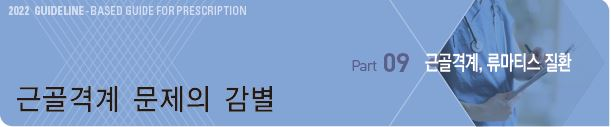
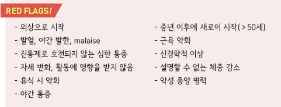
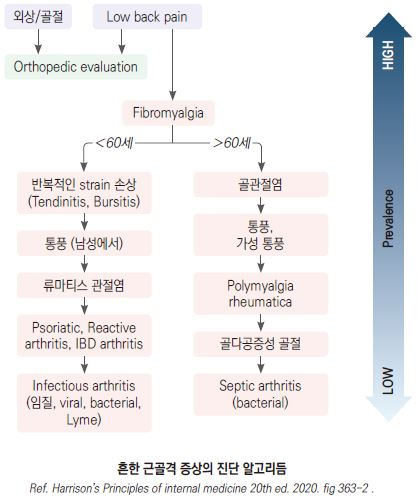
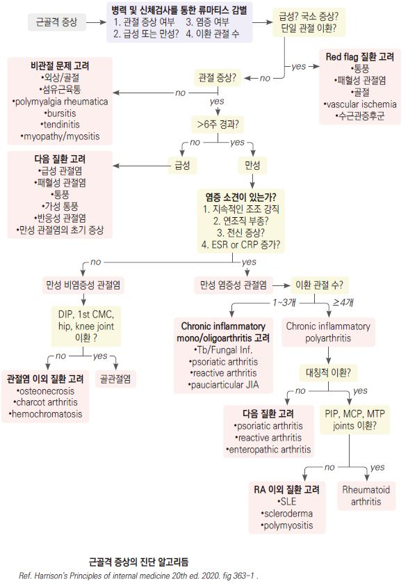
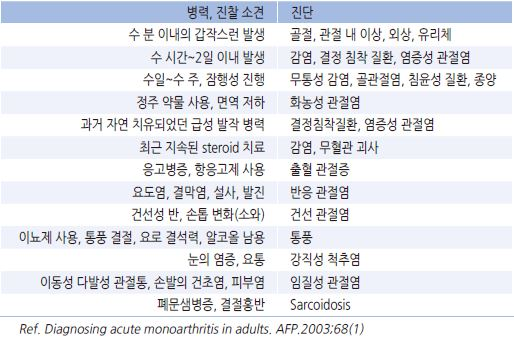
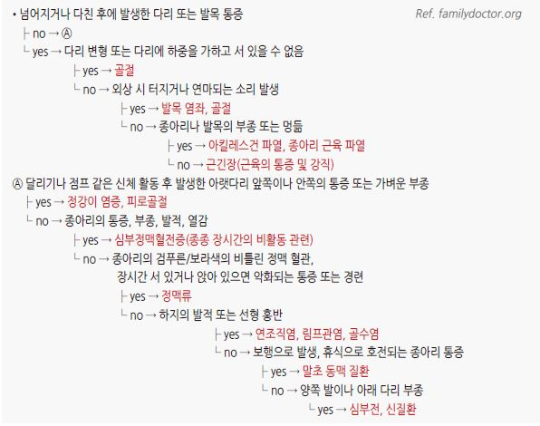
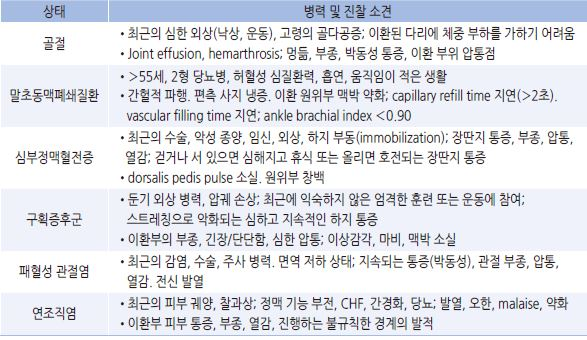
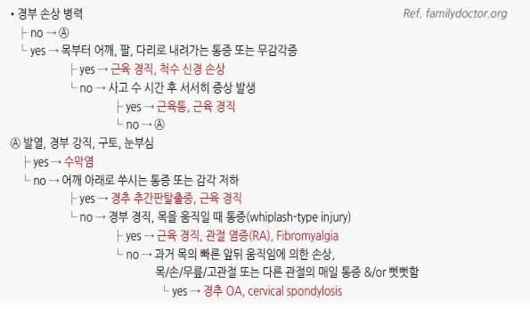

# 근골격계 문제의 감별

    

## 근골격 증상의 감별
    

### 해부학적 위치

#### 관절 문제
- 깊거나 광범위한 통증

- 능동과 수동 움직임 모두에 제한 또는 통증, 부종, 불안정, 변형, crepitus, locking

#### 비관절 문제
- 능동 움직임 때 통증이 있으며, 보통 수동 움직임 때는 통증이 없음

- 운동 범위가 유지되며, 부종/불안정/변형/crepitus 등은 드묾

- 관절 주위 이상 : 관절 인접부 국소 압통, 자세 또는 특정 움직임 시 통증 또는 방사통 발생

### 병리적 특성

#### 염증성 이상
- 분류 : 감염성, 결절성(통풍, 가성통풍), 면역 관련(RA, SLE), 반응성(rheumatic fever, reactive arthritis), 특발성

- 국소 : 홍반, 열감, 통증, 부종

  •강직 : 수 시간 동안 지속, 활동으로 호전(RA, polymyalgia rheumatica)

- 전신 : 피로, 발열, 발진, 체중 감소

- 실험실 검사 : ESR↑, CRP↑, PLT↑, albumin↓, 빈혈(만성 질환 시)

#### 비염증성 이상
- 분류 : 외상(rotator cuff tear), 반복 사용(bursitis, tendinitis), 퇴행성/비효과적 재생(OA), 종양(pigmented villonodular synovitis),

    통증 증폭(fibromyalgia)

- 윤활낭 부종 또는 열감 없는 통증, 전신 증상 없음, 주간, 간헐적 강직

  •강직 : 짧은 시간(＜60분) 지속되는 간헐적 강직, 활동으로 악화

- 실험실 검사 : 정상

### 진행 기간

#### 발생 속도
- 급속 발생 : 화농성 관절염, 통풍

- 서서히 발생 : OA, RA, 섬유근육통

#### 지속 기간
- 급성(＜6주) : 감염성, 결절성, 반응성

- 만성 : 비염증성(OA), 면역성(RA), 비관절성(fibromyalgia)

### 병변 범위

#### 이환 관절 수
- 소수 관절 : 감염성, 결절성

- 다관절(≥4개) : OA, RA

#### 범위
- 국소 : 건염, 수근관증후군

- 광범위 : polymyositis, fibromyalgia

#### 대칭성
- 대칭, 다관절 : RA

- 비대칭, 소수 관절 : spondyloarthritis, reactive arthritis, gout, sarcoid

#### 부위
- 상지 : RA, OA

- 하지 : reactive arthritis, gout

- axial skeleton : OA, ankylosing spondylitis

### 기타
- 동반 질환 : 당뇨병-수근관증후군, 신부전-통풍, 우울/불면-섬유근육통, 골수종-요통, 암-근육염, 골다공증-골절,

    전신 steroid-골괴사/septic arthritis, 이뇨제/화학요법-통풍

- 젊은 연령 : SLE, 반응성 관절염

- 중년 : 섬유근육통, RA

- 노년 : OA, polymyalgia rheumatica

- 남 : 통풍, spondyloarthritis, ankylosing spondylitis

- 여 : RA, 섬유근육통, 골다공증, lupus

    

## 관절통의 감별
    

## 증상/병력에 따른 다리 문제의 감별
    

    

## 증상/병력에 따른 경부 통증의 감별
    
