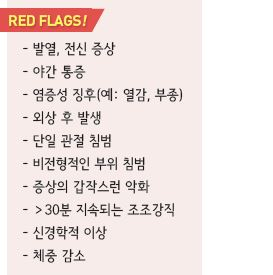
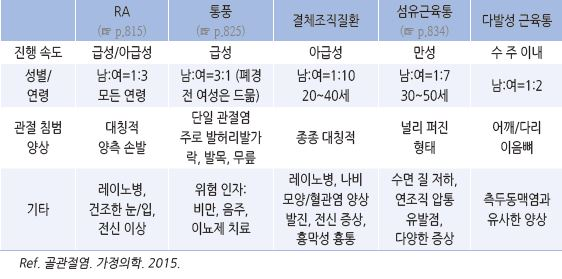
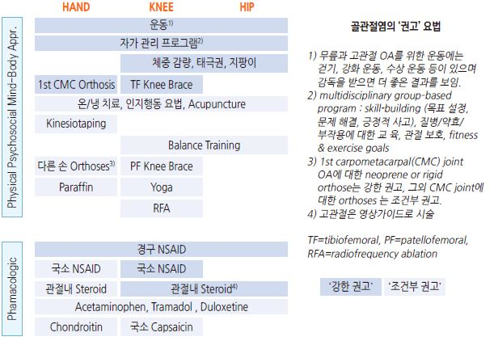
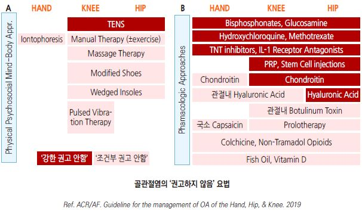
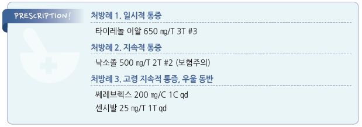

# 골관절염 Osteoarthritis, OA

## 일반 사항
- 연골, 윤활막, 인대, 연골 밑 뼈 등 관절을 구성하는 여러 구조물들에 병리학적 변화가 발생하여 관절의 통증 및 강직,

    기능 제한이 발생한 만성 질환

- 조직학적 변화 : molecular derangement(관절 조직의 대사 이상) → anatomic &/or physiologic derangements

    (연골 degradation, bone remodeling, osteophyte 형성, 관절 염증, 관절 기능 상실)

- 호발 부위 : 무릎, 엉덩이, 손, 척추 관절

- 치료 목표 : 염증 감소, 삶의 질 향상; 진행을 멈추게 하거나 역행하게 할 수 있는 치료는 없음

## 원인 및 위험 인자
- 노화 : ＞50세, 특히 ＞70세

- 여성(특히 손, 무릎)

- 비만 : 체중 부하 관절(특히 무릎)

- 직업 : 반복적으로 쪼그려 앉거나 무릎을 구부리거나 물건을 들어 올리는 육체노동

- 스포츠 활동 : 운동 선수, 심한 활동

- 관절 외상/감염 병력

- 근육 쇠약, 고유감각 결손, 신경병증

- 선천적인 해부학적 기형 : 대퇴골두골단분리증, 선천성 골반이형성증

- 내분비 대사 질환 : 말단비대증, 칼슘결정침착, 혈색소침착증, 윌슨씨병, 파젯씨병

- 가족력

## 임상 양상
- 흔히 수 분 동안의 관절 불편감이나 강직으로 시작하여 점차 진행

>   ✽골관절염 초기 6년 동안은 증상의 변화가 거의 없다는 보고가 있음
- 통증 : 하나 또는 몇 개 관절의 국소 통증, 관절 및 관절 주위 압통, 다양한 강도, 간헐적 발생, 사용에 의하여 악화되고

    휴식으로 완화, 심한 경우 야간 통증, 저온 습한 날씨에 악화

- 강직 : 일시적; ＜30분 지속되는 조조강직 또는 장시간 휴식 후 활동 개시 때의 뻣뻣함

- 부종 : 윤활막 증식 및 삼출에 의한 부종

- crackling, crepitus : 관절면 손상(거칠어짐)에 의해 움직임 때 소리 또는 마찰 느낌

- 변형, 운동 제한 : 관절 변형(관절 가장자리 비대), 관절 정렬 변화, 관절 운동 범위 제한/고정(locking) 또는 과다/불안정

#### 손
- 흔히 엄지손가락 carpometacarpal 관절 이환

- 관절 비후성 변화 : Heberden node(DIP joint), Bouchard node(PIP joint)

#### 어깨
- 특히 바깥 회전 운동 제한

#### 무릎
- 관절 부종(삼출), popliteal cyst(Baker’s cyst)

- 하지 불안정 또는 약화, 특히 외측 또는 계단 내려갈 때

- 관절 정렬 변화 : genu varum 또는 genu valgum

#### 고관절
- 엉덩이 통증, 사타구니-앞쪽넓적다리 방사통

- 특히 내전 운동 제한

#### 발
- 흔히 첫 번째 metatarsophalangeal 관절 이환/운동 제한,

    엄지발가락 굳음증(hallux rigidus)

- 관절 변형 : 무지 외반증

#### 척추
- 흔히 하부 경추 및 하부 요추의 apophyseal (facet) joint 이환

- 경추 OA 시 목/등/상지 통증, 무력감, 팔/손 저림

- 요추 OA 시 하지 감각 소실, 반사 소실, 운동 약화

- 척추관협착증 시 pseudoclaudication

## 진단

### 영상 검사
- 초기에는 유의미한 소견 없음 (✽40세의 90%에서 영상 검사상 체중 부하 관절에 OA 특징이 관찰됨)

- X선 소견 : 골극 형성, 비대칭적 관절강 좁혀짐(무릎 ＜3 ㎜), 연골하 골경화, 연골하 낭종

- 관절 주위의 골다공증과 가장자리 미란 (RA 등과의 감별을 요함)

### 실험실 검사
- OA의 진단을 위한 실험실 검사는 보통 필요 없음

- 다른 질환 배제를 위하여 고려

- 관절액 검사 : 만성 염증성 관절염과의 감별

  •OA : 비염증성; ＜500 cells/㎣, mononuclear cell 우세

  •염증성 : ＞2,000 cells/㎣, neutrophil 우세

### 감별

#### 비관절 질환
- 능동 운동 시 통증 발생, 수동 운동 시 통증 없음

- 관절 인접 부위의 국소 압통, 관절낭으로부터 떨어진 부위에 이상 소견이 존재

- 관절 부종, 마찰음, 불안정성, 변형 등이 없거나 증상과 무관하게 발생

- 국소 증상 발생 예 : 힘줄염, 수근관증후군

- 광범위 증상 발생 예 : 다발근육염, 섬유근육통

#### 감염
- 국소 염증 소견 : 홍반, 열, 통증, 부종 악화

- 전신 증상 : 피로, 발열, 발진, 체중 감소

- 실험실 검사 : ESR↑, CRP↑, 혈소판↑, Hb↓, Alb↓

#### 지속 기간
- 급성(＜6주) : 감염성, 결절성(예: 통풍), 반응성 관절염

- 만성 : OA, 류마티스 관절염(RA), 섬유근육통

#### 이환 관절 수
- 소수 관절 이환 : 결절성, 감염성

- 많은 관절(≥4개) 이환 : OA, RA

#### 이환 부위
- 상지 : RA

- 하지 : 반응성 관절염, 통풍

#### 대칭성
- 대칭 : RA

- 비대칭 : 척추관절병증, 통풍

#### 연령
- ＜60세 : 반복 사용, 과도 긴장, 통풍(남성), RA, 척추관절염, 감염성 관절염

- ＞60세 : OA, 결절성(통풍, 가성통풍), 류마티스성 다발성 근통, 골다공증성 골절, 혈관염, 약제 유발성 질환

### 관절 질환별 특징
    

---

## Management

## 비-약물 치료 및 예방
- 온/냉찜질

- 관절 보호 장치, 부목(특히 손의 OA에 유용)

- 관절 과부하 회피, 과사용 금지 : 지팡이, 보행기, 벽/계단 손잡이 이용

>   ✽압박대는 일반적으로 권하지 않음
- 통증 유발 활동 회피, 통증이 있는 동안 휴식

- 금연

- 체중 감량

- 관절 주위 근육 근력 강화 : 수영, 에어로빅, quadriceps 강화 운동

- 적정 Vit D 유지 : 뼈 건강 유지, 골관절염 발생 및 진행 예방 가능성이 있음 (☞ p.806)

### 운동
- 효과 : 통증↓, 관절 기능↑, 삶의 질↑; 통증 등 관절염 증상으로 운동을 하지 않으면 관절의 운동 기능은 더욱 감소하고

    강직, 부종, 근육 약화, 관절 불안정은 악화됨

- 규칙적 운동 : 거의 매일 30분씩(10분씩 하루 3~4회로 분할 시행할 수 있음), “조금이라도 하는 것이 전혀 안하는 것보다 낫다.”

- 강도 : 통증이 유발되지 않는 수준

- 신체/관절 상태에 맞는 운동을 선택; 비정상적인 관절은 심하지 않은 운동의 반복에 의해서도 OA 위험이 증가함

>   ✽신체 활동 및 운동 가이드  (☞ p.1140)

#### Warm up
- 일반인은 3~5분, 관절염 환자는 10~15분

- 천천히 걷기 또는 10분 이내의 운동을 하는 경우에는 warm up 단계를 생략할 수 있음

- 방법

  ① 앉은 상태로 관절 운동 및 유연성 운동을 머리에서 시작하여 발까지 시행

  ② 제자리 걷기

  ③ 운동할 때 속도의 절반 속도로 걷기

#### 근육 강화 운동
- weight bearing 운동

- 부드럽게 움직임, 갑자기 움직이지 않음

- 통증이나 과도한 피로 없이 연속적으로 8~10회(=1세트) 시행이 가능한 무게를 선택

- 피로와 관절 스트레스를 피하기 위해 팔과 다리 운동을 1세트씩 번갈아 시행

- 1세트 운동으로 관절통이 심해지지 않는다면 무게를 늘릴 수 있음

- 염증성 관절염(예: RA)이 있는 환자에서는 보다 가벼운 무게로 천천히 시행

#### 지구력 운동
- 종류 : 수중 운동(예: 수영, 물속에서 걷기, 수중 에어로빅), 고정 자전거 타기

- 운동 중 대화를 할 수 있는, 통증이 악화되지 않는 낮은 강도 및 짧은 시간으로 시작

- 운동 후 관절이나 근육에 약간의 통증을 느끼는 정도는 허용; 2시간 이상 지속하는 것은 피함

#### Cool down
- 평소 상태로 심박수가 회복되어 갑작스런 혈압 저하, 어지럼, 구역 등을 예방함

- 방법 : 운동 강도를 낮춤(예: 천천히 걷기, 가벼운 기구 들기), 스트레칭/유연성 운동

#### 주의
- 걷기 운동은 가능한 한 평평하고 수평한 곳에서 시행

- 적당한 신발(예: 걷기에 특화된 신발) 착용, 필요시 신발 쿠션/깔창 사용

- 운동 전에는 강력한 진통제를 복용하지 않음. 운동 중 발생하는 통증을 느낄 수 있어야 함

- 운동 중 통증이 발생하면 중지하고 주치의와 상담

- 천천히 시작하여 점차 강도를 높임

- 운동 시 자세에 주의. 필요시 치료사의 도움을 받음

- 빠른 방향 전환/회전, 충격이 있는 운동은 피함(특히 하지 인공 관절 수술 환자)

    

    

## 약물 치료
- 무증상 OA는 약물 치료하지 않음

- 경구제의 부작용을 감안하여 경피제를 우선 권고하기도 함

### 경구제

#### NSAID
- 작용 : 진통 및 항염; 약제 종류에 따른 일반적 효과 차이는 없으나 개인차는 있음 (☞ p.15)

- 최소 유효 용량으로 최단 기간 투여

- GI 문제가 있거나 장기 사용이 필요한 경우에는 COX-2 억제제 권고

- 주의 : 위궤양, 위장 출혈, 신 기능 저하, 고혈압, 부종

  •장기 사용 시 주기적인 혈압, CBC, RFT, 대변 잠혈 모니터링을 요함

  •[OARSI](2019) CV 문제가 있는 경우에는 경구 NSAID를 권고하지 않음

- ibuprofen : 400~800 ㎎ tid [부루펜]

- naproxen : 500 ㎎ bid [낙센], [낙소졸](esomeprazole 복합제)

- celecoxib : COX-2 억제제; 200 ㎎ qd [쎄레브렉스]

#### Acetaminophen
- OA에서의 통증 감소 효과에 대하여 논란이 있고 간독성 문제로 1차 선택제로 권고하지 않음

- 주의 : 간/신 기능 저하 환자

- 용법 : 650~1,300 ㎎ tid, 최대 4 g/d [타이레놀]

#### Opioid
- 다른 치료로 호전되지 않는 심한 통증에 대하여 단기 투여 고려 (☞ p.12)

- tramadol : 100 ㎎ bid~qid [트리돌]

  •acetaminophen 병용 [울트라셋] 또는 NSAID 병용으로 효과 상승

#### 항우울제
- 작용 : 진통제의 효과를 상승시킴 (☞ p.1146)

>   ✽요통과 골관절염 통증에 대한 항우울제 효과는 미약하다는 메타분석 보고가 있음
- 중등도 또는 NSAID에 호전되지 않는 OA, RA, 만성 요통에 고려 (보험기준 ☞ p.1177)

- 우울증 치료 용량보다 적은 용량에도 반응

- nortriptyline : 10 ㎎ bid [센시발]

- amitriptyline : 10 ㎎ bid 또는 25 ㎎ hs [에트라빌]

- duloxetine : 30~60 ㎎ qd [심발타]

#### 기타
- glucosamine [오스테민], chondroitin [콘로인] : 무릎이나 엉덩이 OA에 대한 일부 연구에서 병용으로 효과가 있으나

    다수의 연구에서 단독/병용 모두 위약과 차이 없음; 사용하는 경우에는 6개월 투여 후에도 명백한 효과가 없으면

    중단할 것을 권고 (보험주의)

- S-adenosyl-L-methionine [사메론], avocado [이모튼], soybean : 일부에서 통증 및 기능적 개선 (보험주의)

### 경피제

#### NSAID
- 작은 관절(예: 손), 무릎 OA에 고려; 고관절 OA에는 효과 없음 (보험기준 ☞ p.1175)

- 무릎 OA에 대하여 국소 NSAID를 권고 [OARSI]

- non-low back 근골격계 손상 급성 통증에 대하여 topical NSAID 적용을 권고 [ACP, AAFP]

>     (✽경구제와 동등한 효과가 있다는 보고가 있음)
- ketoprofen [케토톱 플라스타/겔]

- piroxicam [트라스트 패취/겔]

#### Capsaicin cream
- 작용 : 감각 신경 말단의 탈감작 효과; 효과 발현까지 2주 이상 소요

- 작은 관절, 무릎 OA에 고려; 고관절 OA에는 효과 없음

- 부작용 : 작열감(초기에 심하며 차츰 완화됨)

- 용법 : 0.075% 크림 qid [다이악센]

#### Opioid
- 비마약성 진통제 등 다른 치료로 호전되지 않는 심한 만성 통증에 대하여 고려

- 부작용 : 어지러움, 기면. 변비, 입마름, 구역, 구토, 두통, 적용 부위 가려움

- buprenorphine : 1주 1매. 저용량(5~10 ㎍)으로 시작 [노스판 패취]

### 관절 내 주사

#### Steroid
- 대상 : 갑자기 악화된 OA(특히 무릎관절, 고관절), 다른 치료로 호전되지 않는 경우

- 단기(4~8주) 증상 완화 효과; 장기 효과는 불분명

- 고관절에서는 유효한 결과를 얻지 못함. 고관절 OA에 대하여 권고하지 않음 [OARSI]

- 동일 관절에 대하여 ≤3회/년으로 제한 (✽문헌에 따라 횟수 제한에 약간의 차이가 있음)

- 관절강으로부터의 steroid 유출을 줄이기 위하여 체중 부하 제한; 주사 후 3일간 용변/식사 외의 체중 부하를 피함.

    2~3주간 지팡이 등 보조 기구 사용

>   ✽무릎 OA에 대하여 1년간 steroid 관절 내 주사(평균 2.6회) vs 물리 치료(평균 12회)를 비교한 결과 물리 치료군에서 증상 개선이

>     더 우수했다는 보고가 있음

#### Hyaluronic acid (HA)
- 작용 : 관절의 점탄성 회복, chondrocyte 보호, 항염 작용 기대 (보험기준 ☞ p.1192)

- 일부에서 유효. steroid보다 장기 효과(4개월)

- [히루안 플러스 주] : 1회/주 × 3주 주사; 슬관절, 견관절에 적용

- [시노비안 주] : 1회 주사; 슬관절에 적용; BDDE(1,4-butanediol diglycidyl ether) cross-linked sodium hyaluronate 성분

#### Platelet-rich plasma (PRP)
- 논란; 일부 환자에서 초기 OA에 대하여 HA보다 효과적이라는 보고가 있는 반면, 무릎 OA에 대하여 관절 통증 감소나

    기능 개선에 있어 위약보다 효과적이지 않다거나 HA보다 열등하다는 보고가 있음.

    발목 관절염에 대하여 낮은 수준의 일부 연구에서 효과가 있었으나 보다 큰 규모의 무작위 연구에서는 식염수 주입과

    차이가 없었다는 보고가 있음

> **질병코드**
M19 기타 관절증

M19.9 상세불명의 관절증 질병코드

