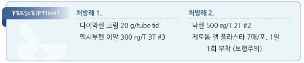

# 윤활낭염 Bursitis

## 원인
- 급성 : 손상, 외상, 감염, microcrystalline 질환(예: 통풍)

  •감염 : 대부분 피부 손상에 따른 침투, 드물게 혈행성; S. aureus 가 흔함

- 만성 : 반복 사용/압박, microtrauma, 염증(예: RA)

## 임상 양상
- 부종(boggy), 통증(능동 운동 시), 압통, 홍반, 운동 범위 감소(특히 어깨), crepitus

  •급성에서는 통증이 두드러지고, 만성에서는 통증이 덜함(서서히 진행)

  •심재성 윤활낭염(어깨, 고관절, 무릎 내부)에서는 부종이 적게 드러남

  •표재성 윤활낭염(팔꿈치, kneecap, 발뒤꿈치)에서는 부종이 크고 통증이 적음

- 이환부 운동 범위 감소

- septic bursitis : 통증, 부종, 발적, 국소 열감, 전신 발열

## 진단
- 병력 : 최근 직업 또는 운동 종목 변경, 외상 병력

- 영상/실험실 검사 : 대부분 필요하지 않음. 다른 문제 감별을 위하여 고려

- 국소 needle aspiration : crystal, 세균, WBC 검사; 감염 의심 시 고려

#### Shoulder bursitis, Subacromial bursitis
- 증상 : 어깨 통증(종종 상박으로 확장); 움직일 때, 특히 팔을 머리 위로 올릴 때 통증

- 감별 : rotator cuff tear/tendinitis (☞ p.751)

#### Scapulothoracic bursitis
- 증상 : 견갑골과 늑골 사이의 통증, popping sense; 팔을 머리 위로 들거나 팔굽혀 펴기 시 악화

#### Olecranon bursitis
- 증상 : 팔꿈치의 현저한 부종(골프 공 모양), 굴곡 시 통증(신전 시 통증 없음; ROM 감소)

- 원인 : 반복적인 압박, 감염, crystal(통풍), RA

#### Radiohumeral bursitis
- 증상 : 뚜껑 열 때, 머리를 말 때, 문 손잡이를 돌릴 때 Radiohumeral 관절 부위의 통증

- 원인 : 반복적인 상완 회전

#### Ischial bursitis
- 증상 : 앉으면 바닥에 닿는 엉덩이 면의 통증 악화, 서 있으면 완화

- 원인 : 딱딱한 표면에 오래 앉아 있음

#### Greater trochanteric pain syndrome (trochanteric bursitis)
- 증상 : 이환된 쪽으로 누울 때, leg extension 및 서 있을 때 통증

  •비정상적인 보행 시 (고관절에 가해지는 불규칙한 스트레스로 인하여) 통증 악화

- 원인 : 심한 운동/달리기, 만성 요통, 반대쪽 무릎 통증, 다리 길이의 차이, 과체중

#### Iliopsoas bursitis
- 증상 : 계단 오를 때 사타구니 부위 통증

- 원인 : 해당 부위의 관절염, 과사용(예: 과도한 달리기), 부상

- 감별 : psoas 근육 감염

#### Prepatellar & infrapatellar bursitis
- 증상 : 슬개골 위 또는 아래의 부종/통증; 무릎을 신전하고 누웠을 때 편함

- 원인 : 반복/지속적 무릎 압박/손상; housemaid’s knee, nun’s knee

- 감별 : 무릎 관절 내 부종(관절염)에서는 무릎을 약간 굴곡하여 누웠을 때 편함

#### Medial collateral ligament bursitis
- 증상 : 무릎 내측의 통증; 부종 없음

- 감별 : MCL 또는 meniscus 손상

#### Pes anserinus pain syndrome
- 증상 : pes anserinus 부위의 갑작스런 통증, 종종 밤에 발생

- 관련/위험 인자 : 무릎 골 관절염, 비만, genu valgum

#### Retrocalcaneal bursitis
- 증상 : 발뒤꿈치의 부종/통증

- 감별 : 아킬레스 건염

---

## Management

### 치료 방침
- 자극/악화 요인 회피

- 통증 및 염증에 대한 대증 치료(경구/경피 NSAID)

- 필요시 bursa aspiration(특히 감염 시), steroid injection

- 기저 감염, 기저 질환 치료

- 가능한 한 적당한 활동(근 위축 및 관절 구축 예방), 운동 범위 유지

※ 경과 : 원인 회피, 안정 및 보호로 대부분 자연 치유됨(septic bursitis 제외)

## 비-약물 치료
- PRICE therapy : protection, rest(부목), ice, compression, elevation

- 윤활낭 보호

  •통증 유발 활동 회피. 활동 시 warm-up & cool-down, 반복 활동 시 중간 휴식

  •보호 장비 사용 : 팔꿈치/무릎 보호대, 패드, 쿠션

  •발뒤꿈치의 압력을 줄이기 위한 신발 선택, 충격 흡수 도구 사용(예: 깔창, 패드)

- 물리/운동 치료 : 스트레칭, 근육 강화

- 체중 감량, 자세 교정

## 약물 치료

### 국소
- capsaicin 크림 : 감각 신경 끝에서의 탈감작 효과; 부작용- 초기 작열감 [다이악센] (☞ p.14)

- ketoprofen [케토톱 플라스타/겔] (보험기준 ☞ p.1175)

- piroxicam [트라스트 패취/겔]

### 전신
- ibuprofen : 400~800 ㎎ tid~qid [부루펜]

- naproxen 500 ㎎ bid [낙센]

### 국소 주사
- lidocaine

- steroid : 감염 배제 후 고려; triamcinolone 40 ㎎/㎖ 0.5~1.0 ㎖ [트리암시놀론 주]

  •표재성 윤활낭염에 대한 steroid 주사는 대부분 효과가 없으며 부작용(예: 감염, 피부 위축) 우려로 권하지 않음

### 항생제
- septic bursitis에 적용; staphylococcal & streptococcal 치료 항생제 선택 (☞ p.901)

- 전신 발열 시 의뢰

> **질병코드**
M06.2 류마티스윤활낭염

M70 사용, 과용 및 압박에 관련된 연조직장애

M71 기타 윤활낭병증

