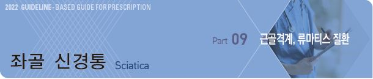
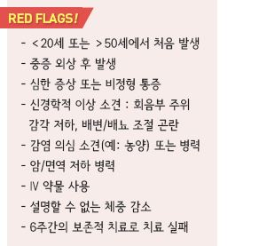
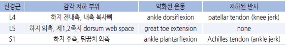
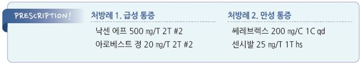

# 좌골 신경통 Sciatica

## 일반 사항
- lumbosacral nerve root(L4~S3)가 압박 또는 자극을 받음으로 인하여 이환된 신경근이 분포하는 엉덩이~하지 부위에

    발생하는, 근력 약화와 감각 장애(감각 저하, 작열감)가 동반되는 방사통

- lumbosacral radicular syndrome, radiculopathy, 또는 nerve root pain 등으로 표현됨

- L5, S1 이환이 가장 흔함

- 신경근 손상 직후~수일 후 통증 발생

- 인구의 5%에서 발생; 남성 40대, 여성 50대에 흔함

- 보존적 치료로 70%~90%에서 6주 내 호전

## 원인
- 추간판탈출증, 디스크의 퇴행성 질환, 척추협착증, spondylolisthesis

- 척추 주위 근육의 경직

### 위험 인자
- 반복적인 들기, 굴곡, 회전을 하는 활동이나 운동(예: 춤, 골프)

- 운동 부족

- 하이 힐, 너무 단단하거나 무른 침대 매트리스

- 임신, 과체중

## 임상 양상
- buttock & leg 후측방에서 발까지 방사통, 작열감 또는 감각 저하

- 하지 통증 (허리 통증보다 하지 통증이 심함)

- 굴곡 &/or 회전 시 통증 발생 또는 운동 범위 제한; 보통 신전 시 통증 완화

- 아침, 장시간 착석 또는 기립, Valsalva maneuver(예: 기침, 배변) 시 증상 악화

- 대부분 편측 발생

- 장기간 지속되면 근 위축 발생

## 진단

### 신체검사
- 하지 감각 및 운동 검사 : dermatome을 따라 감각 저하, myotome을 따라 근 약화

>     ✽Dermatome, Myotome 
- 이환 신경근에 따른 증상 발생 부위

    

- straight-leg raise(SLR) : 다리를 뻗고 누운 자세에서 수동적으로 다리를 들면(30o) 통증 재현

- seated SLR : 무릎을 구부리고 의자에 앉은 자세에서 수동적으로 무릎을 펴면 통증 재현

- crossed SLR : 다리를 뻗고 누운 자세에서 건측 고관절을 수동 굴곡(40o)하면 환측 하지 통증 발생

- [slump test](https://www.youtube.com/watch?v=HFGfP84uwEo) : 허리 뒤에 손을 대고 의자에 앉아 허리를 앞으로 구부리고 고개를 숙인 후 무릎을 펴면 통증 재현

    → 고개를 들면 호전; 추간판탈출증 환자에서는 정확도가 떨어짐 ()

- rectal tone, anal sensation : cauda equina syndrome, spinal cord injury 의심 시 시행

- 하지 맥박 검사 : 혈관 질환과 감별

### 영상 검사
- 6주간의 보존적 치료로 실패 시 고려

- X선 : 진단적 가치가 높지 않음; 일률적 검사는 권고하지 않음

- MRI : 신경 이상 진단에 특히 유효; Red flags에 해당되면 고려

- CT : 골격 이상 진단에 특히 유효

- 초음파 : 복부 질환 의심 시 고려(예: abdominal aortic aneurysm)

- 신경전도 검사, 근전도 검사 : 말초와 중추 신경 장애 감별, 급성과 만성 손상 감별에 유효

---

## Management

## 비-약물 치료
- 급성기 휴식, 이후 활동 유지 (✽활동 제한의 유효성은 입증되지 않음)

- 냉찜질(첫 1~2일), 온찜질(첫 1~2일에는 부종을 악화시킬 수 있으며 이후에 적용

- 물리 치료

- 영상 검사 또는 침습적 치료 전 6주간 시도

## 약물 치료
- NSAID : 장기 사용은 부작용 등 이득보다 손해가 많으므로 피함

  •ibuprofen : 200~800 ㎎ tid [부루펜]

  •naproxen : 250~500 ㎎ bid [낙센]

- 경구 steroid : 단기(5일) 사용이 기능 향상에 도움이 될 수 있음

- epidural steroid 주사 : 통증에 대한 단기 효과 기대; 수술 전 평가 도구로 고려

※ 근이완제, 항경련제(gabapentinoid), TCA 등의 유효성은 입증되지 않음(일부 환자에서 약간의 효과)

## 수술
- 대상 : 보존적 치료로 호전되지 않는 난치성 통증, 신경학적 결함 등 중증에서 고려

## 예방
- 적정 체중 유지

- 금연

- 하이 힐 착용을 피함

- 지속적인 근력 및 유연성 훈련 또는 활동

- 운동 또는 활동 전에 준비 운동을 함

- 가능한 한 무거운 물건을 들고 다니지 않음(예: 장보기 시 카트 이용)

- 물건을 들 때의 자세 주의 : 물건 정면에 다리를 벌리고 서서 허리는 세우고 무릎을 구부려 들어 올림,

    가능한 한 물건을 몸 가까이 듦; 허리를 비틀지 않음

- 의자에 앉아 있을 때 척추를 natural position으로 유지, 허리 지지(특히 운전 시)

- 등받이가 높은 의자 선택, 필요시 등을 기대고 다리를 받쳐주는 의자 선택

- 장시간 앉아서 작업해야할 때는 자주 일어나서 걸음(예: 1시간마다 10분 걷기)

- 장시간 서서 작업할 때는 발받침을 두고 번갈아 발을 올리고 있음

- 옆으로 누워 잘 때는 무릎 사이에 베개를 끼움

### Exercise

> Ref. NHS 

#### Knee to chest stretch
- 방법 : 베개를 베고 무릎을 90°구부리고 발을 엉덩이 폭만큼 벌리고 누움 → 한쪽 무릎을 가슴 쪽으로 당겨 양 손으로 잡고

    20~30초간 유지; 각 다리로 3회 반복

- 시행 중 목과 상체는 편안한 이완 상태를 유지하며 심호흡 함

#### Sciatic mobilising stretch
- 방법 : 베개를 베고 무릎을 90°구부리고 발을 엉덩이 폭만큼 벌리고 누움 → 한쪽 무릎을 가슴 쪽으로 당기고

    다리 뒤를 양 손으로 잡음 → 천천히 무릎을 펴 다리를 세우고 20~30초간 유지; 각다리로 2~3회 반복

- 시행 중 목과 상체는 편안한 이완한 상태를 유지하며 심호흡 함

#### Back extension
- 방법 : 엎드려 팔꿈지를 구부려 팔을 몸 옆에 둠(elbow full flexion), 손바닥은 바닥을 집고 얼굴은 바닥을 향함

    → 상박을 바닥에 붙여놓은 상태에서 팔꿈치를 90°굴곡 상태로 펴며 상체를 들고(골반은 바닥에 붙어 있는 상태임)

    복부 근육을 부드럽게 늘리고 5~10초간 유지(고개를 뒤로 젖히지 않음); 8~10회 반복

#### Standing hamstring stretch
- 방법 : 똑바로 서서 한 다리를 안정된 물체에 올림 → 올려 놓은 다리를 쪽 펴고 발끝을 위로 향하게 함(ankle dorsiflexion)

    → 허리를 편 상태에서 편안하게 할 수 있는 정도로 앞으로 기울이고 20~30초간 유지; 양쪽 다리로 각각 2~3회 반복

#### Lying deep gluteal stretch
- 방법 : 베개를 베고 무릎을 90°구부리고 발을 엉덩이 폭만큼 벌리고 누워 오른쪽 다리를 왼쪽 대퇴부에 올려놓음

    → 왼쪽 허벅지를 잡고 오른쪽 엉덩이에서 스트레칭이 느껴지도록 앞으로 당기고 20~30초간 유지

    → 다리를 바꿔 시행; 각 다리로 2~3회 반복

- 척추는 바닥에 닿은 상태로 엉덩이를 똑바로 유지함. 손으로 허벅지를 잡을 수 없다면 타올로 허벅지를 감아 시행할 수 있음

> **질병코드**
M54.3　좌골신경통

