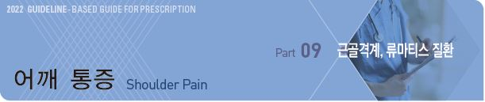
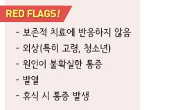
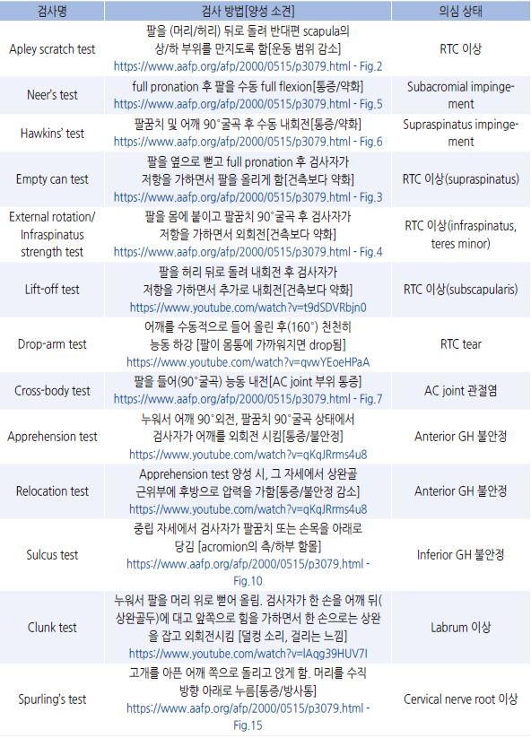
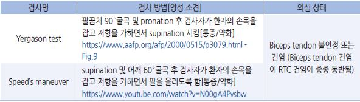
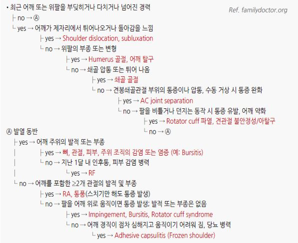
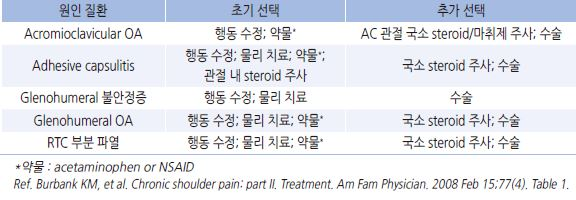

# 어깨 통증 Shoulder Pain

## 원인
- 외상 : 골절, 탈구, 인대/건 파열

- 과사용 : rotator cuff(RTC) 이상, 이두박근 건염, 윤활낭염, 근긴장, apophysis 손상

- 관절염 : OA(Acromioclavicular, Glenohumeral), RA

- 유착 : Adhesive capsulitis(=Frozen shoulder)

- 연관통 : 목의 이상, 심장 질환, 담낭 질환

#### 만성
- ＞6개월 지속되는 경우(치료 무관)

- 주요 원인 : RTC 이상, adhesive capsulitis, instability, OA

### 위험 인자
- 반복적인 overhead activity, 어깨 부하 운동 : 배드민턴, 　테니스, 야구, 배구, 역도

- 부적절한 운동 : 준비 운동 부족, 빠른 부하 증가, 잘못된 운동 방법

- 근력 저하 또는 불균형

- 동반 질환 : 당뇨병, 갑상선 질환

## 진단

### 검사
- 영상 검사 : 진단이 불확실할 때, 치료 방침을 변경할 때 고려

  •외상 병력이 없는 4주 이내의 어깨 통증에 대하여 영상 검사는 보통 필요 없음

  •검사 및 대상 : CT- 골절; MRI- RTC, biceps tendon; MR arthrogram- labrum, RTC, 불안정증; 초음파- RTC, biceps tendon,

    acromioclavicular(AC) joint

- electromyography(EMG)

- 실험실 검사 : RA 등 면역 질환 의심 시 시행 (☞ p.817)

### 신체검사

> ✽shoulder anatomy 1, shoulder anatomy 2, shoulder muscle(3D) 
Ref. Woodward TW, et al. The painful shoulder: part I. Clinical evaluation.. AFP 2000;15;61(10)
　　Burbank KM, et al. Chronic shoulder pain: part I. Evaluation and diagnosis. AFP 2008;15;77(4)
    

    

    ※ 링크 

>     Apley scratch test - Fig.2
    Neer’s test - Fig.5
    Hawkins’ test - Fig.6
    Empty can test - Fig.3
    External rotation/Infraspinatus strength test - Fig.4
    Lift-off test
    Drop-arm test
    Cross-body test - Fig.7
    Apprehension test
    Relocation test
    Sulcus test - Fig.10
    Clunk test
    Spurling’s test - Fig.15
    Yergason test - Fig.9
    Speed’s maneuver

### 원인 질환별 특징
- rotator cuff tear : 통증, ROM 제한; strength 감소, 수동 ROM 유지

- calcific tendonitis : 능동/수동 움직임 모두 통증; 보통 단일  rotator cuff tendon 문제. X선 상 건 사이에 석회화 음영

- glenohumeral osteoarthritis : 현저한 glenohumeral crepitus, X선상 퇴행성 변화

- septic arthritis : 급성, 삼출액 관찰

- 외상 : 어깨 염좌, 탈구, glenoid labrum tear, rotator cuff tear

- 경추/신경학적 질환 : cervical radiculopathy 또는 myelopathy 증상

### 증상/병력에 따른 감별
통증/압통 부위

- 어깨 위쪽 통증 → AC joint 이상, trapezius strain

- 외측/deltoid 통증, subacromial 압통 → RTC 이상

- 뒤쪽(scapular) 통증 → scapulothoracic dyskinesis

- 광범위 통증 → RTC 이상, adhesive capsulitis, glenohumeral(GH) OA

- 다발성 trigger points → non-shoulder 이상(예: fibromyalgia)

#### 통증 유발
- 팔을 비틀거나 머리 위로 올릴 때 통증, 관절 앞쪽 부위 통증, 팔의 근력 약화 → RTC 이상

- 고개를 돌릴 때 통증(목 운동 제한), 팔꿈치 아래로 내려가는 방사통 → 경추 이상

- 무거운 물건을 들 때 통증 → AC 이상

- 야간 통증 → RTC 이상(이환부로 누울 때 통증), adhesive capsulitis, 중증 GH OA

- 팔을 들어 반대쪽 어깨 쪽을 향하여 몸을 가로지르는 동작(cross-body) 시 통증 → AC 이상

- 외전/외회전 시 통증 → 불안정성

#### 운동 범위
- 현저한 능동 및 수동 운동 범위 감소, 강직, 만성 경과 → adhesive capsulitis

- 약간의 능동 및 수동 운동 범위 감소 → GH OA

- 능동 운동 범위 감소, 수동 운동 범위 유지 → RTC 이상

#### 연령
- ＜30세 : 불안정성(아탈구, 탈구)

- ＞30세 : RTC 이상; 30~50세- tendinopathy, 40~60세- 부분 파열, ＞60세- 완전 파열

- ＞40~60세 : adhesive capsulitis

- ＞60세 : OA

- 외상(+) : ＜40세- 탈구; ＞40세- AC 손상, RTC tear

#### 기타
- 과사용 → RTC 이상, AC 이상, labrum 이상

- 약화 → RTC 이상, GH OA

- 수술 병력 → adhesive capsulitis, GH OA

    

## 회전근개 이상 (Rotator cuff disorder)
- 구성 근육 : supraspinatus, infraspinatus, teres minor, subscapularis muscle

- rotator cuff syndrome : 파열을 포함한 모든 형태의 rotator cuff 손상

### 일반 사항

#### Rotator cuff tendinitis & bursitis
- 원인 : 반복적으로 팔을 머리 위로 올리는 동작(운동선수)

- 기전 : 어깨 관절 손상 → 염증 → 근육 및 힘줄이 움직일 수 있는 관절 내 공간 감소 → 움직일 때마다 자극(마찰)

    → 힘줄 약화, 파열

- impingement syndrome : tendon 또는 bursa가 뼈 사이에 끼인 상태

#### Tear
- 젊은 연령에서는 주로 사고에 의하여 발생

### 임상 양상
- 어깨 위치 위로 올릴 때(예: 머리 빗기) 또는 능동적 외전 시 통증(painful arc 60o~120o)

- 어깨 앞 및 측면(deltoid) 통증, 야간 통증

- 능동 운동 범위 감소, 수동 운동 범위 유지, 약화

### 진단
- RTC tear : empty-can, 외회전, Hawkins impingement test, lift-off test, drop-arm test 양성

- 영상 검사 : arthrography, 초음파, MRI, CT; X선 검사에서는 흔히 정상

  •상완골두 sclerosis/cyst, acromiohumeral 간격 감소, acromial spur

>   ✽＞60세 무증상 환자의 50%에서 MRI상 RTC의 파열이 있음

## 유착 관절낭염 (Adhesive capsulitis), 동결견 (Frozen shoulder)

### 일반 사항
- 정의 : GH joint capsule의 진행성 섬유화/구축에 따른 어깨의 통증/강직, 운동 제한

- 기전 : 어깨 관절 주위 조직 비후, 부종, 팽팽해짐 → 관절 골 간격 감소, 움직임 제한, 경직

- 유병률 : 2~5%(당뇨병 환자에서는 10~20%까지), 50대 중반에서 가장 많음, 약 10%에서 반대편도 이환

- 경과 : 보통 수년에 걸쳐 자연 회복 

### 원인 및 위험 인자
- 원인 : 불확실; 만성 염증성 반응(fibroblastic proliferation) 추정

- 위험 인자 : 외상, ≥40세, 앉아서 일하는 직업 또는 생활 습관, 장기간의 팔/어깨 활동 제한(예: 수술 후 팔 고정, 침대 생활,

    잘 사용하지 않는 팔), 여성

   • 관련 질환 : 당뇨병(가장 흔함; 기전 불명), 갑상선항진증/결절, Dupuytren contracture, 경추간판 질환, atherosclerosis,

    neurologic Dz.(예: stroke, 파킨슨병), 자가 면역 질환

### 임상 양상
1. painful freezing phase : 야간이나 환측으로 누울 때 악화되는 심한 어깨 통증의 점진적 진행. 운동 범위(ROM) 제한은 별로

    없음; 1주~10개월까지 지속

   • poorly localized 어깨 통증, 압통, 강직, 근력 약화; 목과 등의 통증 동반

2. frozen or intermittent phase : 1년까지 지속되는 어깨 강직, ROM 제한(능동 및 수동 운동 모두 어깨 굴곡, 외전, 회전에

    현저한 제한)). 보통 통증은 점차 완화되며 ROM의 마지막 부분 및 야간에 발생

3. thawing or recovery phase : 1~3년에 걸쳐 점차 호전; ROM 제한이 남을 수 있음(10%)

### 진단
- 운동 범위 제한 등 임상 양상

- 영상 검사 : 다른 질환 배제를 위해 선별적 시행;

    X선상 보통 정상. MRI상 coracohumeral lig. 비후, inf joint capsule ＞5 ㎜, axillary pouch 소실 

- arthrography

## 상완견관절 골관절염 (Glenohumeral osteoarthritis)
- 주로 ＞50세에서 발생

### 임상 양상
- 활동 시 통증, 야간 통증

- 강직, 움직임 제한

### 진단
- 서서히 진행되는 임상 양상

- X선 검사 : 퇴행성 변화, 골 간격 감소

## 상완견관절 불안정증 (Glenohumeral instability)
- 불안정증 : 상완골두의 ball이 shoulder socket에서 비정상적으로 움직이는 상태; dislocation 및 subluxation을 포함

- 대부분 ＜40세에서 처음 발생

- 원인 : 운동, 부딪힘

### 임상 양상
- 때때로 모호함

- 간혹 소리(clicking, popping)

- 움직일 때 팔이 어깨에서 미끄러지거나 붙잡히는 느낌

- deltoid 감각 둔화

- 탈구 시 심한 통증, 움직임 제한

### 진단
- 과거 병력

- anterior GH 불안정 : apprehension, relocation 양성

- inferior GH 불안정 : sulcus test 양성

- X선 검사 : 보통 정상; dislocation, inferior glenoid avulsion fracture

## 견봉쇄골 관절 이상 (Acromioclavicular joint disorder)

### 종류
- osteoarthritis

- acromioclavicular joint lig. stretching 또는 tearing

- acromioclavicular joint 탈구

### 위험 인자
- 남성, 20~50세

- 격렬한 접촉 운동 : 럭비

- 추락 위험이 큰 운동 : 스키

### 임상 양상
- 관절통

- 관절 움직임 제한

- AC joint 통증 : 어깨 정점 부위의 국소 통증/압통

### 진단
- 국소 압통 등 임상 양상

- cross-body test 양성

- X선 검사 : acromioclavicular joint에 OA 소견(AC joint OA)

---

## Management

### 치료 방침
- 보존적 치료 : 행동 수정, 물리 치료, 약물 치료, 국소 steroid 주사

- 회복까지 수개월 이상 소요되며 완전한 기능 회복이 불가능할 수도 있음

    

## 비-약물 치료

### 행동 수정
    (주의해야 하는 동작)

- bench pressing, 공 던지기 삼가

- 머리 위로 팔 올리기 주의 : RTC 이상, GH OA

- 무거운 물건 들기 주의 : GH OA

- cross-body adduction 주의 : AC OA

- 통증을 유발하지 않는 수준의 움직임은 지속하는 것이 필요

### 물리 치료
- 온/냉찜질 : 외상 초기에 적용; 10~30분간 적용. 동상 주의

- 마사지, 도수 치료 : 효과가 일정하지 있음

- 이완 운동, 강화 운동 : 통증이 유발되지 않는 수준에서 점차 늘려감; 매일 지속 시행 시 통증 완화 및 기능 개선 효과

- 초음파, iontophoresis : 통증 완화 효과

#### Adhesive capsulitis exercise
- [Codman pendulum exercise](https://www.youtube.com/watch?v=dYQsTDnnCdQ) : 이환되지 않은 팔로 탁자를 짚고 상체를 앞으로 숙이고 이환된 팔을 늘어뜨림.

    이환된 팔을 힘들이지 말고(몸을 흔들어) 천천히 좌우로 흔듦, 시계 방향 및 반시계 방향으로 작고 크게 원형 운동함

- [wall climbing ](https://www.youtube.com/watch?v=ocOJTXj8Xeo): 손으로 벽을 짚고 선 후 손가락으로 벽을 기어오르는 동작. 매 6 inch 오를 때마다 멈춰 유지(30초).

    통증이 느껴지면 중단 

### 기타
- arm sling : AC joint 이상에서 일시적 증상 완화

## 약물 치료
- 1차 선택 : acetaminophen or NSAID (☞ p.15)

#### 항염증제, 진통제
- ibuprofen : 200~800 ㎎ tid [부루펜]

- naproxen : 250~500 ㎎ bid [낙센]

- acetaminophen : 650~1,300 ㎎ tid [타이레놀]

- tramadol : 단기 사용; 25~100 ㎎ prn [트리돌]

#### TCA
- amitriptyline : neuromodulator 작용 기대. 효과에 대한 증거 부족 [에트라빌]

#### Steroid 국소 주사
- 대상 : 다른 보존적 요법에 반응이 부족할 때 고려

  •[미국정형외과학회] Glenohumeral OA에 대한 국소 steroid 주사는 권고하지 않음

- subacromial, glenohumeral, AC, subscapular bursa 등에 대하여 초음파 가이드 하에 시행

- 질환 종류, 병변 부위에 따라 효과 차이가 있음; 규칙적인 NSAID 투여와 동등한 효과

- 1년에 동일 관절에 ≤3회로 제한

#### 기타, 수술
- hyaluronate 주사 : 어깨 골관절염에 대한 효과가 미약하여 권고하지 않음 [NICE] (steroid 주사보다 효과가 적음)

- capsular hydrodilatation (arthrographic distention) : 식염수+steroid 또는 hyaluronic acid; 일부에서 단기간(12주) 호전

- suprascapular nerve block : 단기 통증 완화 효과

- laser therapy : adhesive capsulitis에서 위약보다 효과

- 보톡스, PRP(platelet rich plasma) : 증거 불충분

- 수술 : 만성 질환에 대하여 4~6개월의 적절한 보존적 치료에도 호전되지 않을 때, RTC의 기능에 중대한 변화가 있는 파열

    또는 전층 ＞1 ㎝ 파열(＜65세) 시 고려

> **질병코드**
M19.01 기타 관절의 원발성 관절증, 어깨부분

M25.51 관절통, 어깨부분

M75 어깨병변

S43.4 어깨관절의 염좌 및 긴장
