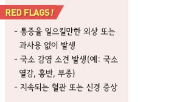
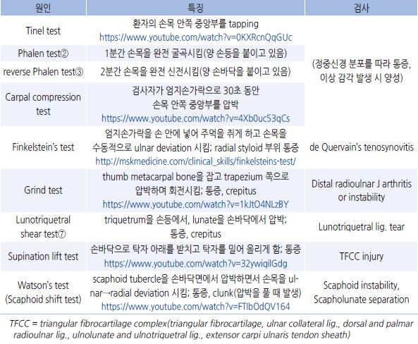
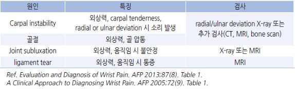
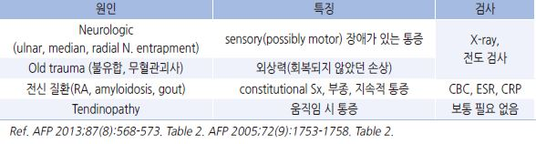
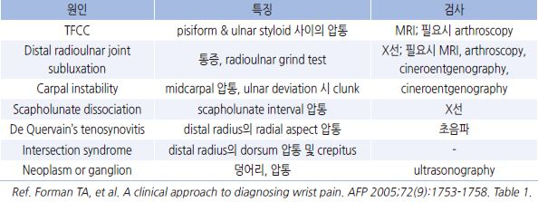
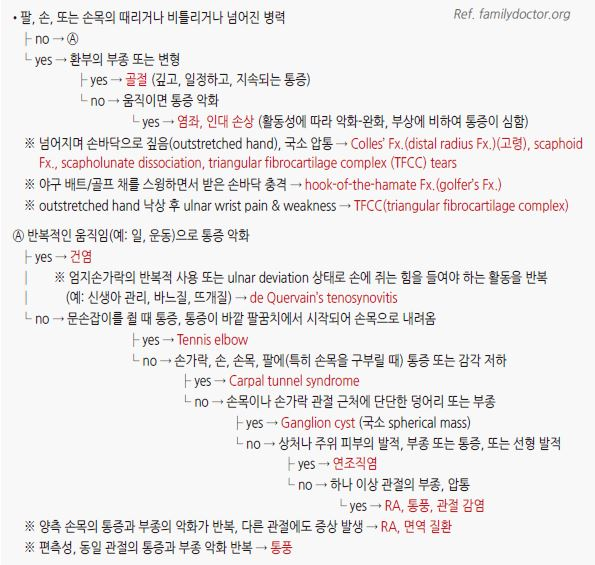
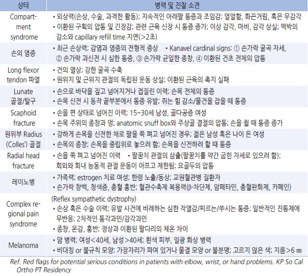

# 손목 통증 Wrist Pain

## 일반 사항
- 반복 사용, 외상 등에 의한 골, 인대, 힘줄, 연조직 등 손목 구조물의 손상 또는 염증으로 발생

- 정상 운동 범위 : flexion(palmar flexion)/extension(dorsiflexion) 70~90도, radial deviation 20도, ulnar deviation 30~40도

- 항상 환측과 건측을 비교하여 판단

## 원인
- 손상 : 외상(추락, 타박), 반복적 스트레스(과사용, 반복되는 힘든 작업)

- 관절염 : 골관절염, RA

- 기타 : Carpal tunnel syndrome, Ganglion cysts, Kienbock’s Dz.

#### 부위별 원인
- Ulnar sided : extensor carpi ulnaris tendinopathy or subluxation,

    triangular fibrocartilage complex injury, triquetral Fx.

- Radial sided : scaphoid Fx., scapholunate instability, trapezium Fx.,

    de Quervain's tenosynovitis, carpometacarpal(CMC) osteoarthritis

- Volar sided : hook of the hamate Fx., pisiform Fx., carpal tunnel syndrome, ulnar neuropathy

- Dorsal sided : wrist sprain, distal radius Fx., carpal Fx., ganglion cyst, carpal boss, Kienböck's Dz. of the lunate,

    intersection syndrome

#### Tendon degeneration 관련 질환
- extensor carpi ulnaris(ECU) tendinopathy, intersection syndrome, de Quervain’s tenosynovitis

#### Nerve compression 관련 질환
- carpal tunnel syndrome

- ulnar neuropathy(예 Guyon’s canal syndrome)

## 손목의 해부학적 구조

>   ✽wrist anatomy 1, wrist anatomy 2 
  ✽forearm muscle(3D) 
  ✽hand muscle(3D) 

## 진단
- 외상 여부 확인(병력이 모호할 수 있음) → 외상 원인 배제 시 과사용 또는 신경 압박 여부 확인 →

병력 및 증상의 부위에 따른 의심 질환 검사

- 통증 정도, 압통, 홍반, 붓기, 덩어리, 피부 병변, 근 위축, 수축, 흉터, 기형 관찰

- 신경 증상 동반(예: 감각 저하, 저림, 따끔거림) 여부 관찰

- 능동 및 수동 운동 범위 관찰

신체검사

    

    ※ 링크

>     Tinel test
    Carpal compression test
    Finkelstein’s test
    Grind test
    Supination lift test
    Watson’s test (Scaphoid shift test)

### 영상 검사
- 일률적인 검사는 권하지 않음

- X선 : 골절, 관절염 진단; 진단이 불확실할 때는 추가 검사를 시행하거나 추적 검사 고려

  •scaphoid Fx에서 초기 X선 검사의 20%가 위음성임, 임상적으로 골절이 의심되는 경우 2~3주 후 재검 고려

- CT : X선 검사에서 진단되지 않는 골절 의심 시 고려

- MRI : 골 및 연조직 진단

- 초음파 : 인대 및 낭종 진단; 시술자에 따른 정확도의 편차가 있음, 복잡한 골격 구조를 평가하기 어려움

- 기타 : bone scan, arthrography, arthroscopy

### 발생 기간별 감별
- 급성(＜2주) : 외상(타박상, 골절, 염좌, 인대 파열), 과사용, 만성 질환의 악화

    

- 아급성(2주~3개월)/만성(＞3개월) : 과사용/반복적 사용, 전신 질환, 과거 손상

    

### 부위에 따른 감별
- anatomic snuff box 압통 → scaphoid 손상. Preiser’s Dz.

- lunate tenderness → Kienböck’s Dz.

- scapholunate interval 압통(Lister’s tubercle에서 원위 1.5 ㎝ 부위) → scapholunate 이상

- distal carpal row, proximal hypothenar area 압통 → hamate hook의 손상(nonunion)

- pisiform & ulnar styloid 사이 공간 바로 원위부 압통 → TFCC injury

- thenar eminence atrophy → median nerve entrapment(carpal tunnel syndrome)

- mid-carpal area(proximal & distal carpal rows 사이) 압통 → midcarpal strain, instability, arthritis

- radius 원위부 외측면 압통 → de Quervain’s tenosynovitis

### 손상 인대에 따른 특징
    

### 증상/병력에 따른 손/손목 문제의 감별

- 신경 분포를 따라 보다 광범위하게 발생하는 작열감, 이상 감각 → 신경 손상

- carpometacarpal 관절의 두드러짐(squaring) → 퇴행성 관절 질환

- 극심한 지속되는 통증, 최근 감염력 → 급성 septic arthritis

- 평소 약간의 통증, 최근 과사용 또는 힘든 작업 → 만성 질환의 급성 악화

- spontaneous onset, 반복적 작업/활동, 외상 병력 모호, 관절염 증상(통증, 부종), 근력 약화 →

    nonunion, avascular necrosis

- 전신 증상(예: 발열, 야간 발한, 권태, 체중 감소, 만성 피로), 양측성 또는 다른 관절 이환 → 전신 질환

- excessive extension 및 ulnar or radial deviation 상태에서의 급성 손상, 힘을 쓸 때 clicking or popping 소리

    → 인대 손상(예: radial deviation 손상 시 scapholunate lig., ulnar deviation 손상 시 lunotriquetral lig.)

## 질환별 특징
    

### 손목터널증후군 (Carpal tunnel syndrome )
- 손목의 골과 인대 사이에서 median nerve entrapment에 의해 발생하는 지연형 정중신경 마비 (☞ p.768)

- 원인 : 과사용(주로), 원위요골 골절의 부정유합, 감염, 외상, 종양

- 위험 인자 : 여성, 비만, 당뇨병, 갑상선저하증, RA, 임신

- 증상 : 손의 radial side 및 제1~3 손가락의 통증, 감각 저하; 밤에 심함; 손 사용, 손목을 구부릴 때,

    팔을 들 때 발생(예: 운전, 책을 들고 독서, 휴대폰 사용, 타이핑, 디지털 게임)

- 검사 : Tinel test, Phalen test, reverse Phalen test, carpal compression test; 신경전도/근전도 검사

### de Quervain tendinopathy
- 엄지손가락과 팔을 연결하는 힘줄(장무지외전근건)의 염증

- 원인 : 주로 과사용(gripping or grabbing; 도구 사용, golf club, tennis racket)

- 증상 : 엄지손가락과 손목의 통증, 손목 부종, 주먹 또는 도구를 쥘 때 통증 또는 힘의 약화

- 검사 : Finkelstein’s test

---

## Management

## 비-약물 치료
- Rest

- 냉찜질 : 손상 후 6시간~2일 동안 수 시간(2~6시간)마다 15분간 적용; 동상 주의(피부에 직접 얼

음이 닿지 않도록 함)

- Brace : 해당되는 힘줄 휴식

  •고정 시 신전근 및 굴곡근의 구축을 방지하기 위하여 ‘normal anatomic position’(safe hand position;

    MCP joint 45~70o, IP joint 10°굴곡, thumb abduct)로 함

- 재활 치료 : 스트레칭, 강화 훈련

## 약물 치료
- NSAID or acetaminophen, steroid injection

  •acetaminophen : 650~1,300 ㎎ tid [타이레놀]

  •ibuprofen : 200~800 ㎎ tid [부루펜]

  •naproxen : 250 ㎎ tid~500 ㎎ bid [낙센]

### 수술
- carpal tunnel syndrome 등에서 다른 치료로 호전되지 않을 때 고려

## 예방
- 손목을 반복적으로 사용하는 작업을 피함; 작업 시(예: 키보드 작업) 손목을 보호할 수 있는 자세를 취하고 자주 휴식

- 스트레칭, 강화 훈련

- 충분한 칼슘, Vit D 섭취 (☞ p.806)

- 낙상 예방 : 적당한 신발, 미끄러짐 방지 장치, 발에 걸릴 위험이 있는 물건을 치움, 조명을 어둡지 않게 함;

    고령에서 약물 주의

- 필요시 활동(특히 운동) 중 손목 보호대 착용

> **질병코드**
M25.53 관절통, 아래팔

M25.54 관절통, 손

M77.2 손목의 관절주위염

S62 손목 및 손 부위의 골절

S63 손목 및 손 부위의 관절 및 인대의 탈구, 염좌 및 긴장

S64 손목 및 손 부위의 신경의 손상

S66 손목 및 손 부위의 근육 및 힘줄의 손상
