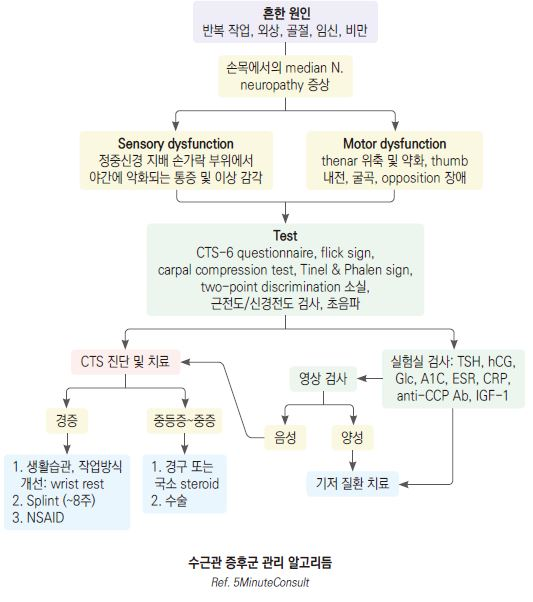

# 수근관증후군 Carpal Tunnel Syndrome, CTS


## 일반 사항

*   손목의 반복적인 움직임 등에 의한, 손목의 carpal bone들과 transverse carpal lig.로 싸여진 carpal tunnel 내의 압력 증가에

    의해 압박된 median nerve의 ischemia에 따른 신경병증 증상
* 주로 dominant hand 이환; 환자의 \~65%에서 양측 발생
* 유병률 : 일반 인구의 3.8%

## 원인

* 외상, 염증, 허혈성 손상, 종양, 골절의 부정유합

### 위험 인자

* 30\~60세
* 여성(남성의 2\~5배)
* 지속적으로 손목을 굴곡 및 신전 시키는 자세, 반복적인 충격/진동 노출 : 원예, 자전거, 테니스

•수근관증후군에 대한 손/손목의 반복 사용 및 작업 요인은 논란이 있음

* 신경병증 유발 질환 : 당뇨병, 알코올 남용, Vit 결핍, 독성 노출
* 체액 균형의 변화 : 임신, 비만, RA, 신부전, 갑상선저하증, CHF

•임신 관련해서는 보통 출산 수 주 후 자연 회복

* occupying Dz : tenosynovitis, gout, ganglion
* 외상 : radius 원위부 골절, perilunate \&lunate 탈구

## 임상 양상

*   정중신경 지배 손가락(제1\~3수지 및 제4수지 radial portion)의 야간 통증, 감각 저하, 따끔거림; 주간에는 손을 구부리고

    펴는 동작, 팔을 올리는 동작 시 발생(예: 운전, 휴대폰 사용, 타이핑, 독서); 흔히 환자는 손 전체의 증상으로 표현함
* 손가락 움직임 장애, 악력 약화(예: 병을 열 때 손에 힘이 없음)
* 간혹 정중신경을 따라 근위부(팔꿈치, 간혹 어깨)로 방사되는 통증과 이상 감각
* 손을 흔들거나 문지르면 완화 (환자가 손목의 통증을 줄이기 위해서 손과 손목을 터는 행동 "Flick sign")
* 양측 발생 (보통 한쪽 손의 증상이 보다 심함)

## 진단

### 이학적 검사

*   [Carpal(or Durkan) compression test](https://www.youtube.com/watch?v=4Xb0uc53qCs) : 엄지손가락으로 환자의 손목 터널 위(손목 안쪽 중앙부를)를 30초간 압박;

    30초 내 정중신경 분포 지역에 통증 또는 저림 등 감각 이상이 시작되면 양성(민감도 87%, 특이도 90%)
* [Tinel test ](https://www.youtube.com/watch?v=0KXRcnQqGUc): 환자의 손목 안쪽 중앙부 tapping 시 증상 유발
* Phalen test : 1분간 손목 완전 굴곡 시(양 손등을 붙이고 있음) 증상 유발
* reverse Phalen test : 2분간 손목 완전 신전 시(양 손바닥을 붙이고 있음) 증상 유발
* two-point discrimination 소실 : 정중신경 지배 손가락에서 ≤5 ㎜ 간격의 두 점을 구별 못함
* thenar 위축 : 오랜 기간 지속된 환자들에서 thumb abduction & opposition의 약화

### 검사실 검사

* 신경전도/근전도 검사(민감도 ＞85%, 특이도 ＞95%)
* 초음파 검사 : 정중신경 cross-sectional area ＞9 ㎟
* X선, MRI : 다른 원인 배제를 위하여 고려
* 실험실 검사 : 다른 원인 배제를 위하여 고려; 갑상선 질환, 당뇨병, RA 감별 검사

### CTS-6 Questionnaire

① 주로 정중신경 지배 손가락(제1\~3수지, 제4수지 radial aspect)에서 증상 발생 (3.5점)

② nocturnal numbness (4점) ③ thenar atrophy &/or weakness (5점)

④ Phalen test 양성 (5점) ⑤ Tinel sign 양성 (4점)

⑥ 2-point discrimination 소실 (4.5점)

```
▶판정 : ≥12점 CTS(Carpal tunnel syndrome) 확률 ≥80%
```

***

## Management

### 치료 방침

* 고정, 물리/재활 치료
* NSAID(1차 선택), corticosteroid 국소 주사
* 수술
* 예방 : 인체 공학적 생활 도구(예: 책상, 키보드), 손에 직접 진동이 전달되는 작업 시 완충 장치 사용, 손목 운동

## 비-약물 치료

* 손목 고정, 냉찜질, 재활 치료 : 제한적 효과
* neutral wrist splint : 수면 중 normal anatomic position으로 부목 적용

## 약물 치료

#### NSAID

* 장기 경과에는 영향 없음
* ibuprofen : 200\~800 ㎎ tid \[부루펜]
* naproxen : 250 ㎎ tid\~500 ㎎ bid \[낙센]

#### Steroid 터널 내 주사

* proximal wrist crease의 palmaris longus tendon의 ulnar side에 주사
* 단기 효과가 있으며 주사에 대한 반응으로 CTS를 감별하기도 함
* 금기 : 감염 소견, 터널 내 종괴, 출혈 경향
*   hydrocortisone 20 ㎎, methylprednisolone 15\~40 ㎎, triamcinolone 20 ㎎

    ✽보통 2% lidocaine 0.15\~0.5 ㎖(or 1% 용액 1 ㎖)를 혼합하여 주사

#### Platelet-rich plasma (PRP) Injections

* 통증 감소와 신경전도 향상 효과가 있다는 낮은 연구 수준의 보고가 있음

#### 경구 Steroid

* 단기 효과(2\~8주); 주사제보다 효과 적음
* prednisone : 20 ㎎ qd ×7d → 10 ㎎ qd ×7d \[소론도]

## 수술

* 다른 치료에 반응이 없는 경우 고려
* decompression : transverse carpal ligament를 dividing
* 수술 치료를 받은 환자의 10\~20%에서 재발

## 손목 운동

* 운동 중 심한 통증이 발생하면 중지
* 3\~4주 이상 꾸준하게 시행 후 호전되지 않으면 재평가, 호전 있으면 이후에도 지속

> ```
> (Ref. AAOS Orthinfo )
> ```

#### Wrist Extension Stretch

*   팔을 뻗고 손목을 dorsiflexion → 반대쪽 손으로 손바닥을 잡고 팔 안쪽이 쭉 펴진 느낌이 들도록 부드럽게 당김

    → 15초간 유지
* 팔을 바꾸어 가며 각 5회 반복(1 set), 1일 4 set(특히 활동 전), 주 5\~7일 시행

#### Wrist Flexion Stretch

*   팔을 뻗고 손목을 palmar flexion → 반대쪽 손으로 손등을 잡고 팔 바깥쪽이 쭉 펴진 느낌이 들도록 부드럽게 당김

    → 15초간 유지
* 팔을 바꾸어 가며 각 5회 반복, 1일 4 set(특히 활동 전), 주 5\~7일 시행

#### Median Nerve Glides

*   ① 주먹을 쥠 → ② 손가락을 모두 붙이고 손을 폄 → ③ 손목 신전 → ④ 엄지손가락 신전/외전

    → ⑤ 손바닥이 위를 향하도록 전완을 돌림 → ⑥ 다른 손으로 엄지손가락을 부드럽게 당겨 스트레칭
* 각 자세를 3~~7초간 유지, 10~~15회 반복(1 set), 1일 1 set, 주 6\~7일 시행
* 시행 전 15분간 손에 온찜질, 시행 후 20분간 냉찜질

#### Tendon Glides

*   Series A : ① 손목과 손가락을 똑바로 세움 → ② 손가락 끝 마디를 ‘hook’ 모양으로 굽힘

    → ③ 다른 손가락들 위로 엄지손가락을 놓고 주먹을 꽉 쥠
*   Series B : ① 손목과 손가락을 똑바로 세움 → ② PIP & DIP 관절을 곧게 유지한 채 MCP 관절을 굴곡하여 ‘tabletop’을 만듦

    → ③ PIP 관절을 굴곡하여 손가락이 손바닥에 닿게 함
* 각 자세를 3초간 유지, 5~~10회 반복(1 set), 1일 2~~3 set, 견딜 수 있으면 횟수 증가
*   시행 전 15분간 손에 열을 가함, 시행 후 20분간 냉찜질

    

> **질병코드** G56.0 손목터널증후군
