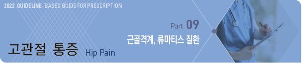
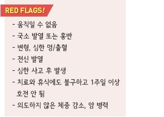
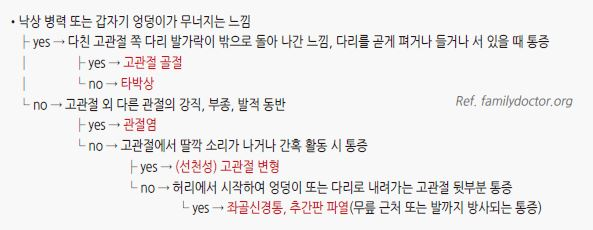
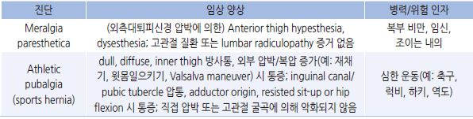
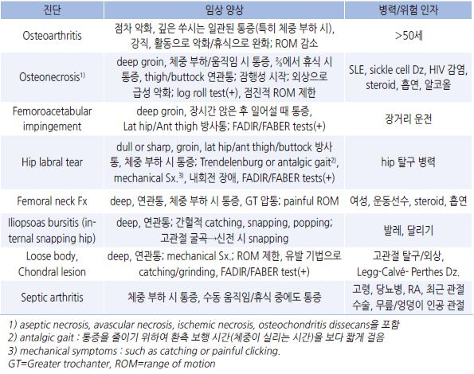
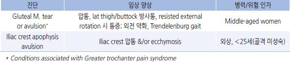
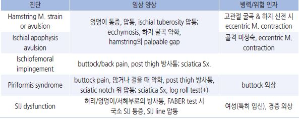
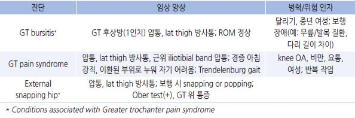

# 고관절 통증 Hip Pain



## 원인

#### 부위별 흔한 원인

* anterior hip or groin : 관절 내 병변(예: OA, hip labral tear); 관절 외 병변(예: hip flexor injury); 복부 or 골반 기원 연관통
*   lateral hip : greater trochanteric pain syndrome(gluteus medius tendinopathy or tear, bursitis, iliotibial band friction 포함);

    방사통/연관통인 경우가 많음
* posterior hip or buttock : piriformis syndrome, sacroiliac joint(SIJ) dysfunction, lumbar radiculopathy

#### 연령별 흔한 원인

* \~사춘기 : 선천 기형, avulsion Fx, apophyseal/epiphyseal injury
* 성인 : 염좌, femoroacetabular impingement, 타박상, 점액낭염
* 고령 : 퇴행성 골관절염, 골절

### 위험 인자

* 고령, 골다공증, steroid 사용



## 임상 양상

* 고관절 통증 및 약화
* 부종
* 멍
* 고관절 운동 범위 제한
* thigh 또는 buttock 방사통
* 하지 기형 또는 단축
* 보행 장애

## 진단

### 영상 검사

* X선 검사 : 골절/탈구 의심 시
*   MRI : X선 검사 등으로 진단이 되지 않을 때(특히 대퇴골두 osteonecrosis, labral tear); hip labral tear 진단에서는

    MR arthrography가 보다 유효
* 초음파 : tendon, bursa, joint effusion, functional 원인(예: snapping hip) 진단에 유효
* bone scan : 다른 검사로 진단되지 않는 골절, osteonecrosis, arthritis, 암의 골 전이

### 실험실 검사

* 흡인 검사 : 점액낭염에서 고려
* 혈액 검사 : 2차성 원인 진단 또는 다른 질환 배제를 위하여 고려

### 신체검사

✽[hip anatomy](https://emedicine.medscape.com/article/1898964-overview)

✽[thigh anatomy \[3D\]](https://www.healthline.com/human-body-maps/thigh#1)

* 양측을 비교 평가하는 것이 중요함

#### Trendelenburg test (= Single leg stance phase)

* [방법](https://www.aafp.org/afp/2014/0101/hi-res/afp20140101p27-f1.jpg) : 선 자세로 한 다리를 들음; 올린 쪽 iliac crest가 ＞2 ㎝ 내려가면 양성(디딤 발 쪽 이상)
*   관련 상태 : 반대쪽 gluteus medius 약화, Hip labral tear, transient synovitis, Legg-Calvé-Perthes(LCP) Dz,

    slipped capital femoral epiphysis(SCFE)

※ Trendelenburg gait : 환측 고관절 쪽으로 상체가 기울어짐

#### Hip ROM testing

*   [방법](https://www.aafp.org/afp/2014/0101/hi-res/afp20140101p27-f2.jpg) : abduction. adduction. extension. internal & external rotation을 각각 시행; 운동 범위 제한, 수동적 움직임으로

    (특히 운동 범위 끝에서) 통증 발생 시 양성
* 관련 상태 : synovitis, septic arthritis, loose body, chondral lesion, OA, LCP Dz, osteonecrosis

#### FABER (flexion, abduction, external rotation) test (= Patrick’s test)

*   [방법](https://www.aafp.org/afp/2014/0101/hi-res/afp20140101p27-f3.jpg) : 누운 자세에서 고관절과 무릎을 45°굴곡 시키고 외전/외회전시켜 발목이 반대 다리의 무릎 근위부에 놓이도록 함;

    SIJ/요추/post hip 통증, groin pain 발생 시 양성
*   관련 상태 : hip or SIJ 이상; OA, SIJ dysfunction, hip labral tear, loose body, chondral lesions,

    femoral acetabular impingement, iliopsoas bursitis, iliopsoas spasm

#### FADIR (flexion, adduction, internal rotation) test (= Impingement test)

* [방법](https://www.aafp.org/afp/2014/0101/hi-res/afp20140101p27-f4.jpg) : 누운 자세에서 다리를 완전 굴곡 시키고 내전/내회전 시킴; 통증 발생 시 양성
* 관련 상태 : hip labral tear, loose body, chondral lesion, femoral acetabular impingement

#### Log roll test (= Freiberg test)

*   [방법](https://www.aafp.org/afp/2014/0101/hi-res/afp20140101p27-f5.jpg) : 누운 자세에서 다리를 신전시켜 힘을 빼게 하고 하지를 통나무 굴리듯이 내회전 및 외회전시킴(log roll);

    움직임 제한, 통증 발생 시 양성
* 관련 상태 : piriformis syndrome, SCFE

#### Straight leg raise against resistance test (= Stinchfield test)

* [방법](https://www.aafp.org/afp/2014/0101/hi-res/afp20140101p27-f6.jpg) : 누운 자세에서 다리를 쭉 펴고 하지를 누르는 상태에서 45°들도록 함; 약화가 있으면 양성
* 관련 상태 : Athletic pubalgia, SCFE, femoral acetabular impingement

#### Straight leg raise(SLR) test

*   방법 : 누운 자세에서 다리를 쭉 펴고 힘을 뺀 상태에서 하지 수동 거상: ＞60\~70o에서 통증 발생 시 양성

    (발목 신전 시 악화, 무릎/고관절 굴곡 시 완화)
* 관련 상태 : hamstrings, gluteus maximus, or hip capsule, or hip or SIJ 이상
* ＜60\~70o에서 통증 발생 시 추간판탈출증 등 신경학적 이상, 감염, 종양 등 고려

#### Ober test (passive adduction)

*   [방법](https://www.aafp.org/afp/2014/0101/hi-res/afp20140101p27-fb.jpg) : 건측을 아래로 하여 옆으로 눕히고 검사자는 환자의 등 뒤에 서서 수동적으로 시행; 움직임 제한,

    통증 발생 시 양성

    •Tensor fasciae latae 검사 : 고관절과 무릎을 완전 신전하고 진찰대 밖으로 다리를 내어 놓아 중력에 의하여 다리가

    내려가도록(내전되도록) 함

•Gluteus medius : 고관절 완전 신전, 무릎 45\~90°굴곡 시킴

•Gluteus maximus : 고관절 굴곡, 무릎 신전 시키고 상체를 어깨가 진찰대에 닿도록 돌리게 함(상체 supine)

* 관련 상태 : external snapping hip, greater trochanteric pain syndrome

#### 기타

*   골반 기울어짐 : 시진상 양쪽 iliac crest 높이가 다름

    •원인 : 다리 길이의 차이, 골반 골절, 측만증, 편측 척추 주위근 경직
* 쪼그려 앉기 장애 •원인 : 중등증 이상의 관절염 또는 점액낭염, 관련 근육 장애

### 증상/병력에 따른 감별

```

```

*   Lumbosacral spine or SIJ로부터의 연관통 : 요통 동반, 통증/감각 이상 증상이 원위부로 확장, 고관절 및 연조직의 이상이

    명확하지 않음; lower lumbar root → gluteus & posterolateral thigh area, SIJ → gluteal area

#### 부위에 따른 감별

> ```
> (Ref. Evaluation of the Patient with Hip Pain. AFP 2014;89(1))
> ```

#### Anterior thigh or groin pain

```

```

#### Anterolateral hip and groin pain

```

```

#### Posterolateral pain

```

```

#### Posterior pain

```

```

#### Lateral pain

```

```

## Occult fracture

* 원인 : 외상 또는 반복적 체중 부하 운동 관련
*   임상 양상 : anterior hip or groin pain; 체중 부하/활동 시 통증(antalgic gait), 수동 움직임 시 통증(특히 ROM의 끝),

    ant-lat hip 압통, SLRT/log roll/FABER test 양성
* 검사 : X선 검사에서 정상; MRI 등으로 진단

***

## Management

## 비-약물 치료

* 휴식 : 증상 초기에 권고; 근력과 유연성을 유지하기 위하여 이후 운동 및 활동 유지
* 냉찜질 : 얼음이 직접 피부에 닿지 않도록 함(동상 주의), 한 번에 10\~15분 이상 지속하지 않음
*   열찜질 : 국소 열감이 없을 때 시행(외상 초기에는 피함); 열찜질이 부종을 악화시킬 수 있음;

    한 번에 20분 이상 지속하지 않음(화상 주의)
* 부목, 압박 붕대, 보조기, 목발
* 물리 치료, 운동

## 약물 치료

### 진통제

* NSAID : ibuprofen 200~~800 ㎎ tid \[부루펜], naproxen 250~~500 ㎎ bid \[낙센]
* acetaminophen : 650\~1,300 ㎎ tid \[타이레놀]

### Steroid

* 부종에 대하여 도움이 될 수 있음
* 단기 사용

### 항생제

* 감염 시 고려 (☞ p.901)

## 예방

* 적정 체중 유지, 비만 치료
* 통증을 악화시키는 활동을 피함
* 장시간 서 있거나, 앉거나 누웠을 때를 포함하여 같은 자세로 오래 있지 않음
* 아픈 고관절을 아래로 하여 옆으로 눕지 않음, 옆으로 누울 때는 무릎 사이에 베개를 끼움
* 구부린 자세로 일하는 것을 피함, 물건을 들 때 무릎을 구부림
* twisting, bending, running, jumping, 갑자기 출발 또는 정지하는 활동을 피함
* 반복적인 작업을 할 때는 자주 휴식을 취함
* 계단 오르내림을 줄임
* 굽이 높은 신발 착용을 피함
* 스트레칭, 근육 강화 훈련

#### 운동

* 운동 전 충분한 준비 운동
* 체중 부하가 적은 운동 선택 : 수영, 자전거
* 고관절에 무리를 주는 운동을 피함 : 농구, 테니스
* 하지 충격을 줄임 : 딱딱한 바닥에서 뛰는 것을 피함, 충격을 흡수할 수 있는 잘 맞는 신발 착용
* 필요시 보호 장비 착용
* 운동량을 천천히 늘림
* 피곤할 때는 운동하지 말 것, 추운 날씨에는 더욱 주의

> **질병코드** M25.55 관절통, 골반 부분 및 대퇴
