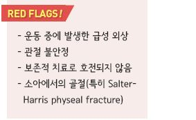
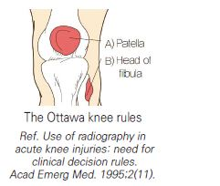
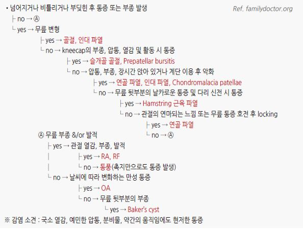
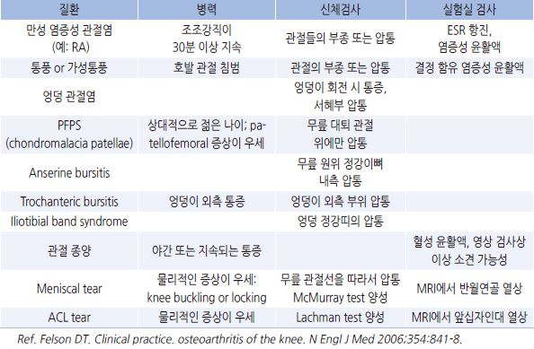
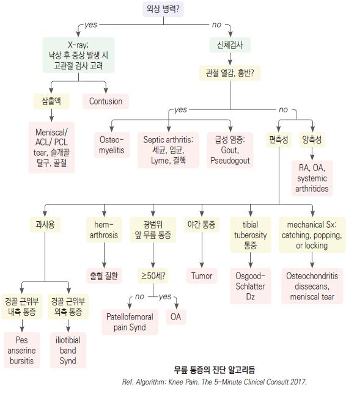
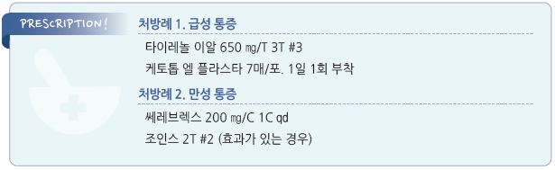

# 무릎 통증 Knee Pain

## 일반 사항
- 외상, 과사용, 퇴행성 변화 등에 의한 관절 내(예: OA, RA) 또는 관절 주위(예: anserine bursitis,

collateral ligament strain)의 급만성 통증, 만성 질환의 급성 악화, 또는 연관통(예: 고관절 질환)

- 무릎의 정상 운동 범위 : 0o(extension)~135o(flexion)

## 원인
- 외상 : 인대 손상, 반월연골 손상, 골절, 탈구, 윤활막염, patellar tendinitis

- 과사용 : tendinopathy, patellofemoral syndrome, bursitis, apophysitis

- 연령 관련 : 관절염, 퇴행성 변화, apophysitis(젊은 연령)

- 류마티스 질환 : RA, gout, pseudogout

- 감염

- 연관통 : 고관절, 허리

- 혈관 질환 : 슬와동맥류, 심부정맥혈전증

- 기타 : 종양, 낭종, plica syndrome

>   ✽중등도 활동 vs 비활동 사람들을 비교한 결과 knee OA의 위험도는 차이 없게 낮았다는 보고가 있음

### 위험 인자
- 비만

- 여성

- 낮은 유연성

- malalignment

- 과거의 손상

- 근육 불균형 또는 약화

- 부적당한 신발, 바닥

- 부적당한 운동 방법

- 많거나 무리한 운동량, 빈도 증가

- 무리한 활동 : 점프, 회전, 가속, 감속, 무릎 구부림

## 진단

### 신체검사

>   ✽knee anatomy 1, knee anatomy 2 

>   ✽leg muscle(3D) 
- 보통 supine postion에서 hamstring muscles을 이완한 상태로 시행

#### Quadriceps angle (Q angle)
- [방법](https://www.aafp.org/afp/2003/0901/p907.html) : anterior superior iliac spine~patella 중심의 가상선과 patella 중심~tibial tuberosity의 가상선과의 각도 측정;

    ＞15° 시 양성

- 관련 상태 : 슬개골 불안정(quadriceps muscle의 강한 수축이 슬개골을 외측으로 당김)

#### Patellar apprehension test
- [방법](https://www.youtube.com/watch?v=0yez2vW1Mrc) : 무릎을 펴게 하고 슬개골을 외측에서 내측으로, 또 내측에서 외측으로 압력을 주어 움직임; 통증 발생 시 양성 

- 관련 상태 : 슬개골 불안정

#### Anterior drawer test
- [방법](https://www.youtube.com/watch?v=IdnBKv38EEQ) : 무릎을 90°굴곡시키고 발바닥을 바닥에 붙이게 하고, 양 손으로 tibia를 잡고(엄지손가락은 tibial tubercle에 위치)

    tibia를 앞으로 당김; 반대쪽보다 많이 움직이면 양성

- 관련 상태 : ACL 손상 

#### Lachman test
- [방법](https://www.youtube.com/watch?v=JFkbKNNa7xQ) : 무릎을 30°굴곡시키고, 한 손은 thigh를 잡고 다른 손은 tibia를 잡고(엄지손가락은 tibial tuberosity에 위치) tibia를

    앞으로 당김; tibia가 명확한 endpoint 없이 움직이면 양성(반대쪽과 비교)

- 관련 상태 : ACL 손상

#### Pivot Shift Test
- [방법](https://www.youtube.com/watch?v=2TPfLOcxbTI) : 다리를 펴고 누운 상태에서, 양손으로 tibia를 약간 내회전 상태로 잡고, 무릎을 천천히 굴곡시키면서 axial load &

    valgus stress를 가함; 20~40o 굴곡 상태에서 "clunk"(부딪히는 둔탁한 소리) or "glide"가 나면 양성

- 관련 상태 : ACL 손상

#### Posterior drawer test
- [방법](https://www.youtube.com/watch?v=AiHpMqqLgkI) : 무릎을 90°굴곡시키고 발바닥을 바닥에 붙이게 하고, 양 손으로 tibia를 잡고 tibia를 뒤로 움직임;

    반대쪽보다 많이 움직이면 양성

- 관련 상태 : PCL 손상

#### Posterior sag sign
- [방법](https://www.youtube.com/watch?v=7vgTMnfP4fs) : 하지를 이완한 상태에서 엉덩이와 무릎을 90°굴곡되도록 종아리나 발뒷꿈치를 받혀 듦, 또는 발을 바닥에 붙이고

    엉덩이가 45o, 무릎이 90°굴곡되도록 함; femur에 대하여 tibia가 내려가 있으면 양성(반대쪽과 비교) 

- 관련 상태 : PCL 손상

#### Valgus[Varus] stress test
- 방법 : 한 손으로 tibia 원위부의 안쪽[바깥쪽]을 잡고, 다른 한 손으로 무릎의 바깥쪽[안쪽]을 잡아 무릎에 내측[외측]으로

    압력을 가함, 무릎 신전 및 30°굴곡(unlocked) 상태에서 각각 시행; 정상보다 많이 움직이거나 명확한 endpoint 없이

    움직이면 양성(반대쪽과 비교) ([valgus test](https://www.youtube.com/watch?v=GSFbttpxCuQ) ; [varus test](https://www.youtube.com/watch?v=sg1gk6QKARw))

- 관련 상태 : valgus stress test- MCL 손상; varus stress test- LCL 손상

#### McMurray test
- [방법](https://www.youtube.com/watch?v=lwDFPAyGGgI) : 한 손으로 무릎을 잡고 다른 손으로 발을 잡고 무릎을 최대한 굴곡 시킨 후 다리를 internal 또는 external rotation

    시키면서 무릎을 폄; 통증과 함께 “딸깍” 또는 “뻑” 소리가 나거나 통증 발생 시 양성

- 관련 상태 : Lat. meniscus(int. rotation 시 양성), Med. meniscus(ext. rotation 시 양성) 손상

#### Clarke's test (Patellar grind test)
- [방법](https://www.youtube.com/watch?v=Y3mKHgg6JoU) : 무릎을 펴게하고, 슬개골의 바로 위에 손의 web space를 위치시켜 하방으로 약간의 압력을 가한 상태에서

    환자는 quadriceps M을 수축시킴; patellofemoral joint에 통증 발생 시 양성(양측을 비교) 

- 관련 상태 : PFPS, OA

#### Ober test
- [방법](https://www.youtube.com/watch?v=Amjv6FzDeLE) : 옆으로 눕히고 무릎을 받혀들어 무릎을 굴곡시키고 고관절을 abduction & extension 시킴. 무릎을 받힌 손을 내려

    고관절을 서서히 adduction시킴; 무릎 외측에 통증을 느끼고 abduction 자세를 유지하려고 하면 양성 

- 관련 상태 : Iliotibial band tightness

#### Dial test
- [방법](https://www.youtube.com/watch?v=3UGffd71KyI) : 엎드린 상태에서 무릎을 30°굴곡시키고 양 발을 잡고 발 뒤꿈치를 모으고 힘을 가하여 최대한 external rotation

    시키고 양쪽 발의 각도(foot-thigh angle)를 비교. 무릎을 90°굴곡시키고 다시 비교(supine position에서도 시행할 수 있음);

    어느 한쪽이 다른 쪽보다 10°이상 external rotation되면 양성 

- 관련 상태 : 30°에서만 양성이면 PLC(postero-lateral corner)만 손상, 90°에서만 양성이면 PCL(posterior cruciate lig.)

    불안정, 30°와 90°모두에서 양성이면 PLC와 PCL 모두 손상 상태

>   ✽PLC : fibular collateral ligament, popliteus tendon, and popliteofibular lig. 등을 포함하는 구조

### 실험실 검사
- arthrocentesis : septic arthritis, gout, pseudogout 의심 시 고려

- CBC, ESR, RF : 감염, RA 의심 시 고려

### 영상 검사
- 대상 : 골절 의심, 외상 병력, OA, osteochondral lesion, PFPS, Ottawa knee rules 해당

- MRI : 연조직 손상 의심 시

- 초음파 : tendon 손상 의심 시

- CT : 골절에 대한 추가 검사

- arthroscopy : 반월연골/인대 손상

#### The Ottawa knee rules 
- 무릎에 대한 급성 손상 후 다음 중 하나 이상에 해당될 경우 골절을 배제하기

    위하여 영상 검사를 시행 (민감도 98.5%, 특이도 48.6%)

  ① ≥55세

  ② patella의 isolated tenderness(무릎 다른 부위의 골 압통은 없음)[A]

  ③ fibula head의 tenderness [B]

  ④ 90°무릎 굽힘 불가능

  ⑤ 체중 부하(양쪽 다리로 각각 2 걸음씩 총 4걸음 보행) 불가능

### 감별 Points

#### 통증 부위별
- 광범위 : OA

- 전방부 통증 : patellofemoral pain syndrome(PFPS)(chondromalacia patellae), patellar tendinitis(Jumper’s knee),

    슬개골 탈구/아탈구, pre/suprapatellar bursitis, tibial apophysitis(Osgood-Schlatter lesion), fat pad impingement,

    quadriceps tendinopathy

- 내측부 통증 : medial collateral ligament(MCL) sprain, medial meniscal tear, pes anserine bursitis, medial plica syndrome

- 외측부 통증 : lateral collateral ligament(LCL) sprain, lateral meniscal tear, iliotibial band tendonitis

- 후방부 통증 : popliteal cyst(Baker’s cyst), posterior cruciate ligament(PCL) injury, meniscal posterior horn injury,

    popliteal cyst or aneurysm, hamstring or gastrocnemius injury, deep vein thrombosis

#### Onset, Duration
- 급성 : 골절, 타박, 인대 손상, 반월연골 손상, 슬개골 탈구/아탈구

  •전신 증상 동반 : septic arthritis, 골수염, gout, pseudogout

- 잠행성 : OA, PFPS, chondromalacia, iliotibial band syndrome, RA, 점액낭염, tendinopathy, loose body, bipartite patella,

    퇴행성 반월연골 찢어짐, 종양

#### 손상 기전
- 과굴곡, 무릎 굴곡 상태에서의 근위 경골에 대한 전방 충격(예: 넘어짐, dashboard injury) : PCL 손상

- 과신전 : ACL, PCL 손상

- 측면 충격 : valgus load(예; 운동 중 외측면 가격)- MCL 손상; varus load- LCL 손상

- 서 있는 자세에서의 회전, 급작스런 방향 전환 : 반월연골 손상

- 급작스런 감속, cutting, 회전 : ACL 손상

#### 부종
- 빠른 진행(2시간), large, tense effusion : ACL 손상, 슬개골 아탈구, tibia plateau 골절

- 서서히 진행(24~36시간)하는 적은 부종 : 반월연골 손상, 염좌

- 활동 후 재발 : 반월연골 손상

- 무릎 뒤 부종 : popliteal or Baker’s cyst

- prepatellar 부종 : bursitis

- bony swelling : OA, neuropathic arthropathy

#### 악화 또는 완화 요인
- 계단 오를 때 통증 : 슬개대퇴골 질환(예: OA, PFPS)

- 계단 오르내릴 때 통증 : 반월연골 손상, PFPS

- 오래 앉아 있을 때 또는 앉았다 일어설 때 통증 : PFPS

### 증상/병력에 따른 감별
    

### 질환별 특징
    

    

## Anterior cruciate ligament(ACL) tear
- ACL의 가벼운 염좌 내지 완전 파열로 인하여 경골이 힘에 의하여 전방으로 움직여짐

- 원인 : 급격한 감속, 착지, 회전, 직접적 충격

- 위험 인자 : 과격/과동한 운동, 적절하지 않은 신발; 여성(남성의 3배), 청소년(16~18세); 해부학적 변이, ACL tear 과거력, 가족력; 과체중, 피로, 근력 약화

- 임상 양상

 •급성 : 심한 통증, 부기; 부상 시 간혹 "펑"소리를 느낌

 •만성 : 불안정. 간혹 quadriceps avoidance gait(고관절과 슬관절을 완전히 펴지 않는 상태로 보행)

- 신체검사 : ant. drawer test(+), Lachman test(+), pivot shift(+)

- 영상 검사 : MRI

- 치료 : 보존적 치료로 회복할 수 있음

 •수술 : ; 심한 손상, 운동선수, 젊은층에서 고려; 스포츠 복귀까지 9~12개월 소요 

---

## Management

### 치료 방침
- 급성 손상에 대하여 PRICEMM therapy : Protection, Relative rest, Ice, Compression, Elevation, Medications, Modalities

- 약물 치료 : 만성 통증에 대한 약물 투여 시 장기 투여에 따른 부작용을 감안해야 함

- 척추, 고관절, 발의 문제가 있는 경우 함께 치료하는 것이 필요

- 테이핑, IMS, 도수치료, 침, 마사지, 레이저치료, 체외충격파치료, PRP : 일부에서 유효

- bracing(안정이 필요한 경우 시행), 지팡이

- 높은 의자 사용, 변기 좌석을 높임 (✽변기 좌석을 높이는 경우 변비 위험이 있음)

## 약물 치료

### 경구제
- acetaminophen : 650~1,300 ㎎ tid [타이레놀]

- ibuprofen : 200~800 ㎎ tid [부루펜]

- naproxen : 250 ㎎ tid~500 ㎎ bid [낙센]

- celecoxib : OA에 적용. 적은 GI 부작용; 200 ㎎ qd [쎄레브렉스]

- tramadol 또는 opioid : 급성 손상에서는 권고하지 않음(심각한 문제가 숨겨질 수 있음)

- clematis 추출물 : 일부 OA, RA에서 증상 완화 효과; 200 ㎎ tid [조인스]

>   ✽NSAID의 장기 사용이 골절, 만성 근육 손상의 치유를 지연시킨다는 보고가 있음

>   ✽강황, 생강 추출물, glucosamine, chondroitin, Vit D : 경도~중등도 knee OA 환자의 통증 감소와 기능 향상에 도움이 될 수 있으나

>     근거가 일관되지 않거나 제한적임 [AAOS](2021)

### 국소제
    (보험기준 ☞ p.1175)

- OA에서 통증 감소 효과

- ketoprofen [케토톱 플라스타/겔]

- piroxicam [트라스트 패취/겔]

- capsaicin : 감각 신경 말단에서의 탈감작 효과. 효과 발현까지 2주 이상 소요; 초기에 심한 작열감, 발적 부작용;

    0.075% cream qid [다이악센]

### 국소 주사
    (☞ p.732)

- steroid 관절 내 주사 : 단기 효과; 동일 관절에 대하여 ≤2회/년으로 제한 [트리암시놀론]

- hyaluronic acid(HA) 관절 내 주사 : viscosupplementation; OA에서 통증 감소, 기능 향상; knee OA 환자에서의 일률적 사용은

    권고하지 않음 [AAOS] [히루안 플러스](1회/주 ×3주), [시노비안 주](1회)

- polynucleotide(PN) 관절 내 주사 : Kellgren-Lawrence grade I~III의 슬관절의 골관절염에 대하여 1주에 1회씩 6개월 내 최대 5회 투여;

    HA 동시 투여 금지. 본인부담률을 80% [콘쥬란] 

- platelet-rich plasma 관절 내 주사 : 논란; 일부 초기 OA에서 유효하다는 평가가 있었으나 최근에는 위약 대비 유의미한

    효과가 없다는 결과들이 보고되고 있음 (lateral epicondylitis에 대해서만 신의료기술 인정)

- botulinum toxin A 연조직 내 주사 : 일부 PFPS에서 유효

### 무릎 OA에 대한 미국류마티스학회 권고
- 사용할 것 : acetaminophen, 국소/경구 NSAID, tramadol, steroid 관절 내 주사 (☞ p.729)

- 사용하지 말 것 : chondroitin sulfate, glucosamine, 국소 capsaicin; 의미 있는 효과가 확인되지 않았거나 이익보다

    위해가 더 큼

## 예방
- 적정 체중 유지

- 적당하고 규칙적인 운동 : 지나친 운동은 피함

- 올바른 자세 운동, 유연성, 균형 운동, 근육 강화 : 스트레칭, 요가, 필라테스

> **질병코드**
M17 무릎관절증

M23  무릎의 내부장애

M25.56 관절통, 아래다리

M76.5 무릎뼈힘줄염

S83  무릎의 관절 및 인대의 탈구, 염좌 및 긴장

