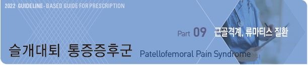
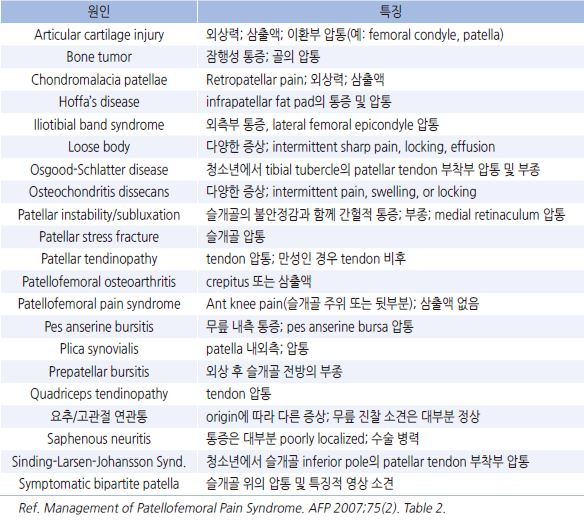
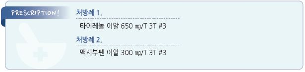

# 슬개대퇴 통증증후군 Patellofemoral Pain Syndrome



## 일반 사항

* 앞무릎 및 슬개골 주위의 통증 및 경직. 계단 오름, 무릎 꿇음, 오래 앉아 있은 후 악화
* 일명 runner’s knee 또는 jumper’s knee
* 유병률 : ＜50세 무릎 통증의 가장 흔한 원인; 일반 인구의 15\~25%, 모든 무릎 손상의 25% 차지
* 경과 : 자연 치유가 잘 되지 않으며 만성화 됨

## 원인

* 과사용, 잘못된 하지 체중 부하 활동
* 무릎 근육 약화
* 하지 구조 이상 : medial patellar facet 형성 부전, patella alta, 하지 malalignment

### 위험 또는 관련 인자

* 여성
* 운동선수, 과활동
* 하지 근육 약화, 유연성 감소 : hamstring, quadriceps, gastrocnemius, gluteus medius
* tight lateral structure : lateral retinaculum, iliotibial band
* patellar hypermobility
* 외상, 수술 병력

> ✽연령, 체중, 신장, BMI, Q angle, 고관절 약화는 PFPS의 위험 인자가 아니라는 보고가 있음

## 임상 양상

* 무릎을 구부릴 때 통증, 특히 무릎을 반복적으로 구부리는 운동/활동(예: climbing stairs, running, jumping, squatting) 시 통증
* 극장에서의 영화 관람, 비행기 여행 등 장시간 무릎을 구부리고 있은 후 통증 &/or 뻣뻣함
* 무릎 앞쪽의 둔한 통증; 보통 점진적 진행
* 광범위 무릎 앞부분 통증; 통증 부위를 정확히 지적하지 못하고 슬개골 주위로 둥글게 표현함(“circle sign”)
* 부종은 드묾, locking 없음
* 내측 또는 외측 retinaculum의 압통
* 슬개골 압통은 보통 없음; 무릎과 고관절의 운동 범위는 정상

## 진단

### 신체검사

> ```
> Ref. Management of Patellofemoral Pain Syndrome. AFP 2007;75(2). fig2~4
> ```

#### J sign (Lat patellar tracking)

* 90°굴곡 상태에서 완전 신전시킬 때 슬개골이 상외측으로 이동하면 양성

#### Patellar mobility testing

* resting position에서 슬개골을 외측에서 내측으로 밀어 움직임
* 슬개골 폭의 ¼ 이상 움직여지지 않으면 외측 구조물 tightness (✽¾ 이상 움직여지면 hypermobile)

#### Patellar tilt test

* 방법 : 똑바로 누워 무릎을 펴게 하고 엄지와 집게손가락으로 슬개골을 잡고 슬개골 내측을 누르고 외측 가장자리를 들어 올림
* tilt up 되지 않으면 외측 구조물 tightness

#### Patellar grind (or inhibition) test

*   [방법](https://www.youtube.com/watch?v=pRqnODPqxFs) : 똑바로 눕히고 슬개골을 trochlear groove를 따라 위에서 아래로 이동시킴. 계속 슬개골을 집고 부드럽게 슬개골이 위로

    올라가지 않게 저항을 주는 상태에서 quadriceps를 수축하게 함
* 반대쪽과 비교하여 통증이 있으면 양성

#### Vastus medialis coordination test

* [방법](https://www.youtube.com/watch?v=9diecCkB7X0) : 똑바로 눕히고 무릎 아래에 (검사자가) 주먹을 넣고 주먹이 눌리지 않도록 하면서 천천히 무릎을 신전
* 통증이 발생하면 양성

#### Patellar apprehension test

* [방법](https://www.youtube.com/watch?v=4TnCQppTy1g) : 똑바로 눕히고 무릎을 30°굴곡 또는 완전 신전 상태에서 슬개골을 내측에서 외측으로 밀어 움직임
* 외측에서 통증 발생 시 외측 구조물의 tightness

### 영상 검사

* 보통 진단에 도움이 되지 않음; 다른 원인 감별을 위하여 고려
* 적응증 : 중증, 비전형적 증상, 치료에 반응하지 않음

### 감별

```
(☞ p.781)
```

#### 앞쪽 무릎 통증의 원인

```

```

***

## Management

### 치료 방침

* 보존적 치료 : 활동 수준 조절, therapeutic exercise program(유연성/근력 강화, ROM 증진)
* 통증에 대한 약물 치료(장기 사용 시 부작용 주의)
* 보존적 치료로 실패 시 수술 치료 고려
* 난치성 환자에 대하여 우울증, 약물 남용 등 정신적 문제 고려

## 비-약물 치료

* Rest : 통증이 해소될 때까지 무릎 통증을 유발하는 활동 중단(cast immobilization 포함)
* Ice : 1일 수회, 1회 20분(피부가 얼얼할 정도의 시간) 시행; 동상 주의(피부에 직접 얼음이 닿지 않도록 함)

> ✽열 치료는 권하지 않음

*   Compression : 압박 붕대 적용(부종 악화 방지 효과); kneecap 부위에는 hole이 있도록 하며 압박이 통증을 유발하지 않는

    정도로 편안하게 적용
* Elevation : 가능한 한 자주 무릎을 심장보다 높게 위치시킴
* 기타 : taping, bracing; electrotherapy, 바이오피드백, foot orthoses, 수술

## 약물 치료

* acetaminophen : 650\~1,300 ㎎ tid \[타이레놀]
* ibuprofen : 200\~800 ㎎ tid \[부루펜]
* naproxen : 250 ㎎ tid\~500 ㎎ bid \[낙센]
* glucosamine, chondroitin, hyaluronic acid : 증거 부족 (보험주의)

## 예방

* 활동에 적합한 신발 착용
* 운동 전 준비 운동, 운동 후 정리 운동(스트레칭 포함)
* 운동/활동량을 점차 늘림
* 하지 스트레칭 및 근육 강화(특히 hip strengthening). 예) 수영, 고정 자전거
* activity modification
* 과거 무릎을 손상시킨 모든 활동을 줄임
* 하지 하중을 줄임, 과체중 시 체중 감량

✽[Knee conditioning program](https://omgsd.com/wp-content/uploads/2017/09/Knee-conditioning-program.pdf): Stretching & Strengthening Exercises \[American Academy of Orthopaedic Surgeons]

> **질병코드** M25.56　관절통, 아래다리


