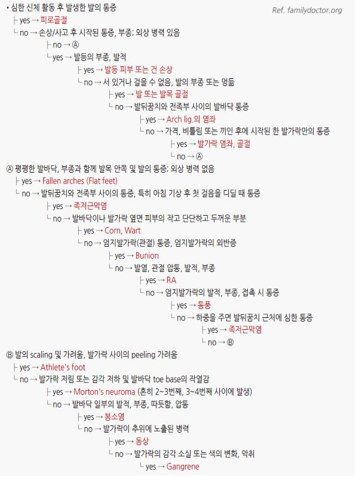

# 발의 통증 Foot Pain

## 일반 사항
- ＞65세의 30%가 발의 압통이 있으며 고령 남성의 20%, 여성의 25%가 활동에 제약을 받는 발의 통증이 있음

- 발의 통증은 삶의 질을 떨어뜨리고 우울과 관련되며 전체적인 건강을 악화시킴

- 위험 인자 : 고령, 비만, 활발한 신체 활동, 운동선수, 무용수, 군인

## 병력/증상에 따른 감별 진단
** 통증이 지속되는가 간헐적인가?**

- 지속적 통증 : 심각한 부상이나 염증

- 간헐적 통증 : trigger를 동반한 손상. 예) cuboid subluxation- 울통불퉁한 표면을 걸을 때 통증

** 통증(예: 둔탁함, 예리함, 불타는 것)을 어떻게 특징지을 것인가?**

- 날카로운 통증 : 관절, 힘줄의 급성 손상

- 둔한 통증 : 만성 손상. 예) hallux rigidus- 1st MTPJ의 만성 둔통

- burning pain : 신경 손상. 예) tarsal tunnel syndrome- 발바닥 표면의 타는 듯한 통증

** 관련 증상이 있는가?**

- 무감각, 이상 감각 : 발 이외 부분의 문제. 예) 척수나 말초신경의 압박

** 방사통이 있는가?**

- 신경 자극을 일으키는 발의 문제

- 전족 발바닥 및 경골신경의 분포를 따라 통증 : tarsal tunnel syndrome

- 손상된 metatarsal 부위에서 인접한 발가락 안쪽면으로 방사 : Morton neuroma

** 체중 부하가 있을 때만 통증 발생? 야간 통증?**

- 야간 통증 : 스트레스 골절, 관절염, 종양, 당뇨병신경병증

- 체중 부하가 있을 때 통증 : 족저근막염, tendinopathy, metatarsalgia

** 만성 질환이 있는가?**

- 당뇨병 : neuropathy

- 통풍 : 특히 1st MTPJ 통증

** 임신으로 인한 많은 체중 증가?**

- longitudinal or transverse arch 붕괴

- longitudinal arch 또는 metatarsal 부위의 trigger pain

** 변화 관련**

- 달리기 거리의 상당한 증가 같은 운동/활동의 증가와 관련하여 통증 발생 : overuse injury

- 통증이 시작되기 전에 신발 교체 또는 착용 방법 변경 : 신발 문제

- 지난 1년 동안 큰 몸무게 증가 : Plantar fasciitis

** 통증을 완화시켜 주는 것은?**

- 폭이 넓은 신발 착용으로 호전 : bunion(hallux valgus), Morton neuroma

### 증상/병력에 따른 발 문제의 감별
    

## 통증 부위에 따른 감별 진단

>  Forefoot pain, Non-traumatic

#### 국소 병소
** 엄지발가락 병소**

- valgus deviation → bunion (hallux valgus)

- varus deviation → hallux varus

- 1st MTP의 irregularity & enlargement → 골관절염, 통풍, 기타 퇴행성 질환

- 엄지발가락의 수동 신전 제한 → hallux limitus, hallux rigidus

- 급성 통증 및 압통, 부종, 발적 → gout, 흔하지 않게 pseudogout or septic joint

** 엄지발가락 이외의 병소**

- MTP joint dorsiflexion, PIP joint plantar flexion, neutral DIP joint → hammertoe

- MTP dorsiflexion, PIP & DIP joint plantar flexion → claw toe

- 5th toe의 rotation & metatarsal bone prominence → bunionette

- DIP joint plantar flexion → mallet toe

- MTP, PIP, & DIP joint plantar flexion → curly toes

- 다른 발가락 위 또는 아래로 꼬임 → crossover toes

** forefoot 피부 또는 발톱의 변화**

- 2nd MT head plantar surface에 큰 callus → Morton callus의 metatarsalgia

- 여러 발가락 MT head plantar surface에 calluses → metatarsalgia (transverse arch drop, neurogenic condition 관련)

- 중심부 core가 있는 callus → corn (☞ p.968)

- PIP dorsum의 callus → 신발 마찰 (hammer or curly toe 관련)

- 깎아내면 dark dots가 발생하는 callus-like skin → plantar wart

- Nail bed 측부의 염증 반응 → ingrown toenail

- 발톱 모양 이상 → nail dystrophy

#### MTP or PIP joints의 광범위한 변화
- rheumatoid arthritis 또는 osteoarthritis

#### 발 모양에 명백한 변화가 없는 forefoot pain
- distal MT shafts 통증 → metatarsalgia

- metatasals 사이의 국소 통증, 발 옆을 함께 쥐면 악화 → Morton neuroma

### Forefoot pain, Trauma-related
- 엄지발가락의 acute hyperextension 후 즉시 or 잠시 후 발생된 통증 및 부종 → MTP sprain (“turf toe”)

- 1st MTP joint 의 지속적인 통증, 신발에 의한 압박 경력이 있음 → sesamoid injury, corn or callus, 드물게 stress fracture

- 외상 후 발톱 밑 변색 및 통증 → subungual hematoma, fracture

- 외상 후 압통, 변색, malalignment → toe fracture or dislocation

- 외상 또는 과사용 후 forefoot dorsum 부종 및 압통 → metatarsal fracture, stress fracture

### Midfoot pain
** Medial arch, navicular prominence, 또는 N-spot의 통증**

- N-spot 압통 → navicular stress fracture

>   ✽N-spot : The area of foot overlying the proximal dorsal surface of the navicular bone
- navicular prominence 통증 & posterior tibialis 검사 시 통증 → insertional tendinopathy

- 현저한 navicular prominence → fibrous separation or 피로골절이 있는 accessory navicular

- medial arch 통증 있음, navicular의 직접적 통증은 없음 → longitudinal arch strain

- midfoot의 plantar surface을 따라 결절 → plantar fibromatosis (Ledderhose disease)

** 약간의 편측성 정적/동적 longitudinal arch 소실이 있는 navicular prominence 통증**

- “spring ligament” (calcaneonavicular ligament) 파열

- posterior tibialis tendon 파열

** Midfoot dorsum 통증**

- tarsometatarsal(TMT) 관절의 bony irregularity → TMT or 전반적 관절염

- 외상 후 Lisfranc joint(=TMT joints) 통증 → Lisfranc joint 염좌 또는 골절

- midfoot dorsum의 soft swollen mass → ganglion cyst

- extensor tendon을 따라 전반적 부종, resisted toe extension 시 통증 → extensor tendinopathy

** Lateral midfoot 통증**

- 압통, cuboid mobility 증가 → cuboid subluxation

- resisted foot eversion 시 통증 → fibularis (peroneus) brevis or fibularis (peroneus) longus tendinopathy

- fifth metatarsal base의 부종 or 통증 → enthesopathy of fibularis (peroneus) brevis, fibularis tertius, or avulsion fracture

### Rear Foot pain
** Plantar fascia의 medial calcaneus plantar insertion 부위 통증**

- 아침에 첫 발을 디딜 때 보다 심한 통증 → plantar fasciitis

- 야간 통증, calcaneus 광범위 압통 → calcaneal stress fracture

- calcaneus 위에서 가장 심한 압통, 엄지발가락 신전에 의해 악화되지 않음 → split fat pad, calcaneus 타박상/미세골절

** Bony irregularity가 있는 posterior calcaneus 통증**

- 부종 및 Achilles tendon squeezing 시 통증 → enthesopathy

- bony irregularity 위의 부종 &/or 압통 → Haglund deformity

** Rigid flat foot & Rear foot의 약간의 bony irregularity**

- rear foot 움직임의 제한 → tarsal coalition

- palpable bony irregularity → accessory ossicle

** Talar dome 또는 talar 측면의 압통**

- 발목 신전 또는 굴곡 시 통증 악화 → 전방 충돌증후군 (tibial or talar spurring 기원)

- talus 측부 통증, 반복 또는 심한 발목 염좌 병력 → talus의 osteochondral injury

** Lateral malleolus 전방 또는 후방 부종 및 통증**

- resisted foot eversion 시 통증 악화 → fibularis (peroneal) tendinopathy

- 전방 부종이 보다 심하고 rear foot pronation → sinus tarsi syndrome

** Calcaneus 바로 상부 rear foot 통증**

- plantar flexion 시 통증 악화 → os trigonum 또는 후방 충돌증후군(talar spurring)

- Achilles tendon squeezing 시 통증 악화 → retrocalcaneal bursitis

** 발바닥을 따라 통증 있음, 압통 없음**

- tarsal tunnel의 tinel’s sign 양성 또는 현저한 pronation → tarsal tunnel syndrome

** fat pad 및 calcaneus의 무통성 flesh colored papules**

- 어떤 원인에 의해 heel strike 압력이 높아짐 → piezogenic papules

## 

## ￭ 족저근막염 Plantar fasciitis
- 발바닥 뒤꿈치에서 발가락까지 이어지는 fibrous tissue인 plantar fascia의 염증

- 추정 기전 : 발뒤꿈치 족저 근막 부착부의 반복적 손상에 의한 근막의 미세 파열 및 파열된 근막의 치유 과정에서 발생하는

    일시적 염증성 변화

- 보통 수개월의 보존적 치료로 치유(회복이 더딤); 80%가 12개월 내 회복

### 위험 인자
- 비만

- 중년(40~60세), 여성

- 편평족, 요족

- 장시간 서 있는 직업, 달리기, 에어로빅

- 비활동 & 갑작스런 보행 증가

### 임상 양상
- proximal medioplantar surface(발뒤꿈치 바닥~족부 내측)의 찌르는 듯한, 방사되지 않는 통증

- anteromedial calcaneus의 plantar fascial insertion 부위의 압통, 발가락 신전 시 통증 악화

- 보통 감각 저하는 없음

- 보행 시작, 아침 처음 몇 걸음 동안 심함, 활동함에 따라 완화되나 장시간 걷거나 서 있으면 심해지고 앉아서 쉬면 호전

### 진단
- 족저근막염의 임상 양상이 있으면서 과사용, 신발 교체, 딱딱한 바닥에서의 운동, 갑작스런 활동 증가 등의 과거력이 있으면

    진단 가능

- 초음파 : 치료에도 불구하고 3개월 이상 지속 시 고려

- X선 : 발의 골격 구조 확인 및 감별 진단을 위하여 고려

### 치료
- 적정 체중 유지

- 낮은 굽, 두꺼운 밑창, 아치를 지지해 주는 신발 선택; 충격 흡수가 안되는 신발 회피

- 발/발목/족저근막 스트레칭/마사지, 냉찜질, 뒤꿈치 쿠션

- 야간 부목(약간의 ankle dorsiflexion; 효과 입증 안 됨)

- 운동 변경

  •회피 : 체중 부하 활동. 예) 등산, 달리기, 오래 걷기

  •선택 : 족저근막에 영향이 덜 가는 운동. 예) 고정식 자전거, 수영

- NSAID : 통증에 따라 간헐적 사용

- 국소 steroid 주사 : 효과가 일시적이고 부작용을 감안하여 제한적으로 고려

- extracorporeal shock wave therapy : 근거가 부족하며 난치성 환자에서 고려

- endoscopic fasciotomy : 6~12개월의 치료에도 불구하고 활동에 제한이 있는 경우 고려
