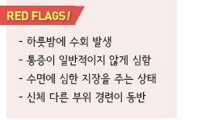
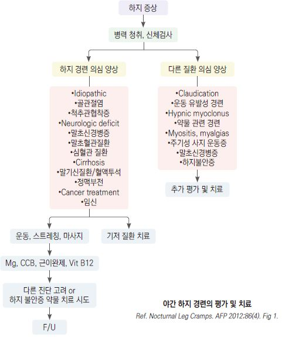
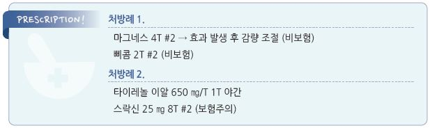

# 야간 하지 경련 Nocturnal Leg Cramp

## 일반 사항
- 취침 중 갑자기 발생하여 수 초~수 분간 지속되는 다리 &/or 발의 긴장

    또는 경련

- 통증으로 잠에서 깨어남

## 원인
- 대부분 불명

### 위험 인자
- 구조/물리적 문제 : 근육 피로(과로, 운동), 평발, genu recurvatum, hypermobility syndrome, 나쁜 자세, 장시간 앉아서 활동,

    단단한 바닥에 장시간 서서 활동

- 수분/전해질 불균형 : 이뇨제, 혈액 투석, 과음, 심한 땀 흘림(염분 보충 부족), 당분 과다 섭취, 임신(특히 저마그네슘혈증)

- 대사 이상 : 당뇨병, 저혈당, 알코올 남용, 갑상선저하증

- 혈관 질환, 중추/말초 신경 질환, 빈혈, 레이노병, 간경화, 납중독, sarcoidosis

- 약물 : IV 철분제, naproxen, estrogen, raloxifene, 이뇨제, teriparatide, nifedipine, cimetidine, salbutamol, statin, terbutaline,

    lithium, penicillamine, phenothiazine

## 진단
- 일반적으로 검사는 필요 없음

- 기저 질환 의심 시 이에 대한 검사 고려

---

## Management

## 비-약물 치료
- 다리/발을 움직이거나 보행

- 다리를 올리고 누움

- 수건으로 감싼 얼음으로 마사지(동상 주의)

- 수 분간(5분) 온찜질 또는 더운물 목욕

## 예방
- (제한이 없는 경우) 충분한 수분 섭취

- 술/카페인 섭취 제한

- 과도하지 않은 수준의 운동을 규칙적으로 시행

- 너무 더운 환경에서의 생활 또는 운동은 피함

- [종아리 스트레칭](https://patient.info/bones-joints-muscles/cramps-in-the-leg) : 벽에서 80~90 cm 떨어져 서고, 손을 벽에 짚고 상체를 벽에 가까이 하고, 발바닥 전체를 바닥에 붙이고,

    허리와 종아리를 신전한 상태로 유지; 5분 이상, 하루 세 번, 마지막은 취침 전 짧게 시행; 효과 발현까지 2~4주 소요

- 취침 전 수 분간 고정식 자전거 타기

## 약물 치료
- 항경련제와 근이완제를 포함하여 약물 치료들의 효과는 명확하지 않으며 투여 기간을 정하기 어려움

- Mg : Mg lactate [마그네스], Mg citrate [판토마그](Ca 복합제); 신장애 시 주의

  •MgO는 흡수율이 낮아 권고 안 함

- Vit B 복합체(특히 B12) : 소간, 육류, 생선

  •Vit B 흡수를 저하시키는 인자 : 음주, 고령, 위축성 위염, 제산제 복용, 위절제술

- 수면 효과가 있는 H1-항히스타민제 : diphenhydramine 50 ㎎ 취침 시 [디펙타민](비보험)

- non-DHP CCB : diltiazem 30 ㎎ [헤르벤], verapamil 120 ㎎ [이솦틴] 저녁

- 항경련제 : gabapentin 600~900 ㎎ #2 저녁, 취침 시 [뉴론틴] (☞ p.13)

- 근이완제 : carisoprodol 350 ㎎ tid, orphenadrine 100 ㎎ bid [스락신]

- quinine derivative : 부작용 문제로 특별히 선별된 환자에 한하여 주의 사용

  •hydroxychloroquine sulfate : 200 ㎎/d ×2wk → 200 ㎎/wk [할록신]

- botulinum toxin 주사

    

> **질병코드**
R25.2 경련 및 연축

