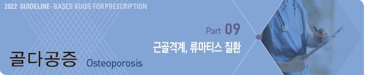
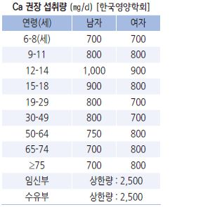
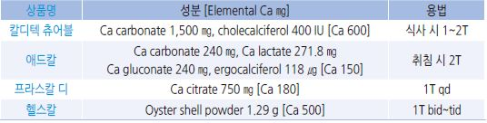
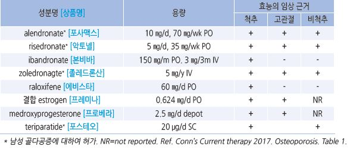
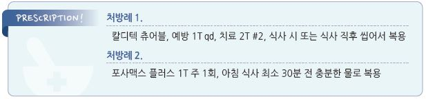

# 골다공증 Osteoporosis

## 일반 사항
-- 골 형성과 골 흡수의 불균형에 의해 야기되는 골 질량(골밀도) 감소와 미세 구조 이상(골 조직 약화)을 특징으로 하는

    전신적인 골격계 질환; 골 강도의 약화로 골절 위험성이 증가

- 유병률

  •osteoporosis : ＞50세 여성- 15%, 남성- 4%

  •osteopenia : ＞50세 여- 50%, 남- 35%

  •우리나라(2011년) : ＞50세 여 37.3%, 남 7.5%; 50대 15.4%, 60대 36.6%, ≥70세 68.5%

  •폐경 여성의 ½에서 골다공증과 관련된 골절 발생. 그 중 15%는 고관절 골절

- 골다공증은 대부분 비가역적이므로 예방이 중요. 특히 성장기의 영양 섭취, 신체 활동이 중요

※ 골다공증 위험도 평가 툴 : [SCORE](https://www.medicalalgorithms.com/simplified-calculated-osteoporosis-risk-estimation-tool)(Simple calculated osteoporosis risk estimation) tool

## 원인 및 위험 인자
- 고령

- 여성. 특히 폐경기, estrogen 수준이 낮은 여성

- 흡연, 음주(＞3 SD/d) (☞ p.995)

- 저체중 : ＜58 ㎏, BMI ＜21

- 적은 신체 활동, 근력 저하

- 취약 골절 병력(fragility fracture. 일반적으로는 골절이 일어나지 않을 약한 외상에 의한 골절)

- 골다공증 또는 대퇴 골절 가족력

- 칼슘 섭취↓, Vit D 섭취↓, 카페인 섭취↑, 염분 섭취↑

- 흡수 장애, 당뇨병, 쿠싱증후군, 갑상선/부갑상선항진증, 백혈병, RA, 신부전, 심부전, 우울

- 약물 장기 복용 : steroid(prednisone ≥5 ㎎/d ×≥3개월), PPI, SSRI, barbiturate, 이뇨제, 갑상선 호르몬제, 항응고제,

    면역억제제, 항전간제, 항암제

## 임상 양상
- 무증상 : 골절이 발생하기 전까지 골다공증 자체는 증상이 없음

- 통증, 변형, 기능 상실, 신장 감소; 골절이 발생하면 이에 따른 증상 발생 

- 척추 골절 : 자각 증상이 없는 경우가 많음; 신장 감소(＞2 ㎝), 요통, 측만증

## 진단

### 골밀도 검사 (Bone mineral density, BMD)
     (보험기준 ☞ p.1194)

#### 측정 장치
- central dual-energy X선 absorptiometry(DXA/DEXA) : 골다공증 진단의 표준 측정법으로 척추 &/or 대퇴골 측정;

    체구가 작은 사람은 실제보다 낮게 측정될 수 있음

- peripheral DXA : 전완 원위부 또는 발뒤꿈치 측정; central DXA와 비슷한 결과

- 단일에너지 X선 흡수계측(SXA) : DXA에 비하여 변동성이 큼

- 정량적 CT(QCT) : trabecular bone과 cortical bone 측정; 방사선 노출량 많음

- quantitative ultrasound(QUS) : 말초 골 측정(예: calcaneus). 방사선 노출 없음. 상대적으로 정확도가 낮음. 예비 검사로 사용

#### 측정 부위
- 척추 : 골 감소 평가에 가장 예민한 부위로 골다공증 판정의 기본 측정 부위

- 대퇴골 : 대퇴골 골절 가능성 예측을 위하여 측정. 주로 고령자에서 평가

  •고령(≥65세)에서 척추는 압박 골절과 퇴행성 변화(골극) 등으로 인하여 실제보다 높게 평가될 수 있으므로

    대퇴골로 판정할 수 있음

#### 판정
- L1~L4 평균치로 판정

- 제외 : L5(오차가 매우 큼), 아래쪽 요추보다 골밀도가 높은 위쪽 요추, 인접한 요추와 ≥1 SD 차이가 나는 요추, 수술한 요추

- 평가에 적합한 요추가 최소 두 부위는 되어야 진단할 수 있음

** T-score**

- 젊은 성인(25~40세)의 평균 BMD와 비교한 표준 편차; ＞50세 또는 폐경 후 여성에 적용

- 정상 : -1.0 ≤ T-score

- 골감소증(osteopenia) 또는 낮은 골량 : -2.5 ＜ T-score ＜ -1.0

- 골다공증(osteoporosis) : T-score ≤-2.5

** Z-score**

- 동년배의 평균 BMD와 비교한 표준 편차; 골밀도가 낮아도 골의 강도가 낮지 않아 골절이 잘 발생하지 않는 연령인 ＜50세

    또는 폐경 전 여성에 적용

- Z-score ＜-2.0 시 ‘연령보다 낮음’으로 판정하고 2차성 골다공증 평가 고려

#### 검사 주기 [ISCD]
- 치료 시작 또는 치료 방법 변경 1년 후 측정, 치료 효과가 확립되면 더 긴 간격 적용

- 이전 검사에서 T-score -2~ -2.49 또는 지속되는 골 소실 위험(예: steroid 복용)이 있는 경우에는 2년 후

- 이전 검사에서 T-score -1.5~ -1.99이고 골 소실 위험이 없는 경우에는 3~5년 후

- 골밀도가 낮고 골절 위험이 높은 골다공증 치료를 받고 있는 폐경 여성에서 치료 반응을 평가하기 위하여 1~3년마다

    척추와 고관절에 대한 DXA 검사를 고려 [미국/유럽내분비학회]

#### 골밀도 선별 검사 대상
    [대한골대사학회] (2018)

  ① ≥6개월 무월경인 폐경 전 여성

  ② 골다공증 위험 인자가 있는 폐경 이행기 여성

  ③ 폐경 여성 ④ 골다공증 위험 인자가 있는 ＜70세 남성

  ⑤ ≥70세 남성 ⑥ 골다공증 골절의 과거력

  ⑦ 2차성 골다공증 의심 ⑧ 영상의학적 검사에서 척추 골절 또는 골다공증

  ⑨ 골다공증 약물 치료 시작 ⑩ 골다공증 치료를 받거나 중단한 모든 환자의 경과 추적

** USPSTF 권고안 **(2018)

  ① ≥65세 여성

  ② ＜65세의 폐경 여성 중 골다공증의 증가된 위험이 있는 경우(10년 골절 확률이 역치(8.4%)보다 큰 경우)

  ③ 남성에서는 이득이 불충분하여 권하지 않음

※ 10년 골절 확률 계산 tool : [FRAX tool](https://www.sheffield.ac.uk/FRAX/tool.aspx?country=25) 

### 실험실 검사
- 2차성 골다공증 감별을 위한 검사 고려

- 대상 : 젊은 연령 또는 남성에서의 골다공증, 매우 낮은 Z-score

- 혈액 : CBC, LFT, RFT, TSH, iron/ferritin, Vit D[25(OH)D], Ca, testosterone, cortisol(쿠싱증후군 의심 시)

- 소변 : 24시간 Ca

- bone turnover marker : 치료 반응이 나쁘거나 순응도가 낮을 때 고려;

  ① antiresorptive therapy에 대하여 C-terminal crosslinking telopeptide

  ② bone anabolic therapy에 대하여 procollagen type 1 N-terminal propeptide (보험기준 ☞ p.1194)

---

## Management

### 치료 방침
- 원인 질환 치료

- 식이/영양 : 적절한 영양 섭취(단백질, 무기질, 비타민), Ca/ Vit D 섭취

- 생활 습관 개선 : 금연, 음주 제한, 낙상 예방, 체중 부하 운동

- 약물 치료 : bisphosphonate, denosumab, PTH, SERM, estrogen/tibolone

## 비-약물 치료

#### 금연, 음주 제한(≤2 SD/d)
    (☞ p.995)

#### 낙상 예방
- 시력 교정, 보행 교정, 균형 훈련, 어지럼 치료

- 안전 장비 설치 : 손잡이 설치

- 환경 개선 : 밝은 조명, 평평한 바닥

#### 운동
- 종류 : 체중 부하 운동 선택; 걷기, 달리기, 계단 오르내리기, 댄스

- 강도 : ≥30분/일, ≥5일/주; 규칙적으로 지속하는 것이 중요

- 효과 : 성장기에서의 골량 증가, 성인에서의 골 소실 방지(성인에서는 골량 증가 효과 없음)

>   ✽요추 및 대퇴경부의 BMD 증가에는 mind-body exercise(예: yoga, tai chi, qigong)가, 전체 고관절의 BMD 증가에는
     resistance exercise가 가장 효과적이었다는 보고가 있음

#### 식이
- 균형 있는 식사

- 칼슘/Vit D가 많은 식품 섭취

- 권장 음식 : 저지방 우유, 요구르트, 생선, 해조류, 콩, 두부, 두유, 들깨, 참깨, 달래, 무청, 귤

- 제한 음식 : 짠 음식, 인스턴트 식품, 가공 식품, 과량의 육류, 과량의 곡류나 섬유질 섭취, 시금치, 음주, 흡연, 탄산음료,

    카페인(하루 커피 ＜3컵, 차 ＜5컵)

## Ca, Vit D

### 칼슘

#### 권고 섭취량
- 한 번에 많은 섭취는 흡수 저하를 초래하므로 1회 섭취량은 ≤600 ㎎을

    권고

>   ✽폐경기 여성에서 칼슘만 섭취하는 것은 BMD 증가에 효과가 없다는 보고가

>     있음

#### 칼슘 보충제
- 제제별 칼슘 함량 : Ca carbonate 40%, Ca citrate 24%, Ca lactate 13%,

    Ca gluconate 8%

- Ca carbonate : 산성에서 용해되므로 보통 아침에 식사와 함께 복용

    권고; PPI 등 제산제와 철분에 의해 흡수 방해 받음

- Ca citrate : 공복 상태에서 흡수 증가

- 부작용 : 변비, 위장 장애, 신결석

>   ✽음식을 통한 칼슘 섭취에 의한 신결석 증가 가능성은 증거가 부족하며

>     반대로 칼슘 섭취가 부족할 경우에 신결석이 증가할 가능성이 있음 (☞ p.717);

>     보충제를 통한 칼슘 섭취 시 감수성이 있는 사람에서 신결석 증가 위험이 있음(특히 식간 또는 취침 전 복용 시)

>   ✽Ca 1000~1500 ㎎/d 보충이 정상 혈압인 사람들의 고혈압 발생을 예방해 준다는 메타분석 보고가 있음

### Vit D
- 골 석회화 촉진, 혈청 칼슘/인산 농도 조절, 골 흡수 억제; 근육/신경/면역 기능 개선, 암 예방

- 혈중 25(OH)D 검사 : ≤20 ng/㎖=결핍, 21~29=상대적 부족, ≥30=충분

>   ✽ Vit D 1000 IU/d 보충이 암 사망을 13% 줄인다는 메타분석 보고가 있음(비만에서는 그 효과가 없었음).

>   ✽ Vit D 2000 IU/d 보충이 자가면역 질환을 22% 줄인다는 보고가 있음

>   ✽ ≥50세 남, ≥55여에서 Vit D 2000 IU/d 5년 보충이 (25(OH)D 수준이 낮은 경우에도) 골절 발생률을 줄이지 못했다는 보고가 있음

>   ✽ 활성형 Vit D만이 골절을 줄이는 효과가 있음이 제안됨

#### 권고 섭취량
    (cholecalciferol로서)

- 한국영양학회 : 20~49세 200 IU, 이외 연령 400 IU, 임신 수유부 ≥600 IU

- 대한골대사학회 : ≥50세 남성 또는 폐경 여성 800 IU

- 미국내분비학회 : ＞30 ng/㎖을 유지하기 위해 하루 1,500~2,000 IU

#### 형태
- cholecalciferol(D3) : UVB를 쪼임으로서 피부에서 합성 → 간/신장에서 활성형(1, 25- (OH)2D3)으로 전환

>   ✽햇빛에 의한 충분한 Vit D 합성 조건 : 봄~가을의 경우 10~14시, 20분/회, 3~4회/주, 신체 40% 노출
- ergocalciferol(D2) : 효모와 식물 스테롤인 에르고스테롤로부터 합성

- calcitriol (1, 25-(OH)2D3) : 활성형 Vit D; 0.25 ㎍ [로이칼 연질캅셀, 네오본 주]

- alfacalcidol(1-α-(OH)D3) : 체내에서 calcitriol로 전환됨; 0.5 ㎍ [알파본]

- 고용량 cholecalciferol 주사제 : 혈중 농도가 초기에는 높고 이후에는 낮음. 단기간 고용량 투여 시 독성이 유발되어 골절

    발생 위험이 높아졌다는 보고가 있음; 경구제 투여 곤란 또는 순응도 저하 시 선택; 필요시 또는 3개월마다 20 만 IU IM

    (연간 상한 60 만 IU) [비오엔 주](비보험)

### 칼슘 & Vit D 보충제
    

>   ✽USPSTF에서는 골절 예방을 위한 남성 및 폐경 전 여성에서의 Vit D와 Ca 보충, 폐경 후 여성에서의 Vit D 400 IU/Ca 1000 ㎎ 이상

>     보충하는 것의 유익성과 위해성을 평가하기에는 증거가 불충분하다고 발표[2018]

## 약물 치료
    (Ca, Vit D 외)

- Antiresorptive drug(골 흡수 억제제): bisphosphonates, RANK ligand inhibitor

- Anabolic drug(골 형성 촉진제) : PTH-related protein, PTH, sclerostin inhibitor

- Estrogen agonist: SERM, estrogen/tibolone

#### 대상
- 다음에 해당되는 폐경 후 여성 및 ≥50세 남성

  ① 고관절 또는 척추 골절력

  ② 다른 원인이 배제된 대퇴 경부 또는 척추 골다공증

  ③ 낮은 골량(대퇴경부 또는 척추 골감소증) & FRAX tool 10년 골다공증 관련 주요 골절 확률 ≥20% 또는

    10년 고관절 골절 확률≥3%

>   (✽보험기준: DXA T-score ≤-2.5인 경우 등. ☞ p.1194)

#### 선택 tips
- 1차 선택 → bisphosphonate(계열 내에서의 선택은 환자 선호도, 비용, 투여 방법 등을 고려)

- 폐경 후 ＜10년의 골다공증 여성 환자 → bisphosphonate 또는 호르몬

- 폐경 전 여성, 폐경 ≥10년 여성, 남성 환자 → bisphosphonate

- bisphosphonate 사용 불가(예: 약물 알레르기), 심한 골 통증 → teriparatide [포스테오]

- 중증 또는 매우 높은 골절 위험의 골다공증 → 1~2년간 anabolic drug → bisphosphonate

- 취약 골절 병력이 없는 유방암 위험 여성 : raloxifene [에비스타]

- bisphosphonate 경구제로 골밀도 회복 안 됨 → (다른 요인이 없는 경우) 다른 종류의 bisphosphonate로 교체,

    다른 계열 약제(예: denosumab, teriparatide) 고려

- 경구제 복용이 곤란한 경우, 경구제 복용 순응도가 좋지 않은 경우 → 주사제 고려

### Bisphosphonate
- 작용 : osteoclast의 골 흡수 억제(파골세포의 동원, 분화 및 작용 억제); 뼈 속에 10년간 잔류

- 적용 : 폐경 후 여성과 남성의 골다공증 치료(ibandronate는 여성만 적용)

  •ibandronate는 비척추 또는 고관절 골절 위험 감소 목적으로는 권하지 않음

- 부작용 : 위장관 증상(복통, 소화불량, 식도/위궤양), 시각 장애, 턱뼈 괴사(특히 암환자에서 주사제 등 고용량 사용 시),

    장기(＞5년) 사용 시 대퇴골 간부 골절 위험 증가

>   ✽장기 사용에 따른 atypical femur Fx 위험 증가보다 골절 예방 이득이 유의미하게 크다는 보고가 있음
  ✽약물 중단 시 atypical femur Fx 위험은 빠르게 줄어듬
  •주사제는 농도가 초기에는 높고 이후에는 낮음, 부작용이 더 많이 발생할 가능성이 있음

  •경구제 식도염 부작용 예방법 : 아침 식사 최소 30분 전에 한 컵(200 ㎖) 이상의 물로 복용, 복용 후 최소 30분간 눕지 않음

- 주의/금기 : 식도 이상, 30분간 기립 자세를 유지할 수 없는 환자, 저칼슘혈증, 심한 신장애, 소화성 궤양

  •alendronate/zoledronate는 CrCl ≥35 ㎖/min,  risedronate/ibandronate는 ≥30 시 투여 가능

- 치료 기간(휴약) : 장기간 사용으로 인한 부작용 우려로 drug holiday(치료 중단 및 휴약)를 권고

    ✽5년 투여 이후의 추가 투여는 이득이 없다는 보고가 있음

  •폐경 여성의 경우 3~5년(1년 주기로 주사하는 zoledronate는 1년) 투여 후 골절 위험에 대하여 재평가(골절 위험도 평가)

    → 골절 위험도가 높은 상태이면 치료를 계속하고, 골절 위험도가 중등도 이하이면 bisphosphonate holiday(~5년까지)를 고려

  •bisphosphonate holiday 시 2~4년 간격으로 골절 위험도를 재평가하며 골밀도 또는 위험 인자의 유의미한 악화가 있는

    경우 5년 이내라도 치료 재개를 고려

  •치과 시술(발치, 임플란트) 시 주의 : 4년 이상 복용한 경우 또는 골절 위험 요소가 동반(예: 당뇨, steroid 장기 치료) 시 

    시술 전 2~4개월간 투여  중단, 시술 부위의 상처가 완전히 아문 뒤 재투여 권고 [골대사학회](2021)

#### Alendronate
- 용법 : 10 ㎎ qd 또는 70 ㎎ qwk [포사맥스, 마시본 액], [포사맥스 플러스](Vit D 복합제)

#### Ibandronate
- 비척추 부위의 골절 감소 효과 없음

- 경구제 : 150 ㎎ qmo [본비바], [본비바 플러스](Vit D 복합제)

  •복용 예정일을 지나친 경우의 대처 : 다음 정기 복용일이 ≥1주일 남았으면 즉시 복용 후 다음 예정일에 복용,

    다음 정기 복용일이 ＜1주일 남았으면 다음 예정일에 복용

- 주사제 : 3 ㎎ 3개월마다, 15~30초간 IV [본비바 주]

#### Pamidronate
- 경구제 : 200 ㎎ qd, 식전 1시간 복용 [파노린]

- 주사제 : 30 ㎎ 3개월마다, 생리 식염주사액 희석 1~4시간 IV [파노린 주]

- 부작용 : 발열(보통 자연 소실), 주사 부위 통증/정맥염, 근골격 통증, 위장관 증상, 두통, 어지럼

#### Risedronate
- 용법 : 5 ㎎ qd, 35 ㎎ qwk, 75 ㎎ 2회/mo, 150 ㎎ qmo [악토넬], [리세넥스엠](Vit D 복합제)

#### Zoledronate
- 주사제 : 5 ㎎ 1년마다, 15분 이상 IV [졸레드론산 주]

- 부작용 : 심방세동, 발열, 두통, 관절통, 근육통; 초회 주사에서 보다 흔히 발생

### RANK ligand 억제제

#### Denosumab
- 작용 : RANKL(receptor activator of nuclear factor kappa B ligand)에 결합하는 단클론 항체로서, RANKL이 osteoclast의 생성,

    분화 및 활성을 조절하는 RANK 수용체에 결합하는 것을 방해 → osteoclast 형성 억제 → 골 소실 감소

- 효과(3년 치료) : 골밀도 척추 9.2%, 대퇴 6%↑; 골절 척추-69%, 비척추-20%, 대퇴-40% ↓

- 허가 사항 : 폐경 후 여성 골다공증 치료, 남성 골다공증의 골밀도 증가를 위한 치료, glucocorticoid 유발성 골다공증 치료,

    androgen 차단 요법을 받는 비전이성 전립선암의 골 소실 치료, 아로마타제 저해제 보조 요법을 받고 있는 여성

    유방암의 골 소실 치료

- 대사 : reticuloendothelial system에 의해 제거; 신장을 통해 배설되지 않음

- 주의 : 중단 시 급격한 골 소실(잔류 효과 없음) 및 반동 골절 위험

 •골절의 위험성이 적은 젊은 환자에 있어서는 투여를 시작하지 않음

- 용법 : 60 ㎎ 피하주사 ×매 6개월 [프롤리아 프리필드]

- 치료 기간 

 •denosumab을 투여받는 골다공증이 있는 폐경 여성에서 5~10년 후 골절 위험도를 재평가하여 높은 골절 위험도가

    지속되는 경우 투여를 지속하거나 다른 골다공증 요법을 시행할 것을 고려

 •denosumab 투여를 지연하거나 중단할 때에는 반드시 antiresorptive 약제(예: bisphosphonate, 호르몬 치료, SERM)

    또는 반동성 bone turnover를 예방하고 빠른 골밀도 감소 위험 및 골절 위험 증가를 줄이는 다른 약제를 연이어

    투여하여야 함(1~2년간)

### PTH
- 재조합 부갑상선 호르몬 (teriparatide), PTH–related protein analog(abaloparatide)

- 작용 : 골 형성 자극; bisphosphonate 등 골 흡수 억제제와의 병용에 따른 효과 상승은 불확실

- 적용 : 골절의 고위험군 또는 골 흡수 억제제 치료에도 골절이 계속 발생할 경우, 골 흡수 억제제 투여가 어렵거나 금기인 경우

- 허가 사항 : 폐경기 이후 여성 및 골절의 위험이 높은 남성에 대한 골다공증, 골절의 위험이 높은 여성 및 남성에 있어서

    지속적인 glucocorticoid 요법과 관련된 골다골증의 치료 

- 부작용 : 근육통, 현훈, 구역, 두통

- 금기 : 골육종, 고칼슘혈증, 골암

- 치료 기간 : 최대 2년(＞2년 사용에 대한 안전성/효과 연구 부족), 이후 골다공증이 있는 폐경 여성에서 증가된 골밀도를

    유지하기 위하여 골 흡수 억제제 치료 지속을 권고

- teriparatide : [포스테오 주] 20 ㎍ 매일 피하주사, 최대 투여 기간- 24개월;

    [테리본 주] 56.5 ㎍ 주 1회 SC, 투여 직전 N/S 1㎖에 용해하여 조제. 최대 투여 기간- 24개월

### Sclerostin inhibitor

#### Romosozumab
- sclerostin(골 형성 신호 체계 억제)에 대한 단클론 항체; 골 형성 촉진, 골 흡수 억제(일시적)

    ; 12개월 사용 후 골 형성 효과가 사라짐

- 용법 : 210 ㎎(105 ㎎ 씩 다른 부위), 월 1회, 총 12회 피하 주사 [이베니티 프리필드]; 칼슘, Vit D 보조제 추가 복용 필요

- 투여 종료 후 골밀도 검사를 실시하여 기저치 대비 동일 또는 개선이 확인되는 경우에 마지막 투여일로부터 1개월 이내에

    골 흡수 억제제로 전환 투여(최대 12개월까지 보험 인정)

- 주의/금기 : 심근경색/뇌졸중 위험, 심한 신장애 

- 약물의 지속 효과가 없어 투여 중단 시 다른 약제 사용을 고려해야 함

#### Selective estrogen receptor modulator (SERM)
- estrogen receptor에 결합하여 일부 조직에서는 작용제로, 일부에서는 억제제로 작용

- 대상 : 골절 위험도가 높은 골다공증이 있으며, bisphosphonates 또는 denosumab를 적용할 수 없고

    심부정맥혈전의 위험이 낮거나 유방암 위험이 높은 폐경 여성

#### Raloxifene
- 효과 : 골밀도↑, 척추 골절↓ 

    ✽3년 투여 시 골밀도 2.1%(대퇴)~2.6%(척추)↑, 척추 골절 50%↓ 효과가 있다는 보고가 있음

  •비척추골이나 고관절의 골절 감소 효과는 없음 

    ✽8년 투여 시 척추 골절이 있었던 고위험군에서 비척추 골절을 36% 감소시켰다는 보고가 있음

  •골다공증 외 영향 : 자궁암 증가 없음, LDL-C↓, 침윤성 유방암↓

- 적용 : 유방암 위험이 높은 폐경 후 여성에서의 골다공증 예방 및 치료

- 부작용 : 감염, flu-like Sx, 안면 홍조, sinusitis, 하지 통증 ; 혈전색전증(✽bisphosphonate와 차이 없음),

    뇌졸중(✽관상동맥병 위험이 높은 경우)

- 용법 : 60 ㎎ qd [에비스타]

#### Bazedoxifene
    ✽3년 투여 시 골밀도 1.1%(대퇴)~2.3%(척추)↑, 척추 골절 42%↓,  비척추 골절 영향 없음의 보고가 있음

- 부작용 : 안면 홍조, 근육 경련, 졸음, 어지럼, 입마름, 말초 부종, 설사, 구역; 혈전색전증

- 용법 : 20 ㎎ qd [비비안트]; Vit D 복합제 [바펜디]

### Menopausal hormone therapy & tibolone
- 적용 : 골절 위험도가 높은, 아래 특성의 폐경 여성에서 ① 모든 종류의 골절을 예방하기 위하여 자궁적출술을 받은 여성에서는

     estrogen 단독 호르몬 투여를, ② 척추 및 비척추 골절을 예방하기 위하여 tibolone 투여를 고려

  •＜60세 또는 폐경 후 ＜10년, DVT 위험이 낮음, bisphosphonates 또는 denosumab를 적용할 수 없음, 

    vasomotor symptom으로 고통 받음, 추가의 갱년기 증상이 있음, estrogen 치료에 금기가 아님,  MI 또는 뇌졸중 병력이 없음,

    유방암이 없음, 이 치료를 받을 의향이 있음

#### Estrogen
- 작용 : osteoclastogenesis 억제

- 골다공증 예방만을 위한 경우에는 estrogen 외의 약제를 우선 권고

- 약제 (☞ p.597)

#### Tibolone
- 작용 : 조직 특이적인 estrogen 유사 효과, 약한 androgen 효과

- 효과 : 골 소실 예방, 폐경 증상 감소; 유방과 자궁에 대한 자극 없음

- 부작용 : 하복부 통증, 비정상적 체모 증가, 질 분비물, 질 출혈, 유방 압통, 체중 증가

- 용법 : 1.25~5 ㎎/d [리비알]

### 기타

#### Testosterone
- 적용 : hypogonadism이 있는 남성 골다공증

- 금기 : 전립선암, 유방암

- [테스토 겔] : 1% 50 ㎎/5g/p : 어깨, 팔, 복부 피부에 1일 1회(오전) 5 g 적용 (☞ p.709)

#### Strontium ranelate
- 작용 : 골 흡수 방해, 골 형성 증가

- 용법 : 2 g qd (✽FDA 미승인)

#### Calcitonin
- 작용 : osteoclast 작용 억제

- 효과 : 골 통증에 대한 약간의 진통 효과; 다른 제제보다 골 소실 예방/골절 감소 효과 적음

- 적용 : 골절 위험도가 높은 골다공증이 있는 폐경 여성에서 다른 치료(예: raloxifene, bisphosphonates, estrogen,

    denosumab, tibolone, abaloparatide, teriparatide)를 적용할 수 없는 경우 nasal spray calcitonin 투여를 고려;

    남성, 다른 치료제를 사용할 수 없는 폐경 5년 이후 여성에 적용

- 주의 : 장기간 사용 시 내성 발생; 6개월 이내 사용 후 수개월간의 휴약을 요함

- 주사제 : 구역, 안면 홍조 부작용

- 비강 분무제 : 200 IU/d

- elcatonin : calcitonin derivative; 10 IU ×2회/주 또는 20 IU ×1회/주 주사 [엘시토닌]

- salcatonin(salmon calcitonin) : 암 발생 증가 문제로 사용 중지

### 모니터링
    [대한골대사학회](2022)

- 치료 목표 : 대퇴골 전체 골밀도 T-score -2.0 제안

- 골다공증 치료제의 효과를 확인하기 위해 골밀도 및 생화학적 골표지자를 추적 평가

- 치료 시작 1년 후 치료제 효과기준을 만족하지 못하는 경우 순응도, 2차 골다공증 원인 등 확인

    → 치료 실패 시 치료 변경 고려

- 치료 실패 : 순응도 개선 및 2차 골다공증 배제 후에도 ① 2개 이상의 골다공증 골절 발생, ② 1개의 골절이 있으면서

    골표지자의 예상되는 변화가 없거나 골밀도의 유의한 감소가 있음, ③ 골표지자의 예상되는 변화가 없으면서

     골밀도가 유의하게 감소

### 약제별 효능 비교
    

> **질병코드**
M80 병적 골절을 동반한 골다공증

M81 병적 골절이 없는 골다공증

M81.0 폐경후골다공증

