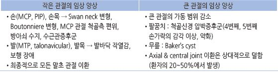
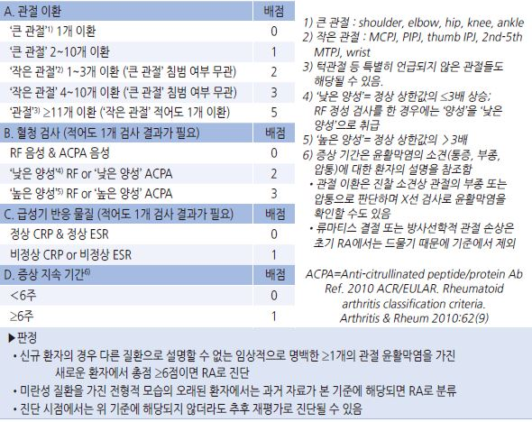
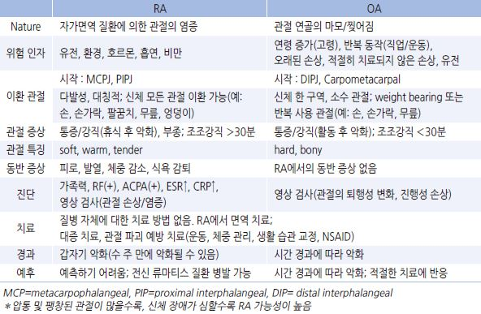
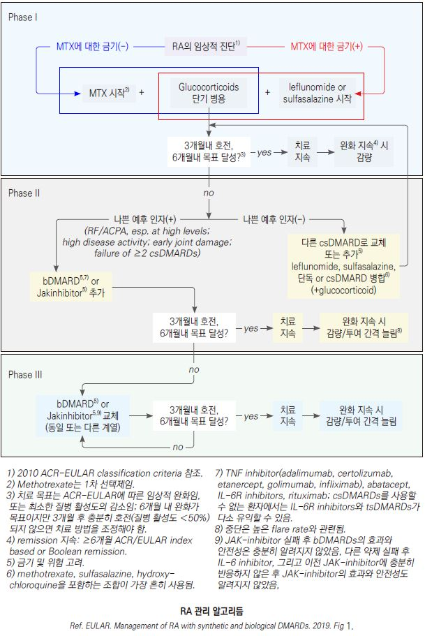
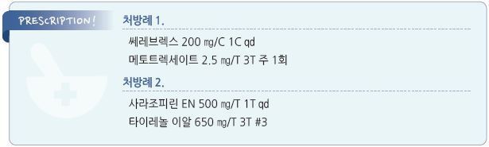

# 류마티스 관절염 Rheumatoid Arthritis


## 일반 사항

* 자신의 관절 조직을 공격하는 항체를 생성하는 자가면역 질환인 류마티스와 관련된 만성, 염증성, 대칭적, 다발성 관절염
* 급성 경과를 보이기도 하지만 보통 비특이적인 관절통 또는 강직으로 시작하여 서서히 진행
* 호발 : 30~~40대 여성(남성의 3배), 40~~70대 남성
* 관절 및 연조직이 파괴되어 관절의 만성적이고 비가역적인 장애 발생; 수명 단축
* 질병 초기에 적극적인 치료를 요함

## 원인 또는 관련 인자

* 원인 : 자가면역 반응의 원인은 불명
* 관련 인자 : 유전, 감염, 흡연, 외상

### 나쁜 예후 인자

* conventional synthetic DMARD(csDMARD) 치료에도 지속되는 중등증 이상의 disease activity
* High acute phase reactant levels
* 크게 부어오른 관절의 숫자
* RF &/or ACPA(+), 특히 높은 수준
* 조기 미란
* 2개 이상의 csDMARDs 치료로 실패

## 임상 양상

### 관절 증상

* 초기에는 하나의 작은 관절의 간헐적 통증
* 통증, 부종, 압통, 동작 시 통증; 보통 대칭적 분포 (✽부종은 synovial 비대 또는 삼출에 기인함)
* 강직 : 30분 이상 지속되고 신체 활동으로 호전, 특히 조조강직/경부 강직, 격렬한 활동 후 심함
*   경추 외의 척추와 sacroiliac joint 이환은 드묾

    

### 관절 외 증상

*   피하 결절 : firm, non-tender; 대부분 뼈의 돌출부 또는 아래팔, 엉덩이, 아킬레스건 등 반복적인 자극 또는 압력을 받는

    부위의 골막, 힘줄 또는 점액낭에 붙어 있음
* entrapment syndromes : 특히 손목 터널의 정중 신경
*   전신 증상 : 피로, malaise, 식욕 부진, 체중 감소, 발열, 우울, 불쾌감

    •고열이 발생한 경우에는 전신 혈관염 또는 감염 의심
*   다른 질환 발병에 영향 : 2차성 Sjögren’s syndrome(건성 각결막염, 입마름), 신장 질환, 심장 질환(심막염, 결절),

    폐질환(섬유화, 결절, 늑막 삼출, 늑막염), 비장 비대, 말초 신경병증, 혈관염, 빈혈, Felty’s syndrome, 림프절병증, 감염 증가

## 진단

```

```

### 영상 검사

* 진단 검사 방법들 중 가장 특이적이지만 보통 증상 발생 후 6개월 동안은 정상 소견을 보임
*   X선 : 진단 및 치료 반응 평가를 위해 시행; 초기 손, 손목, 발 촬영

    •초기 : 연조직 swelling, juxta-articular demineralization.

    •진행 : 관절 미란, 관절 간격 감소
* 초음파, MRI : 뼈와 연조직 변화 진단에 X선보다 민감하지만 조기 진단 가치는 명확하지 않음

### 실험실 검사

* 진단이 어려울 때 시행

#### Anti-citrullinated peptide/protein antibody(ACPA)

* 양성 질환 : 자가면역 질환, 활동성 결핵
* 특이도 95%, 민감도 69%

#### Rheumatoid factor

* RF 증가 상황 : 만성 감염(예: 아급성 세균성 심내막염, 결핵, 매독), 바이러스 감염(예: 감염성 단

핵구증, 거대세포바이러스, 인플루엔자), 기생충 감염, 사르코이드병, 간질성 폐질환, 비감염성 간염

* 민감도 80\~90%
* 역가와 진행 정도의 상관관계 없음
* 양성 시 반복 검사 필요 없음

#### 기타

* ANA : 20\~30%에서 양성
* ESR, CRP : 비특이적. 질병 활성도 평가
* Complement(CH50, C3, C4)
* Synovial fluid analysis
* CBC : 경증 빈혈, 혈소판증가증 소견
* 전해질, Cr, LFT, U/A : 동반 질환 평가를 위해 시행

#### RA 검사 항체들의 정확도

```
☞ p.813
```

### 자가 진단 tool

* [대한류마티스학회 류서치(rheusearch) 프로그램](http://www.rheusearch.com/survey/step1Form.do)

### RA vs OA 비교

```

```

***

## Management

### 치료 방침

* 빠른 진단, 빠른 활성 상태 파악, 빠른 염증 관리, 빠른 기저 질환 관리
*   초기부터 적극적/공격적 치료; 가능한 한 초기부터 DMARD 투여

    •DMARD에 반응이 나타날 때까지 증상 조절을 위하여 단기간 NSAID &/or steroid 병용
* 관절 외 질환 및 증상 관리 : 빈혈, ASCVD, 고지혈증, 고혈압, 흡연, 비활동 생활에 대하여 관리
* 면역 조절제는 생백신 접종 2주 전\~6주 후 동안 투여 중단 (✽중단 필요에 대한 증거는 없음)

### 완화(remission) 판정

* active period가 없는 것으로 판정하거나 다음의 정의를 사용

#### Boolean-based definition

*   언제나 다음 모두를 충족시킴

    ① 압통 관절수 ≤1개

    ② 팽창 관절수 ≤1개

    ③ CRP ≤1 ㎎/㎗

    ④ 환자의 주관적 증상 0\~10점 스케일에서 전반적 평가 ≤1점

#### Index-based definition : SDAI(simplified disease activity index)

*   단순화된 질병 활성도 지표 점수(다음 항목)의 총점 ≤3.3

    ① CRP 수치(㎎/㎗) ④ 0\~10점 스케일의 환자의 전반적 평가 점수

    ② 28개 관절\* 중 압통 관절 수 ⑤ 0\~10점 스케일의 의사의 전반적 평가 점수

    ③ 28개 관절\* 중 팽창 관절 수

> ```
> *28개 관절 : MCP(10개), PIP(8개), thumb IP(2개), shoulder(2개), elbow(2개), wrist(2개), knee(2개)
> ```

## 비-약물 치료

* 금연
* 충분한 활동 및 적당한 휴식, 규칙적인 운동
* 체중 조절
* 정신적, 사회적으로 건강한 생활 유지
*   음식, 허브, 기타 대체 치료 : 효과가 입증된 방법은 없음

    •관련 질환 관리를 위하여 gluten-free diet, 채식 등을 권고

#### 운동

* 관절 운동 범위 유지를 위한 스트레칭, 근육 강화, 유산소 운동
* 이환 관절 뿐 아니라 관련된 모든 근육 운동 시행
* 관절(특히 목, 무릎, 손가락)을 심하게 움직이거나 이에 압력이 가해지는 동작은 피함
* 활성기에는 심한 활동 및 운동은 피함
* 조조강직 : 스트레칭, 따듯한 샤워, 워밍업 운동, (취침 전) 유연성 운동
* 손/손목 운동 : 설거지 또는 샤워 후에 하는 것을 추천(손이 따듯하고 유연해져 있음)
* 유산소 운동 : 걷기, 수영, 사이클 등을 낮은 강도로 시행

## 약물 치료

* 금기가 없는 한 MTX로 시작, 필요시 steroid(단기) 또는 진통제 병용
* MTX 금기 시 leflunomide 또는 sulfasalazine을 1차 선택제로 고려
* 첫 번째 csDMARD로 실패한, 나쁜 예후 인자(-)인 경우 다른 csDMARD로 교체 또는 병용을 고려(예: MTX+leflunomide)
* 첫 번째 csDMARD로 실패한, 나쁜 예후 인자(+)인 경우 bDMARD 또는 tsDMARD 추가 고려
* active Dz 상태에서는 자주 모니터링(매 1\~3개월)
* 3개월 내 호전되지 않거나 6개월 내 목표치에 도달하지 못하면 치료 방법 조정
* 완화 상태가 지속되는 경우 tapering 고려; 중단 시 재발이 흔함

### conventional synthetic DMARD(csDMARD): synthetic DMARDs

* 작용 : 신체의 과잉 면역 및 염증 반응 체계를 억제하여 질병 경과를 늦추고 회복률을 높임
* 효과 발현까지 수 주\~수개월 소요
* MTX로 시작 → 3\~6개월 후 반응 없으면 다른 DMARD/생물학적 제제로 교체 또는 병용
* 모니터링 : 활성 RA 환자에 대한 초기 치료 기간 중 매 4\~8주마다 약물 효과 및 독성 평가

#### Methotrexate (MTX)

* 1차 선택제
* 장점 : 빠른 작용(2\~6주 후 효과 발현), 효과 및 장기 순응도 우수, 상대적으로 적은 독성
*   용법 : 7.5~~10 ㎎ qwk ×4wk → 4주 단위로 2.5~~5 ㎎ qwk 증량 → 증상 완화 시 2\~3개월마다 2.5 ㎎씩 감량;

    통상 유지 용량 15(7.5\~20) ㎎ qwk, 최대 25 ㎎/wk PO or SC \[메토트렉세이트]
*   부작용 : 간 손상(LFT↑; 15%에서 발생), 위 자극(구역, 구토; 13%), 구내염(3%), 두통(1\~2%), 골수 억제(WBC↓/Plt↓;

    발열, 림프 비대, 멍/출혈, 기회감염), 폐 손상

    •간독성은 누적 사용량과 관련; pancytopenia는 c-Cr ＞2 ㎎/㎗ 시 보다 흔함

    •folate 1 ㎎/d or 5 ㎎/wk \[폴산], 또는 leucovorin calcium 2.5\~5 ㎎(MTX 투여 24시간 후)을 공급하면 부작용이 감소됨
*   MTX의 독성을 증가시키는 약제

    •NSAID : salicylate, naproxen, ibuprofen, indomethacin, phenylbutazone

    •항생제 : TMP/SMX, amoxicillin, sulfonamide, minocycline, ciprofloxacin

    •기타 : 알코올, probenecid, barbiturate, colchicine, dipyridamole, sulfonylurea, thiazide
* 금기 : 간/신질환, 알코올 남용, 급성 감염, 임신, 면역 저하, BMI ＞30, 당뇨, 최근 생백신 접종
*   모니터링

    •투여 전 흉부 X선 검사

    •첫 3(\~6)개월간 매달 및 이후 3개월마다 CBC/LFT; 간헐적 U/A; 필요시 hCG

    •LFT 정상 상한치의 2~~3배 증가 시 2~~4주마다 재검, 필요시 MTX 감량 → 지속되면 중단

#### Leflunomide (LEF)

* 작용 : 염증 세포 생성 억제
* 부작용 : 발진, 설사, 구역, 탈모(가역적), 간 손상, 복통, 체중 감소
* 용법 : loading 100 ㎎ qd ×3d → 10\~20 ㎎ qd \[아라바]
* 모니터링 : 6개월간 매달 CBC, LFT, phosphate; ALT가 정상 상한값의 ＞3배 시 중단

#### Sulfasalazine (SSZ)

* 대상 : RA, 강직성 척추염, IBD
* 부작용 : WBC↓/Plt↓(10\~25%), 구역/구토, 광과민, 발진, 두통, 가려움, oligospermia
* 주의 : 오렌지색 소변/눈물/땀 발생, 옷과 콘택트렌즈에 착색될 수 있음
* 금기 : sulfonamide 알레르기, aspirin 과민
*   용법 : 1주차 0.5 qd → 매주 0.5 g/d 증량 → 4주차 1 g bid, 최대 3 g/d \[사라조피린]

    •충분한 물과 함께 섭취; 공복 복용 또는 제산제와 함께 복용하지 않도록 함
* 모니터링 : 투여 전 G6PD 결핍 검사

•CBC/U/A : 3개월간 매 2\~4주, 이후 3개월마다

#### Hydroxychloroquine (HCQ)

* 대상 : RA, SLE
* 일부 환자에서는 반응하기까지 3\~6개월 소요; 종종 MTX나 sulfasalazine과 병용
* 부작용 : DMARDs 중 가장 적음; 망막증, 피부염, 근육 약화, hypoactive DTRs
* 용법 : 400~~600 ㎎/d #1~~2 ×4~~6wk → 200~~400 ㎎/d #1\~2, 최대 600 ㎎/d 6.5 ㎎/㎏/d 식사 또는 우유와 함께 복용 \[할록신]
* 모니터링 : 안과 검진(투여 전, 3 & 6개월, 이후 매년), 신경 근육 검진, CBC, Plt, U/A

#### targeted synthetic DMARD(tsDMARD) = Janus kinase(JAK) inhibitor: Synthetic DMARDs

* 대상 : DMARD에 반응하지 않는 중증 RA
* 투여 전 잠복결핵 검사를 요함
* tofacitinib 5\~10 ㎎ bid \[젤잔즈], baricitinib 2 ㎎ qd \[올루미언트], filgotinib, upadacitinib {린버크]

### biological originator DMARD, biosimilar DMARDs(bDMARD)

* 병의 진행을 완화 또는 예방함. 보통 다른 DMARD(특히 MTX)와 병용

#### Tumor necrosis factor(TNF) inhibitor

* 투여 전 반드시 결핵에 대한 검사 시행 및 치료 중 결핵 발병 여부 관찰
* infliximab : 0, 2, 6주 및 8주마다 3\~10 ㎎/㎏ IV \[램시마 주]
* etanercept : 매주 50 ㎎ 또는 주 2회 25 ㎎ 씩 SC \[엔브렐 주]
* adalimumab : 매주\~격주 40 ㎎ SC \[휴미라 주]
* certolizumab : 0, 2, 4주 및 4주마다 400 ㎎ SC \[퍼스티맙 주]
* golimumab : 50 ㎎ 매달 SC 또는 0, 4주 및 8주마다 2 ㎎/㎏ IV \[심퍼니 주]

#### IL-6 receptor antibody

* tocilizumab : 4주마다 4\~8 ㎎/㎏ IV 또는 2주마다 162 ㎎ SC \[악템라]
* sarilumab

#### T-cell costimulatory inhibitor

* 비용-효과 문제로 배제됨
* abatacept : 500\~1,000 ㎎ (10 ㎎/㎏). 0, 2, 4주 및 4주마다 IV \[오렌시아 주]

#### anti-B cell (CD20)

* 대상 : 중등증 이상의 RA에서 다른 치료에 반응하지 않을 때 고려
* rituximab : 1 g을 2주 간격으로 2번 점적 IV. 24주 후 추가 치료 고려 \[트룩시마 주]

### Steroid

#### 경구제

* DMARD의 효과가 나타날 때까지의 질병 활동 감소(단기) 또는 DMARD 보조(장기) 목적으로

prednisolone 저용량 고려: ＜7.5 ㎎ qd 아침 \[소론도]

* 중증 또는 NSAID에 반응이 부족한 경우 prednisolone 중/저용량 단기 투여 고려: 15\~30 ㎎/d
* ＞3개월 장기 투여 시 골다공증에 대한 예방을 요함

#### 관절 내 주사

* 소수 관절에서의 활성기(flare) 시 고려
* 시술 전 관절 내 감염 배제를 요함
* triamcinolone 10\~40 ㎎ \[트리암시놀론 주]; 연간 4회 이내로 제한

### 진통제

```
(☞ p.12)
```

#### NSAID

* 위궤양 등 부작용을 고려하여 선택
* 일반적인 소염 진통 목적의 용량보다 고용량 투여
* 투여 2주 후 반응 없으면 다른 종류로 교체
* naproxen : 500 ㎎ bid \[낙센]
* ibuprofen : 600\~800 ㎎ tid \[부루펜]
* celecoxib : 200 ㎎ qd \[쎄레브렉스]

#### 기타 진통제

* acetaminophen : 650\~1,300 ㎎ tid \[타이레놀]
* tramadol : 50~~100 ㎎ bid~~tid \[트리돌]
* capsaicin 크림 : 3~~4회/d; 효과 발현까지 2~~4주 소요, 초기 피부 작열감 \[다이악센]

수술

* 심한 관절 손상, 기능 장애에 대하여 고려
* joint replacement
* joint fusion
*   tendon repair

    

> **질병코드** M05 혈청검사양성 류마티스관절염

M06 기타 류마티스관절염


