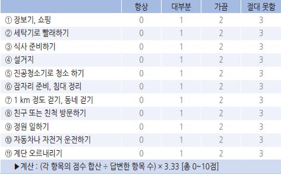
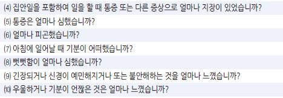
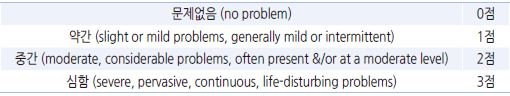
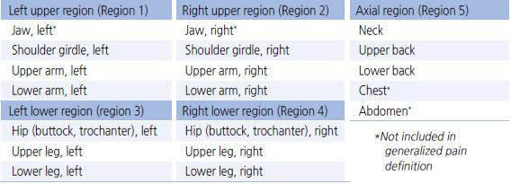
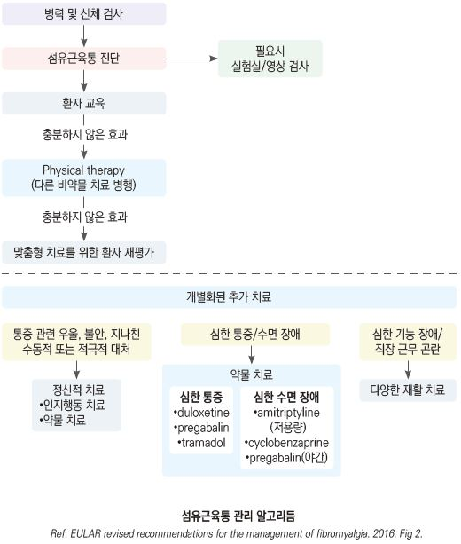
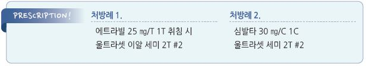

# 섬유근육통 Fibromyalgia

## 일반 사항
- 최소 3개월 동안 거의 매일 지속되는 만성 전신성 비염증성 근골격계 통증 증후군

- 적은 활동도 통증과 피로를 악화시킴

- 통증의 질, 강도, 부위 변화가 있을 수 있음

- 유병율 : 3~10%

- 20~50대 여성에서 흔하고, 객관적 소견이 모호하며, 진단적 실험실 검사법이 없음

## 원인
- 불명

- 추정 기전 : 류마티즘의 일종; 구심성 peripheral nociceptive stimulus의 증가가 관련된 중추 통증 메커니즘의 장애

    (central sensitization)

### 위험 인자
- 여성(20~65세) 

- 부적절한 수면, 수면무호흡증

- 스트레스

- 비만

- 갑상선저하증

- 근육 약화 

- 낮은 사회 경제적 상태

## 임상 양상
- 지속 증상 : 전신, 특히 목, 어깨, 허리, 엉덩이의 경직 및 통증, 피로, 수면 장애

- 종종 발생하는 증상

  •기분 장애 : 우울, 불안, 공황 증상

  •인지 장애(fibro fog) : 집중력/기억력 장애, 혼돈

  •두통 : 긴장형 두통, 편두통

  •운동 능력 저하, 사회적/직업적 기능 저하

  •감각 이상(둔감)

  •호흡 곤란, 두근거림

  •눈/입마름

  •약물에 대한 반응 증가

  •소화기/비뇨기 장애 : 복통, 배변 이상(변비 or 설사), 배뇨 이상(절박뇨, 방광 통증), 성 기능 장애

- 동반 통증 증후군 : IBS, 만성피로증후군, 턱관절증후군, 골반통증증후군, 방광통증증후군, 사이질 방광염, 하지불안증후군

## 진단
- 특이적 진단적 검사 방법 없음. 다른 질환을 배제하여 진단

- 50세 이상에서 발생한 경우 다른 질환을 우선 고려

### 검사
- CBC, ESR, CRP, CPK, TSH, 대사검사, Vit D, Vit B12, folate, Mg : 정상

- ANA, RF : 류마티스가 의심되는 경우 시행

- 영상 검사 : 배제가 필요한 경우 시행

### 선별 문진표 : Fibromyalgia Impact Questionnaire(FIQ)
⑴ 다음을 할 수 있습니까? (답변하지 않는 항목 허용)

    

⑵ 지난 일주일 동안 좋게 느껴진 날이 며칠인가요? (계산 : 점수 × 1.43)

0일(7점), 1일(6점), 2일(5점), 3일(4점), 4일(3점), 5일(2점), 6일(1점), 7일(0점)

⑶ 지난 일주일 동안 섬유근육통 때문에 일을 못나간 것은 며칠이었습니까? (밖에서 하는 일이 없으

면 집안일을 기준으로 답을 하시오) (계산 : 점수 × 1.43)

0일(0점), 1일(1점), 2일(2점), 3일(3점), 4일(4점), 5일(5점), 6일(6점), 7일(7점)

⑷~⑽ 지난 한 주간 다음 각 항에 대하여 ‘전혀 없었으면’ 0점~‘매우 심하거나 힘들었으면’ 10점으

로 점수를 부여하십시오. (계산 : 각 항목 원 점수 합산; 총 0점~70점)

    

▶판정(American college of rheumatology 권고 기준) :

＜39점=mild effect, ＜59점=moderate effect, 59~100=severe effect

(✽보험기준: FIQ ≥40점 및 시각적 아날로그 통증 스케일 ≥40 ㎜ ☞ p.10)

### 감별
- 만성피로증후군 : 만성피로증후군은 무기력이 우세, 섬유근육통은 근육-골격 통증이 우세

- Myofascial pain : 국소 통증, trigger point가 있음

- RA 또는 루푸스 : 대칭적 다발성 관절염, 전신 증상(예: 피부염, 신장염), ESR↑, 류마티스 인자 이상(예: RF, anti-DNA Ab 양성)

- Ankylosing spondylitis : 척추 관절의 만성 진행성 염증; 척추의 통증, 강직, 움직임 감소, X선상 이상 소견(섬유근육통에서는

    보통 정상)

- Polymyalgia rheumatica : 어깨/골반, 통증보다 강직, ＞50세 이환, 빈혈, ESR↑, steroid에 반응

- Myositis : 근육에 국한된 증상; 근육 약화, 근육 효소 수치↑

- 갑상선저하증 : TFT 이상

- 신경병증 : 신경병증적 임상 양상, 검사 결과

### 미국류마티스학회 진단 Criteria
    (2016)

1. SSS(Symptom severity scale) score [총 0~12점]

⑴ 지난 1주일 동안 scale에 따라 다음 3가지 항목에 대하여 각각 0~3점 배점 [총 0~9점]

    ① 피로, ② 기상 시 기력이 회복되지 못한 느낌, ③ 인지 증상

    

⑵ 지난 6개월 동안 다음 3가지 증상이 각각 환자를 괴롭힌 적이 없음=0점, 있음=1점 [총 0~3점]

    ① 두통, ② 하복부 통증 또는 경련, ③ 우울

2. WPI(Widespread Pain Index)

- 지난 7일 동안 다음 19곳 중 통증이 있었던 곳의 개수. 개당 1점 [총 0~19점]

    

▶판정 : 다음 3가지 모두를 충족하면 섬유근육통으로 진단

① { WPI ≥7점 & SSS 점수 ≥5점 } 또는 { WPI 4~6점 & SSS ≥9점 }

② 5개 부위(left & right upper, left & right lower, axial region) 중 ≥4개 부위에 통증이 있는 것으로 정의하는

    ‘generalized pain’이 존재

③ ≥3개월 비슷한 수준으로 증상 존재

- fibromyalgia 진단은 다른 진단 유무와 관계없이 붙여질 수 있으며 다른 임상적으로 중요한 질병의 존재를 배제하지 않음

---

## Management

### 치료 방침
- 안심시킴, 병에 대하여 이해시킴 : 퇴행성 질환이 아니며 생명을 위협하지 않음. 치료가 어렵고 빠른 치료법은 없지만

    증상을 완화시키고 삶의 질을 향상시킬 수 있음

- 1차적 : 운동/스트레칭/여가 활동; 항우울제, 항경련제

- 2차적 : 약물 복합 처방, 물리 치료, 정신적 치료(인지행동 요법), 의뢰

## 비-약물 치료
- 운동, 수면 환경 개선, 적정 체중 유지

- 인지행동 요법, 바이오피드백, 이완 요법(예: 스트레스 감소 프로그램, 최면)

#### 운동
- 장기간(6~12개월), 지속적 시행 필요

- 유산소 운동, 근육 강화 운동 병행; 증상을 악화시키는 운동은 피함

- 낮은 강도/짧은 시간으로 시작 점차 강하게/길게; 매일, 5분씩 → 점차 늘림, 30~60분/회

## 약물 치료

### 진통제
    (☞ p.11)

- acetaminophen : 650~1,300 ㎎ tid [타이레놀]

- tramadol : 50~100 ㎎ q6h [트리돌]; acetaminophen 병용 시 보다 효과적 [울트라셋]

  •부작용 : 어지럼, 졸음, 설사; 항콜린제와 병용 시 항콜린 부작용이 증가함

- NSAID : 증상 완화에 효과 적음; 골관절염 등 다른 증상 동반 시 고려

  •ibuprofen : 400~800 ㎎ tid~qid [부루펜]

  •naproxen : 500 ㎎ bid [낙센]

### 항우울제
    (☞ p.1146)

- 작용 : 통증, 피로, 기분, 수면 개선(TCA)

- TCA에 SSRI 또는 SNRI 병용 시 다소의 효과 상승 (보험기준 ☞ p.1177)

- 용량 : 저용량으로 시작 → 효과와 부작용을 감안하여 점차 증량; 중단 시 tapering

#### SNRI
- 부작용 : 구역, 어지럼

- duloxetine : 30 ㎎/d ×1주, 이후 60 ㎎/d [심발타]

- milnacipran : 12.5 ㎎/d ×1d, 12.5 ㎎ bid ×2~3d, 25 ㎎ bid ×4~7d, 이후 50 ㎎ bid, 최대 100~200 ㎎ bid [익셀]

#### SSRI
- 부작용 : 구역, 설사, 성욕 감소, 두통, 불면증/졸림, serotonin sydrome, CYP450 효소 억제

- fluoxetine : 10~80 ㎎/d [푸로작]

- paroxetine CR : 12.5~62.5 ㎎/d [팍실 CR]

- sertraline : 50~100 ㎎ qd [졸로푸트]

#### TCA
- 부작용 : 입마름, 체액 저류, 체중 증가, 변비, 졸음, 집중력 저하

- amitriptyline : 10 ㎎ hs → 필요시 2주 간격으로 5 ㎎ 씩 증량, 25 ㎎ hs [에트라빌]

- nortriptyline : 10 ㎎ hs → 점차 증량, 25 ㎎ hs [센시발]

#### 기타
- trazodone : 25~400 ㎎/d 저녁(취침 2시간 전) 또는 분할 투여 [트리티코]

### 항경련제
- 작용 : 통증, 피로, 수면 개선 (보험주의)

- 부작용 : 졸음, 어지럼, 체중 증가, 하지 부종

- pregabalin : 75 ㎎ bid → 필요시 1주 간격 증량, 유지 150 ㎎ bid, 최대 450 ㎎/d [리리카]

- gabapentin : 300 ㎎ hs → 1,200~2,400 ㎎/d #2~3 [뉴론틴]

### 수면제
- 최소 유효 용량 사용

- 급성 불면증 : 최대 2~4주 사용

- 만성 불면증 : 간헐적 사용. 지속 사용은 피해야 함

- zolpidem : 5~10 ㎎ 취침 시; 1차 선택제 [스틸녹스]

### 근이완제
- 졸음 주의

- cyclobenzaprine : 15 ㎎ hs 또는 tid [본렉스]

- tizanidine : 4~8 ㎎ hs 또는 tid [티자리드]

- baclofen : 10~20 ㎎ hs 또는 tid [바크론]

### 기타
- Vit D(예: cholecalciferol) : Vit D가 부족한 환자에서 고려 [칼디텍 츄어블]

- acetyl-L-carnitine [엘카린], S-adenosyl-L-methionine [사메론] : 일부 연구에서 효과

- Mg 500 ㎎ [마그네스] + malic acid 1200~2400 ㎎ : 일부 연구에서 피로 감소

- 일반적으로 효과적이지 않은 약제 : steroid, melatonin, opioid, benzodiazepines, Mg, DHEA

##     

## 대체 요법
- 요가 : 수면, 피로, 삶의 질에 도움; 통증 완화 효과는 입증 안 됨

- 침, 카이로프랙틱, 마사지, 전기 요법, 초음파, TPI : 효과 없음

> **질병코드**
M79.7 섬유근통

