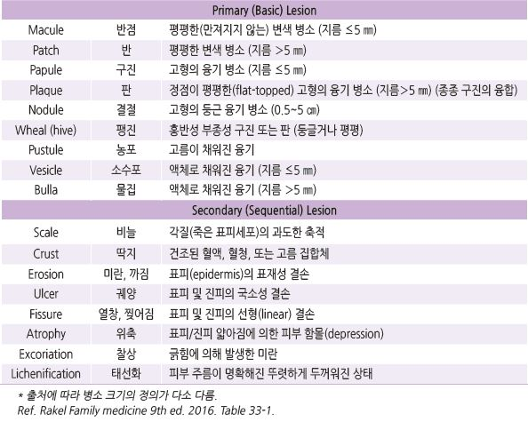

# 피부 병소의 표현

### 피부 병변의 기술

- 흉터(scar) : 외상 또는 염증 후 2차적으로 발생한 피부 변화

- 가피(eschar) : 검은 딱지로 덮인 괴사성 병소

- 모세혈관확장(telangiectasia) : 확장된 표재성 혈관

- 출혈점(petechia) : ＜3 ㎜의 만져지지 않는 평평한 자색반

- 반상출혈, 얼룩출혈(ecchymosis) : ≥3 ㎜의 만져지지 않는 평평한 자색반

- 촉지자색반(palpable purpura) : 혈관 염증에 의한 융기된 자색반

- 종양(tumor) : 지름 ≥5 ㎝의 고형의 융기 병소

### 멜라노 병변(melanocytic lesion)의 악성 감별
- 양성 소견 : 대칭, 명확한 경계, 균일한 색조, 직경 ≤6 ㎜, 크기 변화 없음

- 악성 의심 소견 : 비대칭, 불확실한 경계, 고르지 못한 색조, 직경 ＞6 ㎜, 점차 커짐
