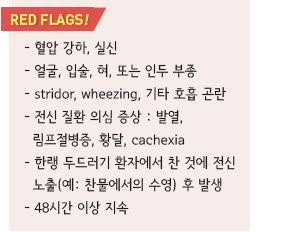
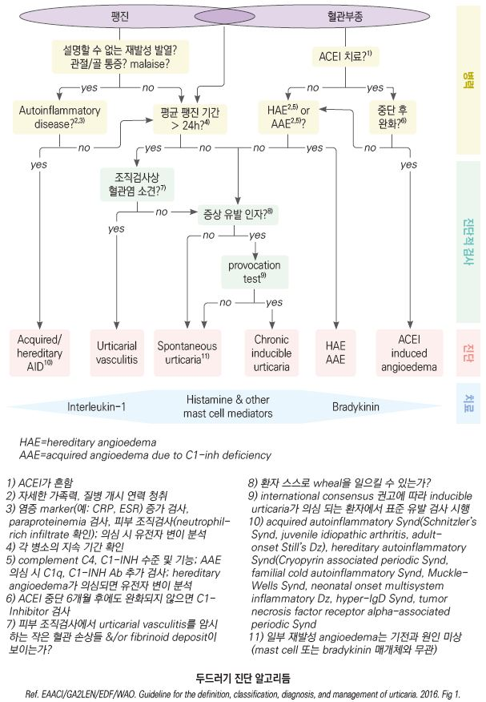
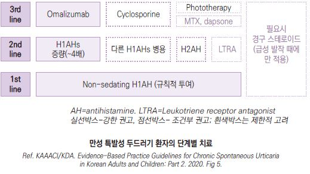
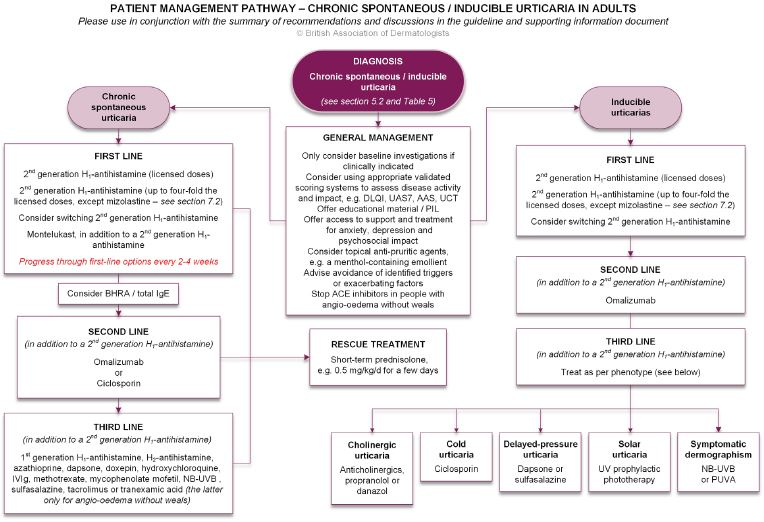
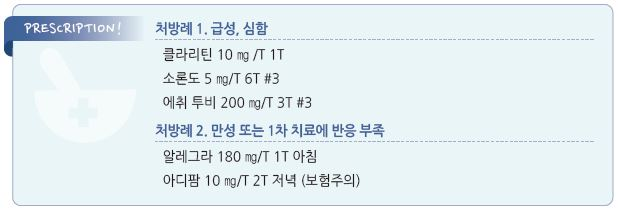

# 두드러기 Urticaria, 혈관부종 Angioedema


## 일반 사항

*   vasoactive mediator의 분비에 의해 야기되는 체액의 extravasation에 의해 피부(skin, mucosa, submucosa)에 발생한

    non-pitting 국소 부종(wheal, angioedema, or both)
*   기전 : mast cell & basophil에서 매개 물질(histamine, prostaglandin, leukotriene, bradykinin, cytokine, protease) 방출

    → 혈관 팽창, 혈관 투과성 증가, 진피 부종
* 두드러기와 혈관부종은 이환된 부위에 따른 구별이며 기본적인 발생 기전은 동일함
* 두드러기는 superficial dermis에서, 혈관부종은 deep dermis 또는 피하 조직에서 반응
* 두드러기 환자의 40%가 혈관부종을 동반, 혈관부종 환자의 80%가 두드러기를 동반
* 인구의 10\~25%가 일생 중 두드러기를 경험; 3%가 만성 특발성 두드러기를 가짐
* 급성 : ＜6주
* 만성 : ≥6주, ≥3 episode/wk 발생(각 episode들은 보통 빠르게 호전); 중년/여성에서 보다 흔함
* 경과 : ~~⅓에서 만성 경과; 이중 30~~50%가 1년 내 자연 치유, 20%가 5년 이후에도 지속
*   만성 두드러기의 경우 수면장애, 불안/우울, 출근/등교 등 심리/일상 생활 문제를 유발할 수 있으며 이에 대한 평가와

    관리가 필요함

## 원인

급성

* 50%에서 원인 불명
* IgE 매개 반응 : 알려진 원인의 대부분 해당; 음식(예: 견과류, 생선, 우유, 계란, 콩, 밀), 약물(예: 항생제), 곤충
* non-IgE 매개 반응 : 감염(예: Streptococcus , HBV, EBV, rhino, rota, herpes), 약물

#### 만성

* 원인 : 80% 이상에서 불명(만성 특발성); 알레르기 반응이 아닌 경우가 많음
* perivascular mononuclear cell, mast cell, T-cell 등의 작용 추정
*   관련 인자 : 물리적 자극(예: 추위, 열, 진동, 압력), 만성 감염(예: 기생충, 곰팡이, 간염), 암, 자가면역 질환(예: Hashimoto

    갑상선염, 류마티스, 루푸스, 피부 혈관염), 음식, 약물, 접촉



## 임상 양상

* 피부 증상 : 홍반, 부종, 통증
*   피부 외 증상 : 호흡 곤란/천명 , 흉부 조임감, 구역/구토,

    경련성 복통, 관절통, 불면증

### 두드러기

* 발생 부위 : 전신
*   피부 병변 형태 : blanchable rash, 뚜렷한 경계, wheal/flare.

    간혹 상대적으로 창백한 중심부

    • 두드러기끼리 융합하여 polycyclic, serpiginous, annular pattern을 보일 수 있음
* 부종 외 증상 : 가려움, 작열감
*   경과 : 급속(보통 자극 후 수 분 내) 발생

    → 보통 한 부위의 병소는 사라지고 다른 부위에 새로 발생, 개별 병변은 20분\~3시간 정도 지속

    → 간혹 1\~2일간 지속, 드물게 3주까지 반복
* 긁음에 의한 상처 외에는 흔적을 남기지 않음

### 혈관부종

*   발생 부위 : 점막, 연조직; 눈꺼풀, 입술, 혀, 생식기, 손/발등, 기도, 위장관

    • 보통 하중을 받는 부위에는 발생하지 않음
* 부종 외 증상 : 온감, 통증; 때로 호흡 곤란, 복통, 구역/구토, 설사; 가려움은 없거나 적음

> ✽점막에는 비만 세포와 감각 신경 말단이 적기 때문에 가려움이 적음

* 경과 : 보통 72시간 내 회복(수시간\~수일)

## 두드러기 종류

### 만성 자발성 두드러기 (Chronic spontaneous urticaria, CSU)

* 원인 미상의 두드러기

식품 또는 약물 알레르기

*   원인/유발 인자

    • 식품 : 조개, 생선, 유제품, 계란, 콩류, 견과류, 과일, 초콜릿, 밀

    • 약물 : 모든 약물이 두드러기를 일으킬 수 있음; aspirin, NSAID, 항생제에서 흔함
*   경과 : 보통 섭취 즉시(1시간 내) 발생; 원인이 되는 물질을 제거하면 호전, 섭취하면 다시 발생

    • ACEI에 의한 경우는 보통 투여 개시 1달 내 발생하지만 지연 발생도 가능
* 진단 : 음식에 대한 정보가 없는 경우에 skin-prick test는 유용하지 않음

### 흡입 알레르기

* 원인 : 꽃가루, 동물 털, 곰팡이 포자
* 흔히 발병 시점이 계절과 관련
* 섭취에 의한 두드러기보다 드묾

### 접촉성 두드러기 (Contact Urticaria)

* 원인 : 라텍스, 쐐기풀, 화학 물질 등 특정 물질에 대한 직접적 접촉 (☞ p.881)

### 피부 그림증 (피부 묘기증, Dermographism, Urticaria factitia)

* 원인 : 긁힘, 압력 등의 자극 → 반사성 혈관 수축 후 2차 반응으로 발생
* 다른 물리 두드러기(콜린성, 한랭)를 함께 갖고 있기도 함
*   진단 : 좁은 물건(예: 설압자, 손톱)으로 피부를 긁으면 6\~7분 내 자극 부위에 가려움이 있는 홍반 발생

    (→ 15\~30분 후 사라지기 시작)

### 지연 압박 두드러기 (Delayed pressure urticaria)

* 원인 : 압력
* 부위 : 조이는 옷 착용 후의 허벅지, 보행/달리기 후의 발바닥, 수 시간 앉아 있은 후의 엉덩이
* 피부 증상 : 혈관부종 또는 두드러기 등 일정하지 않음; 종종 가려움보다 통증/압통이 있음
* 동반 증상 : 발열, 오한, 관절통
* 경과 : 압박 4~~6시간(30분~~12시간) 후 발생 → 보통 48시간(\~수일) 내 소멸
* 진단 : 5 ㎏ 무게를 폭 3 ㎝ 끈으로 팔이나 어깨 위에 20분 간 걸고 있음 → 6시간 및 24시간 후 관찰

### 콜린성 두드러기 (Cholinergic urticaria)

* 원인 : 운동, 땀 흘림, 더운물 목욕, 매운 음식, 강한 심리적 자극 등에 의한 체온 상승
* 기전 : 근육과 땀샘에 분포하는 콜린성 신경 섬유의 매개로 체온 변화 시 혈청 히스타민 증가
*   피부 증상 : 현저한 홍반으로 둘러싸인, 내부에 작은 반점이 있는, 가려움을 동반한 팽진(넓은 홍반과 그 속의 1\~2 ㎜

    정도의 작고 가려운 복수의 팽진) → 전신 확산
* 다른 콜린 증상 동반 : 눈물, 침 흘림, 쌕쌕거림, 두통, 복통, 구토, 설사, 실신
* 경과 : 원인이 진정되면 30\~60분 내 소멸
* 진단 : 운동으로 땀을 발생시킨 후 15분간 더 운동을 하거나 42℃ 온수에 10분간 신체 일부를 담근 후 관찰

### 한랭 두드러기 (Cold urticaria)

* 원인 : 찬 공기, 찬물, 찬 물건 등 차가운 것에 노출 후 다시 따듯해지면서 발생
* 기전 : 차가운 것에 노출 후 피부 비만 세포 활성 및 proinflammatory mediator 방출
* 증상 : 노출 부위의 가려움, 발적, 부종; 전신적 노출 시 혈관 허탈, 실신
* 경과 : 보통 수 분 내 발생하지만 수 시간 후 발생하는 경우도 있음
*   진단 : 4\~5분간 얼음 덩어리를 피부에 올려놓음 → 얼음 제거 10분 후 관찰(ice cube test);

    cryoglobulins( 채취에 특별한 주의가 필요하고 유용성이 크지 않음)

### 열 두드러기 (Heat urticaria)

* 원인 : 뜨거운 물질에 대한 직접 노출; 드묾
* 진단 : 4\~5분간 45℃의 물 또는 물체를 피부에 올려놓음

### 운동 유발 두드러기 (Exercise-induced urticaria)

* 원인 : physical exertion; 드묾
* 진단 : treadmill test

### 일광 두드러기 (Solar urticaria)

* 원인 : 햇빛에 대한 노출; 드묾
* 경과 : 노출 30초~~수 분 후에 가려움 발생 → 노출 부위에 국한된 부종 및 주변부 홍반 발생 → 햇빛 차단 후 1~~3시간 내 소멸
* 진단 : 피부를 부분적으로 노출시킨 후 UVA, UVB 및 가시광선 조사
* 감별 : erythropoietic protoporphyria(porphyrin 검사)

### 수인성 두드러기 (Aquagenic urticaria)

* 원인 : 물의 온도에 관계없이 물과의 접촉으로 발생; 드묾
*   진단 : 신체 일부에 30분간 35℃(또는 여러 온도)의 물 적용 후 수 분 간 관찰;

    polycythemia rubra vera 등 혈액학적 질환과 관련이 있으므로 매년 CBC 시행

### 진동성 두드러기 (Vibratory urticaria)

* 원인 : 수년 동안의 진동 노출(예: 모터사이클, 승마, 산악자전거, 진동 기계) 또는 특발성; 드묾
* 진단 : 피부 일부를 진동 장치로 5\~10분간 진동시킨 후 관찰

## 진단

* 대부분 자세한 병력과 신체검사로 진단 가능하며, 검사를 통하여 원인이 밝혀지는 경우는 많지 않음
* 특히 H1 항히스타민제에 반응하는 급성 및 경증 만성 두드러기에서 추가 검사는 보통 필요 없음

### 병력

* 발생 시기
* wheal 또는 angioedema의 모양, 크기, 빈도/기간, 분포
* 동반되는 증상 : 뼈/관절 통증, 발열, 복통
* wheal 또는 angioedema와 관련된 개인 및 가족 병력
* 물리적 인자, 운동 관련성
* 주간 or 주말/휴일, 월경, 해외 여행 관련성
* 음식, 약물(예: NSAID, ACEI) 관련성
* 감염, 스트레스 관련성
* 이전 또는 현재 알레르기, 감염, internal/autoimmune Dz, GI 증상, 기타 이상
* 사회/직업/레저 활동 이력
* 이전 치료력 : 치료 방법/기간/결과, 반응 정도

※ 증상 일지 작성이 도움이 됨

※ 증상 정도 및 치료 반응 평가를 위하여 Sx scoring system을 사용할 수 있음; Dermatology life quality index(DLQI),

```
weekly Urticaria activity score 7(UAS7), Angioedema activity score (AAS), Urticaria control test (UCT)
```

### 검사

* (만성 환자에서) 선택적 시행; 혈관염, 갑상선 질환 등이 의심될 때 고려
* 검사 전 수일 동안 항히스타민제, steroid 등의 치료를 중단해야 함

> ✽H. pylori 감염이 CSU 위험 증가와 관련이 있을 수 있다는 일부 증거가 있지만 이에 대한 검사를 권하지는 않음

> ✽만성 두드러기와 자가 면역 질환의 관련성이 있어 보이지만 이에 대한 관련 특징이 없는 경우 선별 검사는 제안하지 않음

>

#### skin-prick test (피부단자검사)

* 민감도가 높고 여러 개의 알레르겐을 동시에 검사할 수 있음
* 두드러기 환자에서는 흔히 피부 그림증이 동반되어 위양성을 유발함

#### 실험실 검사

*   CBC(WBC diff count) : eosinophilia- 약물 유발, pemphigoid, 기생충 감염;

    leucocytosis- 감염, 혈관염, 자가 염증 질환; leucopenia- SLE
*   ESR/CRP(혈관염, 자가 염증 질환), TSH(자가 면역성과 관련), antithyroglobulin & antimicrosomal Ab, ANA,

    혈청 특이 IgE Ab, CD 항체
* C4 & C1 esterase inhibitor : angioedema 의심 시 고려
* folate, Vit B12, ferritin, LFT, B형 & C형간염 검사

#### 피부 생검

* 대상 : urticarial vasculitis 의심(통증성, 2\~3일 이상 지속, ecchymosis or petechia 동반)

### 감별

* 벌레 물림 : 수일 지속, 벌레 노출 병력
* 아토피 : 반구진, 비늘, 특징적 분포
* 접촉피부염 : 불분명한 경계, 구진
* 고정약진 : 약물 노출 병력, 가려움 없음, 과다 색소 침착
*   두드러기 혈관염(urticarial vasculitis) : 가려움보다 작열감, 색소 또는 자반(not blanchable), 물집, 흉터; 24시간 이상 같은

    부위에 지속
* Henoch-Schönlein 자반증 : 하지 분포, 자색반, 전신 증상
* 다형홍반 : 수일 지속, 홍채 모양 구진, 표적판 모양, 발열 동반
* 장미색 잔비늘증 : 수 주간 지속, herald patch, Christmas tree pattern, 간혹 가려움
* 바이러스성 발진 : 가려움 없음, 전구 증상, 발열, 반구진, 수일간 지속

#### 유전성 혈관부종(Hereditary angioedema, HAE)

* 증상 : 피부 및 위장관(통증성 복부 경련), 상기도 점막 증상(후두 부종)
* 종류 : histamine 매개, bradykinin 매개(C1 esterase inhibitor 결핍), 미확인 혈관부종
*   반복적인 피부 증상, 재발성 혈관부종 가족력, ＜20세에 발병, 원인 불명의 반복적 복통이나 상기도 부종, 일반적인

    혈관부종 치료(예: 항히스타민제, 글루코코르티코이드, 에피네프린)에 반응하지 않는 부종, 전구 증상(예: 피로,

    권태감, 구역감, 발진) 동반, 두드러기를 동반하지 않는 부종 등이 있는 경우 의심

    

***

## Management

### 치료 방침

* 호흡기 평가(anaphylaxis 배제)
* 원인 회피 : 원인으로 의심되는 행위를 피함; 음주, 급격한 온도 변화, 더운 곳을 피함
* 악화/유발 인자 제거
* 기저 감염 치료
* 필요시 불안, 우울증, 심리 사회적 영향에 대한 평가 및 치료
* 교육 : 두드러기 또는 혈관성 부종에 대한 교육 자료 또는 환자 정보 리플릿 제공

## 약물 치료

*   CSU 환자의 절반이 표준 용량의 H1-항히스타민제 반응하며, 나머지 절반의 \~⅔가 증량 치료에 반응;

    H1-항히스타민제에 반응하지 않는 사람의 ⅔가 omalizumab에 반응, ciclosporin에 비슷한 정도로 반응

### Epinephrine

```
(☞ p.991)
```

* 대상 : 심한 급성 두드러기, 기도 폐쇄를 동반한 혈관부종
* 용법 : 1:1,000 제제(1 ㎎/㎖), 0.01 ㎖/㎏, 최대 0.5 ㎖ IM(대퇴부 전외측 중간 부위)

#### 호흡 곤란 시

* epinephrine : 1:1,000 0.3 ㎖ IM
* steroid : hydrocortisone 200 ㎎ IV \[솔루 코테프 주], methylprednisolone 40\~60 ㎎ IV \[솔루메드롤 주]
* diphenhydramine : 50 ㎎ IV

### H1-항히스타민제 (H1AH)

* 두드러기 치료의 1차 선택제
* nonhereditary acute angioedema 환자의 ＞85%에서 증상 호전
* 가려움에 대해서는 졸음 작용이 있는 1세대 약제가 효과적

> ```
> ✽[BAD] 부작용과 관련하여 1세대 항히스타민제를 1차 선택제에서 제외함 
> ```

* 장기 투여 또는 졸음 부작용을 피하고자 할 때 2세대 약제 선택
*   증상 발생 후 일시적 사용보다는 비만 세포를 안정화시키기 위하여 지속 사용하는 것이 효과적. 특히 만성 두드러기에서는

    지속 투여가 유익
* 표준 용량으로 효과 부족 시 증량, 교체 또는 추가(특히 야간에 1세대 약제 투여), 또는 H2-항히스타민제 추가
* bradykinin-mediated(예: hereditary angioedema)인 경우에는 효과적이지 않음

#### 2세대

* loratadine : 10 ㎎ qd \[클라리틴]
* desloratadine : 5 ㎎ qd \[에리우스]
* cetirizine : 10 ㎎ qd \[지르텍]
* levocetirizine : 5 ㎎ qd \[씨잘]
* fexofenadine : 180 ㎎ qd \[알레그라]
* acrivastine : 8 ㎎ tid
* mizolastine : 10 ㎎ qd \[미졸렌]

1세대

* hydroxyzine : 25\~50 ㎎ hs or qid \[아디팜]
* chlorpheniramine : 4 ㎎ q4\~6hr, 최대 24 ㎎/d(고령자: 12 mg/d) \[페니라민]
* cyproheptadine : 4 ㎎ tid, 최대 32 mg/d; 한랭 두드러기에 적용
* promethazine : 10~~20 ㎎ bid~~tid

H2-항히스타민제 (H2AH)

* 효과 : H1AH에 병용 시 약간의 효과 증가
* 주의 : H2AH만 단독으로 사용할 경우 두드러기가 더 악화될 수 있음
* cimetidine : 200 ㎎ tid\~qid \[에취투비]

### Steroid

* 대상 : 혈관부종, 압박 두드러기, 혈관 두드러기, 난치성 만성 두드러기
* 적용 : 심한 증상 또는 H1AH에 반응하지 않는 경우에 H1AH에 단기 병용
* 국소제는 효과 없음 (✽전신 steroid 역시 증상 완화 효과가 없다는 보고가 있음)

#### 경구

*   prednisolone : 30~~40 ㎎/d, 5~~1 ㎎/㎏/d ×3\~7d \[소론도]

    •장기 투여 시 5\~10 ㎎/d qd 아침

    •중등증 이상(≥30 ㎎/d) 장기(≥2주) 사용 후 중단 시 tapering (3~~5일마다 5~~10 ㎎씩 감량)

#### parenteral

* 대상 : 심한 혈관부종; IV 투여 후 경구제 단기 투여
* hydrocortisone : 200 ㎎ IV \[솔루 코테프 주]
* methylprednisolone : 40\~60 ㎎ IV \[솔루메드롤 주]

### 면역 조절제 (Immunomodulatory agent)

* 대상 : 다른 치료에 반응하지 않는 자가면역 기전에 의한 두드러기 (보험주의)
*   종류 : anti-IgE Ab(omalizumab), cyclosporine, hydroxychloroquine, sulfasalazine, colchicine, dapsone, mycophenolate,

    정맥용 면역 글로불린, 혈장 분반술(plasmapheresis)
*   omalizumab : H1AH 또는 다른 면역 조절제로 조절되지 않는 환자에서 권고

    •용법 : 150 ㎎\~300 ㎎ 4주마다 SC [졸레어 주](%EB%B3%B4%ED%97%98%EC%A3%BC%EC%9D%98/)
*   cyclosporine : 고용량 H1AH 또는 H1AH들의 병용에 반응하지 않는 환자에서 추가 고려

    •부작용 : 고혈압, 신부전

    •용법 : 2.5\~5 ㎎/㎏/d \[산디문] (☞ p.871)
*   methotrexate : H1AH 단독 또는 병용에 반응하지 않는 환자에서 제한적 추가 고려

    •용법 : 15 ㎎/wk \[메토트렉세이트]
*   dapsone : 고용량 H1AH 또는 H1AH들의 병용에 반응하지 않는 환자에서 제한적 추가 고려

    •용법 : 25\~100 ㎎/d \[답손]
* tacrolimus : steroid-dependent chronic urticaria에 고려 \[프로그랍]

### 항류코트리엔제

* 효과 : 일부 환자에서 유효. 특히 한랭 두드러기에 효과
* 대상 : H1AH 표준 용량으로 조절되지 않는 환자에서 제한적 추가 고려 (보험기준 ☞ p.1180)
* montelukast : 10 ㎎ hs qd \[싱귤레어]
* pranlukast : 225 ㎎ bid \[오논]
* zafirlukast : 20 ㎎ bid 공복 복용
* zileuton : 600 ㎎ qid

### 기타

* Vit D : 4,000 U/d ×12wk; 일부 연구에서 증상 감소
* phototherapy : narrow band UVB; H1AH에 반응하지 않는 환자에서 추가 고려

## 만성 두드러기 단계별 치료 \[KAAACI/KDA]

```
① 표준 용량 non-sedating(2세대) H1AH
```

→ ② 처음 선택한 약제의 증량(표준 용량의 \~4배)

→ ③ 2세대 H1AH에 omalizumab 추가

→ ④ 2세대 H1AH에 cyclosporine 추가

```

```

만성 두드러기 단계별 치료 \[BAD(2021)]

모든 경우에

* 국소 항소양제(예: 멘톨 함유 연화제) 사용을 고려
* 알려진 유발 요인 또는 악화 요인(예: 약물) 회피
* ACEI 복용 중인, 팽진이 없는 혈관부종 환자들은 ACEI 투여 중지

만성 자발성 두드러기 (CSU)

* NSAID 관련 의심 : 의심되는 약물 사용 회피. 금기가 아니라면 COX-2 inhibitor로 교체 고려
* 식이 제한 : 일상적인 식이 배제는 권고하지 않음. 유의미한 영향이 확인된 경우 회피

#### 1st Line

*   1차 선택제 : 2세대 H1-항히스타민제

    •2세대 H1-항히스타민제 규칙적 투여

    •표준 용량으로 조절되지 않는 경우 증량(허가 용량의 4배까지)

    •증상 조절 후 단계적 감량(정해진 방법은 없음)

    •2\~4주마다(심한 난치성인 경우 2주마다) 1차 치료 옵션을 사용하여 치료 진행

    •첫 번째 선택제에 반응이 부족하거나 내약성이 없는 경우 다른 2세대 H1-항히스타민제로 교체 고려

    •mizolastine 증량은 회피

    •대체 항히스타민제가 존재하는 한, CNS에 대한 영향을 감안하여 1세대 H1-항히스타민제의 일상적 투여는 회피

    •1세대 H1-항히스타민제 증량은 회피

    •2가지 2세대 H1-항히스타민제 병용에 대한 근거는 부족함

    •2세대 H1-항히스타민제에 반응이 부족한 경우에 H2-항히스타민제(예: 시메티딘)를 일상적으로 첨가하는 것에 대한

    근거는 부족함. 단 두드러기가 소화불량과 관련된 경우 고려할 수 있음
* montelukast : 2세대 H1-항히스타민제 증량에도 반응이 부족한 경우 2세대 H1-항히스타민제에 추가 고려
*   steroid : 심한 증상을 빠르게 조절하기 위하여 단기간 투여 고려(예: 경구 prednisolone 0.5 mg/kg, 수일)

    •다른 치료 옵션이 존재하는 한, 장기적인 전신 투여는 회피. 사용하는 경우 유효 최소 용량으로 최단 기간 투여

2nd Line

* omalizumab : 2세대 H1-항히스타민제에 추가 투여
*   ciclosporin : 3\~6개월간의 1st line 치료 옵션에 반응이 부족한 경우 2세대 H1-항히스타민제에 추가하여 투여;

    ciclosporin의 장기 투여는 회피
* autologous serum skin test(ASST) or autologous plasma skin test(APST)를 일상적으로 시행하지 않음
*   총 IgE 측정 고려\*; IgE 수준이 높은 경우 omalizumab에 대한 반응이 높을 가능성이, 정상인 경우 ciclosporin에 반응할

    가능성이 있음
*   basophil histamine releaseassay (BHRA) 고려\*; BHRA 양성의 경우 ciclosporin에 대한 반응이 높고 omalizumab에는

    반응이 지연될 가능성이, BHRA 음성의 경우 omalizumab에 대한 반응이 높을 가능성이 있음

> \*이들 수준이 모든 환자에서 실제 임상 반응을 반영하는 것은 아님 3rd Line

*   1, 2차 치료 옵션에 반응이 부족하거나 사용할 수 없는 경우

    • azathioprine

    • dapsone

    • doxepin (CNS에 영향을 줄 우려가 있음)

    • hydroxychloroquine (특히 SLE와 함께 발생하는 두드러기)

    • IVIg

    • methotrexate

    • mycophenolate mofetil

    • narrowband ultraviolet (UV)B (통상 30회 치료 코스, 필요시 12개월 후 반복)

    • oral tacrolimus

    • sulfasalazine

    • tranexamic acid (혈관부종이 우세한 경우)

### Inducible Urticaria

#### 1st Line

*   1차 선택제 : 2세대 H1-항히스타민제

    •2세대 H1-항히스타민제 규칙적 투여

    •표준 용량으로 조절되지 않는 경우 증량(허가 용량의 4배까지)

    •증상 조절 후 감량(정해진 방법은 없음)

    •첫 번째 선택제에 반응이 부족하거나 내약성이 없는 경우 다른 2세대 H1-항히스타민제로 교체 고려

    •mizolastine 증량은 회피

    •대체 항히스타민제가 존재하는 한, CNS 부작용 등을 감안하여 1세대 H1-항히스타민제 투여는 보류

    •1세대 H1-항히스타민제 증량은 회피

    •2가지 2세대 H1-항히스타민제 병용에 대한 근거는 부족함
* montelukast : 2세대 H1-항히스타민제에 추가 투여하는 것에 대한 근거는 부족함

2nd Line

* omalizumab : 2세대 H1-항히스타민제에 추가하여 투여

#### 3rd Line

* 2세대 H1-항히스타민제에 추가하여 phenotype에 따른 치료

\*\* Cholinergic urticaria \*\*

* anticholinergics(예: oxybutynin), or beta-blocker(예: propranolol), or danazol, or possibly phototherapy 고려

\*\* Cold urticaria\*\*

* ciclosporin 고려
* 항생제의 일상적 사용에 대한 근거는 부족함
* cold desensitization은 시행하지 않음

\*\* Delayed pressure urticaria\*\*

* dapsone or sulfasalazine 고려

\*\* Solar urticaria\*\*

* 자외선 차단
* UV prophylactic phototherapy 고려
* plasmapheresis or IVIg에 대한 제한된 근거가 있음

\*\* Dermographism\*\*

* NB-UVB or PUVA 고려

의뢰 고려

• 진단이 모호함

• 1st line trerapy로 적절히 조절되지 않음

• inflammatory marker 수준이 높음

• 현저하거나 지속적인 전신 증상이 있음, 전신 상태가 좋지 않음

• 두드러기가 우울, 불안, 수면 장애, 등교/출근 지장 등 삶의 질에 상당한 영향을 미침

• 1st line therapy로 조절되지 않는 팽진 없는 혈관부종



Fig 1. Patient management pathway for urticaria.

> ```
>   For clarity we have divided management options into sections (general treatment, and first-,second- and third-line options).
> ```

> ```
>       However, depending on disease severity, disease fluctuation, comorbidities and national criteria for use of drugs,the order and
> ```

> ```
>       combinations of treatment may vary and change during each person’s disease. 
> ```

```
  AAS=Angioedema Activity Score; BHRA=basophil histamine release assay; DLQI=Dermatology Life Quality Index;
```

> ```
>   IVIg=intravenous immunoglobulin; NB-UVB=narrowband ultraviolet B; PIL=patient information leaflet;
> ```

> ```
>   PUVA=psoralen plus ultraviolet A; UAS7=Urticaria Activity Score summed over 7 days;UCT=Urticaria Control Test
> ```

> ```
> Ref. British Association of Dermatologists guidelines for themanagement of people with chronic urticaria 2021
> ```

> **질병코드** L50　두드러기

T78.3 혈관신경성 부종


