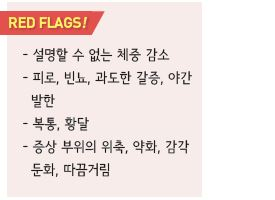
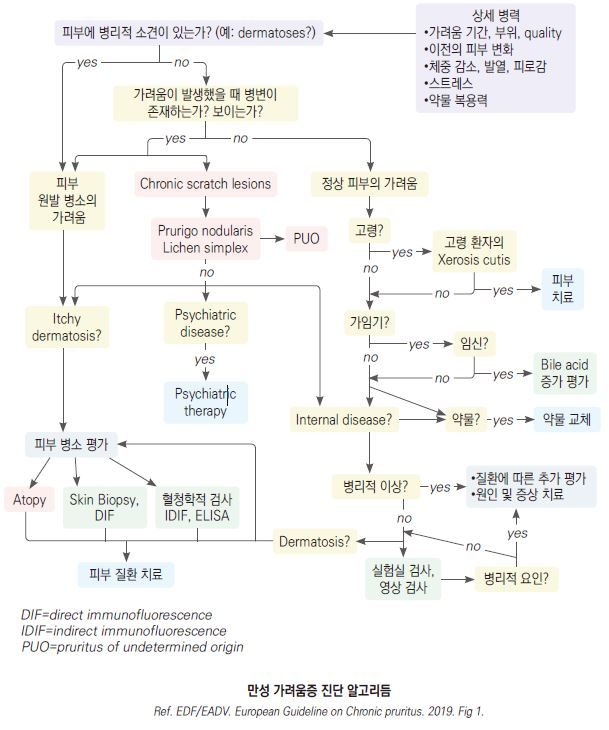
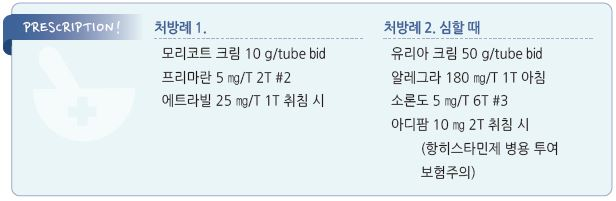

# 만성 가려움증 Chronic Pruritus

## 일반 사항
- ≥6주의 가려움증(긁고 싶은 충동을 일으키는 감각)

- 만성 가려움증은 혈액투석 수준의 삶의 질 저하를 일으킴

- 유병률 : 고령 인구의 7~60%

- 위험 인자 : 천식, 피부건조증, 비만, 불안, 간질환

- primary lesion : bulla, ichthyosis(건조, 비후, 비늘), macular erythema, papule, vesicle, wheal, xerosis

- 2ndary skin change : atrophy, crusting, excoriation, hyper- or hypo-pigmentation, lichenification, necrosis, nodule, papule,

    prurigo nodule, scar, ulceration 

### 원인에 따른 분류 [International forum on the study of itch]
1. Dermatological

  •건조증, 아토피, 건선, 태선, 접촉피부염, 모낭염, 옴, 진균 감염, 장미색 잔비늘증

2. Systemic

  •간, 신장 : 담즙 정체, 원발성 쓸개관경화증, 임신, 경구 피임제, 간염, 만성콩팥병

  •혈액 : 진성 적혈구증가증, 철결핍빈혈

  •내분비 : 갑상선 질환, Carcinoid syndrome

  •감염 : HIV, 기생충(회충 등 장 기생충 포함)

  •악성 종양 : 고형 종양, 림프종, 백혈병

3. Neurological

  •multiple sclerosis, 뇌종양, notalgia paresthetica, brachioradial pruritus,

    postzosteric neuralgia

4. Somatoform

  •정신적 요인이 가려움 증상에 영향을 주는 경우

  •우울증, 정동장애, 환각증, obsessive compulsive & related disorders,

    schizophrenia, eating disorder

5. Mixed origin

6. Others

  •약물 : 항고혈압제, 항생제, 소염제 등 거의 모든 약제가 가려움의 원인이 될 수 있음

## 진단

### 검사
- 기저 질환(예: 간질환, 신부전, polycythemia vera,갑상선저하증, HIV, lymphoma) 감별 

- 1st-step lab screening : CBC, Cr, urea, AST, ALT, ALP, γ-GT, LDH, TSH, 혈당, ferritin, CRP; 대변 잠혈(＞40세), 기생충;

    흉부 X선

- 추가 검사 : immunoelectrophoresis; hepatitis serology, 콜레스테롤, 중성지방; Ca, PTH; biopsy & immunofluorescence

    (mastocytosis, pemphigoid 등); 칸디다; 소변(mast cell metabolites); 영상 검사 및 골수 검사(mastocytosis)

### 감별
- 가족 내 다수 발생 → 옴 등 기생충

- 신체 활동과 관련하여 발생 → Cholinergic pruritus

- 물과의 접촉 수 분 내에 가려움 발생 → Aquagenic pruritus

- 야간 발생, 오한, 피로, 체중 감소, 야간 발한 동반 → Hodgkin’s Dz

- 취침 시 호전 → Somatoform pruritus

- 고령에서 겨울철 악화 → Xerosis cutis, Asteatotic eczema

- 피부 발진 없는 전신 가려움 → 전신 질환, 정신적 문제, 고령, 약물

- 피부 발진 없는 국소 가려움 → 신경/정신적 문제

---

## Management

### 치료 방침
- 피부 건조 관리

- 증상에 대한 약물 치료

- 기저 피부 질환이 있으면 이를 치료, 기저 피부 질환이 없으면 전신 질환 감별

### 단계별 치료 방법 [EDF]
    (2019)

- Step 1. 증상 치료 : 경구 H1-항히스타민제, 국소 steroid

- Step 2. 원인에 따른 치료

- Step 3. 원인 불명 또는 호전 실패 시 국소 &/or 전신 치료

  •국소 : calcineurin inhibitors, cannabinoid agonists, capsaicin

  •전신 : gabapentinoid, 항우울제(doxepin [사일레노], mirtazapine [레메론], paroxetine [세로자트]), UV phototherapy,

    naltrexone, 면역억제제(cyclosporine)

#### 매 단계 동반 치료
- 일반적 관리(비-약물 치료), 특히 보습 치료

- 취침 시 진정 작용이 있는 H1-항히스타민제, TCA, 신경안정제 치료

- 긁은 상처에 대하여 국소 항균 치료, 국소 steroid 치료

## 비-약물 치료

### 회피
- 피부 건조 : 건조한 환경, 열(사우나), 잦은 씻기/목욕, 알코올성 제제 도포, 냉찜질

- 비누 : 매일 비누를 사용하는 부위는 서혜부와 겨드랑이로 제한. 알칼리성 비누 사용을 피함

- 매우 뜨겁거나 매운 음식, 과음, 많은 양의 hot drink(예: 차, 커피)

- 흥분, 긴장, negative stress

- 알레르기 유발 또는 자극 물질 : 향료, 방부제, 계면활성제; 먼지, 집먼지진드기

### 권고
- 부드러운 중성/약산성/향이 없는 비누, 보습 세제, 샤워/목욕 oil

- 목욕할 때 미지근한 물을 사용하며 20분 이내 시행(오트밀 또는 과망간산칼륨을 첨가할 수 있음)

- 수건으로 피부 물기를 닦을 때 문지르지 말고 두들김

- 매일 보습제 적용(특히 샤워/목욕 후)

- 공기가 통하는 부드러운 옷 착용(예: 면 제품); 얇은 옷을 겹쳐 입고 조절하여 땀 나는 것을 피함

- cold wet wrap, fat moist wrap

- 손발톱을 짧게 깎음

- 적절한 실내 습도 유지; 야간에 실내를 낮은 온도로 조절

### 보습제
    (☞ p.867)

- 도포 시점 : 샤워나 목욕 후(특히 피부 건조증 환자에서), 야간; 하루 한 번 이상 도포

- 도포량 : 성인 250~500 g/주; 충분한 양 도포 권고(일반적으로 도포량이 부족함)

- 종류 : colloidal starch, oatmeal baths, ammonium lactate [타로 암모늄락테이트], petroleum jelly [바셀린], glycerol(20%),

    hydrophilic base, urea(5~10%) [유리아]

  •겨울철에는 기름기가 많은 제제 선택

- steroid 외용제와 병용 시 도포 방법 : 크림 보습제는 steroid 사용 15분 전, 연고 보습제는 steroid 사용 15분 이후 도포

### 이완 요법
- 명상, 요가, 스트레칭, 운동, 심리 상담

## 약물 치료

### 국소 치료제

#### Steroid
    (☞ p.1139)

- 대상 : 아토피, 접촉피부염, 건선, 태선 등에 의한 가려움

- 태선화된 병변에 대하여 중등증 이상 역가의 외용제 도포 또는 국소 주사

- 주의 : 부작용, 반동 현상

- 단기(2주 내) 사용

- 고역가 : clobetasol propionate [더모베이트 연고/액]

- 중간 역가 : mometasone furoate [모리코트 크림/로션]

- 장기 사용이 필요한 경우 calcineurin 억제제로 대체 고려 (☞ p.1143)

  •tacrolimus [프로토픽], pimecrolimus [엘리델]

#### Capsaicin
- 작용 : 감각 신경 끝에서의 탈감작 효과. neuropathic itch에 유효

- 효과 발현까지 2주 이상 소요

- 부작용 : 초기 작열감

- 보통 0.025% 제제 사용 [다이악센](0.075%) (보험주의)

#### 기타
- doxepin 5% cream : 졸음 유발 주의

- 마취제 : 단기, 부분적 사용; 1일 수회(≤5회/일) 도포

  •xylocaine, benzocaine [벤조카인], lidocaine, prilocaine [엠라](lidocaine복합제), pramoxine(1%) [프라렉신],

    polidocanol(2%~10%) [옵티덤](urea복합제)

- Soaking : cool tap water, Burow’s solution(1:40 dilution), 식염수(소금 1 teaspoon/물 0.5 L)

- calamine/zinc oxide [칼라민 로션](복합제)(비보험)

- camphor(2%), menthol(1%)

### 전신 치료제
- 대상 : 비-약물 치료로 호전되지 않는 전신 소양증

#### H1-항히스타민제
    (☞ p.1144)

- 대상 : 히스타민 관련 가려움

>   ✽염증성 피부 질환 관련 가려움을 포함하여 대부분의 만성 가려움은 히스타민에 매개되지 않으므로 항히스타민제에 잘 반응하지 않음
- 수면 효과가 있는 1세대 제제가 보다 유효(졸음 주의)

- H2-항히스타민제(예: 시메티딘) 병용 시 약간의 효과 증가

>   ✽H2-항히스타민제 단독 사용은 효과 없음
** 1세대**

- hydroxyzine : 25~50 ㎎ hs or 50~100 ㎎/d #3~4 [아디팜]

- chlorpheniramine : 4 ㎎ q4~6hr, 최대 24 ㎎/d [페니라민]

- diphenhydramine : 25~50 ㎎ q4~6hr, 최대 300 ㎎/d [디펙타민](비보험)

** 2세대**

- loratadine : 10 ㎎ qd [클라리틴]

- fexofenadine : 180 ㎎ qd [알레그라]

- cetirizine : 10 ㎎ qd [지르텍]

- mequitazine : 5 ㎎ bid [프리마란]

#### 항우울제 (TCA, SSRI)
    (☞ p.1146)

- 대상 : 아토피, 접촉피부염, somatoform 가려움 (보험주의)

- amitriptyline : 25~50 ㎎/d [에트라빌]

- mirtazapine : 15~30 ㎎/d [레메론]

- paroxetine : 20~40 ㎎/d [세로자트]

#### Steroid
- 대상 : 다른 약제에 반응하지 않는 가려움 또는 중증 가려움

- 단기(2주 내) 사용

- prednisolone : 2.5~60 ㎎/d; 보통 30 ㎎/d로 시작하여 tapering [소론도]

  •tapering 예 : 30 ㎎/d #3 ×5d → 20 ㎎ qd(아침) ×5d → 10 ㎎ qd(아침) ×5d;

    60 ㎎/d ×5~7d → 40 ㎎/d ×5~7d → 20 ㎎ qd(아침) ×7d → 10 ㎎ qd(아침) ×7d

#### Gabapentinoid
- 대상 : 신경병증성 가려움(특히 당뇨병) (보험주의)

- 부작용 : 어지럼, 졸음, 두통, 구역, 설사, 말초 부종, 체중 증가, 착란

- gabapentin : 300 ㎎ qd~tid(예: 300 ㎎ 4 ㏘ & 600 ㎎ 취침 시) [뉴론틴]

- pregabalin : 150~300 ㎎ bid [리리카]

#### μ-opioid receptor antagonist
- 대상 : cholestatic, CKD-associated pruritus

- 부작용 : 구역, 구토, 졸음; opioid analgesics 복용 환자에서 주의

- naltrexone : 25~50 ㎎/d [레비아]

#### 항류코트리엔제
- H1-AH 표준 용량으로 조절되지 않는 환자에서 제한적 추가 고려

- montelukast : 10 ㎎ hs qd [싱귤레어]

- pranlukast : 225 ㎎ bid [오논]

#### 면역억제제 (Immunomodulator therapy): Cyclosporine
    (☞ p.871)

- 대상 : 다른 치료로 조절되지 않는 심한 아토피성 피부염

- 작용 : T-lymphocyte 억제

- 부작용 : 고혈압, 부종, 신 손상, 발모 증가, 구역, 설사, 가슴쓰림

- 금기 : 간/신질환, 조절되지 않는 고혈압 또는 당뇨병, 악성 종양, 최근 생백신 접종, 주요 감염

- 모니터링 : 혈압, 신 기능

- 용법 : 2.5~5 ㎎/㎏/d #1~2 [산디문]

## 특별한 경우의 치료 옵션

### Renal pruritus
- activated charcoal 6 g/d

- gabapentin 300 ㎎ ×3/주 투석 후,

pregabalin 50 ㎎/격일

- γ-linolenic acid 크림 ×3/d

- capsaicin ×3~5/d

- UVB phototherapy

- nalfurafine IV 투석 후

- thalidomide 100 ㎎/d

- montelukast 10 ㎎/d

### Hepatic & Cholestatic pruritus
- cholestyramine 4~16 g/d

- ursodesoxycholic acid 13~15 ㎎/㎏/d

- rifampicin 300~600 ㎎/d

- naltrexone 50 ㎎/d

- naloxone 0,2 ㎍/㎏

- nalmefene 20 ㎎ ×2d

- sertraline 75~100 ㎎/d

- thalidomide 100 ㎎/d

> **질병코드**
L29 가려움

