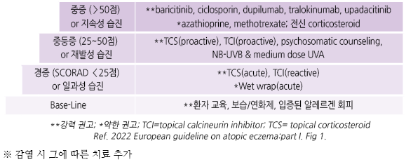
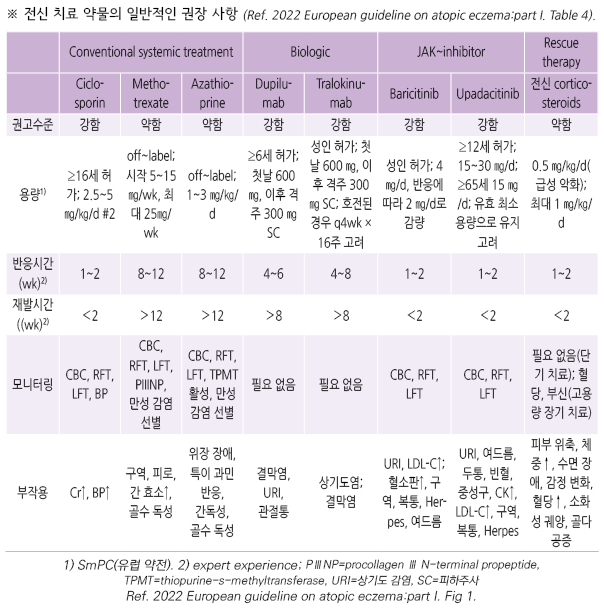
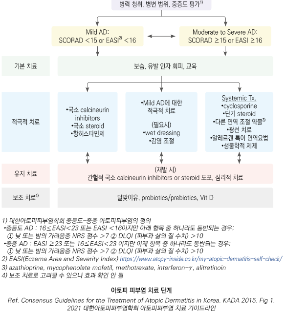
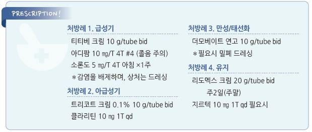

# 아토피 피부염 Atopic Dermatitis, AD


## 일반 사항

* 가려움, 특징적 형태(건조, 삼출물, 태선화) 및 분포를 보이는 만성 재발성 소양성 습진성 피부염
* 보통 젊은 연령 이전에 시작하고 가족력이 있고 다른 알레르기 질환이 있음
* 유병률 : 소아의 10~~20%, 성인의 1~~3%
* 첫 발현 시기 : 50% 이상이 생후 1년 이내에 첫 증상 발현, 90% 이상이 5세 이전에 발현
* 경과 : 소아기 발현 시 70%가 사춘기 이전에 자연 치유; 특히 경증인 경우 나이가 들면서 회복
* 성인에서는 aero-allergen에 보다 민감한 반응을 보임
* atopic march : AD 소아에서 알레르기비염, 천식 등 관련 질환들이 차례로 발생하는 현상
* 용어

•급성 악화(acute flare) : 치료 개입이 필요한, 임상적으로 증상 및 징후의 유의미한 악화

•급성 중재(acute intervention) : 급성 악화를 해결하기 위한 수 일 이내의 치료

•지속 치료(maintenance treatment) : 정기적, 대개 매일 수개월간의 치료

•단기((short term) : ≤16주

•장기(long term) : ＞16주

•반응(reactive) : 질환의 눈에 보이는 악화에 대한 치료 개시 또는 적응

•유지(proactive) : 전신적인 지속적인 연화제 치료에 추가하여 이전 환부에 대하여 항염증 치료의 간헐적)(주 2회) 적용

•관해/통제(remission/control) : 아토피 피부염의 증상과 징후의 만족스러운 완화

•완전 관해(complete remission) : 항염증 치료 없이 아토피 피부염의 증상과 징후가 사라짐

## 원인

### 기전

*   만성 피부 염증을 유발하는 알레르겐 및 미생물에 대한 T-cell의 반응 증가, 피부 면역 반응 이상(IgE 증가, 지연 과민 반응),

    피부 장벽 결함 등이 복합적으로 작용
* filaggrin gene(skin barrier protein 코드)의 변이
*   피부 장벽의 보호 기능 약화 : 피부 자극에 대한 반응 역치↓(적은 자극에도 가려움 발생), 각질층 내 수분 유지 기능↓(수분

    소실로 각질층이 오그라지고 갈라짐, 표피 장벽 소실)
* 알레르기 : 알레르기가 아토피 피부염에 역할을 하는 것으로 보이나 논란이 있음
*   긁음 : 피부 손상이 발생하며 세균, 바이러스, 진균 감염 증가

    •Itch-scratch cycle : 가려움 → 긁음 → 피부 손상 → 염증 물질 분비 → 가려움 악화

### 위험 인자

* 특징적 병력 : 천식, 알레르기비염, 음식 알레르기, 습진, 아토피 가족력
* 가족력 : 부모 한쪽이 환자인 경우 60%, 양쪽이 환자인 경우 80%에서 발병
* 높은 연령의 산모에게서 출생
* 높은 사회 경제적 계층, 도시 (‘위생 가설’ 관련? ☞ p.338)
* 개발국가, 높은 오염도, 추운 기후

※ 나쁜 예후 예측 인자 : 조기 발병, 광범위한 이환, 다른 알레르기 질환 동반, 아토피 가족력, filaggrin 유전자 돌연변이, 높은 IgE 값

### 가려움 유발 또는 AD 악화 요인

*   음식 : 우유, 계란, 견과류, 콩, 밀, 생선, 조개

    •경증의 6%, 중증의 33%가 음식과 관련; 중증 또는 어릴수록 음식과 관련이 많음
* 공기 알레르기 : 꽃가루, 풀, 동물 비듬, 집먼지진드기, 곰팡이
* 건조, 흡연 노출, 겨울철
*   과도한 발한 : 더운 날씨, 옷을 덥게 입음, 땀 흘리는 활동, 발열

    ✽땀의 영향 : 과도한 땀은 피부에 남아 땀구멍을 막고 keratin plug을 형성하여 국소 염증 및 가려움을 유발; 땀에는 histamin,

    antimicrobial peptide, protease가 포함되어 있어 가려움을 유발할 수 있음; 결손된 피부로의 allergen 피부 투과를 촉진할 수 있음
* 피부 자극 : 양털, 아크릴, 비누, 세면도구, 세제, 향수
* 피부 감염 : S. aureus , 헤르페스, 물사마귀, 곰팡이
* 감정적 스트레스

### 난치성 AD의 원인

* 잘못된 진단 또는 다른 피부 질환/기저 질환 동반
* 부적절한 치료 방법 : 너무 복잡한 방법 선택, 치료 부작용에 대한 두려움으로 약물 사용 회피
* 약물 또는 피부 관리 제품에 대한 알레르기 반응
* 음식, 환경, 기타 자극 등 원인에 대한 지속적인 노출

## 임상 양상

### 진행 양상

① 급성 : 심한 가려움, 홍반성 구진(erythematous papule)

② 아급성 : 홍반, 긁힌 상처, 각질성 구진(scaling papule)

③ 만성 : 태선화, 섬유성 구진(fibrotic papule)

* 급성, 아급성, 만성의 3단계 피부 반응이 혼재

### 연령별 주요 발생 부위

* 영아기 : 두피, 얼굴(특히 뺨), 사지 신측부; dry, scaly patch (✽기저귀 부위는 습하기 때문에 드묾)
* 소아기(2세\~사춘기) : 목, 사지 굴축부; rash, scaly patch
* 사춘기 : 굴측부; 특히 외부 자극이 있을 때 가려움 및 염증 발생
* 성인 : 손, 발, 얼굴, 목, 앞 가슴, 외음부; 흔히 만성 단순태선 양상 (☞ p.896)

### 중증도에 따른 양상

* 경증 : 부분적 피부 건조, 간헐적 가려움; 일상적인 활동/수면/정신적으로 거의 지장 없음
* 중등증 : 부분적 피부 건조, 빈번한 가려움, 홍반; 일상생활에 중등도의 장애
* 중증 : 넓은 범위의 피부 건조, 가려움 증가, 홍반; 일상생활에 심한 장애

### 중증도 평가: SCORAD index

* 계산식 : (A÷5)+(B×3.5)+C (☞ [online 계산기](http://scorad.corti.li/))

A. 병변 범위(%) : nine rule을 이용하여 평가(예: 두부 전체 및 한쪽 팔 전체 이환 시 18%); 단순히 건조한 부분은 범위에

```
포함시키지 않음
```

B. 병변의 심한 정도 : 6개의 징후(erythema, edema/papulation, oozing/crust, excoriation, lichenification, dryness)에 대하여

```
각각 없음 0점, 경증 1점, 중등증 2점, 중증 3점 부여; 총 0~18점
```

C. 주관적 증상 : 지난 3일 동안 가려움증과 수면 장애에 대하여 각각 0~~10점 부여; 총 0~~20점

* 판정 : ＜25점=경증, 25\~50점=중등증, ＞50점=중증

## 진단

### 검사

* AD를 진단하는 특이 검사는 없음
*   유용성이 적음 : 검사 결과와 임상 증상의 상관관계가 낮음. 예) 검사에서 나타나는 AD 환자의 음식에 대한 감작 비율은

    30\~80%이지만 실제 확인되는 식품 알레르기의 비율은 훨씬 낮음

#### 실험실 검사

* 혈청 IgE : AD 환자의 80% 이상에서 증가; IgE 수준으로 알레르기 반응의 종류나 강도를 판단할 수는 없음
* 호산구 : 질환의 중증도와 관련이 있는 경향이 있음

#### 알레르기 피부 검사

*   Skin-prick test (피부 단자 검사)

    •피부 과민성 때문에 위양성이 많음; 피부 병변이 심한 경우에는 시행하지 않음

    •검사 전 수일 동안 항히스타민제, steroid 등의 치료를 중단해야 함
* patch test : 원인 제거 후에도 증상이 지속되는 경우 고려; 48시간 및 96시간 후 관찰

> ✽T.R.U.E. test® : 35가지 항원 검사; 알레르기 반응의 70% 정도를 진단할 수 있을 것으로 추정

### 한국인 아토피 피부염의 진단 기준 \[대한아토피피부염학회]

* 진단 : 다음 ‘주 진단 기준’ 중 ≥2가지 + ‘보조 진단 기준’ 중 ≥4가지

\*\* 주 진단 기준\*\*

① 소양증

② 특징적인 피부염의 부위 및 병변 : ＜2세: 얼굴, 몸통, 사지 신측부 습진; ≥2세: 얼굴, 목, 사지 굴측부 습진

③ 아토피 관련 질환(예: 습진, 천식, 알레르기비염)의 개인 및 가족력

\*\* 보조 진단 기준\*\*

① 피부건조증

② 백색 비강진

③ 눈 주위의 습진성 병변 또는 색소 침착

④ 귀 주위의 습진성 병변

⑤ 구순염

⑥ 손, 발의 비특이적 습진

⑦ 두피 인설

⑧ 모공 주위 피부의 두드러짐

⑨ 유두 습진

⑩ 땀을 흘리면 가려움

⑪ 백색 피부묘기증

⑫ 피부 단자 검사 양성

⑬ 혈청 IgE 증가

⑭ 피부 감염 증가

### 감별

*   알레르기 접촉피부염 : 소아기에서의 습진이나 호흡기 알레르기 병력, 또는 아토피 가족력이 없으면서 AD 및

    습진성 피부염에 대한 적절한 치료에 반응이 없는 경우 의심; AD 환자에서 알레르기 접촉피부염이 발생하면

    급성 악화가 발생할 수 있음 (☞ p.882)
* 지루피부염 : 심한 가려움은 없음, 기름진 비늘, 보통 두피와 얼굴 중앙부 이환, 치료에 빠른 반응 (☞ p.886)
*   건선 : 은백색 비늘을 가진 경계가 뚜렷한 홍반 구진, 비늘을 뜯으면 점상 출혈, 팔꿈치, 무릎, 두피, intergluteal cleft 이환

    (☞ p.889)
*   건조증(xerosis) : fine scale을 동반한 건조한 피부. 하지에 심함(전신 이환 가능). 겨울에 심함; 보통 뚜렷한 염증 소견이 없으나

    표피 장벽에 손상이 생기면 염증 반응이 발생할 수 있음
*   어린선(Ichthyosis) : 물고기/파충류 비늘 모양의 건성 피부, 흰색\~갈색의 큰 인설. 주로 양측 사지 바깥쪽 분포, 굴곡부는 정상;

    가려움은 덜함
*   위축털각화증(Keratosis pilaris) : 보통 소아기에 발병, 사춘기 이후 호전. 팔, 허벅지, 얼굴(볼) 측면 이환;

    Keratotic follicular papule

***

## Management

### 치료 방침

```

```

## 회피 요법

#### 자극 회피

```
(☞ p.343)
```

* 자극 물질 및 그 회피에 대한 일관적인 연구 결과는 없음; 개인적 경험에 따를 수 있음
*   자극 물질 및 환경 : 비누, 세제, 화학 약품, 담배 연기, 고온, 고습, 심한 햇빛 노출 회피

    • 세제 : 잔류 세제가 남지 않도록 주의; 액상 세제 사용, 충분히 헹굼

    • 비누 : 최소한의 지방 제거 능력을 가진 중성/약산성 비누 선택

    • 심한 더위 또는 급격한 온도 변화, 과도한 땀흘림을 피함

    • 적정 실내 습도- 40\~50% (✽20% 이하 습도에서는 각질층이 오그라지고 갈라지고, 표피 장벽이 소실되고, 자극에 약해지고,

    염증 반응이 유발됨; 피부를 위한 최적 습도는 60%이나 곰팡이가 발생됨)

    • 실내 습도 조절을 위하여 가습기 또는 제습기를 사용할 수 있으나 청소 등 관리 주의가 필요함

    (✽WHO는 위생 등의 문제로 가습기 사용을 권고하지 않음)

    • 화상을 예방하는 수준의 자외선 차단제 또는 양산 사용 (✽화상을 입지 않을 정도의 햇빛 노출은 제한하지 않으며 햇빛이

    피부 장벽을 호전시키기도 함)
*   의복 : 모직 옷, 거친 재질의 옷, 조이는 옷, 덥게 입는 것 회피

    • 새 옷은 세탁 후 착용, 면 재질의 옷 선택

#### 유발 음식 회피

*   원인으로 확인된 음식 회피; 그러나 식이 제한은 영아 외에는 보통 도움이 되지 않고, 많은 음식에 유발 성분들이 포함되어 있어

    회피하는 것이 현실적으로 어려우며, 지나친 음식 제한은 영양 공급 측면에서 해로울 수 있으므로 임상적으로 입증되기 전에는

    식이를 제한하지 않음
* 유발 음식 : 섭취 후 AD 악화, 습진성 피부염, 두드러기, 쌕쌕거림, 코 막힘 등을 유발한 음식
*   수유기에 가능한 한 모유로 수유하며 AD 고위험 영아(예: 아토피 부모)에서 분유를 먹여야 할 경우에는 저알레르기 분유를

    선택(효과는 불확실)

✽고위험군 소아에게 생후 4\~10개월에 땅콩 섭취를 시작했을 때 80%에서 땅콩 알레르기를 예방할 수 있었다는 보고가 있음;

```
땅콩, 우유, 밀, 계란을 생후 3개월부터 섭취시켰을 때 3세에서 이들 음식에 대한 알레르기 발생이 그렇지 않은 경우의 절반

이하였다는 보고가 있음(2.6% vs 1.1%)
```

#### 공기-알레르겐(aero-allergen) 회피

* 집먼지진드기 관리
* 적절한 환기

•미세 먼지 등 외부 공기의 오염 문제가 있는 경우에는 지속적으로 창문을 개방하지 않고 짧은 시간 동안 완전 개방하여 환기함

```
(✽통상 완전 개방 시 환기에 5~10분 소요)
```

•꽃가루가 많은 계절의 건조한 날에는 밤이나 이른 아침, 비 내리는 날에 환기함

* 카펫 사용을 피함
* 필터가 장착된 진공청소기로 청소, 걸레질로 먼지 제거, 매일 매트리스 청소
* 새로 세탁하지 않은 헝겊 제품(예: 인형)은 침대에 두지 않음
*   침구 및 의류는 60℃의 뜨거운 물로 주 1회 세탁 및 햇빛에 자주 건조시킴

    ✽대부분의 기생충은 53.5℃에서 사멸하지만 권고 세탁 온도는 60℃로 할 수 있음
* 침대와 베개를 고어텍스 또는 유사 재질로 감쌈
* 자동차에 꽃가루 필터 사용

#### 기타

* 침대를 여러 겹의 천으로 감싸지 않음
* 털이 있는 애완동물을 기르지 않음
* 백신 접종 시 병변이 덜한 피부에 시행
*   운동 : 일반적인 제한 없음; 단, 땀이 증상을 유발하는 경우에는 운동량을 점차 늘려 적응시키며, 무거운 장비를 착용하거나

    육체적 접촉이 있거나 땀을 많이 흘리는 운동은 주의
*   지나친 물 접촉/손씻기 회피 (✽반복/지속적 과잉 수분 상태에서는 피부 각질층이 수분을 흡수하여 lipid bond가

    hydrogen bond로 대치되어 표피 장벽이 파괴되고 짓물러지게 됨. 예: 기저귀발진, 손습진)

## 국소 요법

### 목욕 및 세척

*   1일 1회(특히 취침 전; 발진이 심할 때는 1일 수회), 온수(27~~30℃)에 5~~10분간 몸을 담금. 증상이 가벼울 때는 샤워로 대체할

    수 있음; 목욕의 권고 빈도나 기간을 정할만한 근거는 없음 (✽1일 1회와 주 2회 목욕의 차이가 없다는 보고가 있음)
*   세제 : 필요할 때만 중성~~약산성(pH 5~~6), 무향, 무색의 세제 사용

    • 발진이 심한 경우(flare)에는 자극을 줄이기 위하여 세제 사용을 피함; 겨드랑이, 사타구니, 발 등에만 사용
* 물기를 닦을 때 수건으로 문지르지 말고 가볍게 두들김; 강하게 문질러 닦지 않음
* 목욕이나 세안 후 즉시(3분 이내) 또는 피부가 축축할 때 보습제를 도포
* 보습제를 사용하지 않는 잦은 세척은 피부 장벽을 해치므로 피함
*   특별한 목욕 요법은 피부 일부에 시도하여 부작용이 없는 지 확인한 후에 전신에 적용. 효과에 대한 근거는 부족함

    • 발진이 심할 때는 자극 또는 불편감이 있을 수 있음

    • 보통 10분 정도 몸을 담그고 난 후 물로 헹굼; 주 2\~3회 시행

**표백제 목욕**

* 기대 효과 : 피부의 세균을 줄임
* 방법 : 전신이 들어가는 150 L의 욕조 물에 6% Na hypochlorite(락스) 100 ㎖ 투여

**소금 목욕**

* 기대 효과 : 피부 살균
* 방법 : 욕조 물 150 L에 소금 한 컵(150 g) 투여

**식초 목욕**

* 기대 효과 : 피부 살균 및 wet dressing
* 방법 : 욕조 물 150 L에 식초 200\~500 ㎖ 투여

**Oil 목욕**

* 기대 효과 : 피부에 oil 필름을 남겨 수분 증발을 막음 (✽대규모 연구에서 습진 개선 효과 없었음)
* 주의 : oil에 의한 미끄러짐 주의

**베이킹 소다 또는 oatmeal 목욕**

* 기대 효과 : 가려움 감소
* 방법 : 욕조에 투여하거나 반죽으로 피부에 도포

### 보습제/연화제 (moisturizer/emollient)

*   작용 : 수분 손실 최소화, 각질층 수화, 피부 보호, 피부 자체의 keratinocyte 분화와 항균 작용을 회복시킴;

    증상과 염증을 감소시키고, AD flare 간의 시간을 늘림
*   특정 보습제나 유효 성분을 권고할만한 근거는 없음; 일반적으로 저렴하고 향이 없는 제품을 추천하며

    샘플들을 사용하여 환자 개개인에 적합한 것을 찾음

#### 사용 방법

* 하루 2회 도포(발작기에는 더 자주); 연고/oil은 8\~12시간 동안 수분 증발을 막아줄 수 있음

✽관해 후에는 주 2회 도포할 수 있다는 보고가 있음

✽부모가 아토피피부염/천식/알레르기비염 등이 있는 아토피피부염 고위험군 신생아에서 출생\~2개월에 1일 2회 보습제

```
사용 시 1세 때의 아토피피부염 발생을 줄일 수 있다는 보고가 있음. 그러나 장기 효과 또는 고위험군이 아닌 소아에서도

도움이 되는지는 모름
```

* 이환되지 않은 피부까지 도포. 가능한 한 전신 도포
* 충분한 양을 사용하도록 교육(일반적으로 사용량이 부족함); 성인 권고 사용량- 주당 250\~500 g
* 추운 날 또는 겨울철에는 기름기가 많은 제제를 선택하고 보다 많은 양을 도포
* 얼굴에는 너무 기름진 제제는 피함
* 염증이 있는 피부에 적용이 견디기 어려운 경우 염증 치료 후 적용
*   항염 도포제(예: steroid 크림)와 병용할 경우의 간격 : 크림 보습제는 항염제 도포 15분 전, 연고 보습제는 항염제 도포

    15분 후 도포; 가능한 한 30분 이상의 간격을 둠

#### 종류

\*\* 폐쇄 작용제\*\*

* 작용 : 피부를 통한 수분 소실 차단 및 피부 보호
* 종류 : petrolatum \[바셀린], zinc oxide \[보소미], lanolin, mineral oil, silicone
* 부작용 : 모낭염(mineral oil), 접촉피부염(lanolin)

\*\* 습윤제\*\*

* 작용 : stratum corneum의 수분 유지, keratolytic 작용
* 종류 : urea \[유리아], glycerin, alpha hydroxy acid, sorbitol, lactic acid
* 부작용 : 자극(urea, lactic acid)

\*\* 연화제\*\*

* 작용 : 피부 연화
* 종류 : 콜레스테롤, 스쿠알렌, 지방산

\*\* 표피 세포 구성 성분 보충\*\*

* 효과 : 피부 보습 및 방벽 기능 회복; 해당 성분이 부족한 일부 환자에서 효과
* 종류 : ceramide [에피세람](%EB%B3%B5%ED%95%A9%EC%A0%9C/), filaggrin

#### 용매

*   연고 : 보습 효과가 보다 우수; 건조하고 두꺼워진 피부에 적용

    •주의 : 보통 방부제가 함유되어 있지 않으므로 주걱 등을 사용하여 손의 직접 접촉 사용을 피함; 땀샘을 막아 모낭염을

    유발할 수 있으므로 털 또는 겹친 부위는 회피; 삼출성 병소에서는 피함
*   크림, 겔, 로션, 용액 : 사용의 편의성이 있음, 삼출성 병소에 적용

    •단점 : 로션은 증발하면서 피부를 건조하게 할 수 있음. 보통 방부제를 함유하고 있어 환자에 따라 자극 반응이 발생할 수 있음
* 알코올 함유 로션은 가능한 한 피함

### 항염증제

#### 국소 corticosteroid (TCS)

```
(☞ p.1139)
```

* 작용 : 염증 및 가려움 감소. S. aureus 집락 감소
* 급성 악화에 대한 기본 치료제

**약제 선택**

* 증상의 중증도 및 발생 부위에 따라 결정
* 유효한 가장 낮은 역가 제제 선택 (✽병변 상태에 비하여 너무 약한 약제는 증상을 호전시키지 못함)
*   고역가 : 두꺼운 피부(예: 팔꿈치) 또는 두꺼워진 병소에 제한적으로 사용; 얼굴이나 겹친 부위에는 사용을 피함

    \[더모베이트 액/연고, 베타베이트 크림]
* 중간 역가 : 몸통과 사지에 대하여 보다 긴 기간 동안 사용 가능 \[모리코트 크림, 티티베 크림]
* 저역가 : 소아, 얼굴, 겹친 부위(예: 사타구니, 팔오금) 적용 \[데스오웬 로션, 락티케어HC 로션]

**사용 방법**

* 도포 횟수 : 보통 1일 1\~2회; 도포 횟수를 늘리는 만큼 효과는 늘어나지 않음
* 기간 : 중/저역가 제제는 4주까지 사용 가능

•강한 역가 제제(특히 불소 함유제제)는 2\~4주 이상의 지속 사용을 피함

* 중단 : 염증 반응이 해결되면 TCS 도포는 tapering하고 hydration 및 보습은 지속함
*   Pulse therapy

    • 대상 : TCS 지속 사용이 필요한 병소(예: 도포하면 호전되고 중단하면 악화되는 병소)

    • 방법 : 중간 역가 제제로 1주에 2일만 연속된 날(예: 주말) 또는 정해진 요일(예: 화 & 금요일)에 bid로 도포, TCS 비사용 기간

    중에는 보습제 적용

    ✽주 2일 도포 시 비 연속된 2일보다 연속된 2일 도포가 재발 예방에 효과적이라는 보고가 있음

    • 최소 20주간 안전하게 적용 가능

**용매**

* 병변의 특성(건조 또는 습함), 위치, 환자의 선호도에 따라서 결정
* 연고 : 동일 성분에 있어 가장 고역가 특성; 전신 흡수가 크림에 비하여 늘어날 가능성이 많음

**부작용**

*   국소 부작용 : 피부 얇아짐, 실핏줄 확장, 멍듦, 탈색, 여드름, striae, 모낭염(주로 연고)

    • 높은 역가 제제, 얼굴(특히 눈꺼풀), 스치는 부위에서 보다 호발
*   전신 부작용 : HPA axis 억제

    • 약제 강도, 도포 부위, 폐쇄 정도, 전신 대비 도포 면적 비율, 사용 기간 등과 관련

    • 전신 부작용이 발생하지 않는 1개월 사용량 : 유아 15 g, 소아 30 g, 성인 60\~90 g

#### 국소 칼시뉴린 억제제 (Calcineurin inhibitor, TCI)

```
(☞ p.1143)
```

*   대상 : 국소 steroid에 반응하지 않는 경우, 국소 steroid 사용에 대한 공포가 심한 경우, 국소 steroid 치료로 증상이 완화된

    이후 국소 steroid 사용을 줄이고자 하는 경우, 민감 부위(예: 얼굴, 겹친 부위, 항문/외음부)
* 강도 : 저역가\~중간 역가 steroid와 동등
*   용법 : 단기 또는 간헐적 사용; 주 2일 도포로 AD 증상의 재발을 줄일 수 있음

    • 급성 flare 치료에 있어서 국소 steroid를 먼저 사용 후 적용
* 부작용 : 작열감(차츰 호전), 가려움, 발진; 림프종의 위험이 있는 환자(예: HIV)에서 주의
* 주의 : 노출 부위에 사용 시 자외선 차단
*   종류

    • tacrolimus : humoral & cell-mediated immune response 억제; pimecrolimus보다 효과 발현이 빠르나 작열감이 더 많음;

    0.03%, 0.1% 연고 bid \[프로토픽] (2세 이상 허가)

    • pimecrolimus : activated T-cell cytokine 생성 차단; 1% 크림 bid \[엘리델] (2세 이상 허가)

Phosphodiesterase-4 inhibito (PDE-4i)

* 작용 : 염증 반응을 일으키는 phosphodiesterase type-4의 작용을 길항
* 대상 : 2세 이상의 경증/중등증 아토피에 단기 사용
* 부작용 : 따끔거림(사용 초기)
* crisaborole 2% oint

### 기타

#### 광선 치료 (Photo(chemo) therapy)

* 효과 : 가려움 완화
* 대상 : 난치성 병변; 총 20\~25회 치료 후 평가
* 방법 : UVB(가급적 narrow band, 311 nm) 주 3회, 상태에 따라 증감; 급성기에는 UVA1 적용
* 부작용 : 발진, 통증, 가려움증, 색소 침착, 피부암(장기 적용 시)
*   주의 : 전신적 면역 억제제(예: ciclosporin, azathioprine)와 병용하지 않음; 장기 적용은 하지 않을 것을 권고; 피부암의 병력

    또는 증가된 위험이 있는 경우 적용하지 않을 것을 권고

#### 타르

* 작용 : 염증과 가려움 완화
* 효과 : 단독으로는 미약; TCS에 병용 시 TCS 역가를 낮출 수 있음
* 부작용 : 피부 건조 또는 자극감, 모낭염, 광과민증
* 샴푸 등으로 사용

#### 드레싱

* 작용 : 벗겨진 부위의 치유 촉진, 자극(예: 긁음)에 대하여 피부 보호

\*\*Wet dressing \*\*

* 효과 : 약제의 피부 침투 능력을 증가시켜 줌; 특히 목욕 후 시행 시 효과
* 대상 : 중증, 치료에 반응이 없는 만성 병소, 삼출물이 있는 병소
* 방법 : 보습제 또는 저역가 TCS 도포 후 wet pajama, sweat suit, wet tube sock, 또는 wet gauze → 수 시간 후 제거; 보통 잘 때 시행
* 부작용 : 2차 감염

\*\*밀폐 요법 \*\*

* 효과 : 국소 도포제의 침투 증대, 효과 증대
* 방법 : 도포 후 plastic wrap으로 감싸거나 거즈로 덮음

✽대한아토피피부염학회 습포밀폐요법 https://www.atopy.re.kr/sub/atopy\_care3.php

* 부작용 : 자극 증상, 땀샘 배출에 지장이 생겨 모낭염이 발생할 수 있음

## 전신 요법

*   전신 치료 대상 : 중증(SCORAD ＞50점), 적절한 국소 치료와 자외선 치료로 조절되지 않는 경우, 장기간 많은 양의

    TCS 도포가 필요한 경우
*   전신 치료를 시작하기 전에 환자의 생활 치료 순응도와 유발 요인을 평가하며 T-cell lymphoma, 면역 저하 상태 등을

    감별하여야 함

### Corticosteroid

* 대상 : 국소 steroid로 호전되지 않는 중증 또는 급성 악화기
* 주의 : 전신 steroid 사용을 통해 얻어지는 빠른 호전은 흔히 중단 후 반동 현상(flaring)을 유발하므로 1\~2주 내로 사용을 제한함
* 중단 시 국소 steroid, 보습제 등 다른 치료를 병행 또는 강화하는 것을 권고
* prednisolone : 0.5\~2(시작) ㎎/㎏/d, 최대 80 ㎎/d; ＞30 ㎎/d 투여 시 tapering \[소론도]

### 면역억제제 (Immunomodulator therapy)

* 작용 : 강력한 면역 억제(중단 시 재발)
* 대상 : 다른 치료로 조절되지 않는 중증 또는 난치성 AD에 고려 (보험주의)
* 부작용 : 신 기능 장애, 고혈압, 골수 억제, herpes simplex retinitis
* 4\~8주 내 반응하지 않으면 치료 중단
* cyclosporine 외 다른 제제(methotrexate, azathioprine)는 cyclosporine이 효과가 없거나 사용할 수 없을 때 고려
* 보통 생백신 접종 2주 전\~6주 후 동안 투여 중단 (✽중단 필요에 대한 증거는 없음)
*   cyclosporine \[산디문]

    • 시작 5 ㎎/㎏/d #2 → 효과가 나타나면 2주마다 0.5\~1 ㎎/㎏/d 감량 → 최소 유효 용량 투여

    • 연속 사용 시 2년 이하 적용 및 3\~6개월간 휴약

    • 간헐적 사용(예: 주말 사용)으로 누적 용량을 줄이면서 효과적인 치료 가능

    • 시작 모니터링 : 혈압, CBC, 지질, 간/신 기능, Mg, K, 요산, U/A(현미경), 결핵/HIV/임신 test

    • F/U 모니터링 : 매 방문 시 혈압; 매 2주×8회 및 이후 매 2\~3개월- CBC, 지질, 간/신 기능, Mg, K, 요산; 매년 결핵;

    필요시 HIV, 임신

    • 잠재적으로 피부암 위험이 있으므로 자외선 치료와 병용하지 않음

### 생물학적 제제 (Biological agent)

* human IgG4 monoclonal antibody(mAb)으로 IL 수용체에 결합
* 효과 : 면역 세포의 수/활성도/기능, cytokine 및 질환 관련 항체 감소; IgE가 높은 심한 AD에서 효과 기대; 반응까지 4\~6주 소요
* 대상 : 다른 치료로 조절되지 않는 중중 AD
* dupilumab : 600 ㎎ 1회 → 2주 간격 300 ㎎ SC \[듀피젠트 프리필드 주]
*   tralokinumab : 600 ㎎ 1회 → 2주 간격 300 ㎎ SC, 16주후 (거의) 회복된 환자에 대해 4주 간격 투여 가능

    \[아트랄자 프리필드시린지 주]

✽omalizumab은 유의미한 효과를 보이지 않거나 증거 부족으로 유럽 지침에서는 권고하지 않음

### Janus kinase(JAK) inhibitor

*   cytokine에 결합하여 작용하는 JAK를 억제하여 염증 과정을 조절하며, skin barrier protein filaggrin의 발현을 조절하여

    피부 장벽 기능과 만성 가려움을 개선시킴(가격이 고가임)
*   경구제 : 중등증\~중증에서 고려; 국소 steroid와 병용 가능

    • upadacitinib : 15\~30 ㎎ qd; ≥65세 15 ㎎ qd {린버크] (✽upadacitinib이 dupilumab보다 더 우월하다는 보고가 있음)

    • abrocitinib : 200 ㎎ qd; ≥65세 100 ㎎ qd {시반코]
*   국소제

    • ruxolitinib : 중등증 AD에 대하여 체표면적 20% 이하에 사용

    (✽국소 ruxolitinib이 triamcinolone 동등 이상의 효과가 있으며 부작용은 없었다는 보고가 있음)

### 항히스타민제

```
(☞ p.1144)
```

*   효과 : 연구들에서 약간의 효과 또는 전혀 효과 없었음; 히스타민은 가려움에 대한 여러 매개체 중 하나로 항히스타민제의

    효과는 제한적임
*   진정 작용이 있는 1세대 제제가 가려움에 더 효과가 있으나 수면의 질에 악영향이 있는 등 부작용으로 인하여 장기 사용은

    권하지 않음

※ 국소 항히스타민제 : 잠재적인 민감성이 있으므로 사용하지 않을 것을 권고

#### 1세대 항히스타민제

* chlorpheniramine : 4 ㎎ qid 최대 24 ㎎/d \[페니라민]
* hydroxyzine : 25~~50 ㎎ hs or 50~~100 ㎎/d #3\~4 \[아디팜]
* diphenhydramine : 25\~50 ㎎ qid 최대 300 ㎎/d [디펙타민](%EB%B9%84%EB%B3%B4%ED%97%98/)

#### 2세대 항히스타민제

* 알레르기와 관련된 증상에서 장기 투여 또는 졸음 부작용을 피하고자 할 때 선택
* cetirizine : 10 ㎎ qd \[지르텍]
* fexofenadine : 180 ㎎ qd \[알레그라]
* loratadine : 10 ㎎ qd \[클라리틴]
* mequitazine : 5 ㎎ bid \[프리마란]

### 기타

*   leukotriene 조절제 : AD에 대한 의미 있는 효과는 입증되지 않음 (연구 결과가 일관되지 않음). 장기적인 효과에 대해서

    긍정적인 결과가 없음
*   alitretinoin : retinoic acid와 retinoic X receptor에 결합하여 항염증 및 항증식 작용; 유럽 지침 약한 권고;

    \[주의] teratogen; 30 ㎎ qd → 감량 10 ㎎ qd×3\~6개월\[알리톡]

    

## 감염 관리

* AD에서는 세균, 바이러스 또는 진균 감염이 흔함
*   감염 의심 시 치료 고려; 예방적 치료는 효과가 없으며 권고하지 않음

    •감염 의심 소견 : 갑작스런 악화 및 기존 치료에 반응 안 함; 전신 증상 발생(예: 발열, malaise)
* 치료에도 불구하고 잘 낫지 않는 경우에는 자극, 알레르기, 감염 등에 의한 영향을 고려

### 세균 감염

* 원인균 : S. aureus(가장 흔함, SA) (☞ p.899)

•MRSA가 증가(특히 항생제를 자주 사용하는 환자)

* 유병률(편차가 있음) : AD 환자 병변 피부 ＞80%, 비병변 피부 ＞40% (✽정상인에서는 10%)
*   SA의 영향 : T-cell를 활성화를 향상시키는 superantigen toxin 방출, IgE antistaphylococcal Ab 및 IL-31 발현

    → 가려움 및 긁음 손상 → 피부와의 SA 결합 증가 → SA derived ceramidase 증가 → 피부 장벽 파괴; Superantigen

    → alternative glucocorticoid receptor 증가 → TCS 효과 감소; Biofilm 형성 → sweat duct 폐쇄, 염증 및 가려움 증가
* 치료 : 항생제 ± TCS; 살균 작용이 있는 목욕(예: 표백제 희석액 목욕)

※ 경구 또는 경피 항생제의 장기 사용은 하지 않을 것을 권고

#### 경구제

* 투여 기간 : 7\~10일
* macrolide에 내성이 없는 경우 : azithromycin 500 ㎎/d ×1회 + 250 ㎎/d ×4d \[지스로맥스]
*   macrolide에 내성이 있는 경우 : 1,2세대 세파

    •cephalexin : 500 ㎎ bid \[팔렉신]

    •cefprozil : 250\~500 ㎎ bid \[프로세질]
*   community-acquired MRSA

    •TMP/SMX : 160/800 ㎎ bid \[셉트린]

    •minocycline : 100 ㎎ bid \[미노씬]

    •doxycycline : 100 ㎎ bid \[독시사이클린]

    •clindamycin : 300\~450 ㎎ qid \[훌그램]

#### 외용제

*   mupirocin 2% : 일부에서 비내 도포로 AD의 중증도를 감소시킴; 재발성 MRSA 감염에 적용

    •양쪽 코 안에 매달 연속된 5일간 1일 2회 도포 \[에스로반]
* retapamulin : 1일 2회 \[알타고] (보험주의)
* steroid 복합제 : betamethasone dipropionate/gentamicin \[실크론지 크림]

### Herpes simplex virus 감염 (Eczema herpeticum)

* 즉각적인 항바이러스제(예: acyclovir valaciclovir) 치료 시행 (☞ p.962)
*   일반적 항균 치료로 호전되지 않는 반복되는 punched-out erosion 또는 수포성 병변에 대하여 항바이러스제 투여;

    지속 재발성인 경우 예방적 투여 고려
* 항염증 치료를 중단해야하는 증거는 없음 \[유럽 지침]

### 진균 감염

* 원인균 : 지루성 피부에는 lipophilic yeast인 Malassezia furfur(Pityrosporum ovale)가 흔함
* 결손된 피부 장벽을 통하여 침입 → keratinocyte 및 dendritic cell 활성 → proinflammatory cytokine(IL-4, 13, 17) 분비 유발
* 약제 : 경구 itraconazole \[스포라녹스] (☞ p.930)

## 기타/대체 요법

* 대부분 유효성의 근거가 부족하며, 효과가 있다는 연구들의 대부분이 낮은 수준의 연구임
* Interferon-γ : 일부 연구에서 AD을 개선시킴; 체표면적 ㎡ 당 50 ㎍/ SC 매일 or 주3회; 부작용- 감기 유사 증상
*   Allergen immunotherapy : 일부 연구에서 집먼지진드기에 의한 증상을 개선시킴; AD에 있어서의 치료 효과는 논란;

    적응증이 되는 경우 5세 이상에서 적용
*   Probiotics : 대부분의 연구에서 유의미한 효과 없음

    ✽Bifidobacterium animalis subsplactis CECT 8145, Bifidobacterium longum CECT 7347, Lactobacillus casei CECT 9104;

    Lactobacillus casei DN-114001)가 소아 아토피에서 알레르기 증상을 줄였다는 보고가 있음(2020)
*   Chinese herbal medication : 일부 연구에서 증상을 개선시킴; 유효 성분이 입증되지 않음, 효과는 일시적이거나

    지속 투여에도 불구하고 감소함; 부작용- 간 독성, 심장 부작용, 특이 반응
* 달맞이꽃기름(γ-linolenic acid \[에보프림]), 보라지기름(Borage oil), 어유 : 유효한 증거 부족
* Chamomile 추출물 : 확실치 않음
* Mahonia aquifolium, Viola tricolor, Centella asiatica : 유효성 없음
*   Vit D : 일부 연구에서 피부 장벽 기능을 향상시키고 증상을 개선시킴. steroid의 사용을 줄임; Vit D가 부족한 경우에는

    이를 보충하는 것이 유용할 가능성이 있음 (☞ p.806)
* Hypericum(고추나물) 추출물 : 유효할 가능성 있음
* Eleutherococcus \[오가피], Achillea millefolium \[서양톱풀], Lamium album \[광대수염] : 유효성 없음
* 아로마 요법, 소금 목욕 : 효과를 입증할 증거 부족

※acupuncture, phytotherapy, autologous serum, Chinese herbal medicine, 비타민, 일률적 면역 요법 : 사용하지 않을 것을 권고

```
[유럽 지침]
```

※ ‘emollients plus' \[유럽 지침] : 유효 성분으로 추정되나 약물의 정의를 충족시키지 못한 성분; flavonoid(licochalcone A,

```
saponin, riboflavin), 세균 용해물(Aquaphilus dolomiae, Vitreoscilla filiformis), 멘톨 유도체(menthoxypropanediol)  
```

## 임신/수유부에서의 관리

*   1차 선택 : 습윤제/보습제, TCS(주 2회; fluticasone propionate는 태반에서 대사되지 않으므로 회피)

    ✽임신 중 TCS 사용과 태아에 대한 나쁜 결과와의 인과 관계가 없는 것으로 연구됨) (☞ p.1142)
* 임신 중 2차 선택 : UVB(311 nm), 치료 중인 azathioprine, 단기 prednisolone, loratadine
*   수유 중 2차 선택 : 단기 prednisolone

    

### 아토피 피부염 환자 관리 수칙

(Ref. 대한소아알레르기호흡기학회 아토피 피부염 연구회. In 서울시 아토피 교육정보센터)

1. 피부를 늘 깨끗하고 촉촉하게 유지한다.
2. 적절한 온도와 습도를 유지한다.
3. 면소재의 옷을 입는다.
4. 손톱은 짧게 깎는다.
5. 진단을 통해 원인 물질을 찾아 피한다.
6. 모유 수유를 한다. 이유식은 6개월 이후에 시작한다.
7. 집안에서 애완동물을 기르지 않는다.
8. 심한 스트레스, 급격한 온도 변화를 피한다.
9. 주치의의 진료에 따른 약물 치료를 한다.
10. 주치의와 상의 없이 과학적 검증이 되지 않은 치료법을 사용하지 않는다.

> **질병코드** L20　아토피성 피부염


