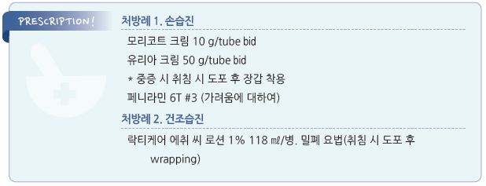

# 습진 Eczema

## 일반 사항

* 홍반, 가려움, 분비물, 딱지 등의 특징을 갖는 비전염성 염증성 피부 질환
*   홍반성 피부 상태의 일반 명사로도 사용되며 다음을 포함 : 아토피성 피부염(☞ p.862), 접촉피부염 (☞ p.881),

    건성 피부염, 지루성 습진(☞ p.886)
*   증상

    •원발 병소 : 홍반성 반점, 구진, 소수포, 반/판으로 융합, 진물, 갈라짐

    •2차성 병소 : 심한 습진에서 감염 또는 긁음에 의해 발생(삼출성 딱지)

    •만성 습진 : 반복적인 긁음에 의해 발생(태선화)
*   항생제 치료 : 감염의 증거가 있지 않는 한 항생제 투여 안 함

    •감염의 증거가 있으면 경구 또는 국소 항생제 치료 (☞ p.904)

##

## ￭ 손습진 Hand eczema

## 일반 사항

* 자극 물질(예: 물, 세제, 화학 물질) 또는 알레르겐에 대한 만성적인 과도한 노출에 의해 발생 및 악화 (☞ p.881)

### 위험 인자

* 다른 피부 질환 : 아토피
* 직업 : 주부, 요식업, 미용

## 임상 양상

* 가려움, 통증
* 급성 : 손의 홍반, 부종, 진물, 수포
* 만성 : 각질, 갈라짐, 태선화

## 치료

### 치료 방침

* 자극 및 알레르겐 회피
* 피부 보호 : 면장갑 착용, 외용제 사용
* 항균/항염 치료 : 백선 등 감염 치료 (☞ p.899, p.923)

### 1차 선택제 : 외용제

* 피부 보습제 : 1일 수회 도포; glycerol, petrolatum \[바셀린], urea \[유리아] (☞ p.867)
*   중/고역가 국소 steroid : qd~~bid ×2~~4주; mometasone \[모리코트] (☞ p.1139)

    •필요시 저역가 steroid 밀폐 요법 : 도포 후 plastic wrap으로 감싸거나 거즈로 덮거나 petroleum jelly를 덧바름;

    자극 증상, 모낭염, 감염 등의 부작용이 발생할 수 있음; hydrocortisone \[락티코트] (☞ p.868)
* Calcineurin inhibitor : 국소 steroid 대체제; pimecrolimus \[엘리델], tacrolimus \[프로토픽] (☞ p.1143)
* 2\~4주 후 평가 : 호전이 있으면 4주 후 재평가, 호전이 없으면 환자 순응도 확인 및 치료 방법 변경 고려

### 난치성 병변 : 전신 치료

* 대상 : 적절한 국소 치료에 반응하지 않는 만성 병변
* 효과에 대한 충분한 근거를 가진 전신 치료제는 없음
* 경구 steroid : 단기 사용; prednisolone 0.5~~1 ㎎/㎏/d ×3~~7d \[소론도]
* alitretinoin(경구 retinoid) : 30 ㎎ qd → 감량 10 ㎎ qd \[알리톡]
* phototherapy(UVB, PUVA, UVA1)
* 면역억제제 : methotrexate \[메토트렉세이트], azathioprine, cyclosporine (☞ p.820)
* 기타 : bexarotene gel, Grenz ray, 보톡스 주사, 이온삼투요법

##

## ￭ 손톱습진 Nail eczema

## 원인

* 손습진과 동일 : 주로 손에 대한 자극, 특히 미용적 손톱 손질

## 임상 양상

* nail fold 염증성 변화(가장 흔함)
* transverse ridge, 색조 변화, 조갑 박리증
* 많이 사용하는 손에 심함

## 치료

* 손습진과 동일
* 손톱 손질, 손톱에 대한 충격 및 자극을 피함
* 점도가 높은 보습제 사용 \[바셀린]
* 중증도에 따라 국소 steroid 역가 선택 : clobetasol \[더모베이트] (☞ p.1139)
* 조갑 주위염 등 감염 예방 및 치료

##

## ￭ 건조습진 Asteatotic eczema, Xerotic eczema

## 일반 사항

* 건조한 피부에서 발생하는 경미한 염증성 피부염
* 주로 겨울철(동계 소양증 winter itch), 고령자의 하지 신측에 흔함
* 증상 : 가려움, 건조, 갈라짐, 각질

## 치료

* 피부 자극 및 환부에 대한 비누 사용을 피함
* 낮은 온도의 물로 짧게 샤워
* 목욕 후 충분한 피부 보습제 도포 (☞ p.867)
* 적정 습도 유지(40\~50%)
*   국소 steroid

    •필요시 저역가 steroid 밀폐 요법 : 도포 후 plastic wrap으로 감싸거나 거즈로 덮거나 petroleum jelly를 덧바름;

    자극 증상, 모낭염, 감염 부작용 발생 가능; hydrocortisone \[락티케어 HC]
* 필요시 가려움증 치료 (☞ p.857)

> **질병코드** L30.8 기타 명시된 피부염

L60.8 기타 손발톱장애

L85.3 피부건조증

