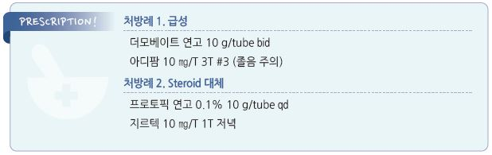

# 땀흘림이상, 한포진 Dyshidrosis

## 일반 사항
- 땀과 관련된 손발의 질환으로 몇 가지의 상태를 포함함

- 젊은 연령에서 호발; 평균 발생 연령- ＜40세

- 유병률 : 손 습진의 5~20%

#### 땀흘림이상습진 (Dyshidrotic eczema)
- 정의 : 손가락 측면 및 손발바닥에 발생하는 극심한 가려움을 수반하는 급/만성, 재발성, 대칭성, 비-홍반성 수포성 피부염;

    일반적으로 한포진은 이 상태를 말함

- 경과 : 초기 비염증성 소수포 → 긁음에 의한 2차 감염 → 두꺼워지고 갈라지는 판 형성

  •2차 감염이 없으면 보통 수 주(2~3주) 내 흉터 없이 자연 치유

#### Pompholyx
- 손발의 급성 대수포성 피부염

#### Lamellar dyshidrosis
- 손발 상피의 표재성 박리성 피부염

## 원인
- 불명

>     ✽항상 땀샘이 관련되지는 않음

### 위험 인자
- 다한증 : 환자의 40%에서 관련됨

- 금속 과민(예: 니켈, 코발트,크롬), 자극성 화합물(예: 세정제, 기름 용매) 사용, 시멘트 작업

- 빈번한 물 노출, 밀폐 장갑 지속 착용 : florist, hair stylist, health care worker

- 날씨 : 덥거나 추운 기온, 높은 습도, 햇빛/UVA 조사

- 알레르기, 아토피, 접촉피부염

- 진균 감염 : 환자의 10%에서 관련

- 흡연, 스트레스

- 약물 : neomycin, quinolone, acetaminophen, 경구 피임제

## 임상 양상
- 심한 가려움, 작열감, 통증; 보통 수포에 앞서 가려움 발생(전구 증상)

- 1~2 ㎜, 맑은, 비홍반성, 다발성 구진 및 수포 : 2~3주 지속 후 표피 탈락

- 주로 손가락 측면 및 thenar/hypothenar에 발생; 손/발등에도 발생 가능

## 진단
- 검사 : 2차 감염 또는 다른 질환 감별을 위하여 고려

---

## Management

### 급성
- 냉찜질 또는 찬물 soaking

  •진물이 있는 병변 : 1:10,000 KMnO4 qd~bid(10~15분/회) ×5일 이내

- 보습제 : glycerine, petrolatum [바셀린] (☞ p.867)

- 국소 steroid : 고역가 제제, bid ×2~4주; fluocinonide [나이드], clobetasol [더모베이트] (☞ p.1139)

- 국소 calcineurin 억제제 : 국소 steroid 대체제; pimecrolimus [엘리델], tacrolimus [프로토픽] (☞ p.1143)

- 항히스타민제 : 가려움에 대하여 진정 작용이 있는 1세대 선택; diphenhydramine [디펙타민](비보험),

    hydroxyzine [아디팜], chlorpheniramine [페니라민] (☞ p.1144)

#### 중증
- wet dressing (☞ p.868)

- 국소 steroid : 고역가 제제로 밀폐 요법 고려

- 경구 steroid : 다른 치료에 호전되지 않는 심한 병변

  •prednisolone : 40~60 ㎎/d ×3~7d, 중단 시 tapering [소론도]

- 광선 치료 : psoralen + PUVA

### 만성
- 고역가 steroid(장기 사용 시 주의), 보습제, 각질 용해제 병용

- 2차 감염 치료 : 항생제(S. aureus ) (☞ p.901), 항진균제 (☞ p.925)

- 면역억제제 : methotrexate, azathioprine, cyclosporine (☞ p.820)

- botulinum toxin type A 주사

- alitretinoin : 30 ㎎ qd → 감량 10 ㎎ qd [알리톡]

#### 재발성
- 전구 증상(가려움) 발생 시 전신 steroid 단기 투여 고려

  •prednisolone : 60 ㎎/d ×3~4d [소론도]

## 예방
- 스트레스 조절

- 유발 인자 회피 : 자극 물질, 흡연, 과도한 땀 흘림, 신선한 과일의 직접 접촉 회피 (☞ p.881)

- 마찰 회피, 잦은 세척 회피

- 물 작업 시 반지나 팔찌 등 제거; 물 접촉 후 피부를 건조시키고 보습제 도포

- 원인이 되었던(known irritant) 물질 회피. 예: 가죽 또는 고무 신발/장갑

- 피부 보호 : 면으로 된 장갑 또는 양말 착용, 젖은 작업 시 비닐장갑 착용, 보호 장갑 착용

> **질병코드**
L30.1 발한이상[한포]

