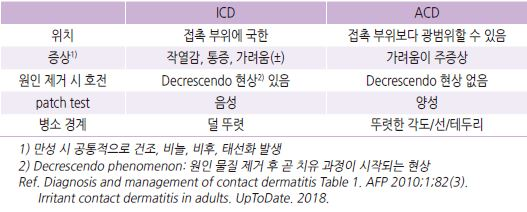
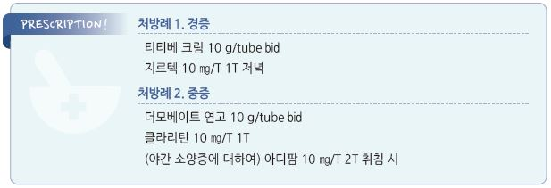

# 접촉피부염 Contact Dermatitis


## 일반 사항

* 외부 자극에 대한 피부의 즉각 또는 지연 염증 반응에 의한 피부염

### 일반적 임상 양상

* 급성 : 홍반, 구진, 수포, crust, oozing
* 만성 : 홍반, 태선화, scale, fissure

### 위험 인자

* 직업 또는 취미로 화학/자극 물질을 다루는 사람(예: 미용사, 정비사, 정원사), 여행

## 분류

### 자극 접촉피부염 (Irritant contact dermatitis, ICD)

* 기전 : 화학적 또는 물리적 피부 자극에 대한 즉각적인 염증 반응에 의한 피부염
* 원인 : 물일, 비누, 세제, 세정제, 향기 제품, 위생 제품, 허브/식물, 염료, 벌레, 장난감, 옷, 피부 마찰
* 호발 부위 : 잦은 노출 부위(예: 손), 얇은 피부 부위(예: 눈꺼풀, 겹침 부위), 밀폐 부위
*   증상 : 원인과 기전은 달라도 임상 양상은 비슷함

    •경증: 홍반, 건조, 갈라짐, 가려움 •중증: 부종, 진물, 통증, 압통, 물집, 궤양
*   경과 : 접촉 후 수 시간 내 발생(접촉한 부위에 증상 발생). 24시간 내 가장 심해지고 이후 완화

    

### 알레르기 접촉피부염 (Allergic contact dermatitis, ACD)

*   기전 : 자극에 대한 지연 과민 반응(type Ⅳ cell-mediated delayed hypersensitivity reaction)에 의한 피부염;

    알레르기 항원 접촉에 의한 감작 후 재접촉 시 발생
*   원인 : 옻, 은행, 염색제, 방향제, 니켈(장신구, 지퍼), 코발트(장신구, 크레용, 땀분비 억제제), 고무, 라텍스,

    formaldehyde(피부 관리 제품, 가정용품), quaternium-15(피부 관리 제품, 종이, 잉크, 토너),

    benzalkonium chloride(소독제/물휴지, 보존제), 약물(항생제, steroid)
* 호발 부위 : 노출 부위(특히 손, 발, 눈꺼풀, 입술)
* 증상 : 심한 가려움, 홍반, 경화, 각질 판, 부종(특히 눈꺼풀, 입술, 생식기), 심한 경우 수포
*   경과 : 재접촉 후 12(~~48)시간 내 발생(접촉한 부위를 넘어서 증상 발생) → 48~~72시간에 가장 악화

    → 원인 제거 후 2\~4주 내 회복; 항원 제거 후에도 증상이 지속될 수 있음. 드물게 수개월 이상 홍반이 지속될 수 있음

진단

* 접촉력, 직업, 취미
* patch test : 원인 제거 후에도 증상이 지속되는 경우 고려; 48시간 및 96시간 후 관찰

### 자극성 접촉피부염 vs 알레르기성 접촉피부염

```

```

***

## Management

### 치료 방침

* 자극 회피, 보호
* 유발 물질에 노출 시 세척; ivy 등에 노출되었다면 30분 내에 씻어냄
* 가려움에 대한 대증 요법 : 냉찜질, 보습제, 전신 항히스타민제
* steroid : 국소 도포, 필요시 전신
* 항생제 : 2차 감염에 대하여 국소 도포, 필요시 전신
* 항진균제 : 칸디다 추정 시

## 비-약물 치료

* 냉찜질, soaking(예: cool tap water, Burow’s solution)
* wet dressing : 사지에 30\~60분간 wet dressing bandage, 1일 수 회
* 항소양제 : calamine/zinc oxide [칼라민](%EB%B9%84%EB%B3%B4%ED%97%98/), colloidal oatmeal baths (☞ p.857)
* 보습제 : petrolatum \[바셀린], urea \[유리아] (☞ p.867)

## 약물 치료

### 국소 치료제

* 국소 항히스타민제는 접촉피부염을 유발할 수 있어 권고하지 않음

#### Steroid

```
(☞ p.1139)
```

* 1일 1~~2회 도포 ×2~~4주(얇은/겹치는 부위는 1\~2주); 손바닥 등 약제가 쉽게 닦여 나가는 부위는 도포 횟수를 늘릴 수 있음
* 얇은/겹치는 부위(예: 얼굴, 목, 겨드랑이, 사타구니) : 저역가; hydrocortisone 2.5% \[하티손]
* 두꺼운 부위(예: 몸통, 손바닥) : 중간 역가; triamcinolone 0.1% \[트리코트], mometasone 0.1% \[모리코트]
*   중증, 태선화 병소 : 고역가 단기 적용(제외: 얼굴, 겹치는 부위); clobetasol 0.05% \[더모베이트], fluocinonide 0.05% \[나이드]

    → 회복 후 중/저역가로 tapering
*   밀폐 요법 : 중증에서 고려; 저역가 제제 도포 후 plastic wrap으로 감싸거나 거즈로 덮거나 petroleum jelly를 덧바름;

    모낭염 등 부작용 발생 가능 (☞ p.868)
* 장기 도포가 필요한 경우(예: 만성 ACD) : 1일 1회 ×격일 또는 pulse therapy(주말 도포) (☞ p.869)

#### Calcineurin 억제제

```
 (☞ p.1143)
```

* 국소 steroid 대체제; 보통 회복될 때까지 1일 2회 적용
* tacrolimus : 0.1% \[프로토픽]
* pimecrolimus : 1% \[엘리델]

#### 항생제

* 대상 : 감염
* mupirocin : 2% bid\~tid \[에스로반]
* bacitracin (비보험 복합제로 시판)
* steroid/항생제 복합제 : betamethasone dipropionate/gentamicin \[실크론지]

### 전신 치료제

#### 항히스타민

```
(☞ p.1144)
```

* 대상 : 가려움
* 보통 졸음 작용이 있는 1세대가 효과

\*\* 1세대\*\*

* doxepin : 3\~6 ㎎ 취침 전 30분 \[사일레노]
* hydroxyzine : 25~~50 ㎎ hs or 50~~100 ㎎/d #3\~4 \[아디팜]
* chlorpheniramine : 4 ㎎ q4\~6hr, 최대 24 ㎎/d \[페니라민]

\*\* 2세대\*\*

* cetirizine : 약간의 졸음 작용이 있음; 10 ㎎ qd \[지르텍]
* loratadine : 10 ㎎ qd \[클라리틴]
* fexofenadine : 180 ㎎ qd \[알레그라]

#### Steroid

* 대상 : ACD에서 중증, 넓은 범위(신체 ＞20%) 이환, 국소제에 반응하지 않는 경우
* 투여 기간 : 보통 2주

> ```
> ✽적정 투여 기간에 대한 명확한 권고안은 없음; 5~7일 정도의 짧은 투여는 반동성 피부염을 예방하기에는 미흡함;
> ```

> ```
> 강력한 항원(예: 옻)에 의한 중증 발진에서 3주 치료 시 반동성 피부염을 예방할 수 있다는 보고가 있음
> ```

* prednisolone : 60 ㎎/d(0.5\~1 ㎎/㎏/d)로 시작 후 tapering \[소론도]

•예 : Pd 60 ㎎/d ×5d → 40 ㎎/d ×5d → 20 ㎎ qd 아침 ×5d → 10 ㎎ qd 아침 ×5d

#### 항생제

```
(☞ p.901)
```

* 대상 : 중증 감염
* dicloxacillin : 250~~500 ㎎ qid ×7~~10d
* amoxicillin/clav. : amox 500 ㎎ bid ×7\~10d \[오구멘틴]
* erythromycin : Pc 알레르기 환자에서 고려; 250 ㎎ qid
* TMP/SMX : 160/800 ㎎ bid ×7\~10d \[셉트린]

#### 면역억제제

```
(☞ p.871)
```

* 대상 : 다른 치료로 조절되지 않는 심한 피부염 (보험주의)
* cyclosporine : 2.5\~5 ㎎/㎏/d \[산디문]
* methotrexate : 10\~25 ㎎/wk \[메토트렉세이트]
* azathioprine : 1\~3 ㎎/㎏/d \[이뮤란]

### 항진균제

```
(☞ p.925)
```

* 대상 : 4일 이상 지속되는 칸디다 감염 추정 병변
* 국소제 : imidazole계 크림, 1일 2회 도포; clotrimazole \[카네스텐], miconazole
* 자각 증상이 심한 경우 첫 1\~2일간 hydrocortisone 추가
*   경구제 : 재발성 칸디다 피부염에 대하여 고려

    •fluconazole : 150 ㎎ qwk ×2\~4wk \[푸루나졸]

## 예방

*   자극성 피부염 : 장갑 착용, 너무 자주 씻지 않음

    •엉덩이/기저귀 부위의 자극 피부염에 대하여 피부 방수제 고려 \[카빌론]
* 알레르기 피부염 : 항원 회피 (☞ p.865)
* barrier cream 도포

> **질병코드** L23　알레르기성 접촉피부염

L25　상세불명의 접촉피부염


