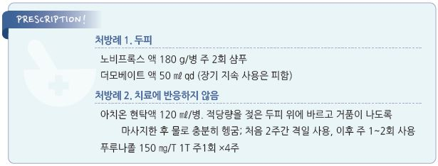

# 지루피부염 Seborrheic Dermatitis

## 일반 사항

* 지성 비늘이 덮여있는 붉은색의 반이나 판의 만성 재발성 염증성 피부 질환
* 만성 질환이면서 간헐적인 증상 악화를 보임(active phase)
* 계절적 변화 : 겨울\~이른 봄에 보다 흔함; 여름에 호전
*   분포

    •피지 많은 부위 : 두피(가장 흔함), 눈썹, 눈꺼풀, 미간, 코/입술 주름부, 귀, 턱밑, 가슴 중앙부

    •겹친 부위 : 겨드랑이, 사타구니, 유방 밑 주름, 엉덩이 틈새

## 원인

* 불명
* 관련 요인 : 피부 효모균(Malassezia ), 진드기(Demodex folliculorum ), 성호르몬

### 위험 인자

* 감정적 스트레스
* 호르몬 변화
* 파킨슨병, CNS 손상, HIV 감염, 장기 이식
* 약물 : buspirone, chlorpromazine, ethionamide, griseofulvin, haloperidol, interferon-α, methyldopa, psoralen, IL-2

## 임상 양상

* 비듬 : fine, white scale
* 심한 경우 yellowish, greasy scale 및 각질 아래 붉은 염증성 판
* 가려움(보통 경증), 작열감; active phase 시 자각 증상 악화
* 넓은 범위, 대칭적 양측 발생

## 진단

* 지루피부염 진단을 위한 특이 검사는 없음
* 조직 검사 : 다른 질환 감별을 위하여 고려

### 감별

* 가려움 및 진물 → 아토피 피부염
* 난치성 지루피부염, 만성 설사, 성장 부진 → 면역 기능 이상 감별
* 전신의 심한 비늘 → 건선
* oozing & crusting 시 2차 감염 의심

***

## Management

### 치료 방침

* 악화 요인 회피 : 두피 지루피부염에서 hair spray 또는 hair pomade 사용을 피함
* 경증 : 항진균제(ketoconazole) 또는 항비듬 샴푸/크림 적용(Zn, selenium)
* 중증(염증 및 가려움) : 항진균제와 국소 steroid 병용
* 재발 예방 : 필요시 항진균 외용제의 간헐적 사용(주 1회)

## 비-약물 치료

### 샴푸

* 항비듬 샴푸 : 주 2\~3회(비보험); selenium, sulfur, salicylic acid, tar, zinc \[아치온]
* coal tar 샴푸 : 가려움 감소, 항균, 표피 과증식 억제 작용; 주 1\~2회, 심한 정도에 따라 매일 또는 필요시 사용
* 방법 : 머리를 적시고 적량 적용 후 거품이 생기도록 마사지 → 5분간 유지 후 완전히 헹굼
* 4\~6주 후 호전되지 않으면 다른 종류의 샴푸로 교체

## 약물 치료

### 국소제

#### 항진균제

* 크림 : bid ×4주 또는 호전될 때까지 (☞ p.925)
*   샴푸 : 주 2~~3회 ×4주 또는 호전될 때까지; 호전 후 1~~2주에 1회 지속 사용 고려 (비보험)

    •ketoconazole 2% \[니조랄], ciclopirox 1% \[노비프록스]

#### Steroid

* 대상 : 샴푸나 다른 방법으로 호전되지 않는 가려움 및 염증, 급성 악화 (☞ p.1139)
* 두피 : 고역가 사용; clobetasol propionate 0.05% \[더모베이트 액]
* 얼굴, 겹친 부위 : 저역가 사용; hydrocortisone \[락티케어 HC]
* 두피 1일 1회, 기타 부위 1일 1\~2회 적용 (✽두피에는 약제가 오랫동안 잔류하므로 1일 1회 적용)
* 주의 : 의존 및 재발 유발, 고역가 제제 지속 사용 시 피부 위축 등 부작용 발생

#### Calcineurin 억제제

* 국소 steroid 대체제, 1일 2회 적용 (☞ p.1143)
* pimecrolimus 1% \[엘리델], tacrolimus 0.1% \[프로토픽]

#### Hyaluronic acid sodium

* 일부에서 효과
* 용법 : 0.2% bid [코네티비나](%EB%B9%84%EB%B3%B4%ED%97%98/)

### 전신 항진균제

* 대상 : 치료에 반응하지 않는 진균 감염이 의심되는 중증 (☞ p.930)
* itraconazole : 200 ㎎/d ×1\~2개월 \[스포라녹스]
* fluconazole : 150 ㎎ qwk ×2\~4주 \[푸루나졸]

> **질병코드** L21　지루피부염

