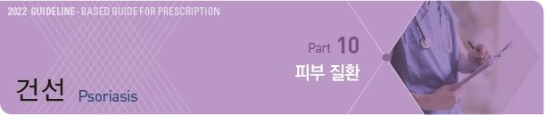
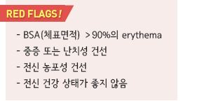
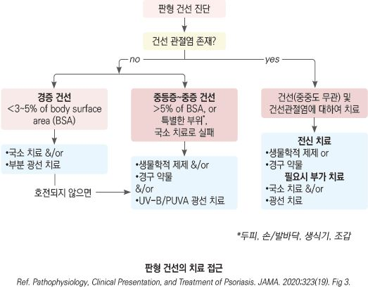
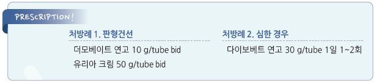

# 건선 Psoriasis



## 일반 사항

* 표피 각질 세포의 과증식에 의한 특징적인 은색 비늘을 가진 홍반성 반이 발생하는 만성 염증성 피부 질환
* 분포 : 전신, 자극받기 쉬운 부분에 흔함; 팔꿈치, 무릎, 두피, 요천추부, 엉덩이 틈새, 손발바닥, 손발톱, 음경 귀두
* 호발 연령 : 30대, 50\~60대
*   경과 : 보통 평생 지속(증상의 변동은 있을 수 있음)

    •치료에 반응이 있으면 1\~2달 내 호전

    •오랜 기간 동안 진행되거나 국소 부위에서 갑작스럽게 악화

## 원인

* 불명; 감염 또는 전염성 질환은 아님
* 유전; 환자의 40%에서 가족력이 있음
* 환경, 면역 관련

### 위험 인자

* 국소 외상/자극
* 감염 : Streptococcus , HIV
* 비만, 정신적 스트레스, 흡연, 알코올
* 약물 : lithium, β-차단제, 항말라리아제, interferon, steroid 금단

### 동반 질환

* 비만, 당뇨병, 대사증후군, 만성 신질환, 심혈관 질환, 비-알코올 지방간질환
* 자가면역 질환 : 크론병, 원형탈모증
* 암 : 림프종

## 임상 양상

* 두꺼운 은색의 비늘로 덮인, 경계가 명확한 홍반성 구진 및 판
* 손발톱 미세 함몰(stippling, pitting)
* 통증(특히 홍색피부건선, 건선관절염 관절통), 가려움(특히 물방울건선), 손발톱 변형(조갑건선)
* 발열 없음(예외: 홍색피부건선, 농포성 건선)
* Koebner’s phenomenon : 피부 손상 부위에 새로운 건선 병소 발생
* Auspitz’s sign : 건선 판을 긁어내면 기저부에서 점상 출혈 발생
* Sebopsoriasis : 지루피부염에 건선이 병발하여 기름진 인설 형성; 두피, 눈썹, nasolabial fold, 귀뒤, 흉골 부위 이환

## 종류

### 판형건선 (Plaque psoriasis, Psoriasis vulgaris)

* 빈도 : 전체 건선 중 80\~90% 차지
* 모양 : 은백색 인설로 덮인 경계가 명확한 다양한 크기(보통 1\~10 ㎝)의 홍반; 천천히 커지거나 오랜 기간 동안 변화 없이 유지
* 증상 : 가려움, 통증, 갈라짐, 출혈
* 부위 : 두피, 사지 신측부(팔꿈치, 무릎), lower back, 얼굴, 손발바닥, 엉덩이 틈새

### 역위건선 (Inverse psoriasis, Intertriginous psoriasis)

* 모양 : 경계가 명확한 표면이 매끈한 홍반성 비늘성 판(비늘은 없을 수 있음), 짓무름
* 부위 : 마찰부, 굴곡부; 겨드랑이, 사타구니, 유방 아래, 배꼽
* 유발 인자 : 마찰, 땀

### 홍색피부건선 (Erythrodermic psoriasis)

* 빈도 : 1\~2% 해당
* 모양 : 넓은 범위의 진한 홍반(fiery redness)
*   증상 : 심한 가려움, 통증, 피부 벗겨짐, 탈모, 조갑 이상, 체온 오르내림(체온 유지 장애), 오한, 심부전, 탈수, 전해질 이상;

    생명 위협
*   유발 인자 : 심한 일광 화상, 알레르기, 전신적 건선 치료 중 갑작스런 중단, 전신 steroid 사용, 감염, 감정적 스트레스,

    알코올 남용, 약물(예: lithium, 항말라리아제, coal tar)

### 고름물집건선, 농포성 건선 (Pustular psoriasis)

* 모양 : 흰색의 농포(비감염성 고름) 및 주위 발적
* 부위 : 국소(손, 발) 또는 전신
*   전신성 건선의 경과 : 전신적 무균성 농포 → 융합 → 마르면서 얇게 떨어져 나감 → 심한 홍반, 고열 동반(39\~40℃,

    수일간 지속); 이 과정이 반복됨. 치료하지 않으면 위험
*   유발 인자 : 국소 자극, 임신, 약물, 감염, 감정적 스트레스, steroid 금단(예: 기존의 건선에 대하여 경구 또는

    고역가 국소 steroid 사용 후 중단), 과도한 자외선 조사

### 물방울건선 (Guttate psoriasis, Eruptive psoriasis)

* 빈도 : ＜2% 해당; ＜30세(특히 소아청소년)
* 증상 : 많은 수의 작고(1\~10 ㎜) 둥근 물방울 모양의 홍반성 비늘성 구진
* 부위 : 몸통, 상지, 허벅지, 두피
* 다른 건선(특히 판형 건선)에 동반될 수 있음
* 유발 인자 : GABH Streptococcus 감염(예: 인두염 2\~3주 후), 스트레스, 피부 손상, 약물(예: 항말라리아제, β-차단제)

### 조갑건선 (Nail psoriasis)

*   증상 : 조갑 표면 점상 소와(pit), 갈색 반점, 색깔 변화(yellow-brown), 조갑 박리, 비후, 통증/압통, 조갑하 과다각화증,

    손톱 밑 가루 찌꺼기
* 건선 환자의 50% 이상에서 조갑 변화 발생

### 건선관절염 (Psoriatic arthritis)

* 빈도 : 건선이 있는 사람들의 \~⅓이 건선관절염을 지님
* 부위 : 주로 손, 발, 무릎 관절
*   증상 : 관절통(단일, 비대칭적), 관절 강직, 소시지 모양의 손발가락 부종, (변색을 동반한) 따듯한 관절;

    관절 증상은 아침 또는 휴식 후 심함; 흔히 손톱 문제(예: 조갑백선)를 지님

## 진단

* 보통 검사 필요 없음(건선 확진을 위한 혈액 검사는 없으며 다른 질환 감별을 위하여 시행)
* 혈액 검사 : RF(-), ESR 정상, CRP↑, 요산↑
* KOH, X선 검사, 조직 검사
* 40세 이상에서는 피부 질환의 중증도와 상관관계가 있는 대사증후군을 모니터링

***

## Management

### 치료 방침

* 치료 방법과 예상 경과(완치가 쉽지 않음)에 대하여 설명
* 생활 습관 조정의 중요성에 대하여 강조 및 교육
*   약물 치료

    •경증(BSA(체표면적) ＜5% 이환 시 국소 치료(steroid, calcineurin inhibitor, Vit D analogue)

    •중등증\~중증(BSA ＞5% 이환) 및 특별한 부위 이환, 난치성 건선 시 의뢰/전신 치료

## 비-약물 치료

* 회피 : 외상, 자극, 일광 화상, 흡연, 음주, 건조, 스트레스, 손에 대한 세제 자극
* 적절한 피부 보습, oatmeal bath (☞ p.866)
* 비만 시 체중 감량
* 조갑을 길지 않게 유지; 매니큐어 등 미용 목적의 조갑 손질을 하지 않음
* 적절한 햇볕 노출 (지나친 노출은 피부암 등의 위험이 있음)

## 약물 치료

### 국소 치료제

#### 국소 Steroid

```
(☞ p.1139)
```

* 작용 : 항염, 각질 세포 증식 억제, 면역 억제, 혈관 수축
*   고역가제 사용 후 증상 경과에 따라 pulse therapy(예: 주말 도포) 또는 저역가제로 전환

    •clobetasol : qd~~bid ×2~~4주, 최대 50 g/wk \[더모베이트]
* 소아, 얼굴, 겹친 부위는 처음부터 저역가제 선택
* 조갑건선 : 2\~3개월간 nail fold에 도포, 야간 도포; 국소제로 치료 잘 안 됨

#### Calcineurin 억제제

```
(☞ p.1143)
```

* 국소 steroid 대체제로 선택. 얼굴, 겹친 부위에 적용; 판형건선에서는 효과 적음
* 부작용 : 작열감, 가려움, 홍반
* pimecrolimus 1% \[엘리델], tacrolimus 0.03%/0.1% \[프로토픽]; 보통 1일 2회 도포

#### Vit D 유도체

* 작용 : 각질 세포 증식 억제, 항염
* steroid보다 효과 발현이 늦지만(보통 4주 내 효과 발현) disease-free 기간은 길게 유지됨
* 단독 또는 국소 steroid에 병합, 또는 국소 steroid 중단 기간 중 적용
*   부작용 : 작열감, 가려움, 부종, 건조, 피부 벗겨짐, 홍반; 보통 사용하면서 호전되나 얼굴과 사타구니에는 도포하기 어려움

    •광범위 도포 시 고칼슘혈증을 유발할 수 있으므로 최대 사용량을 제한함
*   calcipotriene(=calcipotriol) : 고역가 steroid와 비슷한 수준의 효과

    •0.005% qd\~bid, 1주 최대 50 g(청소년)\~100 g(성인) \[다이보넥스]

    •국소 steroid와의 병용 시 효과 상승; 두 제제를 별도로 적용하는 경우 다른 시간(예: 각각 아침과 저녁)에 도포(halobetasol은

    예외); \[다이보베트]\(calcipotriol+betamethasone 복합제, qd) (보험주의)
* calcitriol : 정상 피부에 대한 자극이 보다 적음; 0.0003% bid, 최대 200 g/wk [실키스](%EB%B9%84%EB%B3%B4%ED%97%98/)
* tacalcitol : 0.0002% bid, 최대 70 g/wk \[본알파 하이]
* pH를 변화시키는 제제(예: lactic acid)와 병용하지 않음

#### Retinoid (Vit A 유도체)

* 작용 : 각질 세포 증식 억제
* 효과 : 고역가 steroid와 비슷한 수준의 효과; 국소 steroid와의 병용으로 효과 상승
* 부작용 : 자극감, 광과민
* tazarotene : cream or gel 0.05\~0.1% qd (✽다른 retinoid제제들은 건선 치료 효과가 입증 안 됨)

#### 각질 용해제

* 작용 : 각질 완화, 다른 국소 치료제의 침투력을 향상시킴(특히 두피에서 중요)
* salicylic acid [클리어틴](%EB%B9%84%EB%B3%B4%ED%97%98/), ammonium lactate \[타로 암모늄락테이트]\(1일 2회), urea \[유리아]\(1일 수회/d), lactic acid

#### 타르

* 작용 : 가려움 감소, 항균, 표피 과증식 억제. 광선 치료 효과 향상
* 적용 : 주 1\~2회, 심한 정도에 따라 매일 또는 필요시 사용

#### 광선 치료

* 작용 : 면역 억제, 증식 억제
* 적용 : 국소 치료로 호전되지 않는 판형 또는 물방울건선에 대하여 주 2\~3회

### 전신 치료제

* 전신 치료제가 필요한 중증 건선 환자는 류마티스 전문의에게 의뢰 고려
* 전신 steroid는 중단 시 심한 반동 현상이 나타날 수 있으므로 금기

#### 치료 대상 \[NICE]

1. 국소 치료로 조절되지 않음 AND
2. 환자에게 신체적, 정신적, 사회적 장애 초래 AND
3. 다음 중 하나 이상 해당

① 전체 체표면의 ≥10% 이환된 중증 또는 PASI score ≥10점 (http://pasi.corti.li/)

② 중요한 기능 장애 ± 심한 괴로움

③ 광선 치료가 효과적이지 못함

#### 비생물학적 제제

```
(☞ p.820)
```

* 작용 : DNA 합성 차단, 림프 조직 증식 억제
* 대상 : 중증, 다른 치료로 호전되지 않는 경우에 단기 사용
* 종류 : methotrexate, apremilast, acitretin, cyclosporine
*   methotrexate : 면역억제제, DNA 합성 차단

    •5 ㎎으로 테스트 → 7.5\~15 ㎎/wk → 매주 2.5 ㎎ 씩 증량 → 25 ㎎/wk \[메토트렉세이트]

    •부작용 예방을 위하여 folic acid 1 ㎎/d 병용

    •흉부 X선, LFT, RFT, CBC, 잠복 결핵 검사 및 모니터링

    •알코올, 엽산 대사 장애(TMP/SMX, NSAID, sulfamethoxazole), 간독성(retinoids) 약물 회피
*   cyclosporine : T-cell 활성 억제; steroid, acitretin, MTX 등의 대체제

    •2.5 ㎎/㎏/d → 4주 후 반응 부족 시 2주마다 0.5 ㎎/㎏/d 증량; 최대 5 ㎎/㎏/d \[산디문]

#### 생물학적 제제

```
(☞ p.822)
```

* 대상 : 다른 치료에 반응하지 않는 경우에 단기 사용
* 생물학적 제제를 사용해야하는 단계는 의뢰 고려
*   종류

    •Anti–TNF-α : etanercept, adalimumab, certolizumab pegol, infliximab

    •Anti–IL-17 : secukinumab, ixekizumab, brodalumab

    •Anti–IL-12/23 : ustekinumab

    •Anti–IL-23 : guselkumab, tildrakizumab, risankizumab

## 부위별 치료 방법 \[PCDS]

\*\* 몸통, 사지\*\*

* 병변 특징 : 대칭적(주로 신측부)으로 분포하는 다양한 크기의 경계가 명확한 scaly plaque
*   치료

    ① calcipotriol/betamethasone 복합제를 병변이 편평해질 때까지 1일 1회 도포

    ② 8\~12주 치료에 반응이 충분하지 않으면 순응도 검토, 매우 두꺼운 비늘에는 각질 용해제(salicylic acid), or

    기름진 연화제로 폐쇄 요법 고려, 타르 고려

    ③ 호전 후 적극적인 국소 치료는 줄이고(예: 주 2회) 연화제 지속 사용

\*\* 두피\*\*

* 병변 특징 : patchy, 비듬, hairline을 넘어 확장(목덜미에서 관찰됨)
*   치료

    •필요시 각질 용해제 또는 코코낫 기름으로 비늘 제거(비늘이 얇아질 때까지 지속)

    •고역가 국소 steroid로 염증 치료

    •주 1\~2회 타르 샴푸, 고역가 국소 steroid 등으로 유지 치료

\*\* 굴측부, 생식기\*\*

* 병변 특징 : 홍반성 patch, 붉게 빛나는 scale; 종종 칸디다로 오인됨
*   치료

    •국소 steroid제 : 저역가/중간 역가로 qd 도포, 두꺼운 plaque에는 중간 역가로 1주간 도포 후 중등/저역가로 weaning;

    호전 후 2회/wk 도포 유지

    •국소 Vit D : 국소 steroid와 아침과 저녁에 각각 도포; 호전 후 국소 Vit D qd & steroid 2회/wk 도포

    •굴측부에는 국소 calcineurin inhibitor를 steroid나 Vit D를 대신하여 사용할 수 있음(포경 남성에서는 주의)

\*\* 얼굴\*\*

* 병변 특징 : 흔히 발생하는 부위는 아님, 종종 지루성 피부염과 유사
*   치료

    •중간 역가 steroid를 1주일간 도포 후 calcineurin inhibitor 0.1% qd/bid 도포 및 반응에 따라 감량, 또는 Vit D 주 2회 도포 후

    자극 증상을 관찰하면서 qd 도포

    •지루성 피부에 대하여 저역가 steroid qd\~bid 도포

\*\* 손발바닥\*\*

* 병변 특징 : creamy sterile pustule → brown macule로 변화; 난치성, 흡연자에서 보다 흔함
* 치료 : 고역가 steroid 야간 폐쇄 요법, 보습제, PUVA, 전신 치료제(예: acitretin)
* 금연

\*\* 조갑\*\*

* 병변 특징 : pitting, hyperkeratosis, onycholysis
* 치료 : 고역가 steroid 또는 steroid/Vit D 복합제 도포
* 관절염, 조갑백선 확인 (✽조갑백선에 대한 terbinafine 투여는 건선을 악화시킬 수 있음)
* 손톱을 짧게 유지

\*\* 관절\*\*

* 병변 특징 : inflammatory polyarthritis, spondyloarthritis, synovitis, dactylitis, tendinitis
*   치료 : Rheumatology 의뢰

    

> **질병코드** L40　건선


