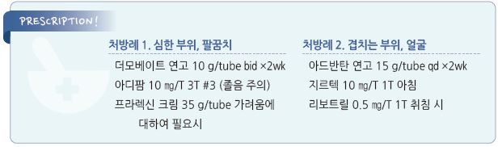

# 만성 단순태선 Lichen Simplex Chronicus

## 일반 사항
- 반복적인 긁음 또는 문지름 등 물리적 자극에 의해 피부가 가죽처럼 변한 판

- 가려움 → 긁음 → 염증 및 가려움 유발 → 긁음 악순환

- 흔한 부위 : 목덜미, 전완 외측, 손목 안쪽, 아래 다리/발목 외측, 발등, 엉덩이, 항문, 음문, 음낭

- 2차 감염, 궤양 등이 없는 순수한 태선의 경우 보통 흉터 없이 치유 됨

- 치료 후 재발 또는 치료 중 다른 부위에 발생할 수 있음

## 원인 및 위험 인자
- 건조, 땀

- 벌레 물림

- 정신적 스트레스, 불안

- 여성, 중장년층

- 가려운 습진성 피부염(예: 아토피)

## 임상 양상
- 국소적으로 시작, 서서히 진행

- 가려움 : 발작적, 특히 밤에 심함

- 비교적 명확한 경계의 피부 병소

- 피부색 변화 : 과다 또는 과소 색소 침착

- 피부 비늘

## 진단
- 보통 검사 없이 진단

- 진균 또는 세균 감염 의심 시 KOH 검사 등 고려

### 감별
- psoriasis : 팔꿈치, 무릎, 두피, 손톱의 하얀 비늘이 있는 붉은 병소 (☞ p.889)

- lichen planus : 보라색의 작은 polygonal papule

- nummular eczema : 동전 모양

---

## Management

### 치료 방침
- 긁는 것을 중단하지 않으면 치료될 수 없음을 교육

- 가려움 완화 및 긁지 않도록 치료 (☞ p.857)

- 건조 방지, 피부 보호

- 1차 치료 약물 : 국소 steroid, 경구 항히스타민제(1세대)

## 비-약물 치료 및 예방
- 냉/온찜질 - 목욕 및 보습제 도포 (☞ p.866)

- 손톱을 길지 않게 관리 - 인지행동 요법, 스트레스 관리

- 실크 소재 내의 착용(마찰을 줄임)

## 약물 치료

### 항염 : 국소 Steroid

#### 도포제
    (☞ p.1139)

- 작용 : 항염, 가려움 완화

- 1차 선택제

- 작은 부위에 대하여 고역가 제제를 bid ×~2주 적용 → 반응에 따라 낮은 역가로 교체

  •clobetasol propionate 0.05% [더모베이트]

  •fluocinonide 0.05% [나이드]

- 얼굴, 항문/외음부, 겹치는 부위 : 중간 역가 제제를 단기 적용 → 낮은 역가로 교체

  •methylprednisolone aceponate 0.1% [아드반탄]

  •mometasone furoate 0.1% [모리코트]

#### 테이프
- 장점 : 흡수력 증가, 손 접촉 차단 효과

- flurandrenolide tape [Cordran tape]

#### 병소 내 주사
- 대상 : 다른 치료로 호전되지 않는 심한 증상

- triamcinolone acetate 5~10 ㎎/㎖ [트리암시놀론 주]

#### 밀폐 요법
    (☞ p.868)

- 대상 : 심한 가려움

- 방법 : steroid 도포 후 plastic wrap으로 감싸거나 거즈로 덮음

- 부작용 : 자극 증상, 모낭염

#### Calcineurin 억제제
    (☞ p.1143)

- 대상 : 국소 steroid를 지속 사용해야 하는 경우의 대체제

- pimecrolimus bid [엘리델], tacrolimus bid [프로토픽]

### 가려움 대증 치료

#### 경구 항히스타민제
    (☞ p.1144)

- 졸음 효과가 있는 1세대 약제가 보다 유효

- diphenhydramine : 25~50 ㎎ q4~6hr [디펙타민](비보험)

- hydroxyzine : 25~50 ㎎ hs or 50~100 ㎎/d #3~4 [아디팜]

#### TCA
- doxepin : 10~25 ㎎ hs [사일레노]

- amitriptyline : 10~25 ㎎ hs [에트라빌]

#### 향정신성 약물
- clonazepam : 0.5~1 ㎎ hs [리보트릴]

#### Gabapentinoid
    (☞ p.13)

- 대상 : steroid에 반응하지 않는 경우의 증상 완화 목적

- 저용량으로 시작하여 점차 증량

- gabapentin : 300~900 ㎎/d [뉴론틴]

- pregabalin : 150~300 ㎎/d [리리카]

- 부작용 : 용량 의존 어지럼/졸음(대처- 저용량 시작 및 주의 깊은 증량)

#### 국소 도포제
- 2차 선택제

- doxepin 5%

- capsaicin 0.075% : qid; 작열감, 홍반 부작용(초기에 심함) [다이악센] (☞ p.14)

- pramoxine 1% : 국소 마취제; ~5회/d 도포 [프라렉신]

#### Hydrocolloid 밀폐 요법
- 피부 보호, 습윤/가려움 완화

- 부착 후 7일간 유지 ×1~2개월 [듀오덤]

#### Botulinum toxin 피내 주사
- 다른 방법으로 치료 실패 시 고려

> **질병코드**
L28.0　만성 단순태선

