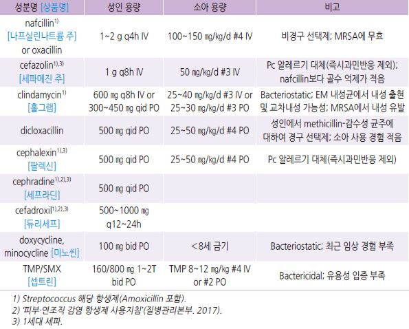
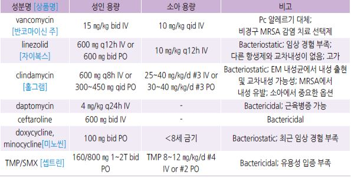
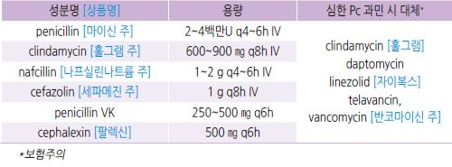
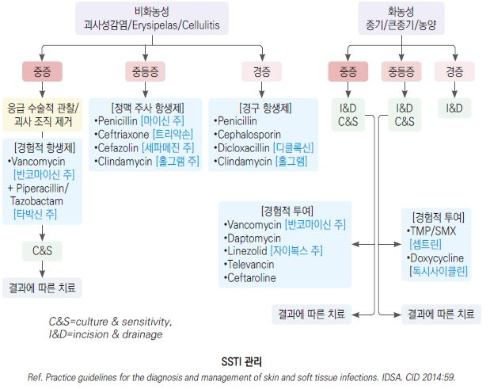

# 피부 및 연조직 감염 Skin and Soft-Tissue Infection

## 일반 사항
- 농가진 (Impetigo) : 세균성 다발성 표재성 화농성 병변 (☞ p.903)

- 모낭염 (Folliculitis) : 모낭의 표재성 화농성 염증. 표피에 국한된 고름 형성 (☞ p.907)

- 종기 (Furuncle) : 모낭의 심재성 화농성 염증. 피하 조직까지 침범하는 작은 농양 형성 (☞ p.915)

- 큰 종기 (Carbuncle) : 종기의 감염이 주변 모낭으로 퍼지고 합쳐져 염증 덩어리가 형성된 것. 여러 모낭구로부터 고름이 배출됨

- 얕은연조직염 (Erysipelas) : upper dermis, 표재성 림프관을 침범한 염증 상태 (☞ p.910)

- 연조직염 (Cellulitis) : deeper dermis, 피하 지방층을 침범한 염증 상태 (☞ p.912)

#### 화농성 SSTI(skin and soft tissue infection)
- Mild infection : 절개 배농의 대상이 되는 상태

- Moderate infection : 전신 증상이 동반된 상태

- Severe infection : 절개 배농 및 경구 항생제로 치료가 되지 않는, 전신 증상이 동반된 상태; ＞38℃, 빈맥(＞90/분),

    빈호흡(＞24/분), 비정상적인 WBC(＞12,000 또는 ＜4,000 cells/㎕)

#### 비-화농성 SSTI
- 경증 감염 : 전형적 cellulitis 또는 erysipelas, 특별한 농양 부위가 없음

- 중등증 감염 : 전형적 cellulitis 또는 erysipelas, 전신 증상 동반

- 중증 감염 : 경구 항생제로 치료가 되지 않는, 전신 증상(화농성과 동일)이 동반된 상태; 물집, 피부 탈피, 저혈압, 기관 장애 등의

    심부 감염 소견

## 원인

### 원인균
- 주로 Staphylococcus , Streptococcus

- gangrenous : Streptococcus , clostridia

- necrotizing : aerobic 및 anaerobic microflora

### 위험 인자
- 피부 장벽 파괴

  •외상 : 긁음, 면도, 벌레 물림, 운동

  •피부 스침 : 꼭 끼는 옷, 손발가락 사이

  •가려움 유발 질환 : 옴, 습진, 아토피

  •다른 감염 : 진균 감염

- 부종, 정맥/림프 부전

- 면역 저하, 당뇨병, 심부전, 신증후군

- 영양 결핍, 심한 Vit C 결핍

- 음주, 비만

- 불결 : 코 후비는 습관, 밀집 생활, 위생적이지 않은 수영장/온천/사우나/찜질방

- 가족력

#### MRSA 위험 인자
- 최근 입원/수술, 혈액 투석, HIV 감염, 항생제 사용

- 장기 요양 시설 거주, 군대, 위생용품(예: 면도기, 수건) 공동 사용, 스포츠 장비 공동 사용

---

## Management
치료 방침

- 항생제 : 임상적 판단으로 개시, 배양 및 감수성 검사 결과에 따라 조정

  •24~48시간 후 치료 평가 → 호전되지 않으면 항생제 내성 또는 심각한 감염 상태 고려

- 전신적 단기 steroid : 합병증이 발병하지 않은 연조직염의 일부 환자에서 염증을 줄이는 데 도움이 될 수 있음;

    prednisolone 30 ㎎/d [소론도]

- 국소 감염 : 국소 관리 및 경구 항생제 요법

- bulla, bleb, crepitus, necrosis 등과 관련된 빠른 진행을 보이는 감염 : 입원 치료(비경구 항생제 투여, 수술 요법)

## 예방
- 손을 자주 씻음

- 전신 및 손톱 매일 항균제 세척 : chlorhexidine [헥시딘], benzoyl peroxide, hexachlorophene

- 표백제 목욕 : 전신이 들어가는 150 L의 욕조 물에 6% Na hypochlorite(락스) 100 ㎖ 투여; 10분 정도 몸을 담그고 난 후

    물로 헹굼, 주 2회 시행

- 보습제 도포 (☞ p.867)

- 수건, 의복, 시트 등 뜨거운(60℃) 물세탁 및 자주 교체

- 거친 육체 활동 시 피부 보호 의복/장구 착용

- 면도 주의 : 면도 횟수를 줄임, 면도날 사용 주의(1회용 날 사용, 전기 면도기 사용 권고)

- 긁지 않도록 관리 : 가려움 치료, 손톱을 길지 않게 함

- 목욕이나 샤워 시 강한 피부 마찰을 피함(목욕용 수세미 사용을 피함)

- 표백제로 욕실 청소

- 수건, 의류, 개인위생용품 공동 사용을 피함

- 양쪽 코 안에 항생제 도포 : 매달 연속된 5일간 1일 2회 도포: mupirocin [에스로반], bacitracin

- 3개월마다 콧구멍 전방부 배양 검사; 균주 지속 시 clindamycin 150 ㎎/d ×3개월 [훌그램]

- 필요시 가족의 콧구멍 배양 검사 시행

## 항생제

>     (Ref. IDSA. Practice guidelines for the diagnosis and management of skin and soft tissue infections. 2014)

#### MSSA(methicillin-susceptible S. aureus ) SSTI
    

#### MRSA(methicillin-resistant S. aureus ) SSTI
    

#### Non-purulent SSTI (cellulitis)
    

    
