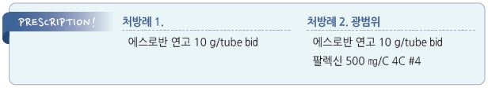

# 모낭염 Folliculitis

## 일반 사항
- 모낭의 감염성 또는 비감염성 농성 염증

- 호발 부위 : 두피, 엉덩이, 사지

- 경과 : 보통 흉터 없이, 발모에 지장 없이 치유됨(7~10일); 재발성, 중증인 경우 색소 침착

  •furunculosis로 진행할 수 있음 (☞ p.915)

- sycosis : 머리나 목에 깊숙이 만성적이고 난치성인 모낭염

## 원인

#### 감염성
- 세균 : S. aureus (대부분), P. aeruginosa (불결한 물), Aeromonas hydrophila (물놀이),

  •면역저하자에서는 그람음성균주가 중요; Klebsiella , Enterobacter , Proteus

- 진균 : Pityrosporum (청소년 & 남자 호발, upper chest & back 호발), Candida

- 바이러스 : VZV, HSV

- 기생충 : Demodex , mites, schistosomes

#### 비감염성
- acneiform folliculitis, acne, perioral dermatitis, rosacea, pruritic folliculitis(임신), toxic erythema(신생아)

### 위험 인자
- 제모 : 면도, 뽑기, 왁싱, 제모 도구 - 피부 가려움 질환(예: scabies, eczema)

- 청결하지 않은 수영장/욕조 - 당뇨병, 중증 Vit C 결핍, 영양 실조, 면역 저하

- 욕조 목욕, 사우나 - MRSA 감염자와의 접촉

- 드레싱 또는 의복에 의한 밀폐 - 항생제, steroid(국소 또는 전신) 사용

- 발한, 마찰(예: 조이는 옷)

## 임상 양상
- 주변에 발적이 있는 작은(1~5 ㎜) 돔 모양의 구진농포, 농포, 수포

- 대부분 가려움 동반, 약간의 작열감, 압통(보통 통증은 없음)

- Pseudomonas folliculitis : 오염된 물(예: 수영장) 노출 1~4일 후 가려움, 압통, 농포성 병변

- steroid acne : 얼굴과 몸통에 동일한 형태의 papule, papulopustule; 국소 또는 전신 steroid 치료 중 발생하며

    국소 benzoyl peroxide에 반응

## 진단
- 일반적으로는 필요 없음

- 난치성인 경우 배양 검사(MRSA 등 감별)

- 진균 감염 의심 시 KOH 검사

- 재발성인 경우 당뇨 검사, HIV 검사

---

## Management

### 치료 방침
- 온찜질(1일 3회)

- 습윤 드레싱

- 각질 용해제 : 2.5~10% benzoyl peroxide 겔 qd(hs)~bid [파티마 겔](비보험) (☞ p.944)

- 약물 치료 : 경증 감염은 보통 약물 치료 없이 회복됨

## 약물 치료

### 세균
- 외용제를 우선 선택

- 전신 항생제는 필수적이지 않으며 효과가 불확실함; 중증에서 고려

#### 외용제
- 보통 1일 2~3회, 10일간 적용

- mupirocin [에스로반], clindamycin [크레오신 티 액](비보험)

#### MSSA(methicillin-susceptible S. aureus )
- cephalexin : 250~500 ㎎ qid ×7~10d [팔렉신]

- dicloxacillin : 250~500 ㎎ qid ×7~10d

#### MRSA
- TMP/SMX : 160/800 ㎎ bid ×5~10d [셉트린]

- clindamycin : 300~450 ㎎ qid ×10~14d [훌그램]

- minocycline : 초회 200 ㎎, 이후 100 ㎎ bid ×5~10d [미노씬]

- doxycycline : 50~100 ㎎ bid ×5~10d [독시사이클린]

#### Pseudomonas folliculitis
- acetic acid 목욕

- ciprofloxacin : 500~750 ㎎ bid ×7~14d [씨프로바이]

#### 여드름 환자에서의 Gram-negative folliculitis
- isotretinoin (☞ p.946)

### 진균
    (☞ p.925)

- ketoconazole 2% 샴푸 : 3~5분간 유지, 2회/주 ×2~4주, 이후 1~2주마다 1회 [니조랄]

- selenium sulfide 2.5% 샴푸 : 2~3분간 유지. 2회/주 ×2주, 이후 1~2주마다 1회

- econazole 크림 : bid ×2~3wk [에코라]

- fluconazole : 100~200 ㎎/d ×3wk [푸루나졸]

- itraconazole : 200 ㎎/d ×1~3wk [스포라녹스]

### 기생충 (Demodex folliculitis)
- permethrin 5% : 이환부 도포, 8~14시간 후 세척 [오메크린 크림](비보험)

- ivermectin : 200 ㎍/㎏ PO 7일 간격으로 2회 또는 permethrin 도포 후 1회 적용

### 헤르페스
    (☞ p.962)

- valaciclovir : 500 ㎎ tid ×5~10d [발트렉스]

- famciclovir : 500 ㎎ tid ×5~10d [팜비어]

- acyclovir : 200 ㎎ 1일 5회 ×5~10d [메노바]

## 예방
- 마찰과 oil 사용을 피함

- 털 방향으로 면도 및 면도 후 소독액(예: 알코올) 적용

- 피부 위생 관리 (☞ p.900)

- 지속되는 Staphylococcal folliculitis

  •코에 mupirocin 도포

  •경구 clindamycin(150~300 ㎎/d ×4~6주), 또는 TMP-SMX(1달에 1주 ×6개월)

  •알코올 + 6.25% aluminum chloride 매일~격일 적용(특히 엉덩이 부위)

  •표백제 목욕 : 20 L당 ¼~½컵, 15분, ×3~5번/주

> **질병코드**
L73　기타 모낭장애

