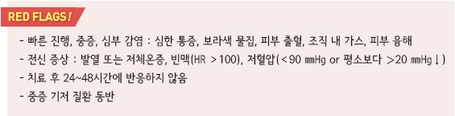
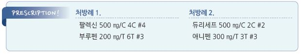

# 연조직염, 봉소염 Soft Tissue Infection, Cellulitis

## 일반 사항
- 진피 및 피하 조직의 급성 세균 감염(= phlegmon)

- 하지에 흔함, 특히 갈라진 발가락 사이(발백선)

- 병변은 보통 수 시간(3~36시간) 동안 확장되며 병변이 커질수록 전신 증세가 악화됨

- 보통 편측 발생

## 원인

### 원인균
- 주로 S. aureus , GABH Streptococcus

- P. aeruginosa : 당뇨병, 면역저하자

- Aeromonas hydrophila (담수 노출력), Vibrio (해수 노출력)

- H. influenzae : buccal cellulitis

- Pasteurella multocida , Capnocytophaga canimorsus : 물림

### 유발/위험 인자
- 피부 조직 손상 : 외상, 벌레 물림, 약물 주사, 피어싱, 감염

- 다른 피부 질환 : 습진, 종기, 궤양

- 정맥/림프관 부전 관련 부종(예: 수술, 시술, 심/신부전)

- 고령, 비만, 야외 작업자, 운동선수

- 당뇨, 고혈압, 면역 저하

## 임상 양상
- 경계가 명확하지 않은 국소 발적, 부기, 따뜻함, 가려움, 통증 → 화농성 변화 → 농양

- 림프선을 따라 근위부로 림프관염, 림프절염

- 전신 증상 : 발열, 오한, malaise

## 진단
- 일반적으로 원인균을 알기 위한 검사는 필요 없음

- 전신 증상 발생 시 혈액/병소 배양 검사(bacterial, fungal, mycobacterial), WBC, Cr, bicarbonate, CPK, CRP 검사

- 골수염 의심 시 영상 검사 고려

- 면역 저하 환자에서 피부 생검 고려

### 감별
- necrotizing fasciitis : 심한 독성의 모습, 물집, 지각 마비, 피부 괴사

- venous stasis, varicosities : 하지 내측 복사뼈 위의 급성 압통성 red plaque

- 접촉피부염 : 홍반, 수포, 부종, 가려움

- stasis dermatitis : 수일~수 주에 걸쳐 진행; 압통 없음

---

## Management

### 치료 방침
- 부종에 대하여 환부 거상, 움직임 줄임, 압박 스타킹, 이뇨제 고려

- 멸균 생리 식염수 드레싱, 냉찜질(Al acetate)

- 필요시 배농 및 국소 치료

- 항생제 치료; 전신 증상이 발생하면 입원 및 비경구 항생제 치료 고려

- 무좀 동반 시 국소 항진균제 치료

- 외상에 의한 경우 파상풍 백신 고려

## 약물 치료

### 항생제
- 경증 시 경구 항생제로 5~10일간 투여 (ACP 권고- 5~6d)

- 24~48시간의 치료에 반응하지 않으면 내성균 또는 심각한 질환 상태 고려

  •보통 첫 24시간 동안에는 bacterial antigen 분비 등과 관련하여 악화됨

- 과거 MRSA 감염 또는 MSSA 치료 48시간 내 반응하지 않는 경우에는 MRSA 고려

- 당뇨병 환자의 경우는 그람 양성/음성, 혐기성을 포함하는 광범위 항생제 선택

- 중증 또는 빠른 악화 시 처음 2~5일간 IV 치료; IV를 적용할 수 없는 경우 경구제 첫 투여 시 2배 용량 고려

- IV 치료를 한 경우에는 이후 경구 항생제를 5~10일간 투여

※ 예방적 항생제 투여에 대해서는 논란. 적절한 관리에도 불구하고 ≥4회 재발 시 고려 

#### Nonpurulent cellulitis
- 대상 균주 : β-hemolytic Streptococcus , MSSA

- 보통 5~10일간 투여, 필요시 연장

  •합병증이 없는 경우에는 5일과 10일 치료 결과가 비슷함

- cephalexin : 500 ㎎ qid [팔렉신]

- dicloxacillin : 500 ㎎ qid

- clindamycin : 300~450 ㎎ qid [훌그램]

- IV : cefazolin(1~2 g q8h), oxacillin(2 g q4h), nafcillin(2 g q4h), clindamycin(600~900 ㎎ q8h)

#### Purulent cellulitis
- target : MRSA

- 경험적 항생제 치료 개시 후 경과 및 배양/감수성 검사 결과에 맞춰 조정

- clindamycin : 300~450 ㎎ qid [훌그램]

- TMP/SMX : 160/800 ㎎ 1~2T bid [셉트린]

- doxycycline : 100 ㎎ bid [독시사이클린]

- minocycline : 100 ㎎ bid [미노씬]

- linezolid : 600 ㎎ bid [자이복스]

- tedizolid : 200 ㎎ qd

- IV : vancomycin(15~20 ㎎/㎏ q8~12h), daptomycin(4 ㎎/㎏ qd), linezolid(600 ㎎ q12h), tedizolid(200 ㎎ qd),

    ceftaroline(600 ㎎ q12h), tigecycline(50 ㎎ q12h)

### NSAID
- 발열/통증 대증 치료

## 예방
- 하지 부종에 대하여 압박 스타킹 착용

- 좋은 피부 위생 (☞ p.900)

- 철저한 혈당 관리, 적절한 당뇨발 관리

- 3~4회/년 이상 재발 시 예방적 항생제 고려 : Pc-G 120만 단위/월 IM, Pc 250 ㎎ bid PO

> **질병코드**
L03　연조직염

H60.1  외이의 연조직염

N48.21  음경의 연조직염

N73.0  급성 자궁주위조직염 및 골반연조직염

