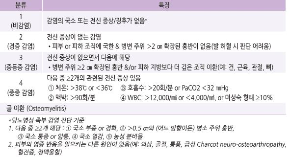
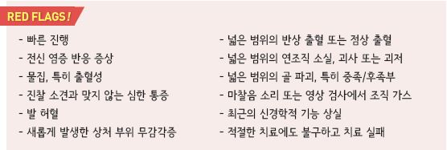
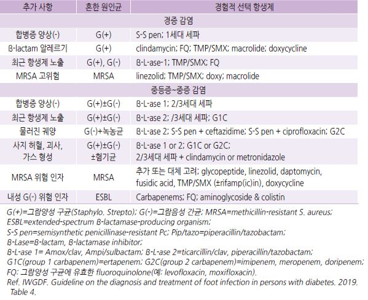
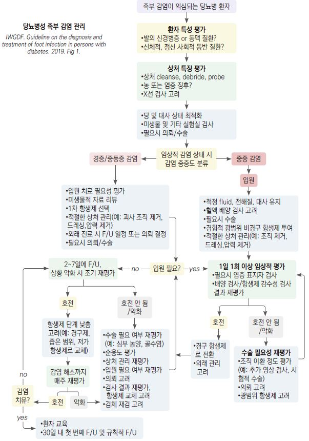
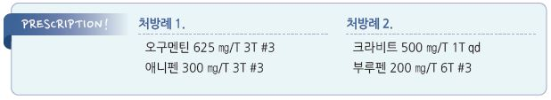

# 당뇨병성 족부 감염 Diabetic Foot Infection

## 원인
- 그람양성 Staphylococci(가장 흔함)

## IWGDF classification 및 임상 양상
    

## 진단
- 임상적으로 상태 판단이 어려운 경우 검사 고려

- 실험실 검사 : CRP, ESR, procalcitonin

- 배양 검사 : 중등증 이상 감염에서 고려

- 영상 검사 : 골수염 의심 시 일련의 X선 촬영; 골 이상(변형, 파괴), 연조직 가스

  •임상 및 X선으로 진단되지 않는 경우 MRI, PET CT, leukocyte scintigraphy 등 고려

- probe-to-bone test : 골수염 의심 시 시행; sterile blunt probe를 ulcerated lesion에 삽입하여 probe가 골에 닿으면 양성

>     ✽발의 온도나 정량적 미생물 분석은 유용성이 입증되지 않았으며 진단 방법으로 권고 안 함

---

## Management

### 치료 방침
- 철저한 당 조절

- 환부를 청결하게 관리 : 괴사 조직, 딱지, 주변 굳은 살 제거, 배농

- 압박을 피함

- 부종 관리 : 침상 안정, 거상, 이뇨제 투여

- 감염에 대하여 항생제 치료

- 발열, 통증에 대하여 대증 치료 : NSAID

### 드레싱
- 분비물 상태에 따른 드레싱 소재 선택 (☞ p.1062)

- 노출 상처에 대하여 povidone-iodine 4배 희석액에 적신 거즈 packing [베타딘]

- 발바닥 상처가 드레싱에 의하여 압박되지 않도록 관리

## 항생제
    (☞ p.901)

- 경증 감염 : 경구제 ± 주사제(명확한 효과가 있을 때)

- 중증 감염 : 초기부터 주사제 선택

- 비감염성 상처에 대한 예방적 항생제 사용은 권하지 않음

- 최근 항생제 치료를 받지 않은 환자에서는 그람양성 병원균에 대한 경험적 항생제 선택

- 열대 기후 거주, 1개월 내 항생제 치료력, 중증 환자는 그람 양성/음성, 혐기성균까지 고려

- 1~2주 투여, 필요시 연장(광범위, 중증 말초동맥 질환 시 3~4주)

  •4주간의 적절한 치료에도 해결되지 않는 경우 재평가 및 추가 검사, 치료 방법 변경 고려

- 국소 항균제는 효과가 입증되지 않아 권고하지 않음(연구 결과들에서 효과가 없었음)

### 경증 감염

#### MSSA, Streptococcus
- clindamycin : 300~450 ㎎ qid [훌그램]

- cephalexin : 500 ㎎ qid [팔렉신]

- levofloxacin : 500 ㎎ qd [크라비트]

- amoxicillin/clav. : 혐기성 균주 포함 혼합 감염 의심 시 고려; amox 500 ㎎ tid [오구멘틴]

#### MRSA
- doxycycline : 100 ㎎ bid [독시사이클린]

- TMP/SMX : 160/800~320/1600 ㎎ bid [셉트린]

### 중등증 이상 감염

#### MSSA
- levofloxacin [크라비트], moxifloxacin [아벨록스]

- ampicillin-sulbactam [유나신 주], cefoxitin [파세틴 주], ertapenem [인반즈 주], tigecycline [타이가실 주],

    imipenem-cilastatin [티에남 주], ceftriaxone [트리악손 주]

#### MRSA
- linezolid [자이복스], daptomycin, vancomycin [반코마이신 주]

    

## 수술
- 대상 : 중증 감염, 넓은 괴저/괴사성 감염/심부 조직 농양/구획증후군이 동반된 중등증 감염, 심한 하지 허혈

    

> **질병코드**
E10.6 기타 명시된 합병증을 동반한 1형 당뇨병

E10.72 기타 및 상세불명의 당뇨병성 족부합병증을 동반한 1형 당뇨병

E11.6 기타 명시된 합병증을 동반한 2형 당뇨병

E11.72 기타 및 상세불명의 당뇨병성 족부합병증을 동반한 2형 당뇨병

