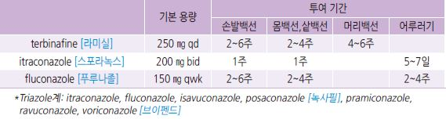
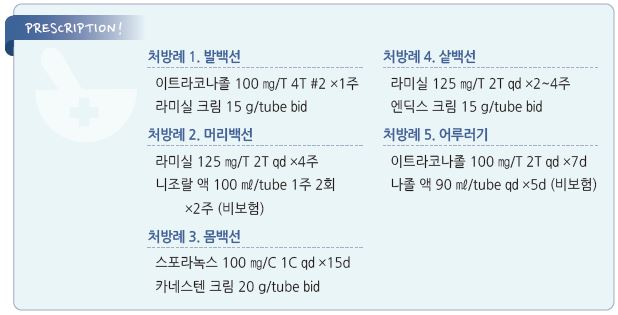

# 피부 백선증 Dermatophytosis, Tinea

## 일반 사항
- 피부 사상균(dermatophyte)에 의한 피부 감염

- 균주가 피부, 조갑, 머리카락 등의 케라틴 조직에서 생존함

- 함께 생활하는 사람 모두 치료

## 원인
- 원인균 : 주로 Trichophyton, Microsporum, Epidermophyton

- 감염 기전 : 감염된 사람 또는 동물과의 접촉; 흔히 발백선이 신체 다른 부위로 퍼짐

### 위험 인자
- 백선 가족력

- 고령, 흡연, 비만

- 더운 날씨, 여름, 땀 흘림, 젖거나 꽉 끼는 옷/양말/신발

- 조갑 또는 피부의 마찰/긁음/외상

- 백선 환자와의 동거, 애완동물의 백선 감염

- 공동생활, 밀집 생활, 습한 환경(예: 수영장, 찜질방, 헬스장), 공동 라커룸 이용

- 아토피, 말초 혈액 질환, 암, 당뇨병, 건선, 면역 저하

- 국소 steroid 도포

## 종류 및 특징

### 손발톱백선증 (Tinea unguium)
    (☞ p.929)

### 손발백선증 (Tinea manus, Tinea pedis)
- 원인균 : T. interdigitale (급성), T. rubrum (만성)

- 호발 : 20~50세, 남성

- 증상 : 무증상~심한 불편; 홍반, 부종, 비늘, 수포, 짓무름, 갈라짐, 가려움; 2차 감염 시 통증

- 손백선증 : 광범위, 건조, 비늘; 보통 편측 발생. 발백선증 동반

>     ✽two feet & one hand 이환이 가장 흔한 형태(65%)라는 보고가 있음
- 감별

  •건선 : 손발바닥의 chronic scaling, 조갑 변화; 항진균제에 반응하지 않음

  •접촉피부염 : 종종 dorsal surface 이환, 국소 steroid에 반응

  •수포성 병변에 대하여 pompholyx(dyshidrosis), scabies 감별을 요함

### 몸백선증 (Tinea corporis)
- 원인균 : T. rubrum

- 이환 부위 : 얼굴, 몸통, 팔

- 증상 : 가장자리가 활성화되어 있는, 비늘이 있는 원형 또는 타원형의 붉은색 반 또는 판(중심부

clear; ringworm)

- 동물 관련 병소는 구진 및 염증 형태를 보임

- 감별

  •건선 : 주로 팔꿈치, 무릎, 두피, 조갑에 전형적인 병변

  •2차 매독 : 손발바닥, 점막에 전형적인 병변

### 샅백선증 (Tinea cruris)
- 원인균 : T. rubrum, E. floccosum

- 흔히 발백선에서 전파

- 이환 부위 : 사타구니, 엉덩이, 항문 주위; 음낭에는 발생하지 않음

- 호발 : 여름, 남성(사춘기 이후)

- 편측 또는 양측 발생

- 증상 : 심한 가려움; 명확한 경계, 가장자리 활성화, 비늘, 홍반, 간혹 구진; 중심부는 clear; 호전 후 과색소 침착

- 감별 : 칸디다증- 선홍색, 병변의 주 경계 바깥에 satellite papules & pustules, 음낭 이환

### 머리백선증 (Tinea capitis)
- 원인균 : T. tonsurans

- 이환 부위 : 두피, 머리카락

- 호발 : 사춘기 이전(3~9세)

- 증상 : 가려움; 초기 비늘이 있는 둥근 붉은 패취 → 만성적인 비늘, 탈모

### 어루러기 (Tinea versicolor)
- 원인균 : Malassezia furfur

  •피부의 정상 균주인 yeast cell이 덥고 습한 날씨, 땀, 스킨 oil, 경구 피임제, 영양 결핍 등과 관련하여 병원균의 형태로

    변화되어 발병

- 전염성 없음

- 이환 부위 : 가슴, 등, 어깨; 간혹 안면(특히 소아), 사지 원위부 침범

- 호발 : 청소년~젊은 성인

- 증상 : 타원형의 반점 또는 반, hypopigmentation(간혹 hyperpigmentation), 긁으면 비늘 관찰, 드물게 가려움

- 감별

  •Vitiligo : 보다 넓은 병변, total depigmentation. 비늘 없음

## 진단

### 검사
- 진단이 불확실한 경우, 난치성인 경우 고려

- KOH, Wood lamp, 배양 검사

---

## Management

### 치료 방침
- 치료 목표 : 증상(특히 가려움) 완화, 2차 세균 감염 예방, 전염 방지

- 항진균제 치료 : 국소제를 1차 선택; 조갑이나 머리백선에서는 경구제를 1차 선택제로 고려

- 개인위생 관리, 사용했던 수건/의복 세탁, 수건/의복/머리띠/베게 등 공동 사용 금지

- 발백선이 있는 경우 반드시 이를 함께 치료

- 함께 생활하는 사람, 밀접 접촉자, 애완동물 평가

  •두부 백선의 경우 2~4주 동안 가족 모두 예방적 항진균 샴푸 사용

- 난치 또는 재발 가능성이 있음에 대하여 설명

## 약물 치료

#### 국소 Steroid
- 사용을 권고하지 않음 (✽국소 steroid는 백선증의 위험 인자가 되며 백선증에서 사용 시 병변의 형태를 변화시켜

    백선 진단을 어렵게 하고 심부 염증성 결절, 육아종 등을 발생시킬 수 있음)

- 가려움 및 염증 완화를 위하여 수일간 저역가제 사용 고려

#### 국소 항진균제
- 각 계열 내에서의 약제간 유의미한 효과 차이는 없음

>     ✽allylamine계가 azole계보다 효과적이라는 보고가 있음

>     

#### 경구 항진균제
    (☞ p.930)

    

### 손발백선증

#### 국소 항진균제
- 투여 기간 : 4~6주; 효과가 제한적임

- 심한 발백선에 대하여 benzoic acid/salicylic acid 고려 [치선 액](비보험)

- Al subacetate 용액 soaking 20분 bid

- 건조하고 각질이 있는 발바닥 병소에 대하여 urea 병용 [유리아]

#### 경구 항진균제
- itraconazole : 200 ㎎ bid ×7d or 100 ㎎ ×30d (치료율 ＞90%) [스포라녹스]

- terbinafine : 250 ㎎ qd ×2~6wk [라미실]

- fluconazole : 150 ㎎ qwk ×2~6wk [푸루나졸]

### 머리백선증

#### 국소 항진균제
- 단독 치료는 거의 효과 없음; 주로 샴푸의 형태로 경구제에 병용

- ketoconazole 2% 샴푸 : 3~5분간 유지, 2회/주 ×2~4주, 이후 1~2주마다 1회 [니조랄](비보험)

- selenium sulfide 2.5% 샴푸 : 2~3분간 유지. 2회/주 ×2주, 이후 1~2주마다 1회

#### 경구 항진균제
- griseofulvin : microsized 500 ㎎/d, ultramicrosized 330~375 ㎎/d ×6~12주

- terbinafine : 250 ㎎ qd ×4~6wk [라미실]

- itraconazole : 100 ㎎/d ×6wk [스포라녹스]

### 몸백선증, 샅백선증
- 치료 후 피부가 원래 색으로 회복되는 데 수개월 소요됨

#### 국소 항진균제
- 투여 기간 : 2~4주(임상적 호전 후 1~2주 치료)

>     ✽몸백선증에 대하여 terbinafine [라미실]과 butenafine[멘탁스]이 가장 빠른 반응을 보인다는 보고가 있음

#### 경구 항진균제
- 신체 여러 곳에 발생한 경우 적용

- itraconazole : 100 ㎎ qd ×15d or 200 ㎎ qd ×7d [스포라녹스]

- terbinafine : 250 ㎎ qd ×2~4wk [라미실]

- fluconazole : 150 ㎎ qwk ×2~4wk [푸루나졸]

### 어루러기
- 피부 색소 회복에는 수개월이 소요될 수 있음

#### 국소 항진균제, 샴푸
- 투여 기간 : 2~4주

- ketoconazole 2% 샴푸 : 이환 부위 도포 → 5분간 유지 후 세척, qd ×5d & 치료 기간 중 주 1회 반복 [니조랄](비보험)

- selenium sulfide 2.5% 샴푸 : 이환 부위 도포 → 10분간 유지 후 세척, qd ×7d & 한 달간 주 1회 반복

#### 경구 항진균제
- fluconazole : 150~300 ㎎ qwk ×2~4주 [푸루나졸]

- itraconazole : 200 ㎎ qd ×5~7d [스포라녹스]

>     ✽terbinafine [라미실]과 griseofulvin은 효과적이지 않음

#### 예방
- 유지 치료를 하지 않으면 2년 내 80% 이상에서 재발

- ketoconazole 2% [니조랄] 또는 selenium sulfide 2.5% 샴푸 : 10분간 전신 적용 ×1회/주~월

- itraconazole : 200 ㎎ bid ×1d/월 [스포라녹스]

## 피부 및 조갑 백선증 예방
- 개인위생 관리(손 씻기)

- 샤워 후 몸을 완전히 건조시킴. 조갑 또는 발백선 환자에서는 특별히 발 건조에 유의

- 습기, 더위, 폐쇄, 몸에 끼이는 옷 등 곰팡이 성장을 조장하는 환경을 피함

- 고무 재질, 폐쇄된 신발, 조이는 신발 착용을 피함

- 흡수성이 있는 면양말 착용

- 의류는 뜨거운 물(＞60℃)로 세척

- 기저 질환 관리

- 옷, 스포츠 장비, 수건을 다른 사람과 공동 사용하지 않으며 소독된 것으로 사용

- 체육관, 수영장, 찜질방 등 공공장소에서 깨끗한 슬리퍼나 샌들 착용

- 공공장소의 옷장 사용 시 양말과 내의가 노출되지 않도록 관리(예; 봉투에 담음)

- 환자와 피부 접촉 후 비누와 샴푸로 세척

- 애완동물이 있는 경우 발병 여부 확인 및 관리

- 피부 이환 시 타월, 샌들, 헤드기어 공동 사용을 금지

- 조갑 이환 시 손톱깎이 공동 사용 금지; 이환된 조갑과 비-감염 조갑의 도구를 별도 사용

- 두부 이환 시 빗, 브러시 등 모발 관리 제품 소독 및 공동 사용 금지

- 꼭 필요하지 않은 국소 steroid의 사용을 피함

> **질병코드**
B35.0 수염 및 두피 백선

B35.2 손백선

B35.3 발백선

B35.4 체부백선

B35.6 사타구니백선

B35.8 기타 피부백선증

B36.0 어루러기 

