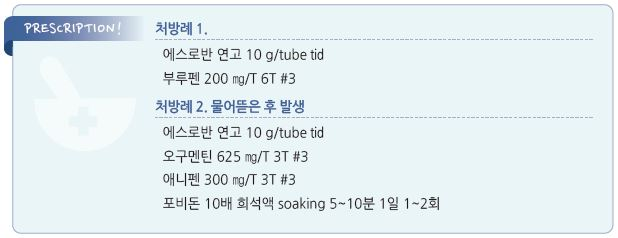

# 손발톱 주위염 Paronychia

## 일반 사항
- 손발톱 측부 또는 근위부 주름(nail fold) 표피층의 염증

- 만성 : 4주 이상 지속 또는 악화-완화 반복하는 경우

- 경과 : 적절한 치료 시 1주 정도에 회복; 만성인 경우 수 주~수개월 소요

- 치료에 반응하지 않는 만성 병변은 악성 종양 감별을 요함

## 원인
- 원인균 : S. aureus , S. pyogenes , C. albicans (만성 습진성 병변)

- 외상, 습진

  •만성 : 지속되는 습진, 반복되는 자극 또는 알레르겐 노출, 진균 감염(칸디다, 무좀)

### 위험 인자
- 손상된 손톱

- 습진, 아토피 피부염

- 손이 물에 젖는 직업 : 주부, 바텐더, 식당 종사자, 간호사, 수영 선수

- 매니큐어, 손톱 정리; cuticle 소실, barrier function 소실

- 손가락을 빠는 습관, 손톱을 깨무는 습관

- 당뇨병, 면역 저하

## 임상 양상
- 보통 lateral nail fold에서 시작

- 급성 : 통증/압통, 홍반, 부종, 농양(세균 감염 시)

- 만성 : 부종, 통증/압통, boggy nail fold, cuticle 소실(nail plate와 fold 분리), 조갑의 transverse ridge(Beau’s line), 손톱 색깔 변화

## 진단

### 검사
- 대상 : 심한 증상, 재발성에서 고려

- KOH, 그람염색, 배양 검사, Tzanck test

- 조직 검사 : 적절한 조치로 회복되지 않으면 고려

### 감별
- Felon : digital pulp space의 감염; 손가락 원위부 연조직의 심한 통증 및 부종

---

## Management

### 치료 방침
- 급성 : 감염 치료(1차로 국소 항생제 선택), 배농

- 만성 : 손 습진, 진균 감염(예: 무좀), 기저 질환(예: 당뇨) 치료

- 필요시 파상풍 백신 접종

## 비-약물 치료
- 온찜질, 거상

- 부목 : 통증이 심한 경우 보호를 위하여 고려

- antiseptic soaking : 5분씩 qd~tid; povidone-iodine [베타딘](7~8배 희석), chlorhexidine [헥시딘]

- warm water soaking : 20분씩 tid

## 약물 치료

### 항생제

#### 국소제
- 1차 선택

- mupirocin 2% 연고 : tid~qid ×5~10d [에스로반]

- Pseudomonas 감염 의심 시 국소 fluoroquinolone제 선택

#### 경구제
- 국소 요법에 반응하지 않거나 농양 발생, 면역저하자에서 고려 (☞ p.901)

** oral flora에 노출 안 된 경우**

- cephalexin : 500 ㎎ tid ×7d [팔렉신]

- dicloxacillin : 250 ㎎ tid ×7d

** oral flora에 노출 된 경우(nail biting, finger sucking 관련)**

- amoxicillin/clav. : amox 500 ㎎ tid ×7d [오구멘틴]

- clindamycin : 300~450 ㎎ tid~qid ×7d [훌그램]

** MRSA**

- TMP/SMX : 160 ㎎/800 ㎎ bid ×7d [셉트린]

- doxycycline : 100 ㎎ bid ×7d [독시사이클린]

### 항진균제
- 특히 만성 병변에 대하여 진균 감염 고려

- 1% clotrimazole 크림 : bid~tid ×~30d [카네스텐]

- 알코올 : 항진균제 도포가 어려운 경우 대체; thymol 4% qd

- 경구제는 드물게 적용 (☞ p.930)

### Steroid
- 습진 또는 만성 병변에 대하여 고역가 제제로 1일 2회 단기 도포 고려

- clobetasol propionate 0.05% [베타베이트 크림]

- diflucortolone valerate 0.3% [디푸코 연고]

### 농양 치료
- I&D 및 배농 유지를 위하여 자주 warm soaking

- 경구 항생제 : I&D 및 국소 항생제로 대부분 치유되나 필요시 경구 항생제 투여(비-농양 병변과 동일);

    필요시 배양 및 감수성 검사 시행

## 예방
- 자극과 알레르겐 접촉을 피함

- 손상을 주는 습관/행위를 피함 : 손톱/손가락 물기, cuticle 손질

- 손톱을 짧게 유지함

- 손 보호 : 건조 유지, 습한 작업 시 장갑 착용, 손 세척 후 보습 로션 도포

- 고무장갑을 착용하는 경우에는 속에 면장갑을 착용

> **질병코드**
L03.00 손가락의 연조직염

L03.01 발가락의 연조직염 

