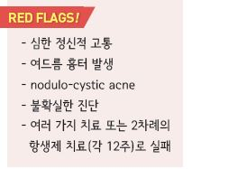
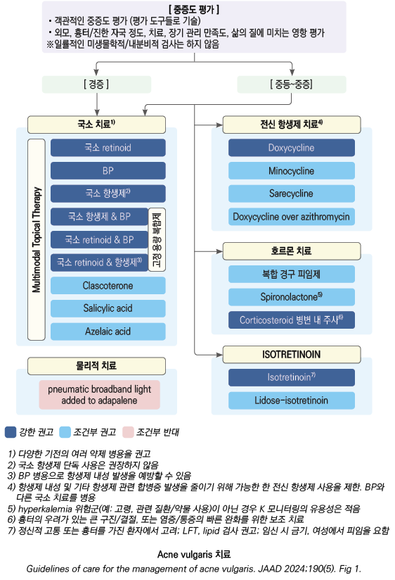
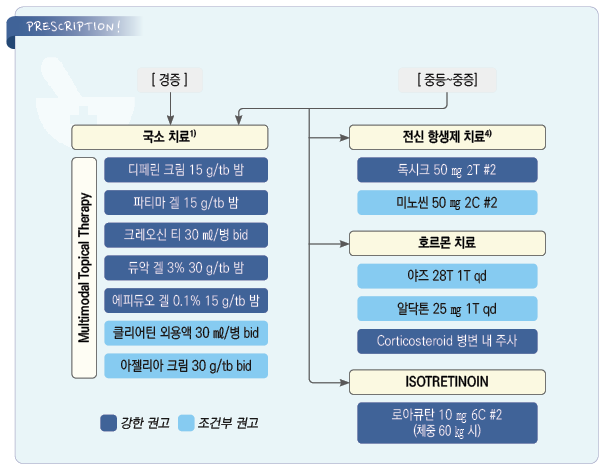

# 여드름 Acne Vulgaris


## 일반 사항

*   모낭(pilosebaceous) 상피의 비정상적 탈락으로 인해 모낭관이 막혀 염증을 일으키고 이에 따라 구진, 농포, 결절,

    면포 및 흉터가 형성되는 모낭의 만성 질환
* 분포 : sebaceous follicle이 밀집된 곳; 얼굴(주로), 등(upper back), 앞가슴
*   발생 시기 및 유병률 : 청소년기- 남성(skin oil이 많음), 성인기- 여성 호발; 환자의 40%에서 7\~10세에 시작, 청소년의 85%

    (15~~18세에 최대); 보통 25세 전에 쇠퇴, 25~~34세의 8%; 여성 환자의 26%, 남성 환자의 12%에서 40대까지 지속

    ✽마스크 사용과 관련하여 유병률이 증가하였다는 보고가 있음(acne mechanica)
* 여드름 관리에 있어서 객관적 징후 뿐 아니라 주관적 척도, 삶의 질이 중요함

## 원인

### 병인

① 모낭 상피의 비정상적인 각질화에 의해 모낭 내강에 각질화된 세포가 들어참(각질 세포 plug)

② 피지선에서의 피지 과잉 생산 (✽피지는 세균 증식의 배지 역할을 함)

③ 모낭에서의 혐기성 균인 _Cutibacterium acnes_(예전 _Propionibacterium acnes_) 증식

```
• proinflammatory mediator 활성 증가 → 염증 조장

• lipase 생성 → 피지의 TG를 free fatty acid로 분해하고 이것이 염증 반응을 유발

• C. acnes는 일부 병원성일 가능성이 있지만 나머지는 피부 미생물군집에 공생함; C. acnes 양과 여드름의 중증도는

무관하지만 C. acnes 양을 줄이면 여드름이 개선됨
```

④ androgen(testosterone, DHEA-S) 활성 : 피지 생성 및 각질 세포 증식을 자극

⑤ 피부 염증

*   각질 세포 plug에 의한 피지 모낭의 폐쇄 → 면포 형성 → 모낭 팽창 & 파열 → 진피층으로의 분출 및 염증 반응;

    염증 반응이 표면에서 발생하면 구진/농포 형성, 보다 깊은 곳에서 발생하면 결절 형성

### 관련/악화 인자

* 유전 : 환자의 50%에서 가족력이 있으며, 가족력이 있는 경우 보다 조기 발생 및 중증 발생
*   호르몬 관련 : 사춘기(androgen 활성 증가), 월경(여드름 발생 여성의 25\~50%가 월경 1주 전 악화), 임신 3분기, 폐경기,

    내분비 질환(다낭성난소증후군, 쿠싱증후군)
* 약물 : steroid, progestin, lithium, iodine, isoniazid, halogen, phenytoin, Vit B2/B6/B12
* 더위, 습함, 열대 기후

✽계절 요인은 확실치 않음. 자외선이 여드름에 좋고, 찬 바람과 낮은 습도가 피부에 나쁜 영향을 주고 겨울철이 스트레스가

```
더 많을 가능성 등으로 인하여 여름에 호전되고 겨울에 악화된다고 알려져 있었으나 실제 환자 조사에서는 여름철 악화,

겨울철 악화 및 영향 없음이 각 ⅓로 차이가 없었다는 보고가 있음
```

* 피부 자극 및 손상 : 마찰, 외상, 머리띠, 휴대폰, 화장품, 헬멧 턱받침, 여드름 짜냄
* 지성 화장품, 머리 기름
* 흡연, 스트레스
* 식이 : 논란; 초콜릿, 기름진 음식, 설탕이 든 음료, 흰 빵, 유제품 등이 관련되는 경우가 있음

※ 하악 및 목의 전측방을 따라 분포하는 크고 깊은 염증 병변, menstrual flare, androgen 과다 징후(예: hirsutism, 불규칙

```
월경)는 호르몬 연관을 시사
```



## 임상 양상

*   면포, 농포, 염증성 구진, 결절, 흉터(심하고 깊은 염증이나 잘못된 압출 관련);

    보통 여러 형태의 여드름이 동시에 존재
* 통증/압통

**IGA(Investigator global assessment) 중증도**

0 깨끗(clear) : 잔여 색소 침착 및 홍반이 있을 수 있음

1 거의 깨끗(almost clear) : 몇몇 산재한 면포와 작은 구진

2 경증(mild)' : 쉽게 인지됨; 얼굴의 절반 이하 이환; 약간의 면포, 구진, 농포

3 중등증(moderate) : 얼굴의 절반 이상 이환; 많은 면포, 구진, 농포; 한 개의 결절이 존재할 수 있음

4 중증(severe) : 얼굴 전체가 면포로 뒤덮여 있고, 구진과 농포가 많음; 결절과 낭종이 몇몇 있을 수 있음

### 면포 (Comedone, 여드름집)

* 각질, 지질, 세균 등으로 피지 모낭이 채워진 상태(plugging)

#### 폐쇄성 면포 (Closed comedone; Whitehead)

* follicular neck의 폐쇄로 표피 바로 밑에서 follicular duct의 낭종성 팽창이 발생
* 본래 피부색 또는 주변 피부보다 약간 밝은 색의 1\~2 ㎜ 크기의 구진
* 입구에 바늘 크기의 구멍만 존재, 내용물이 쉽게 배출되지 않음
* 염증성 여드름(붉은 구진, 농포, 결절, 낭종)의 전구 상태

#### 개방성 면포 (Open comedone; Blackhead)

*   모낭 입구가 열려 있어(크고 확장된 모낭구) 각질 세포 plug 내의 산화된 멜라닌이 보이는 상태(구멍에 후추가

    들어가 있는 것처럼 보임)
* 쉽게 배출되는 산화된 검은색의 기름진 부스러기들로 채워짐
* 염증 증상은 별로 없는 상태

### 결절 낭성 여드 (Nodulocystic lesion)

* 모낭 주위 피부 깊숙이 염증 부스러기의 낭종(액화된 덩어리)이 형성된 상태

## 진단

* 피임약/약물/화장품/월경 관련 증상 변화, 나이, 생활 방식, 환경, 가족력, 이전 치료력

### 실험실 검사

* 일반적으로 필요 없음(유용하지 않음)
* hyperandrogenism 의심 여성에서 free & total testosterone, DHEA-S, LH, FSH
* 항생제 투여 또는 중이염이 있는 환자의 얼굴에 발생한 농성 병변에 대하여 배양 검사 고려(그람음성균 배제)

※ isotretinoin을 투여할 경우 baseline LFT & TG, 가임 여성에서 hCG 측정

### 여드름 모양 발진 감별 질환

* 원발성 피부 질환 : 여드름, acne rosacea, 모낭염, 지루피부염, keratosis pilaris, pyoderma
* 약물 : steroid, lithium, iodine
* 전신 질환 : Cushing’s Dz, dimorphic fungi, Behcet’s Dz, 다낭성난소증후군

※ 수개월의 경구 항생제 치료로 호전되지 않는 염증성 여드름은 G(-) 모낭염을 시사

***

## Management

### 치료 방침

* 이상각화증 정상화, 과도한 피지 생성 억제, 항염/항균, 여드름집 제거
* 중증도와 hyperpigmentation 후유증 등을 감안하여 치료 수준을 결정

### 치료 경과

* 치료 후 2\~4주 동안 악화될 수 있음
* 치료 반응까지 6~~8주, 충분한 호전까지 8~~12주 소요; 등과 가슴은 보다 장시간 소요(3\~4개월)
* 새로운 병변 개수로 치료에 대한 반응 평가
*   치료 12주에 평가 •목표 달성 시 국소/경구 항생제 치료를 중단하고 다른 치료를 고려

    •목표 달성 실패 시 치료 순응도 검토 및 다른 치료 고려
* 치료 중 재발하는 경우 내성 C. acnes 균 출현을 의심
* 여성에서 isotretinoin 중단 후 즉각 재발 시 hyperandrogenism 또는 다른 호르몬 질환을 고려

## 비-약물 치료 및 예방

* 충분한 증거를 가진 예방요법은 없음
* 규칙적 생활, 충분한 수면
* 피로하지 않게 함, 정신적 스트레스를 피함

#### 회피

* 여드름 부위를 만지지 않음 : 손 접촉이 여드름 악화 또는 2차적 세균 감염을 일으킬 수 있음
* 면포 압출 주의 : 압출 조작이 국소 염증 반응을 유발할 수 있으므로 압출 조작을 피하며 단순히 구멍을 내는 정도로 제한함
* 화장(특히 색조 화장)을 피함
* 피부 손상 주의 : 면도기 사용 주의(특히 칼날면도기)
* 헤어 젤, 무스, 스프레이, 옷 등에 의한 피부 자극을 피함
* 지나친 햇빛 노출을 피함 : 양산, oil-free/noncomedogenic 햇빛 차단제 사용 (☞ p.1084)
* 기름진 미용 제품 사용 회피 : 얼굴 및 두발에 사용 시 모공을 막을 수 있음
* 피부 건조 회피 : noncomedogenic moisturizer가 자극을 줄일 수 있음

#### 세척

*   청결한 피부 관리 : 중성 또는 약산성 비누로 하루 2회 이하 세안, 문지르지 않음. 단, 여드름과 나쁜 위생이나 지방의 관계에

    대한 증거는 부족함
*   피부 각질 제거 세정제 : 일시적으로 피지를 제거할 수 있으나 미세 면포 형성을 예방할 수는 없음;

    sulfur, resorcinol, salicylic acid [클리어틴](%EB%B9%84%EB%B3%B4%ED%97%98/)
*   alcohol, hexachlorophene 함유 제품 : 여드름용 비누가 피부 표면의 세균 수를 감소시키는데 다소 효과가 있다는 보고가 있으나

    이들 성분과 병인이 되는 세균과의 관계가 명확치 않으며 여드름을 줄인다는 증거는 없음

#### 음식

* 여드름을 악화시킨 경험이 있는 음식은 피함
*   몇몇 연구에서 과량의 유제품, 설탕, 지방, junk foods이 여드름과 관련이 있는 것으로 나타났으며 이들의 섭취 제한을 권고.

    단, 특정 음식과 여드름의 관계에 대한 증거는 부족함
* Vit C 대용량(≥2 g/d) : 일부에서 유효

#### 광선 치료 (Blue light)

* 보라\~푸른색 광선은 photoreaction으로 세균을 사멸할 가능성이 있음
* 중등증 염증성 여드름에 고려
* 단기적 효과가 기대되지만 장기 효과 또는 기존 치료와의 효과 차이는 불분명
* 4주간 주 2회, 15분/회 노출

## 약물 치료

*   강한 권고 : benzoyl peroxide, 국소 retinoid, 국소 항생제, 경구 doxycycline; 중증 또는 다른 요법으로 실패한 경우

    경구 isotretinoin
* 조건부 권고 : 국소 clascoterone, salicylic acid, azelaic acid; 경구 minocycline, sarecycline, 복합 경구 피임제, spironolactone
* 실천적 방법 : 여러 작용 기전의 국소제 병합, 국소제와 전신 항생제 병합, (큰 병소에 대하여) corticosteroid 병변 내 주사

### 국소 약물 치료제

* 보통 1일 1\~2회, (구진/농포 등 병소 뿐 아니라) 환부 전체에 도포
* 약제에 의한 자극이 심한 경우 적응을 위해 격일 도포로 시작하여 점차 빈도를 늘림
* 8주 치료 후 효과에 대하여 평가
*   용매 선택

    •건성/민감 부위 : 크림, 로션, 연고

    •지성/습한 부위 : 겔, 용액

    •털 부위 : 로션, hydrogel, 폼

#### Retinoid

* 작용 : 각질 용해, 과각화 정상화, 미세 면포 형성 억제 및 감소, 항염
* 여드름의 모든 단계에 적용; 의미 있는 호전까지 4주 이상 소요; 호전 후 수개월간 추가 도포
* 주의 : 눈/코/입 주위 도포 회피. 자외선 차단을 요함; 임신 중 금지, 치료 종료 후 6개월간 피임
* 부작용 : 자극감, 박피, 홍반; 사용 초기에 보다 흔하며 저자극성 클렌저나 보습제가 도움이 됨
* BPO나 azelaic acid와 병용 시 retinoid 제제는 야간, 다른 약제는 아침에 도포
* 염증성 여드름에 대하여 국소/전신 항생제와 병용
*   tretinoin : 0.025\~0.1% qd 야간 [스티바에이 크림](%EB%B9%84%EB%B3%B4%ED%97%98/)

    •0.025% 크림을 2~~3일마다 야간에 1회 도포로 시작하여 점차 빈도를 늘려 (2~~4주 후) 매일 밤 세안 20\~30분 후(피부가

    건조된 후) 도포; 도포 일수를 늘리지 못하는 경우에도 효과 있음

    ✽tretinoin과 tazarotene은 자외선에 의해 비활성화되고 benzoyl peroxide에 의해 산화됨
*   adapalene : tretinoin보다 자극감은 적고 효과는 우수 (비보험)

    •0.1%\~0.3% qd 아침 또는 야간 도포 \[디페린 크림/겔]; BPO 복합제 \[에피듀오 겔]
* tazarotene : 0.05%\~0.1% qd 야간 도포; 효과와 자극감 모두 상대적으로 많음
* trifarotene : 선택적 retinoic acid receptor(RAR)-γ 작용제; qd 저녁 \[아크리프 크림]

#### Benzoyl peroxide (BPO)

* 작용 : 항균, 항염, 각질 용해/과각화 정상화, 면포 용해
* 장점 : 내성 발생이 없어 국소 항생제보다 유리
* 약제 농도와 치료 효과가 비례하지는 않음
* 주의 : 눈/코/입 주위 도포는 피함. 자외선 차단을 요함(SPF ≥30의 자외선 차단제 권고)
* 부작용 : 자극감, 건조, 홍반, 광과민; 농도가 진할수록 부작용 증가; 의복을 탈색시킬 수 있음
* 용법 : qd(hs)~~bid; 2.5~~10%(농도가 높은 것이 반드시 더 효과적이지는 않음) [파티마 겔](%EB%B9%84%EB%B3%B4%ED%97%98/)

#### 항생제

* 작용 : 항균; 경구 항생제보다 효과 적음
* 장점 : 자극 또는 건조 부작용이 retinoid 또는 benzoyl peroxide보다 적음
* 단점 : 미세 면포 형성 억제 효과가 없고 내성 발생 가능성이 있어 단일 치료제로는 권하지 않음
* 대상 : BPO 또는 retinoid (6주)치료에 반응하지 않는 경우; 장기 사용은 피함
* 부작용 : 건조, 자극감; 크림/로션보다 겔/용액이 자극적임
* clindamycin : 1일 1\~2회; 1% [크레오신 티 외용액](%EB%B9%84%EB%B3%B4%ED%97%98/)
* erythromycin : C. acnes 내성이 많음
* sulfacetamide
* dapsone : 5% 겔; 염증성 여드름에 적용
* 복합제 : clindamycin/BPO [듀악 겔](%EB%B9%84%EB%B3%B4%ED%97%98/), clindamycin/tretinoin

#### Clascoterone

* 국소 antiandrogen(안드로겐 수용체에 직접 결합)
* 작용 : 피지 세포의 androgen-mediated lipid 및 inflammatory cytokine 합성 억제
* 효과 대비 가격 등을 고려하여 '조건부 권고'

#### Salicylic acid

* 작용 : 면포 용해, 화학적 박피, 과각화 정상화
* 효과 : tretinoin보다 효과/자극감 적음
* 부작용 : 피부 건조, 자극
* 용법 : 1일 1\~2회 도포 클리어틴 외용액(비보험)

#### Azelaic acid

* 작용 : 항균, 면포 용해, 각질 용해, 염증 후 과색소화 감소
* 적용 : 보조 치료, 염증 후의 색소 침착 치료
* 효과 : 다른 도포제 대비 동등 이하 효과
* 의미 있는 호전까지 4주 이상이 소요되며 호전 후 수개월간 추가 적용을 권고함
* 부작용 : 홍반, 건조, 박피, 저색소증; 다른 제제보다 적음
* 용법 : 20% 크림 qd\~bid [아젤리아 크림](%EB%B9%84%EB%B3%B4%ED%97%98/)

#### 경구제

* 통증이 있는 구진/결절, 광범위한 병변, 중증의 active lesion, 환자의 요구가 있는 경우 고려

#### 항생제

* 작용 : C. acnes 대사 억제, 항염
* 일반적으로 tetracycline 계열을 사용
* 항생제 관련 합병증 발생을 줄이기 위해 전신 항생제 사용을 제한. 단독으로는 사용하지 않음. 국소 항생제와 병용하지 않음
* 국소제(BP, retinoid)와 병용(항생제 사용 기간 및 내성 위험 감소)
* 대상 : 국소 항생제 치료(6주)에 반응하지 않는 중등증 이상의 광범위 염증성 병변(농포, 결절)
* 투여 기간 : 3~~4개월 이하; 호전되면 국소 항생제나 retinoid를 사용하며 6~~8주마다 50%씩 tapering
*   tetracycline계 부작용 : 위장 장애(오심, 구토, 설사, 식도염; upright 자세로 적절한 음식/물과 함께 복용), 세균 증식,

    광과민(특히 doxycycline), 치아 착색(＜8세 금지)
* 광범위 macrolide 항생제로서의 azithromycin는 내성 증가 우려 및 여드름 치료에서의 더 열등한 효과를 감안하여 회피
*   TMP-SMX는 심각한 이상 반응(Stevens-Johnson 증후군, 독성 표피 괴사, 급성 호흡 부)과 관련이 있을 수 있으며,

    폐렴이나 요로 감염 등의 지역사회 획득 감염에도 사용되고 항생제 내성균 발생을 피하기 위하여 여드름 치료에서 배제

**종류**

*   doxycycline : 100 ㎎ qd~~bid, 유지 50~~150 ㎎ qd \[독시사이클린]

    • 저용량(20 ㎎ bid, 서방향 40 ㎎ qd)으로 중등도 염증성 여드름에 효과가 있음
*   minocycline : 중등도 이하 여드름에서 국소 BP 5% or erythromycin 2%/BP 5%보다 우월하지 않음;

    현훈, 자가 면역 간염, 피부 과색소 침착, 약물 유발 루푸스 등 잠재적 부작용에 대한 우려 로 조건부 권고;

    50~~100 ㎎ bid, 유지 50~~100 ㎎ qd \[미노씬]
* sarecycline : 위장, 광과민, 칸디다 감염 등 부작용 발생률이 낮음; 효과와 비용을 고려하여 조건부 권고

#### 복합 경구 피임제 (Estrogen/Progestin)

* 작용 : circulating free testosterone 감소 → 피지 분비 감소
* 대상 : 항생제 치료에 반응하지 않는 호르몬 이상 또는 isotretinoin 치료에 해당되지 않는 여성
* 3\~6개월 치료 후 효과 평가
*   1차 선택 : estrogen/progestin 복합제(비보험); progestin으로 drospirenone 선호 (☞ p.700)

    •[야스민](21T/) : ethinyl estradiol(EE) 30 ㎍, drospirenone 3 ㎎; 21일간 복용 → 7일간 휴약

    •[야즈](28T/) : EE 20 ㎍, drospirenone 3 ㎎; 24일간 연분홍색 → 4일간 흰색(위약) 복용

#### Selective aldosterone antagonist

* 작용 : androgen 생성 감소 (✽여드름 치료 목적에 대하여 FDA 미승인)
* 부작용 : 어지럼, 유방 압통, 월경통, 불규칙 월경
* 경구 피임제와 함께 투여 시 효과적
* spironolactone : 25\~200 ㎎/d \[알닥톤]

#### Isotretinoin

* 작용 : 피지선 크기/분비 감소, 과각화 정상화, 미세 면포 형성 예방, 항균(C. acnes 감소), 항염
* 대상 : 심한 낭포성 결절 여드름, 다른 치료에 반응하지 않는 중등증 이상의 여드름
*   주의 : 부작용 문제로 제한적 사용

    • 임산부 복용 금지(기형 출산 위험), 투약 전 및 종료 후 각 최소 1개월간 완전한 피임, 헌혈 금지

    • 병용 금지 약물 : tetracycline계, Vit A

    • 각질 치료제 병용을 피함(건조 부작용을 증가시킴)
*   부작용 : 콜레스테롤↑, 중성지방↑, 간 효소 수치↑. 구순염, 피부/입술/구강/안구 건조증, 피부 광과민, 코피, 안검염, 결막염,

    야간 시각 이상, S. aureus 감염 증가, 관절통, 뇌 내 고혈압, 감정 변화(예: 우울, 자살), 탈모(가역성)
*   실험실 검사 : 투약 전 모니터링 총콜레스테롤, 중성지방, LFT, HCG(임신)

    • 모니터링 : 투약 후 4주째 TC, TG, LFT, 정신적 문제 관찰

    • 간기능 검사와 관련하여 치료 중단이 필요한 경우는 1\~5%로 보고되고 있음. 약물 투여와 관련하여 상승한 간 효소와

    TG는 치료를 중단하면 빠르게 회복됨

    • 2024 AAD 권고에서는 CBC는 투약 전 검사 및 모니터링에서 제외함; 부작용 발견을 위한 실험실 모니터링의 이점을

    뒷받침할 증거가 부족함

    • 신경 정신 질환과의 인과성이 입증되지는 않았으나 우울증, 불안, 자살 위험이 있는 인구(특히 청소년)에서 이에 대한

    선별 검사 및 모니터링을 요함
*   용법 : (0.5\~)1.0 ㎎/㎏/d #1\~2 ×20(\~24)주, 식사 시 투여 [로아큐탄](%EB%B3%B4%ED%97%98%EC%A3%BC%EC%9D%98/)

    • 투여 초기에 일시적으로 여드름이 악화될 수 있음(steroid 병용으로 방지)

    • 적응을 위하여 처음 4주간 0.5 ㎎/㎏ qd 용법을 적용할 수 있음

    • 첫 번째 코스(20\~24주) 치료로 치유되지 않으면 2개월 후 두 번째 코스 치료 고려
*   치료율 및 재발률 : 충분한 용량으로 치료하지 않는 경우 치료율이 낮고 재발률이 높음

    • 기준 용법 치료 시 치료율 70~~80%, 치료 종료 후 3~~5년 활성 여드름 재발률 25%

    ※ 기준 용법 : 120\~150 ㎎/㎏/코스 투여. 체중 60 ㎏ 시 10 ㎎/C 제제로 1일 5C

    • 총 투여량이 ＜120 ㎎/㎏ 인 경우 재발률 80%

    • 저용량(＜0.4 ㎎/㎏/d)을 간헐적(1개월간 1주 이내)으로 사용하는 것은 치료율이 낮음
*   투약 종료 후 6개월 이내의 full-face dermabrasion, mechanical dermabrasion with rotary device, ablative laser treatment

    of the entire face or non-facial regions는 부작용 위험으로 권고하지 않음

#### Absorica

* isotretinoin agent
* 용법 : 0.5\~1 ㎎/㎏/d bid



## 기타

#### Steroid 병소 내 주사

* 대상 : 결절성 염증성 여드름
* 부작용 : 피부 위축, hypopigmentation, telangiectasia
* triamcinolone : 2.5 ㎎/㎖, 병소 당 0.05 ㎖, 30G 바늘 사용

#### 피부 박피술

* 여드름의 1차 치료로 권고하지 않음; 추가 연구 필요
* 주의/금기 : isotretinoin 복용 중, dark skin pigmentation 환자

질병코드

L70 여드름

L70.0 보통여드름


