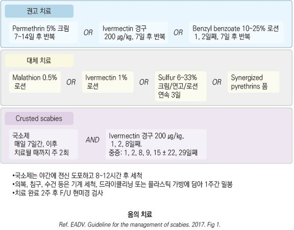
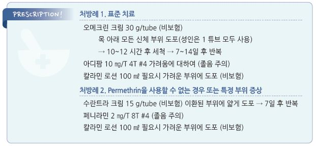

# 옴 Scabies

## 일반 사항
- Sarcoptes scabiei 의 피부 침투에 의해 발생하는 심한 소양성 질환

- 호발 계절 : 겨울; 밀집 생활, 두꺼운 의복 착용, 목욕 횟수 감소 등과 관련. 추운 곳에서는 기생충이 보다 오래 생존할 수 있음

- 잠복기 : 3~4주(2~6주), 감염 병력이 있는 경우 수일(1~4일); 잠복기에도 전염력이 있음

- 전염 경로 : 신체 접촉, 특히 성 접촉에 의하여 기생충 전파(감염자와 15~20분 동안 밀착된 신체 접촉이 있으면 전염될 수 있음);

    드물게 환자가 사용한 물품에 의하여 전염

- 경과 : 치료 1~2일 후 가려움 증상 완화 시작; 가려움이 치료 후 수 주간 지속될 수 있음

- 가려움 기전 : 배설물/분비물/충란에 의한 delayed hypersensitivity reaction과 관련

- 최초 감염 때는 무증상일 수 있음

## 원인
- 원인균 : Sarcoptes scabiei var. hominis (큰 암컷의 크기 0.4×0.3 ㎜)

### 위험 인자
- 겨울

- 밀집 생활

- 불결한 생활, 무분별한 성관계

- 영양 결핍, 면역 저하

## 임상 양상

### 심한 가려움
- 특히 밤 또는 뜨거운 샤워 후 심함

- 고령에서 보다 심한 호소

- 야간 소양증은 치료 후 2주(~4주)까지 지속됨

### 국소 병소
- 호발 부위 : 손가락 사이, 손목/팔꿈치/무릎 접히는 부위, 겨드랑이, 음경, 유두, 유방, 허리, 엉덩이

  •보통 두경부, 손발바닥, 등에는 없음

- 붉은색 작은 구진, 소수포, burrow

  •burrow : 2~15 ㎜ 길이, 머리카락 굵기의 융기 선; 발견하기 어려움

- 긁은 흔적(찰과상, 습진성 판), 농포(2차 감염 시), 결절

## 진단

### 진단 기준 [IACS]
- 임상적 진단 : burrows 관찰 OR 남성 외음부에서의 전형적 병소 OR 옴의 두 가지 특징이 있는 전형적 부위의 전형적 병변

- 의심 : 옴의 두 가지 특징 중 하나가 있는 전형적 부위의 전형적 병변 OR 옴의 두 가지 특징이 있는 비전형적 부위 또는

    비전형적 병변

- 확진 : 현미경으로 성충, 충란, fecal pellets 관찰 또는 dermoscopy로 성충 관찰

※ 옴의 두 가지 특징 : 감염자 접촉 병력, 가려움 증상

검사

- eosinophilia, burrow ink test, 피부 조직 검사

---

## Management

### 치료 방침
- 환자 격리 및 치료 : 기생충 구제, 증상 치료(가려움), 합병증(2차 감염) 치료

- 접촉자 및 접촉 물품 조치

- 추적 관찰 : 치료 후 홍반 및 가려움 여부를 매주 추적 관찰

- 재치료 : 치료 후에도 가려움이 4주 이상 지속되거나 새로운 발진이 발생하면 재치료 고려

## 예방 및 관리

#### 접촉자 조치
- 가족 및 환자와 밀접하게 접촉한 사람들은 증상 유무에 관계없이 치료

#### 접촉 물품 조치
- 환자가 4일 내 접촉한 의복, 수건, 침구류 등 모든 물품들에 대하여 조치

- 뜨거운 물(60℃) 세탁, 드라이클리닝, 또는 고온(＞55℃)에서 30분간 말림

- 세척할 수 없는 물품 : 플라스틱 가방에 넣고 밀봉하여 춥지 않은 곳에 1주일간(＞72시간) 보관

>   ✽옴 기생충은 신체와 떨어진 상태에서 24~36시간 동안 생존할 수 있음

#### 관리자 조치
- 환자 관리 시 관리자는 피부가 노출이 되지 않도록 옷과 장갑으로 보호

- 환자 접촉 후 손 세척

#### 사회 격리
- 출근/등교 중지, 집단 시설에서는 환자 격리

- 복귀 : 첫 치료 완료 후 복귀 가능

## 약물 치료

### 항기생충제
- 외용제는 피부를 통한 흡수를 최소화하기 위하여 피부와 모발이 건조한 상태에서 사용하며 눈에 들어가지 않도록 주의

- 1차 선택 : permethrin 5% 크림, ivermectin 경구제, benzyl benzoate 10~25% 로션

- 2차 선택 : malathion 0.5% 로션, ivermectin 1% 로션, pyrethrin(이감염증 치료제로 허가. ☞ p.977), sulfur 6~33% 로션/연고

>   ✽치료 실패의 대부분은 잘못된 사용에 의하며 반복 치료 방법에 대해서는 임상 지침들이 다소 상이함
** Permethrin 5% 크림**

- 치료율 : ＞90%(다른 약제들보다 효과적)

- 용법 : 목 아래 모든 신체 부위 도포(성인 30 g) → 10(8~14) 시간 후 세척 → 7~14일 후 반복;

    ≥2개월 연령 사용 [오메크린 크림](비보험)

  •소아에서는 두피 이환이 보다 흔하므로 눈/입을 제외한 안면 및 두피에도 도포

- 부작용 : 피부 자극

** Benzyl benzoate 10~25% 로션**

- 용법 : 1일째 및 2일째 도포, 7일 후 반복 [안식향산벤질 로오숀](비보험)

** Crotamiton 10%**

- 작용 : scabies 사멸 및 가려움 완화

- 용법 : 다양; 목 아래 모든 신체 부위 도포 → 24시간 후 세척 및 건조 후 재도포 → 24~48시간 후 세척 [유락신 연고](비보험);

    성인 사용

** Ivermectin 1% 로션**

- 치료율 : 63.1%(재치료 포함 84.2%)

- 용법 : 이환된 피부에 얇게 도포 → 7일 후 반복 [수란트라 크림](비보험)

- 부작용 : 피부 자극

** Sulfur**

- 5%~10% 연고; 냄새가 불쾌할 수 있음

- 용법 : 3일 연속 도포; ≥2개월 연령 사용

**Lindane(γ-benzene hexachloride) 1% 도포제**

- 전신 독성 부작용 때문에 대체제로서 주의 사용(✽유럽과 일본에서는 사용 중지)

- 용법 : 목 아래 모든 신체 부위 도포 → 8시간 후 세척 → 1주 후 반복 [린단 로오숀]

- 부작용 : 신경 독성(발작, 근 경련), 재생불량성 빈혈

- 주의/금기 : 광범위 피부염, 벗겨진 피부 부위, 조절되지 않는 발작, 발작 유발 약물 복용, 면역 저하, 조산아, ＜10세,

    ＜50 ㎏, 임신/수유부

** Ivermectin 경구제**

- 용법 : 200 ㎍/㎏씩 1주 간격으로 2회 투여

- 효과 : permethrin 대비 열등, lindane 1% 대비 동등 이상

- 투여 방법의 편의성으로 요양 시설에서의 단체 구제 시 고려; 국소 살균제와 병용 가능

- 주의/금기 : ＜15 ㎏ 소아, 임신부

### 가려움
    (☞ p.857)

#### 경구 H1-항히스타민제
- 수면 효과가 있는 1세대 제제가 보다 유효

- hydroxyzine : 25~50 ㎎ hs or 50~100 ㎎/d #3~4 [아디팜]

- chlorpheniramine : 4 ㎎ q4~6hr, 최대 24 ㎎/d [페니라민]

- diphenhydramine : 25~50 ㎎ q4~6hr, 최대 300 ㎎/d [디펙타민](비보험)

#### 국소제
- calamine/zinc oxide : 필요시 1일 수회 [칼라민](비보험)

- 중/고역가 steroid : triamcinolone 0.1% 크림 bid [트리코트] (☞ p.1139)

  •진단 전 국소 steroid 사용 시 증상이 가려질 수 있으므로 주의

### 기타
- 경구 steroid : 가려움 증상이 심한 경우에 멸균 치료 후 고려

- 항생제 : 긁음에 의한 2차 감염(발적, 부종, 농, 통증) 시 고려 (☞ p.901)

    

## ￭ Crusted (Norwegian) scabies
- 수많은 기생충 감염에 의해 발생되는 psoriasiform dermatosis

- 주로 고령, 면역저하자에서 발생

- 전염력이 높으며 양로원 등에서 집단 발생

- 증상 : 광범위한 두꺼운 각질성 붉은 판, 갈라짐; S. aureus 2차 감염 위험

- 호발 부위 : 팔꿈치, 무릎, 손, 발; 신체 모든 부위 가능

치료

- permethrin 5% : 전신 도포 qd ×7일 → 이후 치료될 때까지 주 2회 plus

- ivermectin 경구제 : 200 ㎍/㎏ 1, 2, 8, 9, 15일째 복용, 심한 경우 22, 29일 째 추가 복용

> **질병코드**
B86 옴

