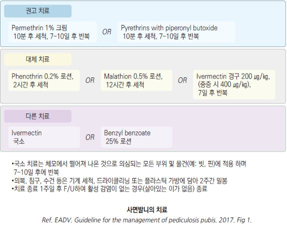
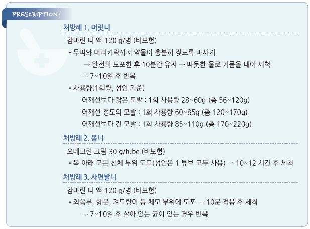

# 이감염증 Pediculosis, Lice

## 일반 사항
- Pediculus 에 의한 흡혈성 체외 기생충 감염

- 호발 : 머릿니는 3~12세 및 여아, 사면발니는 성인에서 호발

- 전염 경로 : 신체 접촉에 의하여 기생충 전파

- 서식 장소 : 주로 머릿니와 사면발니는 체모, 몸니는 의복에 서식

- 예후 : 적절한 치료 시 ＞90% 치료

## 원인

#### 원인균
- 머릿니, 몸니 : Pediculus humanus capitis , Pediculus humanus corporis ; 길이 3~4 ㎜

- 사면발니 : Pediculus pubis ; 길이 1.5~2 ㎜

### 위험 인자
- 긴 머리카락

- 밀집 생활, 학교, 유아원

- 용품 공동 사용 : 빗, 모자, 헬멧, 의복, 침구류, 수건

- 불결한 위생, 노숙자

- 불량한 성생활

## 임상 양상
- 머릿니의 경우 대부분 무증상

- 가려움(특히 야간), 긁은 흔적(미란)

- 국소 홍반, 작은 구진

- 긁음과 관련된 2차적 감염 및 염증

## 진단
- 머릿니/사면발니 : hair shaft의 base 부위에 단단하게 부착되어 있는 충란(서캐) 관찰

- 몸니 : 의복의 솔기/주름/이음매 등에서 성충/충란 관찰; 먹이를 먹을 때만 피부로 올라오기 때문

에 몸에서는 찾기 어려움

- 주변에서 환자 발생

### 감별
- 머릿니- 지루피부염; 몸니- 옴, 빈대; 사면발니- anogenital pruritus & eczema

---

## Management

### 치료 방침
- 환자 활동 제한

- 접촉자 및 접촉 물품 조치

- 1주 후 치료 결과를 평가하고 성충 또는 충란 발견 시 재치료

- 치료가 잘 되지 않는 경우 신체 다른 부위의 털이 있는 부위도 치료

- 치료 8~12시간 후 살아 있는 성충이 발견되는 경우에 치료 실패, 약물 내성으로 판정

- 외용제로 치료 실패 시 경구제(예: ivermectin) 치료 고려

## 예방 및 관리

#### 접촉 물품 조치
- 의복, 수건, 침구, 빗, 헤드기어 등 환자가 48시간 내 접촉한 모든 물품들에 대하여 조치

- 뜨거운 물(60℃) 세탁, 드라이클리닝, 또는 고온(＞55℃)에서 30분간 말림

- 세척할 수 없는 물품은 2주 동안 플라스틱 용기에 넣고 밀봉

- 가구/카펫에 대하여 진공청소기 청소

#### 접촉자 조치
- 침구를 함께 사용하는 가족은 기생충이 발견되지 않아도 치료

- 사면발니 감염 시 30일 내 성 접촉을 한 파트너에 대하여 평가 및 필요시 치료

#### 환자의 활동 제한
- 머릿니 : 사회 격리(출근/등교 제한)는 하지 않거나 초회 치료 후 재개함(확정된 방법은 없음)

- 사면발니 : 성 접촉 금지

## 비-약물 치료
- 머릿니 물리적 제거 : 참빗 등 0.2~0.3 ㎜ 간격의 촘촘한 빗으로 서캐 제거(특히 두피에서 1 ㎝ 이내 근위부).

    정전기 발생을 피하기 위하여 머리카락이 젖은 상태로 시행; 약물 치료와 함께 3~4일마다 2주간 시행

- 사면발니 : pubic shaving 고려

## 약물 치료
- 외용제는 피부를 통한 흡수를 최소화하기 위하여 피부와 모발이 건조한 상태에서 사용하며 눈에 들어가지 않도록 주의

### 머릿니
** Pyrethrin 0.33% & Piperonyl butoxide 4%**

- 용법 : 두피와 머리카락에 약물이 충분히 젖도록 마사지 → 도포한 후 10분간 유지 → 따듯한 물로 거품을 내어 세척

    → 7~10일 후 살아 있는 균이 있는 경우 반복 [감마린 디 액](비보험)

  •약물 치료 후 죽은 머릿니 또는 서캐를 촘촘한 빗으로 제거

- 부작용 : 피부 자극

- 주의/금기 : 알레르기; 사용 연령 ≥2세

** Permethrin 1%**

- 용법 및 주의 사항 : pyrethrin과 동일 [오메크린 크림](5%)(비보험); ≥2개월 연령 사용

** Phenothrin 0.2%**

- 용법 : 2시간 적용 후 세척

** Malathion 0.5%**

- 용법 : 8~12시간 적용 후 세척 → 7~9일 후 살아 있는 균이 있는 경우 반복; ≥6세 사용

- 부작용 : 악취, 자극감, 섭취 시 호흡 저하

** Benzyl alcohol**

- 용법 : 10분 적용 후 세척 → 7일 후 살아 있는 균이 있는 경우 반복; ≥6개월 연령 사용

- 부작용 : 피부 자극, 일시적 피부 감각 저하

** Spinosad**

- 용법 : 10분 적용 후 세척 → 7일 후 살아 있는 균이 있는 경우 반복; ≥6개월 연령 사용

- 부작용 : 피부 자극

** Ivermectin 0.5%**

- 용법 : 10분 적용 후 세척, 반복하지 않음; ≥6개월 연령 사용 [수란트라 크림](비보험)

- 부작용 : 피부 자극, 건조

** Lindane 1%**

- 낮은 효과와 부작용 때문에 1차 약제로 권하지 않음

- 용법 : 4분 적용 후 세척, 반복하지 않음 [린단 로오숀]

- 부작용 : 자극, 신경 독성

- 주의/금기 : 면역 저하, 발작 위험 환자, 손상된 피부, 소아, ＜50 ㎏

### 몸니
- 몸니는 주로 의복에 서식하므로 보통 의복/침구류 소독으로 해결됨

- permethrin 5% : 머리 부분 제외 전신 도포 → 10(8~14)시간 후 세척 [오메크린 크림](비보험)

- pyrethrin : 전신 도포 → 수 시간 후 세척

- steroid 도포제 : 구제 후 가려움에 대하여 저역가 제제를 증상이 있는 곳에 수일간 1일 2회 도포

  •prednicarbate [티티베 크림]

### 사면발니
- 외음부 및 항문 주위에 도포, 필요시 다른 부위(예: 겨드랑이)의 체모에도 도포할 수 있음

#### 1차 선택제
- permethrin 1% 크림 : 10분 적용 후 세척 → 7~10일 후 살아 있는 균이 있는 경우 반복 [오메크린 크림](5%)(비보험)

- pyrethrin 0.33% & piperonyl butoxide 4% : permethrin과 동일 [감마린 디 액](비보험)

#### 대체제
- permethrin 0.2% 로션 : 2시간 적용 후 세척

- malathion 0.5% 로션 : 12시간 적용 후 세척

- ivermectin 경구 : 200 ㎍/㎏(중증 시 400 ㎍/㎏), 7일 간격으로 2회 투여

### 눈썹
- 사면발니 감염 시 petrolatum bid~qid ×10d 도포 [바셀린]

        

> **질병코드 **
B85.0 머릿니에 의한 이감염증

B85.1 몸니에 의한 이감염증

B85.3 사면발니증

B85.4 혼합 이감염증 및 사면발니증

