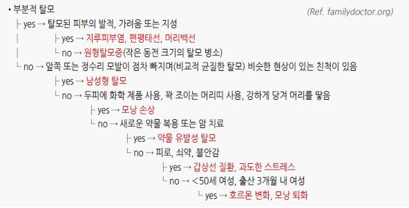
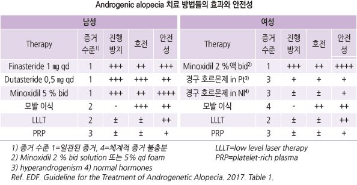
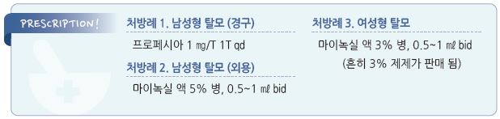

# 탈모증 Alopecia

## 일반 사항

### Hair cycle
•growth (Anagen; 성장기) : 전체 모낭의 90% 차지. 0.3 ㎜/d 성장. 지속 기간 2~6년

  → involution (Catagen; 퇴행기) : ＜1% 차지. 지속 기간 3주

  → rest (Telogen; 휴지기) : 10% 차지. 지속 기간 2~3개월

  → 탈락(보통 50~150개/d 소실) → new hair(Anagen)로 진입

## 분류 및 원인

#### 비흉터성 탈모 (nonscarring)
- focal alopecia : alopecia areata, alopecia syphilitica, pressure-induced(postoperative) alopecia, 

    temporal triangular alopecia, traction alopecia

- patterned alopecia : 남성형 탈모(androgenetic alopecia), 여성형 탈모, trichotillomania

- diffuse alopecia : telogen effluvium(가장 흔함), anagen effluvium, loose anagen syndrome

#### 흉터성 탈모 (scarring, cicatricial)
- 기전 : 두피의 염증, 섬유화, 모낭 파괴

- 1차성 : alopecia mucinosa, central centrifugal cicatricial alopecia, discoid lupus erythematosus

- 2차성 : 머리백선, 암, 방사선 조사, 외상 흉터

- 임상 양상 : 가려움, 통증, scale, crust, 모공 소실(매끈한 두피)

#### 구조적 탈모 (structural)
- 기전 : 모발 형성 이상 또는 손상에 기인한 모발 약화 또는 부서짐

- Menkes Dz, monilethrix, trichothiodystrophy, trichorrhexis nodosa, trichoptilosis

### 위험 인자
- 유전

- 스트레스 

- 영양 결핍

- 두피의 외상 또는 감염

- 만성 질환 : 자가면역 질환, 감염, 암

- 약물, 화학요법, 방사선 치료

## 주요 탈모 형태

### 남성형 탈모 (male pattern hair loss)
- 주요 병인 : androgen 수용체↑, 5-alpha reductase↑

    → 모낭에서의 testosterone의 dihydrotestosterone(DHT; 강력한 androgen)으로의 전환↑

    → 모낭 크기 변화(다양한 크기의 모낭 존재), vellus follicle(가는 모발) 비율 증가

    → 점차 follicle size 및 vellus hair 감소

    → 탈모

- 시작 연령 : 20~25세

- 탈모 부위 : 전두-양측두부와 두정부 등 androgen 민감 부위 (hairline 후퇴); 대칭적

  •상대적으로 후두부는 유지됨

### 여성형 탈모 (female pattern hair loss)
- 주요 병인 : androgen → estrogen 생합성 작용의 촉매인 aromatase↓ → DHT↑

- 시작 연령 : 40세; 65세 이상 여성의 70%에서 발생

- 탈모 부위 : 두정부; 보통 anterior hairline은 유지됨

- 모발 상태 : 남성형 탈모와 동일

### 휴지기 탈모 (Telogen effluvium)
- 병인 : 많은 모낭들의 휴지기 연장

    → 약한 견인(예: 빗질)에도 모발이 탈락

    → 모발 탈락 후 모낭이 성장기로 돌아가지 못함

- 관련 인자 : 신체 스트레스(고열, 심한 감염, 수술, 다이어트/영양실조), 만성 질환, 갑상선 질환, 호르몬 변화(산욕기),

    철 결핍, Vit D 결핍, 약물(lithium, sodium valproate, fluoxetine, warfarin, metoprolol, propranolol, retinoids, isoniazid, 중금속)

- 증상 : 광범위한 모발 가늘어짐, 휴지기 모발의 증가(전체 모발의 20~50% 차지), ＞150개/d 소실; latent period- 4개월

- 경과 : 원인 소멸 후 자연 치유(회복까지 6~9개월 소요)

- 기저 대사 질환이 있는 경우가 있음. 예) 갑상선 이상, 철분 결핍

### 견인 탈모 (Traction alopecia)
- 병인 : 만성적인 견인 습관; 머리 말기/땋기, 고무 밴드

- 증상 : 견인된 두피에서의 모발 소실. 견인 지속 시 흉터성 탈모 유발

- hair pull test : 정상 또는 부서진 모발

### Trichotillomania
- 증상 : 탈모 반이 불규칙한 모양. 모낭 출혈, 모낭 변형, 탈모 반에 짧은 모발/끊어진 모발/자라나는 모발이 있음

- dominant hand와 같은 쪽에 발생

### 원형탈모증 (Alopecia areata)
    (☞ p.986)

### 머리백선
- 병인 : 백선균의 모발 침범

- 증상 : 비늘, 부서진 모발이 있는 산재된 반, 농포를 가진 움푹한 판(백선종창) 등 다양한 상태

## 진단
검사

- 보통 필요 없음; 병력 및 신체검사로 진단이 불확실한 경우 고려

- 실험실 검사 : TSH, CBC, anemia study(ferritin, TIBC, Fe, reticulocyte)

  •선택 : LFT, 전해질, Zn, VDRL, ANA, prolactin, free testosterone, DHT sulfate(특히 여성)

- 조직 검사 : 특히 흉터성 탈모에서 고려

- Hair pull test : 엄지와 집게손가락으로 25~50개의 머리카락을 잡고 부드럽게 당김;

    1~2개 탈락 시 정상, ≥6개 탈락 시 비정상, 머리카락 부서지는 경우 구조적 이상 의심

- trichoscopy : 모발 두께 이질성- ≥20%, vellus hairs- ＞10%, 한 개의 hair shaft만 있는 follicular unit의 비율 증가,

    empty follicle, yellow dots, 모낭 주위 변색(peripilar sign), circle hair, honey comb pigment pattern;

    후두부에 비해 전두부에 이상 변화가 많음

### 증상/병력에 따른 감별
    

---

## Management

### 치료 방침
- 원인이 될 수 있는 약물 투여 회피, 모발/두피에 대한 자극 중단

- 기저 질환 치료(예: 갑상선 질환, 빈혈)

- 영양 섭취가 부족한 경우 이를 보충; 적정 이상의 영양 섭취는 도움이 되지 않음

## Androgenic alopecia
- 조기에 치료하는 것이 효과적 (비보험)

#### 경구 5α-reductase inhibitor (5-ARI)
- 작용 : DHT 생성 억제 (✽androgen 수용체에 대한 친화성이 없고 testosterone의 작용은 방해하지 않음)

- 효과 : 지속 복용 시 80% 이상에서 탈모 중지 또는 발모; 특히 vertex 부위에 효과

  •효과 발현까지 수개월, 충분한 효과 발현까지 1년 소요; 복용을 중단하면 수개월 내 탈모 진행

  •여성 : 효과 입증 불충분 (✽위약과 차이가 없다 vs 약간의 효과가 있다는 소수의 보고들이 있음)

- 부작용 : 성 기능 저하(1~3%, 약물 중단 후에도 지속되는 경우가 있음; 약물과의 인과 관계는 불명확), 여성형유방증, 우울

- 주의 : 간질환

  •전립선암 : 전립선암의 위험을 낮추지만, 복용 중 PSA 감소에 따른 전립선암 발견 지연 가능성이 제기됨;

    투여 전 및 매년 PSA 검사 권고

- 금기 : 임신 (✽임신 중인 여성이 사고로 섭취한 경우에 기형아 출산율이 증가하지는 않았다는 보고가 있음)

- finasteride : 5α-reductase type 2 enzyme 억제. 반감기 6시간;

    1 ㎎ qd 식사 무관 (평균 모발 밀도 변화 +18.37 hairs/㎠) [프로페시아]

  •finasteride 0.2~5 ㎎/d 간의 발모 효과 차이는 미약함

- dutasteride : 5α-reductase type 1 & 2 enzyme 억제. 반감기 5주; 0.5 ㎎ qd [아보다트]

>     ✽일부 연구에서 finasteride 1 ㎎보다 우월한 효과를 보임

#### 국소 Minoxidil
- 작용 : 성장기 연장, 휴지기 단축, 축소된 모낭 확대

- 효과 : 60%에서 탈모 중지 또는 발모

  •탈모 시작 후 가능한 한 빨리(5년 내) 시작할수록, 탈모 면적이 적을수록 효과적

  •치료 초기 2달 정도 휴지기 모낭이 성장기로 진입하면서 일시적으로 모발 탈락이 증가함

    → 4~8개월간 모발 성장 → 12~18개월 후 안정

  •6개월 후 평가하여 효과가 있으면 효과 유지를 위하여 지속할 수 있음

- 부작용 : 접촉 및 자극 피부염(상처 부위에 도포하지 말 것)

- minoxidil : 1일 2회 도포; 남성 2% 액(평균 모발 밀도 +8.11 hairs/㎠), 5% 액(+14.94), 5% 폼;

    여성 2% 액(+12.41), 5% 폼(qd) [마이녹실]

 ✽여성에서 2%와 5%의 효과 차이는 미약하며, 흔히 3% 제제가 판매 됨

 ✽효과가 없는 경우는 권장하는 용법으로 꾸준히 도포하지 않았기 때문일 수 있음

#### 경구 minoxidil 
- androgenic alopecia에 있어서 효과는 용량에 비례함; 1 ㎎ 증량 시 24주 후 total/ terminal hair density 47.1/9.1 hairs/㎠,

    hair thickness 1.4 ㎛ 증가 [미녹시딜 정](허가안됨)

  • [남] 1~2 ㎎ qd로 시작, 반응에 따라 2~3개월마다 0.5 ㎎씩 증량, 필요시 최대 2.5~5 ㎎ qd

  • [여] 0.5~1 ㎎ qd로 시작, 반응에 따라 2~3개월마다 0.5 ㎎씩 증량, 필요시 최대 1.5~2 ㎎ qd

- 식사 무관 복용. 기립성 저혈압 위험을 줄이기 위하여 취침 전 복용 고려

- Tmax 1hr, 반감기 4hr, 약리 작용 시간 72hr

- 여름철 전해질(K, Mg) 함유 음료 섭취 고려

- 혈압 모니터링 : 첫 주 동안 매일, 한 달 동안 매주, 이후 한 달에 한 번 측정 고려; 투여 2~3개월 후 CBC, LFT, RFT 고려

    (이후 필요시 검사)

- 결과가 만족스럽고 큰 부작용이 없는 경우 장기간 복용 가능

- 부작용 : 다모증(0.25~0.75 ㎎ 투여 시 28.9%, 1~1.25 ㎎ 30.4%, 2.5~5 ㎎ 86.8%; 투여 중지 1~6개월 정도 후에 이전 상태로

    복귀함), 심혈관 문제(저혈압, 부족, 피로, 빈맥, PVC; 0.25~0.75 ㎎ 투여 시 4.0%, 1~1.25 ㎎ 시 10.8%, 2.5~5 ㎎ 시 34.2%) 

#### 경구 anti-androgen
- 작용 : androgen 작용 차단, testosterone 생성 억제

- 여성에서 적용

- 부작용 : 어지럼, 졸음, 유방 압통, 불규칙 월경, s-K↑

- 주의/금기 : 신부전, 임신

- spironolactone : 100 ㎎ bid [알닥톤]

#### 국소 17α-estradiol
- 작용 : weak estrogen, 5α-reductase inhibitor

- 효과 : 탈모 중지 또는 감소(남녀 모두 해당); 국소 미녹시딜의 절반 정도의 효과를 보임

- alfatradiol : 0.025% qd [엘크라넬]

#### 국소 항진균제
- 작용 : 모낭의 DHT level 감소

- 국소 미녹시딜과 함께 사용 시 효과

- 여성에서 적용

- ketoconazole [니조랄 액]

#### 병용 요법/기타
- 남성에서 경구 finasteride 1 ㎎/d와 국소 minoxidil bid 병용 시 보다 효과가 있다는 보고가 있음

- 여성에서 국소 minoxidil과 경구 보조제*를 9개월간 병용하였을 때 telogen에 개선이 있었다는 보고가 있음

>   *경구 보조제 : medicinal yeast 100 ㎎, thiamine nitrate 60 ㎎, Ca pantothenate 60 ㎎, para aminobenzoic acid 20 ㎎, cyctine 20 ㎎,

>     keratin 20 ㎎ [판시딜]
- Low-level light device(low frequency red light) : 작은 연구에서 평균 모발 밀도 변화 +17.66 hairs/㎠

## 기타

### 외상성 탈모
- 원인 제거

- 발모벽 : 모발을 짧게 깎음, 정신 치료

### 머리백선
- 머리백선 치료 (☞ p.926)

> **질병코드**
L64 안드로젠탈모증

L65 기타 비흉터성 모발손실 

