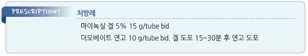

# 원형탈모증 Alopecia Areata

## 일반 사항

* 원형의 국소 탈모
*   빈도 : 일생에서 원형탈모증이 발생할 확률은 1\~2%

    •주로 소아/젊은 연령층에서 발생 (절반 이상이 20세 이하에서 발생)
* 경과 : 50%에서 12개월 내 자연 치유. 국소 병변의 경우 80%에서 완전 회복; 재발할 수 있음
* 나쁜 예후 : 어린 연령에서 발생, 넓은 범위, 탈모 상태 지속, 여러 차례 발생

## 원인

* 원인 : 불명
* 추정 기전 : 자가면역 질환으로 T-cell이 모낭의 생장 부위를 둘러싸 모발 생장을 정지시킴

### 위험/관련 인자

* 자가면역 질환 : 하시모토 갑상선염, 백반증, 1형 당뇨, 악성빈혈(Vit B12 결핍), 궤양성 대장염
* 아토피 피부염, 천식, 알레르기 비염
* 감염, 약물, 백신, 심리적 스트레스, Vit D 결핍
* 가족력

## 임상 양상

* 빠르고 완전한 머리카락의 소실, 둥근 반 형성
* 병변 내 피부는 정상 모습(nonscarring)
* 2\~3 ㎜ 길이의 작은 털들이(exclamation hairs) 보일 수 있음
* 병변 주위의 모발이 쉽게 빠짐
* 흔히 손톱 변형 동반 : 소와(pitting), 길이 방향의 줄, 백색 변화(leukonychia)
* 치유가 되면서 병소에서 나오는 모발은 처음에는 가늘고 흰색이며 점차 정상 모발로 대체 됨

## 진단

* 탈모 모양
* 조직 검사 : 보통 불필요
* 실험실 검사 : 갑상선, 빈혈 검사(ferritin, TIBC, Fe, reticulocyte) 고려

### 감별

* 매독 : moth-eaten pattern; 두피 여러 부분의 좀이 먹은 듯한 탈모

***

## Management

### 치료 방침

* 보통 자연 치유되므로 소아에서는 치료가 필요하지 않을 수 있음
* 1차 치료 : steroid 피내 주사 또는 국소 도포
* 대체 또는 병용 : 국소 minoxidil
* 광범위/재발성 병변 : 면역 치료 또는 의뢰

## 약물 치료

### 국소 치료

#### Steroid 피내 주사

*   용법 : triamcinolone 2.5\~5 ㎎/㎖ 농도 용액을 deep dermal layer에 30 G 바늘로 1 ㎝ 간격으로 0.1 ㎖ 주사(1 ㎠ 당 0.1 ㎖ 주입),

    1 session에 최대 20 ㎎ 주사; 4(\~6)주마다 주사
* 효과 : 3회 주사 시 80% 환자에서 효과; 유효한 경우 6\~8주 내 반응이 나타남
* 주사 기간 : 모발 성장이 완료되면 중단; 6개월 내 반응이 없으면 실패 판정 및 중단
* 낮은 효과 예측 인자 : 빠르게 진행한 병변, 광범위, 오래된 병변
*   부작용 : 통증, transient atrophy(10%), 저색소증

    •통증 경감을 위하여 주사 전 국소 마취제를 도포할 수 있으며 주사 전 닦아 냄 \[엠라]

#### Steroid 도포

* 용법 : 초고역가 제제로 bid 적용; clobetasol \[더모베이트 연고], diflucortolone \[디푸코 연고]
*   효과 : 부분 원형탈모증의 60\~70%에서 효과

    •효과 발현까지 최소 3개월 지속 치료. 유지요법이 필요할 수 있음
* 부작용 : 국소 모낭염(수 주 후 발생), telangiectasia, 국소 위축

#### Minoxidil

* 일부 환자에서 유효
* 국소 steroid와 병용 가능
* 용법 : 5% 용액 bid \[마이녹실]
* 부작용 : 자극성 피부염, 기존의 피부염 악화

#### Anthralin

* 국소 자극 작용; 일부 소아에서 유효
* 용법 : 1일 1회, 20\~30분 동안 피부 적용 후 중성 비누로 세척
* 부작용 : 착색

#### Immunotherapy

* allergen으로 작용; squaric acid dibutyl ester, diphenylcyclopropenone
* 광범위 또는 재발성 원형탈모증에서 고려
* 기전 : 지연 과민 반응 유발 → 두피 알레르기 피부염 유발 → 모낭 염증 반응 → 발모
* 효과 : 40\~60%에서 효과; minoxidil이나 anthralin보다 유효
* 부작용 : 가려움(경미, 1\~2일간 지속됨), 심한 피부염(세척 후 steroid 도포로 완화), 림프절증, 두드러기, 백반증, dyschromia
*   diphenylcyclopropenone(DPCP)

    •용법 : 2% 용액을 탈모반에 지름 4㎝ 정도 크기로 도포 → 2주 후부터 1\~2주마다 점차 농도를 높여가면서 병소에 도포(예:

    0.001%, 0.01%, 0.1%, 0.2%, 0.5%, 1%, 2%); 도포 후 모자 등으로 자외선 노출을 피하며, 도포 24\~48시간 후 세척

### 전신 치료

* 광범위 탈모에 대하여 고려

#### 경구 Steroid

*   대용량 prednisolone 간헐 요법 : 60%에서 매우 좋은 효과가 있으며 안전하다는 보고가 있음

    •월 1회 5 ㎎/㎏(300 ㎎) ×3\~6개월 \[소론도]
* prednisolone + PUVA light therapy 병용이 효과가 있다는 보고가 있음

#### Janus kinase inhibitor

* tofacitinib, ruxolitinib, baricitinib
* 중증 질환에서 고려 (☞ p.822, p.871)

> **질병코드** L63 원형 탈모증

\*\*\[보험기준] 원형탈모증 급여여부 \*\*(2000-12-30)

원형탈모증 중 노화현상에 의한 탈모증은 국민건강보험요양급여의기준에관한규칙 \[별표2] ‘비급여 대상.

1-나’에 의거 비급여대상이나, 병적 탈모증은 자각 증상 없이 탈모반이 한 개 또는 여러 개 발생하여 병소가

확대 또는 융합하여 큰 털 모반을 형성할 수 있는 병적인 탈모이므로 병변의 경·중에 관계없이 급여 대상임.
