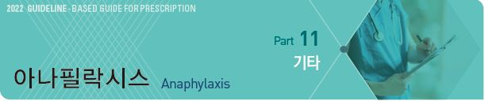
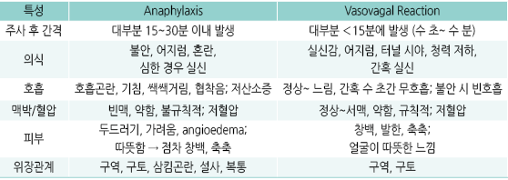
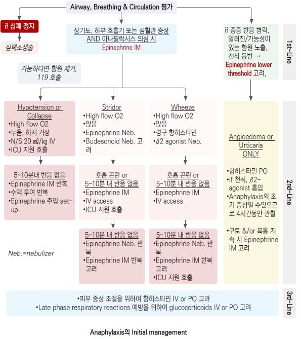
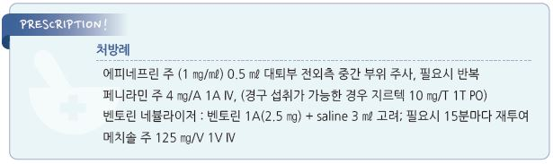

# 아나필락시스 Anaphylaxis

## 일반 사항
- 감작된 사람에서, 특이 항원에 대한 전신적 노출 후 수 분~수 시간 내(주로 5~30분) 혈관 허탈 또는 쇼크가 발생하는, 치명적인

    다기관 과민 반응; 호흡기, 심혈관, GI, 피부 점막 알레르기 반응

- 예측할 수 없음. 알레르기 병력이 있는 환자에서 발생하는 경우가 많지만 인지하지 못하고 있는 사람에서도 발생할 수 있음;

    첫 episode에서도 치명적일 수 있음

- 유병률 : 평생 유병률 1.6~5.1% [미국]

- Biphasic anaphylaxis : 첫 아나필락시스 호전 1~72시간 후 재발한 anaphylaxis; 1~20% 빈도

## 원인
- 음식 : 견과류(특히 땅콩), 갑각류, 효소, 우유, 계란

- 약물 : 항생제, 백신, 호르몬, aspirin, NSAID, opioid, 조영제, 신장 투석 관련 약제, 근육 이완제, 면역 글로블린, protamine,

    덱스트란

- 수혈 반응, 뱀독, 벌독, 항원 추출물(곤충에서 얻은 착색제), 라텍스

- 운동(특히 음식 섭취 또는 약물 복용 후 운동), 온도(추위, 열)

- 심리적 요인

### 위험 인자
- anaphylaxis 병력

- 알레르기 질환 병력(예: 천식, 아토피)

- 다제약물 복용, 고령(약물 사용 증가와 관련), 음주

- mastocytosis

#### 중증 아나필락시스 위험 인자
- 심혈관 질환, 천식, 고령, 동반 질환

## 임상 양상 및 진단
- 치료의 긴급성 때문에 임상적으로 진단함

- 필요시 반응 직후 tryptase/histamine 검사, 4~6주 후 피부 검사 고려

** 진단 criteria [NIAID/FAAN]**

- 다음 3가지 criteria 중 하나 이상에 해당 (민감도 95%, 특이도 71%)

1. 피부 또는 점막 증상(예: 전신 두드러기, 가려움, 홍조, 입술/혀/목젖 부종) & 다음 중 ≥1개의 증상이 갑작스럽게(수 분~

    수 시간 내) 발생

 ① 호흡기 증상(예: dyspnea, wheeze-bronchospasm, stridor, PEF↓, hypoxemia)

 ② 혈압↓ 또는 end-organ 기능 부전 관련 증상(예: hypotonia [collapse], 실신, 요실금)

2. 알레르겐으로 생각되는 물질에 노출된 후 다음 중 ≥2개의 증상이 빠르게(수 분~ 수 시간 내) 발생

  ① 피부 또는 점막 증상 

  ② 호흡기 증상 

  ③ 혈압↓ 또는 end-organ 기능 부전 관련 증상

  ④ 지속적인 위장 증상 : 경련성 복통, 구토

3. 해당 환자에서 알레르겐으로 알려진 물질에 노출된 후 수 분~수 시간 내 혈압 감소

  ① 신생아, 소아 : 낮은 SBP* 또는 SBP에서 ＞30%↓

  ② 성인 : SBP ＜90 ㎜Hg 또는 기저 혈압에서 ＞30%↓

>     *낮은 SBP 기준 •1개월~1세: 70 ㎜Hg •1~10세: (70 + [2 × age]) ㎜Hg •11~17세: 90 ㎜Hg

>     Ref. Summary report-second national institute of allergy and infectious disease/food allergy and anaphylaxis network symposium.

>         J Allergy Clin Immunol 2006;117:391.

#### Anaphylaxis vs Vasovagal reaction
    

---

## Management

## Anaphylaxis treatment protocol

>         (Ref. Anaphylaxis- a practice parameter update. Ann Allergy Asthma Immunol 2015;115)

#### Immediate measures
1. Allergen 제거 : (가능하다면) 원인이 된 항원 제거

2. Airway 확보 : airway, breathing, circulation, orientation 평가; 필요시 비침습적이고 효과적인 방법으로 호흡 지지(예:

    ‘bag valve mask’)

3. 심폐소생술 : 언제라도 심정지 시 즉시 흉부 압박 시작(빈도 100회/분)

4. Epinephrine IM : 1:1,000(1 ㎎/㎖) 제제 0.01 ㎖/㎏(최대 성인 0.5 ㎖, 소아 0.3 ㎖) 대퇴부 전외측 중간 부위

>     ✽대퇴부 IM 주사가 상박 IM or SC 주사보다 최대 혈장 농도가 높음
  •anaphylaxis가 의심되거나 우려되는 경우에는 충분히 진단되지 않는 경우에도 epinephrine을 투여할 수 있음

5. 도움 요청

6. 자세 확보 : recumbent position; 임신 중이면 왼쪽, 소아에서는 편한 자세로 눕힘

>     ✽대부분의 사람에서 lateral recumbent position이 airway protection에 유리함
6. 119 호출 : 첫 번째 epinephrine 주사에 반응 없거나 심한 anaphylaxis(WAO grading scale ≥2)

>     ✽World allergy organization(WAO) grading scale Grade 2 : 다음 중 ≥2개 기관에서 증상 발생 시 해당

>     ⑴ 피부: ① 두드러기, 발적-열감 &/or 가려움 &/or ② 작열감 or 입술 가려움 or ③ 혈관부종(후두 제외),

>     ⑵ 상기도: ① 코 증상(예: 재채기, 콧물, 코 가려움, 코 막힘) &/or ② 목 청소(목 가려움) &/or ③ 기침(bronchospasm과 무관),

>     ⑶ 결막: 발적, 가려움, or 눈물,

>     ⑷ 기타: ① 구역, ② 쇠 맛
7. 산소 공급 : 마스크로 8~10 L/분, 필요시 100% O2; (가능하다면) pulse oximetry 모니터링

7. Epinephrine IM repeat : 환자가 반응하지 않으면 5~15분마다 최대 3회까지 재주사

7. 수액 IV : 생리 식염수로 라인 확보; 저혈압 또는 epinephrine에 반응하지 않는 경우 1시간 동안 1~2 L(소아 30 ㎖/㎏) 투여

    (첫 5분 동안 5~10 ㎖/㎏ 투여)

#### Additional measures
8. β-agonist 네뷸라이저 : 하기도 폐쇄에 대하여 albuterol 2.5~5 ㎎/saline 3 ㎖ 고려*; 필요시 15분마다 재투여

>     *국내 시판제로서 salbutamol 2.5~5 ㎎ [벤토린](2.5 ㎎/A) ☞ p.349
9. Glucagon IV : epinephrine에 반응하지 않는 β-차단제에 의한 경우 고려; 1~5 ㎎을 5분 이상에 걸쳐 천천히 주입(빠르게

    주입 시 구토가 유발될 수 있음)

10. Epinephrine IV : epinephrine IM 및 수액 치료에 반응하지 않는 경우; epinephrine 1 ㎎ + N/S 1 L을 120 ㎖/hr 속도로 IV

    → 600 ㎖/h까지 증량; 혈압/심박수/산소 농도에 따라 조절

11. Intraosseous access : IV 라인 확보를 하지 못한 경우에 epinephrine 및 수액 투여를 위해 확보

#### Refractory anaphylaxis
12. Advanced airway management : 심한 stridor, 심한 후두 부종, 또는 bag valve mask로 부족할 때 고려;

    supraglottic airway, endotracheal intubation, cricothyroidotomy

13. Vasopressor : 위의 방법으로 혈압이 회복되지 않는 경우에 심장 모니터링이 가능한 상황에서 (epinephrine에 추가로)

    dopamine 주입을 고려

#### Optional treatment
14. H1-항히스타민제 : diphenhydramine 25~50 ㎎(소아 1 ㎎/㎏) IV; 경구 투여가 가능하다면 cetirizine 10 ㎎ PO;

    급성 가려움증과 두드러기를 줄이는데 도움이 될 수 있음

>    ✽항히스타민제는 작용에 1~2시간이 필요하며 호흡기나 심혈관 증상 호전에 유효하지 않음

>    ✽국내 시판제로서 chlorpheniramine 성인 10 ㎎, 소아 2.5~5 ㎎ [페니라민 주](4 ㎎/A)
15. Steroid : methylprednisolone 1~2 ㎎/㎏(최대 125 ㎎) IV or PO [메치솔 주]

>     ✽steroid의 작용 개시가 느리고 임상적 유효성을 뒷받침할 근거는 부족함

#### Observation & Monitoring
16. Observation in hospital : 응급 이송 치료 및 8시간 관찰

17. Observation in office : 응급 이송 대상자가 아닌 환자들은 완전한 회복 후 추가 30~60분간 외래에서 관찰

※ 환자의 20%(특히 심한 증상, epinephrine 다회 주사가 필요했던 환자, epinephrine 투여가 지연되었던 환자)에서 수 시간

>     (~72시간) 후 biphasic reaction이 발생할 수 있으므로 경증 환자는 1시간, 중증 환자는 6시간 이상 관찰할 것을 권고

>     AAAAI/ACAAI(2020)]

#### Discharge management
18. 교육 : anaphylaxis 인지 및 치료 방법에 대하여 환자 및 가족 교육

19. 자가 주입 Epinephrine 준비 : anaphylaxis를 경험한 환자 또는 중증 anaphylaxis 위험이 있는 환자는 2회분의 자가 주사

    epinephrine을 준비. 환자 및 가족은 사용법 숙지 [젝스트 프리필드펜 주](300 ㎍-성인용, 150 ㎍-소아용)

20. Anaphylaxis action plan : 환자에게 epinephrine 투여 시기와 방법에 대한 action plan을 제공

    ([대한천식알레르기학회 교육자료](http://www.allergy.or.kr/mail/img/card_2017.pdf)[)](http://www.allergy.or.kr/mail/img/card_2017.pdf))

    

## 예방
- 약물 사용 주의 : 유사 계열 약물 사용 주의 (예: penicillin & cephalosporin)

- 야외 활동 시 다음을 피함 : 맨발, 향기 나는 화장품, 곤충이 많은 지역에서의 식사, (보호 장구 없이) 울타리 또는 풀 제거,

    과일 또는 쓰레기를 멀리 운반

- 자신의 과민 반응 정보를 기록한 팔찌 착용, 휴대용 epinephrine 주사 준비

- 유발 의심 물질 검사 : prick 또는 scratch skin test; IgE와 관련 없는 경우에는 유용하지 않음

- 이전에 조영제에 반응이 있었던 사람들에게 이를 다시 시행해야 하는 경우나 화학요법 등을 시행할 때 관련 반응 또는

    아나필락시스를 예방하기 위하여 사전에 steroid &/or 항히스타민제를 투여할 수 있음

> **질병코드**
T78.2 상세불명의 아나필락시스쇼크

T78.0  음식의 유해작용으로 인한 아나필락시스쇼크

[**보험기준] Epinephrine bitartrate 주사제 [젝스트 프리필드펜주] **(2020-01-01)

- 다음 중 어느 하나에 해당하는 경우로서 자가 투여를 목적으로 투여 시, 1회 처방 당 최대 2개까지 요양급여를 인정.

    재처방은 유효 기간 경과 등으로 폐기 사유가 확인되거나 이전에 처방 받은 동 약제의 사용이 확인된 경우에 한하여 인정

  ① 아나필락시스 치료 후 퇴원 처방 시

  ② 아나필락시스의 과거 병력이 있는 환자에게 처방 시
