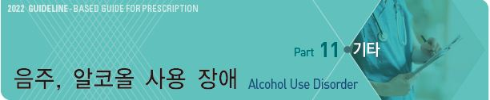
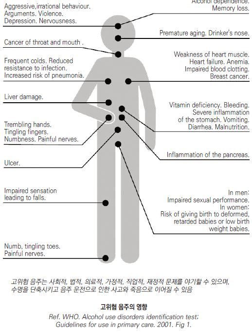
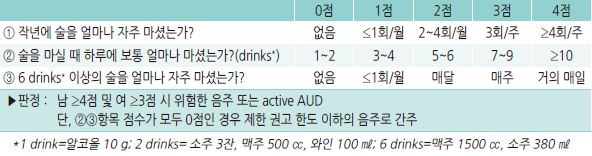
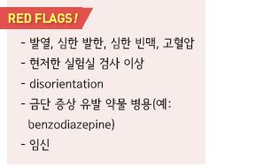
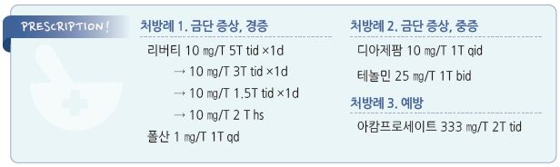

# 음주, 알코올 사용 장애 Alcohol Use Disorder, AUD



## 일반 사항

* 알코올 사용 장애 : 심각한 신체적, 정신적, 사회적 장애를 일으키는 알코올 사용
*   DSM-IV에서 alcohol abuse 및 dependence로 나누었던 분류를 DSM-5에서는 alcohol use disorder(AUD)로 통합하고

    경증, 중등증, 중증의 하위 분류를 함
* 알코올과 카페인을 함께 섭취하면 카페인에 의해 알코올의 정신적 영향이 적게 드러나 더 많은 음주를 할 위험이 있음
* 유병률 (미국) : ≥18세 인구 중 7%, 20\~40세에서 최대
* 음주 수준에 대한 권고 : 음주를 시작하지 않은 사람은 ‘시작하지 말 것’, 마시는 경우에도 하루 한 잔 이하로 마실 것 \[AHA]

### 알코올 사용 장애의 위험 인자

* 가족력
* 스트레스, 위기 가족, 이혼, 실직, 장시간 노동(≥55시간/주)
* 흡연, 다른 중독
* 우울, 불안, 양극성 장애, 섭식 장애
* 반사회적 성향, 범죄자
* 남성(\[미국] 남성 8~~10%, 여성 3~~5%)
* 낮은 사회 경제적 상태
* 음주 동료, 음주 문화

### 음주 수준 \[NIH]

\*\* 주종에 따른 pure ethanol 양 \*\*

> ```
> ✽주류 ethanol의 pure ethanol = 0.79 g/㎖
> ```

* 5% 맥주 1캔 330 ㎖ = 330 ㎖ × 0.05% × 0.79 g/㎖ = 13 g
* 12% 와인 1잔 140 ㎖ × 0.79 g/㎖ = 13.3 g
* 20% 소주 1잔 50 ㎖ × 0.79 g/㎖ = 7.9 g

\*\* Standard Drinks (SD)\*\*

* 1 SD = pure ethanol 14 g(미국) (✽1 SD의 pure ethanol 기준은 국가/문화에 따라 차이가 있음)
* 20도 소주 1병(360 ㎖) = pure ethanol 57 g = 4 SD

#### 보통 음주 (Moderate alcohol consumption)

* 만성 질환의 위험을 줄이고 전체적인 건강을 유지하기 위한 음주의 상한
* 보통 체구의 ≤65세 남성 : ≤2 SD/d & ≤10 SD/wk
* 작은 체구, 여성, ＞65세 남성 : ≤1 SD/d & ≤5 SD/wk (✽고령은 알코올에 대한 감수성이 큼)

#### 저위험 음주 (Low-risk drinking)

* 낮은 수준이지만 알코올 사용 장애 위험이 있는 음주
* ≤65세 남성 : ≤4 SD/d & ≤14 SD/wk
* 여성, ＞65세 남성 : ≤3 SD/d & ≤7 SD/wk

#### 과음 (Heavy drinking)

* 여성 ≥8 SD/wk, 남성 ≥15 SD/wk
* 폭음 기준에 해당하는 음주를 최근 30일 동안 ≥5일

#### 폭음 (Binge drinking)

* 한 번(동일한 시간 또는 2시간 내)에 여성 ≥4 SD, 남성 ≥5 SD 음주
* 혈중 알코올 농도 0.08% 이상의 음주에 해당

### 과음의 영향

* 사망 : 일반인에 비하여 2배의 사망률, 10\~15년 조기 사망
*   뇌, 신경 : 우울, 양극성 장애, 폭력성, 판단 장애, 협응 장애(낙상, 작업 능력 저하), 뇌졸중, 기억력 저하, 치매,

    말초신경병증(사지 이상 감각); 고령자에서 특히 악영향
* 순환기, 내분비 : 심근증, 심부전, 부정맥, 고혈압, 빈혈, 혈액 응고 장애, 당뇨병
* 소화기 : 위염, 소화성 궤양, 설사, 구역, 지방간, 간염, 간경화, 췌장염
* 암 : 구강암, 식도암, 간암, 유방암
* 영양, 면역 : 영양 결핍(Vit 결핍), 면역 저하, 호흡기 감염(감기, 폐렴, 결핵, 호흡 곤란)
* 기타 : 사고 증가, \[남] 성 기능 저하, \[여] 기형아(특히 제1석달 음주)\*/저체중아 출산

> ```
> * heavy drinker 여성의 fetal alcohol syndrome 아기 출산률 : 10~50%
> ```

```

```

## 진단

### 알코올 사용 장애(AUD) 진단 기준 \[DSM-5]

*   최근 12개월 동안 다음 중 해당되는 사항이 2~~3개=경증, 4~~5개=중등증, ≥6개=중증

    ① 처음 의도했던 것보다 더 많이 또는 더 오래 술을 마셨다.

    ② 금주를 시도했으나 실패한 적이 2번 이상 있다.

    ③ 음주에 많은 시간을 소비했거나 음주로 인하여 아프거나 기타 후유증을 겪었다.

    ④ 다른 생각이 들지 않을 정도로 술을 마시고 싶었다.

    ⑤ 음주(또는 음주로 인한 문제)가 가정을 돌보는데 지장을 주거나 직장 또는 학교생활에 지장을 주었다.

    ⑥ 음주가 가족 또는 친구들과의 문제를 일으킴에도 불구하고 계속 술을 마셨다.

    ⑦ 음주를 위하여 자신에게 중요하거나 즐거움을 주는 일을 포기하였다.

    ⑧ 음주 중 또는 음주 후 다칠 가능성이 많은 행동(예: 운전, 수영, 기계 사용, 위험한 지역 걷기, 안전하지 않은 섹스)을

    한 적이 2번 이상 있다.

    ⑨ 음주가 우울 또는 불안감을 느끼게 하거나 다른 건강 문제 또는 일시적 기억 상실을 일으켰음에도 음주를 계속했다.

    ⑩ 평소와 같은 양을 마셔도 음주 효과가 적었거나 같은 효과를 얻기 위해 더 많이 마셨다.

    ⑪ 금주(알코올 효과가 사라짐) 후 수면 장애, 떨림, 불안정, 메스꺼움, 발한, 빈맥, 발작 같은 금단 증상을 겪었다.

### 알코올 사용 장애 선별 문진표

#### AUDIT(alcohol use disorders identification test) (10-item questionnaire)

```
☞ [AUDIT](https://www.drugabuse.gov/sites/default/files/audit.pdf)
```

#### Abbreviated AUDIT-C (three-item questionnaire)

```

```

#### CAGE questionnaire for alcohol problems screening

* Have you felt the need to Cut down on your drinking?
* Have people Annoyed you by criticizing your drinking?
* Have you ever felt bad or Guilty about your drinking?
* Have you had a drink first thing in the morning to steady your nerves or to get rid of a hangover (i.e., an “Eye opener”)?

#### 검사

#### 실험실 검사

* CBC, MCV↑, PT↑
* AST/ALT ratio(＞2.0), γ-GT↑, BUN↑, TG↑, 총 콜레스테롤↑, uric acid↑
* 영양 결핍 시 protein/albumin, P, Mg 감소
* thiamine(B1), pyridoxine(B6), folate(B9), cobalamin(B12)
* stool OB

#### 영상 검사

* 대상 : 복부 외상 병력, advanced stage
* 복부 CT, 초음파

#### 상부 소화기 내시경 검사

## 알코올 금단 증상 (Alcohol withdrawal syndrome)

*   기전 : 만성적인 알코올 섭취 → GABA 관련 억제 신경 전달 물질 시스템 하향 조절 및 glutamate 관련 excitatory 자극

    신경 전달 물질 시스템 상향 조절 → 이들 시스템이 금주로 인하여 알코올의 영향을 받지 못하게 되면(억제되지 않게

    되면) 뇌의 과흥분 발생

### 임상 양상

*   초기 tremulous state : 떨림, 가벼운 흥분, 두근거림, 발한, 불면, 두통, 위장 장애, 발열; 마지막 음주 후 6\~8시간 또는

    알코올 섭취를 줄인 후 12~~48시간에 발생 24~~36시간에 가장 현저; 음주로 호전
* 알코올성 환각: 청각(주로), 시간, 촉각, 후각; 마지막 음주 24\~36시간 후에 가장 현저
* 금단 발작 : 마지막 음주 후 7~~30시간(peak 13~~24시간); 의식 소실(generalized convulsion, no focal sign)
* 경과 : 4~~5일째 호전 → 5~~10일간 지속; 자율 신경계 이상 증상(불안, 불면)은 4\~6개월 지속

### 위험 인자

- 지속적인 많은 양의 음주

* benzodiazepine 의존
* 알코올 관련 뇌질환
* 다른 중증 질환 동반

### 진단 기준 \[DSM-5]

1. 과도하고 장기적인 알코올 사용의 중단(또는 감소)
2. 알코올 사용 중단(또는 감소) 후 수 시간\~수일 내 다음 중 ≥2개 발생

① 자율 신경 증상(예: 땀 흘림, 빈맥(HR ≥100회/분))

② 손떨림 증가

③ 불면

④ 구역 &/or 구토

⑤ 일시적 환각 또는 지각 장애(시각, 청각, 촉각)

⑥ psychomotor 흥분(예: 불안정감, 안절부절)

⑦ 불안

⑧ generalized tonic-clonic seizure

3. 이들 증상은 사회적, 직업적, 기타 중요한 기능 영역에서 임상적으로 유의미한 고통이나 장애를 유발
4. 이들 증상은 다른 의학적 상태에 기인하지 않으며 다른 정신 질환으로 더 잘 설명되지 않음

### 중증도 평가 도구

* [CIWA-Ar](https://www.mdcalc.com/ciwa-ar-alcohol-withdrawal)(clinical institute withdrawal assessment from alcohol-revised) scale : 10개 항목으로 평가; ≥15점 시 고위험

***

## Management

※ 입원 적응증 : 섬망이나 금단 발작 병력, 심한 금단 증상, 정신 또는 의학적 질병 동반, 임신, 최근 높은 수준의 알코올 섭취,

```
지원 네트워크 부족, 재발
```

## 급성 중독, 공격성 치료

#### Benzodiazepine

* 짧은 반감기 약제 선택
* 일정하지 않은 흡수율 때문에 IM 투여는 피함
* lorazepam : 1~~4 ㎎ q3~~4hr ×3\~5d PO or IV \[아티반]
* oxazepam : 15~~30 ㎎ tid~~qid PO

#### 항정신병제

* agitation, hallucinosis를 완화시킬 수 있으나 발작 역치를 낮출 수 있음
* olanzapine : 2.5\~10 ㎎ IM \[자이프렉사]
* haloperidol : 2\~5 ㎎ IM or IV \[페리돌]

## 금단 증상 치료

#### 진정제 : Benzodiazepine

* 1차 선택제 (☞ p.1149)
* 주의 : 중증 간장애
* long acting 제제 : 금단 발작 예방에 효과적; chlordiazepoxide, diazepam
* short acting 제제 : 고령, 중증 질환 동반, 간장애 등 지속되는 진정이 우려될 때 선호; lorazepam, oxazepam
*   용법 : 과진정 또는 졸림을 유발하지 않는 수준으로 증상에 따라 용량을 조절하여 증상이 호전될 때까지 투여(보통 2일 소요)

    → 이후 약제 금단 증상이 발생하지 않도록 3\~5일에 걸쳐 tapering(하루 50%씩)

\*\* Symptom-triggered regimen\*\*

* CIWA-Ar scale ≥8인 경우에만 매 시간 투여; BZD 투여량을 줄일 수 있음
* chlordiazepoxide : 50\~100 ㎎ \[리버티]
* diazepam : 10\~20 ㎎ \[디아제팜]
* oxazepam : 30\~60 ㎎
* lorazepam: 2\~4 ㎎ \[아티반]

\*\* Fixed-schedule regimen\*\*

* 증상에 따라 적절한 투여가 어려운 경우, 중증 관상동맥병, 금단 발작 병력이 있는 경우 고려
* 정해 놓은 일정에 따라 투여하고, CIWA-Ar scale ≥8인 경우에 추가 투여를 고려
* chlordiazepoxide : 50 ㎎ q6hr (×1d) → 25 ㎎ (×2d)
* diazepam: 10 ㎎ q6hr (×1d) → 5 ㎎ (×2d)
* lorazepam: 2 ㎎ q6hr (×1d) → 1 ㎎ (×2d)

#### 자율 신경 항진 치료 : β-차단제, α2-작용제

* 효과 : 떨림, 빈맥, 혈압 상승 등 자율 신경 항진 증상 완화 (☞ p.154)
* 단독으로는 사용하지 않고 benzodiazepine에 병용; 기저 섬망을 악화시킬 수 있음
* atenolol : 50\~100 ㎎/d \[테놀민]
* clonidine : 0.1\~0.6 ㎎/d \[켑베이]

#### Vitamin

* 효과 : 음주에 의한 Vit 결핍 보충, 신경계 증상 완화
* thiamine : 100 ㎎/d IV or IM ×최소 3d \[티아민염산염 주]

> ```
> ✽Wernicke encephalopathy 및 Korsakoff psychosis 우려가 있으므로 glucose 투여는 thiamine 투여 후 시행
> ```

* folic acid : 1 ㎎/d \[폴산]

## 금주 유도

* 약물 치료 시 반드시 환자가 약물의 부작용을 인지하고 있어야 함
* 단독으로 사용하지 않음. 행동 치료에 보조적으로 사용
* 투여 기간 : 6\~12개월간

#### Acamprosate

* 기전 : glutamate 및 GABA modulator
* 효과 : 알코올에 대한 갈망 감소
* 부작용 : 설사, 신경과민, 피로
* 주의/금기 : 신장 기능 저하, 신장 결석, 알코올 해독 기간
* 용법 : ≥60 ㎏- 666 ㎎ tid; ＜60 ㎏- 아침/점심/저녁 각각 666/333/333 ㎎ \[아캄프로세이트]

#### Naltrexone

* 기전 : opiate 수용체 대항제
* 효과 : 음주에 의한 황홀감 감소, 알코올에 대한 갈망 감소
* 부작용 : 구역, 두통, 어지럼, 간 효소 상승
* 주의 : 최근 7\~10일 내에 음주하지 않은 경우에만 투여
* 금기 : 급성 간염, 간부전
*   용법 : 50\~100 ㎎ qd PO 또는 380 ㎎ q4wk IM \[날트렉손]

    •노약자는 저용량으로 시작. 초기에 구역이 심하면 2\~3일간 휴약 후 ½ 용량으로 재투약

#### Disulfiram

* 기전 : 알코올 대사 억제, acetaldehyde 축적
* 효과 : 약 복용 중 음주 시 홍조, 발한, 구역, 빈맥 등 독성 증상이 발생하므로 금주하게 됨
* 부작용 : 피로, 경증 졸음, 두통, 피부염, 간 독성(드묾)
* 주의/금기 : 음주 후 12시간 내 투약 금지. 간/신 장애, 호흡기 질환, 관상동맥병, 정신병
* 용법 : 125~~500 ㎎/d 취침 시 ×1~~2wk, 유지 250 ㎎/d

#### 항경련제

* pregabalin : 일부 연구에서 naltrexone과 비슷한 금주 효과; 300 ㎎/d \[리리카]
* gabapentin : 900\~1800 ㎎/d \[뉴론틴]
*   topiramate : 25~~300 ㎎/d #1~~2, 5주 이상에 걸쳐 조절 \[토파맥스]

    •부작용 : 이상 감각, 미각 이상, 식욕 감퇴, 집중 장애

#### SSRI

* 효과 : 우울 환자에서 알코올 소비 감소
* 부작용 : 사정 장애, 구역, 두통, 졸음, 불안, 설사, 입마름, 쇠약 (☞ p.1146)
* sertraline : 시작 50 ㎎/d → 200 ㎎/d \[졸로푸트]
* fluoxetine : 시작 20 ㎎/d → 60\~80 ㎎/d \[푸로작]

## 예방

* 과음하지 말 것. 연령, 체중, 건강 문제를 고려하여 자신의 한계를 정하고 지킬 것
* 천천히 마실 것(3시간 동안 ≤2 SD)
* 음주 전 및 음주 중 식사를 할 것
* 갈증이 있을 때는 다른 종류의 음료보다 물을 먼저 마실 것

#### 다음의 경우 금주

* 운전, 기계 또는 기구 등 조작 예정, 위험한 신체 활동 예정
* 알코올과 상호 작용하는 약물 복용 중
* 정신적 또는 육체적 건강 문제가 있음
* 음주 관련 문제가 있음
* 임신 중 또는 임신 예정
* 중요한 결정을 해야 하는 경우

#### 금주 지원 센터 활용

* [중독관리통합지원센터](http://www.mohw.go.kr/react/policy/index.jsp?PAR_MENU_ID=06\&MENU_ID=06330404\&PAGE=4\&topTitle=) : 보건복지부와 지자체에서 50여 개소 운영 중

> **질병코드** F10 알코올사용에 의한 정신 및 행동 장애


