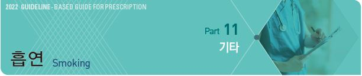
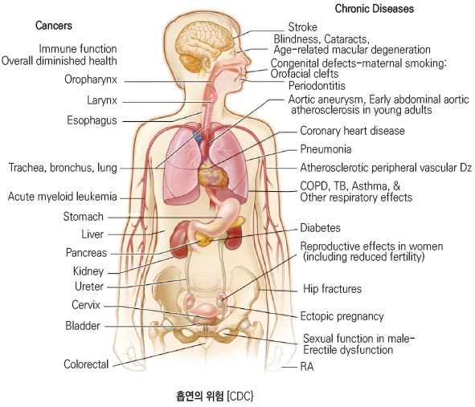
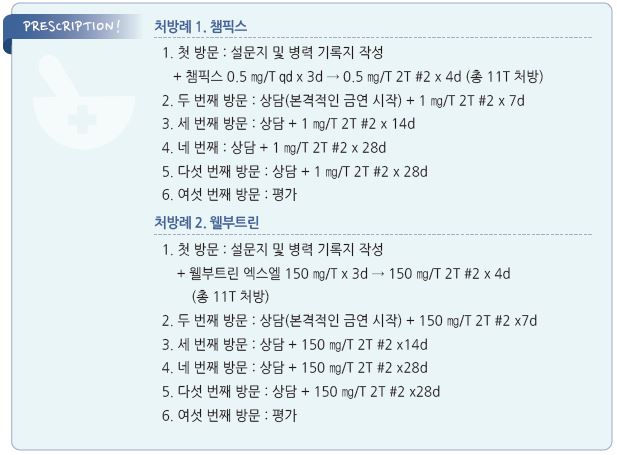

# 흡연 Smoking

## 일반 사항

### 흡연의 영향
- 평균 수명 11년 단축, 암 사망 원인의 ⅓ 차지

- 관련 질환 : COPD, 폐결핵, 관상동맥병, 죽상 경화성 질환, 남성 성 기능 저하, 황반변성, 소화성 궤양, 당뇨병, RA, 골다공증,

    골절, 자궁외임신, 치주 질환, 면역 기능 저하

- 관련 암 : 폐, 구강, 인두, 상부 소화기, 간, 신장, 방광, 자궁 경부, 대장, 백혈병

  •폐암 발생률 : 비흡연자 대비, 1~14 개비/일 흡연 시 5배, ≥15개비/일 흡연 시 11배

>     ✽담배는 니코틴을 비롯하여 4,700가지 이상의 성분을 포함하고 있음
    

### 담배 중독 기전
- 체내 니코틴 유입 → CNS에서 nicotinic acetylcholine receptor(nAChR)와 결합 → nAChR를 활성화시키고 도파민 분비를

    자극 → 각성, 인지력↑, 기분 전환, 불안/긴장감↓, 식욕↓

- 흡연에 의해 섭취된 니코틴은 반감기가 짧아 긍정적 효과는 하루가 지나면 내성을 일으키고 이후 금단 증상을 막기 위해

    흡연을 지속하게 됨; 흔히 100개비 흡연 이후 중독성이 발전함

- 아침 흡연 욕구의 원인 : 수면 중 뇌 속 니코틴 농도 감소에 따른 금단 상태 해소 욕구

- 담배 흡연의 만족감이 니코틴 대체제보다 높은 이유 :

    ① 흡연 시 7초 후면 니코틴이 뇌에 도달하지만 대체제는 긴 시간이 필요,

    ② 흡연에 의한 뇌 속 니코틴 농도는 spike 형태로 증가하므로 보다 자극적임,

    ③ 담배 연기, 라이터 소리, 담배를 물고 있을 때의 입술에서의 느낌 등 니코틴 외 작용이 있음

### 금단 증상
- 초조감, 안절부절, 욕구 불만, 화냄, 우울, 불안, 집중력 저하, 불면

- 식욕 증대 또는 체중 증가

- 금연 24시간 내 발생, 점차 호전

>     ✽니콘틴 의존은 간헐적 흡연 시작 수일~수 주 내 또는 매일 흡연하기 시작할 때 발생

### 흡연/니코틴 중독 위험 인자
- 정신 질환 : 우울, 외상후스트레스장애, 조현병

- 낮은 사회 경제적 상태, 낮은 교육 수준

- 이른 시기의 흡연 경험(청소년은 성인에 비하여 중독에 취약함)

- 가족 또는 친구의 흡연

- 다른 약물 남용

### 금연 효과
- 30분 후 : 흡연 직후 상승했던 심박동수 및 혈압 회복

- 12시간 후 : 혈중 CO 농도 정상 회복

- 2주~3개월 후 : 혈액 순환 및 폐 기능 개선

- 1~9개월 후 : 기침/숨참 호전, 폐 감염 위험↓(기관지 섬모 운동 회복, 기관지 적체 가래 배출)

- 1년 후 : 심혈관 질환 위험↓(흡연자의 ½로 감소)

- 5년 후 : 구강/인후/식도/방광암 위험↓(50%), 자궁경부암/뇌졸중 위험↓(비흡연자 수준)

- 10년 후 : 폐암 사망 위험↓(흡연자의 ½로 감소), 인두암/췌장암 위험↓

- 15년 후 : 관상동맥병 위험↓(비흡연자 수준)

## 진단

### 담배사용장애 진단 기준 [DSM-5]
- 지난 12개월 동안 아래의 임상적으로 의미 있는 장애나 고충으로 이어지는 담배 사용 패턴이 2~3개 시 경증(담배 사용),

    4~5개 시 중등증(흡연 의존), ≥6개 시 중증(흡연 의존)

  ① 자신이 의도했던 것보다 더 많은 양의 흡연을 하고 더 오랜 시간 흡연한다.

  ② 흡연을 줄이거나 끊어보려는 생각을 늘 가지고 있지만 결국 성공하지 못한다.

  ③ 담배를 구하거나 사용하는데 필요한 활동을 하느라 상당한 시간을 소비한다.

  ④ 흡연에 대한 갈망 또는 강한 욕망을 경험한다.

  ⑤ 반복되는 흡연으로 인해 직장, 학교, 가정에서 해야 할 역할을 수행하지 못한다.

  ⑥ 흡연으로 인해서 대인 관계 혹은 사회적인 문제(예: 흡연과 관련된 타인과의 갈등)가 반복적이거나 지속적으로

    발생함에도 불구하고 반복해서 흡연한다.

  ⑦ 흡연 때문에 중요한 사회적, 직업적 혹은 여가 활동들을 포기하거나 줄여야 한다.

  ⑧ 물리적으로 위험한 상황에서도 흡연을 한다(예: 침대에서 흡연).

  ⑨ 흡연에 의해서 유발되거나 악화된 육체적이거나 정신적인 문제가 있다는 것을 알고 있음에도 불구하고 흡연을 한다.

  ⑩ 다음 사항 중 어느 하나에 해당하는 내성이 발생한다.

a. 원하는 효과를 느낄 때까지 흡연량을 현저하게 늘리려 한다.

b. 같은 양의 담배를 피웠는데도 효과가 현저하게 떨어진다.

  ⑪ 다음 사항에 모두 또는 어느 하나에 해당하는 금단 증상이 있다.

a. 흡연 금단에 해당되는 특징적인 증상

b. 금단 증상을 피하기 위해서 또는 해소하기 위해 흡연한다.

### 담배 금단 진단 기준 [DSM-5]
A. 최소 수 주간 매일 흡연한다.

B. 갑자기 흡연을 중단하거나 흡연량을 줄이면 24시간 내 다음 중 ≥4가지의 증상이 발생한다.

  ① 초조감, 욕구 불만, 화냄 

  ② 불안감 

  ③ 집중 곤란 

  ④ 식욕 증가

  ⑤ 안절부절못함

  ⑥ 우울한 기분

  ⑦ 불면

C. B항에 있는 신호와 증상으로 인해 사회적, 직업적 또는 다른 중요한 영역의 기능에서 임상적으로 유의미한 고충이나

    장애가 나타난다.

D. 증상과 신체 신호들이 다른 내과적 문제에 의해서 나타난 것이 아니며 다른 정신 질환이나 다른 물질의 중독 혹은

    금단에 의한 것이 아니다.

### 니코틴 의존도 검사 (Korean Version of Fagerstrom Test for Nicotine Dependence)
1. 아침 기상 후 첫 흡연까지의 시간 : ＜5분=3점, 5~30분=2점, 31~60분=1점, ≥60분=0점

2. 금연 구역(예: 병원, 도서관, 극장)에서 흡연을 참기 어려움 : 예=1점, 아니오=0점

3. 하루 중 담배 맛이 가장 좋은 때 : 아침 첫 담배=1점, 다른 나머지=0점

4. 하루의 평균 흡연량 : ≤10개비=0점, 11~20개비=1점, 21~30개비=2점, ≥31개비=3점

5. 아침 기상 후 첫 몇 시간 동안 하루의 다른 시간대보다 더 자주 흡연 : 예=1점, 아니오=0점

6. 아파서 하루 종일 누워있는 날에도 흡연 : 예=1점, 아니오=0점

▶판정 : 1~3점=니코틴 의존도 낮음, 4~6점=중간, 7~10점=높음

  •1번과 4번은 흡연지표(HSI)로 두 문항 합계가 ≥4점 시 의존도 높음으로 판정

### 영상 검사
- 폐 증상이 있는 환자에서 흉부 X선 검사 권고

- [USPSTF](2021) 선별 검사

  •20 pack-year의 흡연력이 있으며 현재 흡연 중이거나 지난 15년 이내에 담배를 끊은 50~80세에 대하여 저선량 CT로

    매년 폐암 검진을 권고

  •15년 이상 금연 상태 또는 기대 여명이 제한되거나 수술을 통한 폐 치료가 어려운 건강 문제가 발생하면 중단

---

## Management

### 치료 방침
- 간단하고 단순하고 강력하게 설명

- 동기 부여와 자신감을 심어줌; 제대로 된 준비 없이 금연을 시도하다 실패하면 실망과 좌절감을 유발하여 금연이 어렵다는

    잘못된 신념을 강화시킬 수 있음

- 비-약물 치료와 약물 치료를 함께 시행하는 것이 보다 효과적임

- 환자가 금연을 원하고 금연할 준비가 되어 있으면 약물 요법 시작. 니코틴 의존을 치료하기 위한 조치 병행

## 비-약물 치료

### 금연 계획

>     (Ref. 2015 금연 치료 건강보험 지원 사업 안내)

#### 금연 준비하기
- 금연 개시 일자를 정한다. 준비 시작부터 2주 이내로 정하는 것이 좋다.

- 가족, 친구, 동료 등 주위에 금연을 시작할 것을 알리고 이해와 협조를 요청한다.

- 금연 시작일 전까지 흡연량을 조금씩 줄이거나 담배 종류를 바꾼다.

#### 금연 전날의 행동
- 담배를 생각나게 하는 각종 물건들(예: 라이터, 재떨이, 성냥)을 모두 치운다.

- 금연을 하게 된 이유를 곰곰이 생각해 보면서 다시 결심을 굳힌다.

- 특히 초기 몇 주간은 니코틴 금단 증상을 포함, 금연을 방해하는 요인들이 많을 것을 각오한다.

#### 금연 동기에 대해 생각해 보기
- 나의 건강 : 질병에 걸리고 싶은 사람은 없을 것이다.

- 나와 가족의 미래 : 내가 심각한 질병에 걸린다면 우리 가족은 어떻게 될 것인가?

- 사회적 압력 : 이제 흡연할 만한 곳도 없고 사회에서 흡연자들은 대접받기 힘들다.

#### 흡연 습관 이기기
- 커피를 마실 때마다 담배를 피웠던 사람 → 커피 대신 차를 마시거나 산책을 한다.

- 식사 후 항상 담배를 피웠던 사람 → 식사 후 양치질을 하고 산책을 한다.

- 친구들과 같이 담배를 피웠던 사람 → 친구들과 함께 금연하거나 비흡연 친구들과 어울린다.

#### 호흡 이완 운동
- 어깨에서 힘을 빼고 입을 다물고 최대한 천천히 코로 숨을 들이마신다.

- 넷을 셀 때까지 숨을 참다가 천천히 숨을 입으로 내쉬면서 폐에 있는 모든 공기를 다 내뿜는다. 천천히 5회 정도 반복한다.

#### 기타 행동 전략
- 과식을 피하고 기름지거나 맵거나 짠 자극성 음식을 피하고 산뜻하고 가볍게 식사한다.

- 회식 자리에서는 음주나 흡연을 하지 않는 사람들과 주로 시간을 보낸다.

- 과일과 야채를 자주 섭취하고, 규칙적으로 운동(≥중강도, ≥30분, ≥3회/주, ≥3개월) 한다.

- 입이 심심할 때마다 칼로리가 적은 음식(예: 껌, 은단, 당근, 오이, 다시마, 미역)을 섭취한다.

- 스케일링 등 치과 치료를 받는다.

### 금연 동기를 높여주는 전략 5 Rs
- Relevance : 왜 금연을 해야 하는지 설명함; 흡연자의 나이, 성별, 질환, 위험 인자, 가족, 사회적 상황 등에 맞추어 설명

- Risk : 흡연의 부정적 결과를 인지하도록 질문 “흡연을 하면 어떤 점들이 나쁠까요?”; 삶의 질 저하(예: 성 기능 저하,

    심장/호흡 질환에 따른 활동 제한, 중풍), 각종 질병과 암에 의한 고통과 수명 단축

- Reward : 금연의 긍정적 결과를 인지하도록 질문 “금연을 하면 어떤 점들이 좋을까요?”; 건강 증진, 피로 회복, 기억력 향상,

    자녀의 흡연률 감소, 성 기능 향상, 금전적 이득

- Roadblock : 금연 방해 인자들에 대해 질문 및 해결책 제시; 스트레스, 흡연의 즐거움, 주위의 흡연자, 음주, 체중 증가,

    금단 증상

- Repetition : 방문할 때마다 반복적으로 동기 부여 중재

### 금연 의지를 높이는 전략 5 As
- Ask : 모든 환자에게 흡연 여부 질문

- Advise : 명료하고 강력하고 개별화하여 금연을 권고

- Assess : 금연에 대한 의지 파악(예: 한 달 내 금연하겠다)

- Assist : 금연 의지가 있는 환자에게 상담과 치료 방법을 제공

  •금연 의지가 없는 환자에게는 향후 금연 시도를 위해 중재

- Arrange : 금연 시작 후 재흡연 방지를 위하여 빠른 시일(예: 1주) 내 재방문할 것을 권고

  •금연 의지가 없는 환자에게는 다음 방문 시 니코틴 중독과 금연에 대하여 상담

## 약물 치료
    (금연치료지원사업 외 비보험)

- varenicline을 니코틴 패취나 bupropion보다 우선 권고(성공률이 더 높음);

    varenicline 단독보다 varenicline NRT 병합을 적용할 수 있음

- 표준 치료(6~12주)보다 연장 치료(＞12주)를 권고(표준 치료 대비 18% 성공률 향상)

- 금연에 대한 준비가 안된 흡연자에서도 varenicline 약물 치료를 바로 시작할 것을 권고

- 정신질환자의 금연 치료에서 varenicline을 우선 권고(심각한 부작용이 일반인과 차이 없음)

- COPD 환자에서 약물 치료(varenicline, bupropion, NRT)는 일반 흡연자와 다르지 않음

#### 약제 금연 성공률
    (위약 대비)

- varenicline : 1년 후 성공률 25%(위약 10%); bupropion보다 우수 [챔픽스]

- 니코틴 껌/패취 : 4~8주 성공률 75%(위약＜50%), 1년 후 성공률 25%(위약 12%)

- bupropion : 7주 성공률 44%(위약 19%), 1년 23%(위약 12%) [웰부트린]

- nortriptyline : 위약의 2~4배 성공률 [센시발]

- nicotine vaccine : nicotine의 antibody sequestration; 연구 중

### 니코틴 대체 요법 (Nicotine Replacement Therapy, NRT)
- 평소 흡연량, 아침 첫 흡연 시간을 고려하여 초기 용량 결정

- 주의 : 최근 2주 내 심/뇌혈관 질환 병력(예: 협심증, 심한 부정맥), 청소년, 지속 흡연자

- 부작용 : 불면증, 구역, 소화 장애, 어지럼증, 두통, 혈압 상승, 다발성 통증

- (금연 기간 뿐 아니라) 금연 준비 기간에 흡연량을 줄이는 목적으로도 사용할 수 있음

- 장기 사용이 효과적이나 12개월 이상 사용하는 것은 권고하지 않으며 중단할 때는 tapering

#### 니코틴 패취
- 용량 및 일정

  ① ＜10개비/d 흡연자 또는 ＜45 ㎏ : 14 ㎎ qd ×6주 → 7 ㎎ qd ×2주 [니코맨 패취]

  ② ≥10개비/d 흡연자 : 21 ㎎ qd ×4주 → 14 ㎎ qd ×2주 → 7 ㎎ qd ×2주

- 부착 방법 : 매일 아침 기상 시 평평하고 움직임이 적은 털이 없는 부위(예: 팔 안쪽, 허벅지, 등)에 10~20초간 눌러서 붙임.

    매일 다른 곳에 붙임

- 사용 기간 : 8주~12주

- 특징 : 부착 2~4시간 후에 최고 농도에 도달하며 일정한 농도로 공급됨

- 부작용 및 대처법 : 피부 자극-심하면 steroid 도포, 불면증-취침 전 제거

#### 니코틴 껌
- 용량 : ≥25개비/d 흡연자- 4 ㎎, ＜25개비/d 흡연자- 2 ㎎ [니코틴엘 껌]

  •(6주간) 매 1~2시간 또는 흡연 충동 시 1개씩 사용(최대 24개/d) → 점차 줄여감

- 용법 : 얼얼하거나 따끔따끔한 느낌이 들 때까지(1~2분) 천천히 씹음 → 껌을 볼 안이나 입술 밑에 넣어 두었다가 느낌이

    사라지면 다시 씹음 → 총 30분 동안 또는 껌의 맛이 없어질 때까지 반복하고 뱉음

- 사용 기간 : 1~3개월

- 특징 : 사용 20분 후 최고 농도에 도달; 커피, 주스, 탄산음료 등 산성 음료수는 니코틴의 구강 점막 흡수를 방해하므로

    껌 씹기 15분 전~씹는 동안 마시지 않음

- 부작용 : 구강 자극/건조감, 기침, 딸꾹질, 소화불량/속쓰림; 대처법- 식사 전후 15분간 사용 회피

#### 니코틴 정제 (lozenge)
- 용량 : 기상 후 첫 담배까지 시간이 ＜30분- 4 ㎎, ≥30분- 2 ㎎ [니코맨 트로키]

  •(6주간) 매 1~2시간 또는 흡연 충동 시 1정(최대 25개/d) → 점차 줄여감

- 용법 : 입안에 넣고 강한 맛이 날 때까지 천천히 녹임 → 잇몸과 볼 사이에 넣어 두었다가 맛이 사라지면 다시 입안에서 녹임;

    씹어 삼키거나 정제 상태로 삼키면 안 됨

- 사용 기간 : 3~6개월; 하루 1~2정으로 감소되면 복용 중단

- 특징 : 사용상 편리, 위장관 부작용 적음, 껌에 비하여 조금 더 많은 양의 니코틴이 공급됨

- 부작용 : 니코틴 껌과 동일

### 니코틴 부분 작용제 (Nicotine partial agonist)
- 기전 : nAChRs에 부착되어 니코틴에 의한 도파민 보상 작용을 차단(담배 맛 감소), 뇌의 쾌락 중추의 도파민 수준을

    증가시킴(금단 증상 및 흡연 갈망 감소)

- 가장 효과적인 치료제

#### Varenicline
- 기전 : α4β2 nicotinic acetylcholine receptor partial agonist

- 용법 : 금연 예정일 1주 전부터 시작; 0.5 ㎎ qd ×3d → 0.5 ㎎ bid ×4d → 1 ㎎ bid ×11주

  •식사 직후 충분한 물과 함께 복용; 필요시 6개월~1년간 유지 [챔픽스]

- 표준 복용법으로 실패한 경우 금연 개시 예정일 한 달 전부터 복용하는 것을 고려

- nicotine 패치 병용 시 단독 사용보다 효과적일 수 있음

- 부작용 : 구역, 복부 부글거림, 불면, 이상한 꿈, 두통, 발진, 행동 변화, 초조, 우울, 자살 충동

- 주의/금지 : 정신 질환, 심혈관 질환, 청소년, 임신부; eGFR ＜30 or 투석 시 감량

※ 국외에서 약제 속의 N-nitroso-varenicline 검출과 관련되어 제품 회수가 진행된 바 있음

### 항우울제

#### Bupropion SR
- 기전 : 신경 말단에서 도파민 및 노에피네프린의 재흡수 차단, nAChR 차단

- 용법 : 금연 1주 전 시작; 150 ㎎ qd 아침 ×3~6d → 150 ㎎ bid(최소 간격 8시간) [웰부트린]

- 사용 기간 : 7~12주; 약물 중단 후 흡연 욕구가 큰 경우는 150 ㎎ qd ×~6개월 고려

- NRT 병용 가능

- 우울증, 조현병 환자에서 선택; 체중 감소 효과

- 부작용 : 불면(35~40%; 오전 복용), 입마름(10%), 불안, 두통, 소화불량, 경련(용량 의존)

- 주의/금기 : 정신 병력, 과민 반응, 발작 병력, 중추 신경계 종양, 급격한 알코올 또는 벤조디아제핀 중단, 대식증,

    신경성 식욕 부진, 18세 이하, 임산부

#### Nortriptyline
- 2차 약제

- 용법 : 금연 10~28일 전 시작; 25 ㎎/d → 75~100 ㎎/d까지 점차 증량; ~12주 복용 [센시발]

- 부작용 : 졸림 & 입마름(64~78%), 시야 흐림(16%), 요저류, 경증 두통(49%), 손 떨림(23%)

## 대체 요법
- 전자 담배 : 니코틴을 기화 흡입

  •니코틴 함유 전자 담배는 NRT 또는 니코틴 비함유 전자 담배에 비하여 금연 성공률이 높다는 보고가 있음(RR 1.63~1.94)

  •니코틴 외 다른 성분들을 포함하고 있어 궐련 담배에 버금가는 위해가 우려됨. 예) 폐렴, 사망 위험 증가

- 침술, 금연초, 최면 요법, 레이저 치료 : 위약에 비하여 입증된 우월한 효과 없음; 일부 질 낮은 연구에서 유효성 주장

## 금연 실패 대처
- 정확한 약물 투여 여부 및 약물 부작용을 확인하고 필요시 조치

- 금단 증상 : NRT를 시행하지 않고 있는 경우에는 시작, 시행 중이었던 경우에는 증량 고려

- 정확한 4주 약물 투여에 충분한 효과가 없는 경우 : 약물 교체 또는 추가

  •전통적 병합요법 : NRT(패치)+NRT(껌/로젠즈/흡입기), bupropion+NRT

  •실험적 병합요법 : varenicline+bupropion(일부 연구에서 1갑 이상의 흡연자에서 유효, 추후 연구 필요),

    varenicline+NRT(일부 연구에서 유효, 추가 연구 필요)

#### 재흡연
- 금연 교육 강화

- 재흡연은 ‘실패’가 아님을 강조. 짧은 비흡연 기간도 작은 성공이며 비흡연 기간을 더 늘리도록 격려

- 담배를 다시 피게 된 이유를 파악하여 대처

- 재발은 주로 금단 증세가 가장 강한 첫 주에 발생하므로 이 시기에 지원 자원(예: 가족, 친구)을 동원,

    담배를 구입하지 않아 절약된 돈으로 보상(예: 영화 관람, 특별한 식사, 쇼핑)

- 흡연 유발 상황(예: 스트레스, 음주, 흡연하는 사람들을 만남)을 최대한 피함

- 금연을 방해하는 기저 질환(예: 알코올 남용, 우울증) 치료

- 이전에 효과가 있었던 약제로 다시 시작 또는 병용 요법 시행

> **질병코드**
Z72.0 담배사용

F17.2 담배흡연의 의존증후군 

