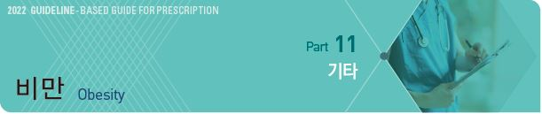
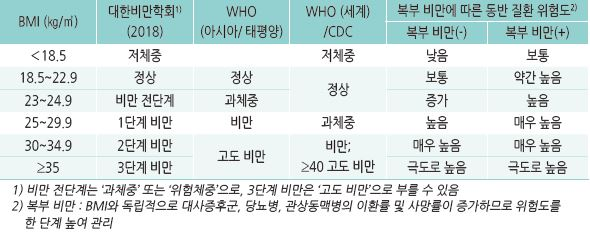
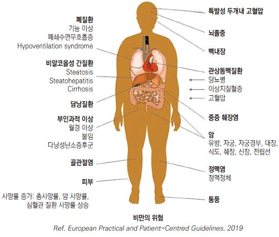
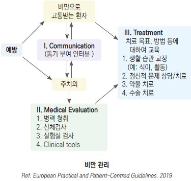
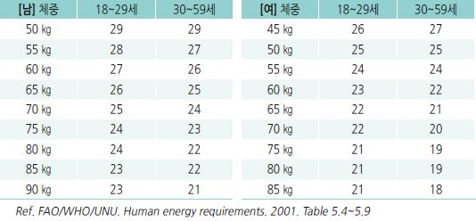
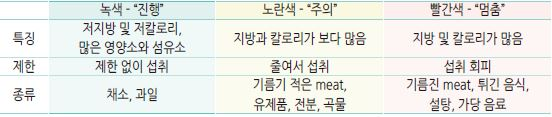
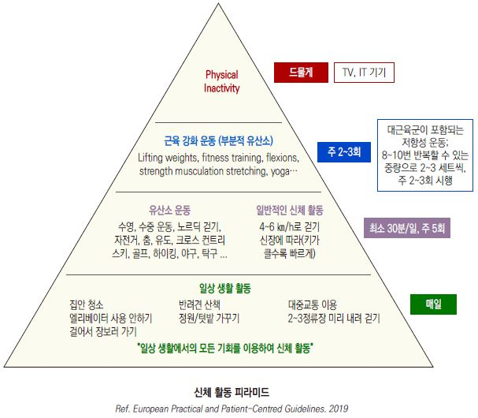
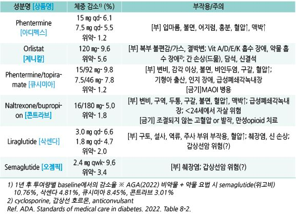
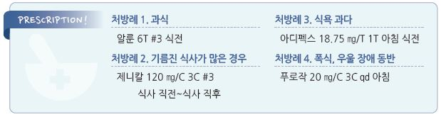

# 비만 Obesity

## 일반 사항

### 정의

#### 체질량지수(Body mass index)
    

#### 복부 비만
- 허리둘레 : 남 ≥90 ㎝, 여 ≥85 ㎝; WHO 남 아시아/태평양 ≥90 ㎝(Europid ≥94 ㎝), 여 ≥80 ㎝

- waist-to-hip ratio [WHO-아시아] : 남성＞0.9, 여성＞0.8

#### 체지방률
- 심혈관계 위험 요소를 동반한 비만 기준 : 남 26%, 여 36%

### 비만의 위험
- BMI 22에서 사망률 최저

- 치료 전 체중의 3~5% 감량만으로도 비만 관련 질환을 의미 있게 개선시킬 수 있음

### 고령자 유의 사항
- ~65세에는 연령 증가에 따라 자연적인 체중 증가가 나타나며 이것은 fat-free mass 감소를 완화하는 효과가 있음

- ≥65세에서는 비만과 사망률의 관련성이 거의 없음; 과체중 환자가 마른 사람보다 사망률이 낮음

- 비만 진단 시 BMI와 함께 허리둘레, 허리-엉덩이 둘레비로 복부 비만 여부를 평가

  •노화에 따른 체성분 변화(지방량↑, 제지방↓) 및 신장 감소로 BMI 적용이 곤란함

- 비만 관련 질환의 위험보다 체중 감량의 이득이 더 큰 경우에 체중 감량을 권고

- 단백질이 풍부한 저 칼로리 식사 권고

- 활동량 증가를 권고

## 분류 및 원인

#### 1차성(단순성) 비만
- 섭취-소비 불균형 : 섭취가 소비를 초과함으로써 체내에 칼로리가 지방으로 축적되어 발생

- 전체 비만의 90% 해당

- 보통 여러 인자가 복합적으로 관여

- 주요 인자 : 생활 습관, 연령, 인종, 유전, 장내 미생물, 환경 화학 물질/독소

- 과식을 하는 사람은 섭식 조절 기능이 저하되어 있을 가능성이 있음

#### 2차성 비만
- 유전자 돌연변이, 선천성 장애, 약물, 신경계 질환, 내분비계 질환, 정신 질환 등에 의한 비만

### 위험 인자
- 칼로리 농축 음식 소비, 고지방 식사, 빈번한 패스트푸드 섭취

- 활동이 적은 생활 방식, 하루 2시간 이상의 TV 시청 또는 IT 기기 사용

- 하루 6시간 미만의 적은 수면 시간

- 낮은 사회 경제적 상태

- 스트레스 (✽스트레스는 식욕 저하를 일으키기도 함)

- 다른 질환 : 정신적 장애(폭식장애, 계절정동장애), 갑상선저하증, 시상하부 이상, 쿠싱증후군

- 가족력, 임신 중 산모 흡연, 산모의 임신당뇨병(신생아 출생 체중 증가), 모유 수유를 적게 한 경우, 이른 비만 연령

    (청소년기 비만)

- 빨리 먹는 습관; 포만감이 나타나기 전에 과식을 하게됨

- 연령 증가; 연령이 증가할수록 기초대사량이 감소하여 체중 및 복부 지방이 늘어남

- 약물

  •항정신병제 : thioridazine, risperidone, olanzapine, clozapine, quetiapine, sertindole

  •항우울제 : TCA, SSRI(paroxetine), MAOI

  •항경련제 : valproic acid, carbamazepine, gabapentine, pregabalin

  •항당뇨병제 : insulin, SU, TZD

  •항히스타민제 : diphenhydramine, cyproheptadine

  •α-차단제 : doxazosin, prazosin, terazosin

  •β-차단제 : propranolol, metoprolol, atenolol

  •기타 : steroid, lithium, 경구 피임제

## 진단

### 신체 계측 방법
- 몸무게 : 8시간 금식 후 소변을 본 후 신발을 벗고 최소한의 복장으로 측정, 동일한 시간에 동일한 조건으로 측정하여 비교.

    예) 매일 아침 기상하여 배뇨 후 내의 차림으로 측정

- 신장 : 발뒤꿈치는 붙이고 발은 60o로 벌린 상태에서 숨을 깊이 들이 쉰 상태로 측정

- 허리둘레 : 양 발을 25~30 ㎝ 간격으로 벌리고 서서 숨을 편안히 내쉰 상태에서 늑골 하단부와 골반 장골릉 상단의 중간 부위

    측정[WHO 지침] 또는 양쪽 장골릉의 최상단 측정[NIH 지침]

>   ✽복부에 지방이 많이 축적되어 허리둘레가 커진 경우에는 iliac crest 정점에서 측정하라는 권고가 있음
  ✽특히 BMI 25 이상인 경우에 허리둘레 측정을 권고 [캐나다의학협회]
- 엉덩이둘레 : 엉덩이의 가장 넓은 부위 측정

- 허리나 엉덩이둘레 측정 시 바닥과 평행하게 2회 측정하여 차이가 ≤1 ㎝면 평균값을 사용하고 차이가 ＞1 ㎝면 다시 2회를

    측정함

### 검사
- 필수 : 혈압, 당뇨(FBS, HbA1c), Lipid, LFT(AST, ALT, γGT), RFT(Cr)

- 선택 : TFT(TSH), index of inflammation(hs-CRP, ferritin), uric acid

  •심/간 비대, 복부 지방 검사를 위하여 영상 검사를 고려(특히 LFT 상승 시 고려)

- 기타 : 체지방(✽고가 및 variable accuracy 문제로 일률적 권고는 하지 않음), 수면무호흡증, 쿠싱/hypothalamic 질환 검사

---

## Management

### 치료 방침
- 생활 습관 중재를 기본으로 하여 체중 관련 합병증이 있으며 생활 습관 중재만으로 충분하게 반응하지 않는 과체중/비만

    환자에게 약물 요법을 추가

1. 환자의 감량 동기 파악 및 교육/동기 부여

  •비만의 위해성과 감량의 필요성 및 효과 등 비만에 대한 올바른 인식을 갖도록 교육. 비만 치료는 단순히 미용 목적으로

    시행하는 것이 아님을 강조

  •최단 시간에 최대 체중 감량을 달성하는 것이 비만 치료의 핵심이 아님

  •허리둘레가 줄면 내장 지방과 심장병 위험이 줄어듦. 체중 감소 자체보다 이것이 더 중요함

  •환자의 자존감 회복, 동반 질환 관리

2. 감량 목표 설정 : 보통 6개월간 치료 전 체중의 5~10% 감량

  •체중 감량을 하지 못하거나 하지 않아야 하는 경우(예: 고령, 소아, 만성 중증 질환자)에는 현재 체중 유지를 목표로 함

  •동반 질환에 따라 서서히 감량(예: 담석증, 고요산혈증) 또는 감량 금지(예: 신경성 식욕부진)

  •상태에 따른 체중 감량 목표 : 대사증후군- 10%, T2DM/이상지질혈증/고혈압- 5~15%, NAFLD- 10~40%,

    수면무호흡증- 7~11%, 천식- 7~8%, GERD- ≥10%

3. 생활 습관(식사 횟수, 종류, 양, 폭식 습관, 활동 패턴) 및 과거 치료 방법/결과 파악

4. 치료 : 생활 습관 개선/인지행동 요법, (적응증이 되는 경우) 약물 치료, 수술 치료

5. 감량 체중 유지 : 많은 환자가 감량한 체중을 유지하지 못하며, 감량과 증량이 반복되면(weight cycling) 요요현상(복부

    비만)이 발생함

  •≥1회/주 체중 측정, 음식 섭취 제한, 200~300분/주 중등도 신체 활동 권고

  •체중이 빠르게 다시 늘어나면 곧 진료 받도록 함

  •6개월간 감량한 체중을 유지한 후 필요시 새로운 목표 체중을 설정

#### 치료 실패 위험 인자
- 단순히 미용 목적의 체중 감량

- 불분명한 치료 목적

- 수동적 태도(타인의 요구에 의해 체중 조절을 시도)

- 약물 치료에 의존

- 낮은 사회 경제적 상태

- 심리적 문제. 예) 스트레스, 불안, 우울

- 불가피한 회식이 많은 환자

    

## 비-약물 치료
- 중재 대상 : BMI ≥25; 아시아계 미국인은 BMI ≥23부터 중재 권고 [ADA]

- 효과 : 생활 습관 개선으로 체중의 5~15%를 감량할 수 있으며 신체 이미지, 자존감, 자기 확신, 삶의 질을 향상시킬 수 있음

- 체중 감량을 위하여 6개월 이상, 감량된 체중을 유지하기 위해 1년 이상 생활 습관 개선이 필요

- 1.5 ㎏/wk 이상 감량 시 담석증 위험이 증가하며 UDCA 600 ㎎/d [우루사] 복용으로 예방

### 식이 요법
    (☞ p.1164)

- 식이 조절을 3~6개월 이상 지속해야 신체가 적응하며 감량된 체중을 유지할 수 있음

#### 식사량
- 평소 식사량에서 1일 500~1,000 ㎉ 감량 섭취; 1일 500 ㎉ 감량 섭취 시 500 g/wk 체중 감소

- 다이어트를 위한 통상적 1일 섭취 칼로리 : 남 1,500~1,800 ㎉, 여 1,200~1,500 ㎉

- 특정 다이어트 방법보다 실천하기 쉬운 방법으로 꾸준히 제한된 칼로리를 섭취함

>   ✽황제다이어트 : 저탄수화물 고단백 식이 요법으로 1년간의 비교에서 유의미한 성과 없음
** 초저칼로리 식이**

- 1일 섭취 칼로리 : 800~1,000 ㎉

- 감량 후 체중 재증가 가능성이 높으며 장기적으로 일반적 저칼로리 식이와 체중 조절 차이 없음

- 부작용 : 탈수, 기립성 저혈압, 피로, 근육 경련, 변비, 두통, 추위 불내성

- 철저한 의학적 관리 하에 제한적으로 시행되어야 하며 1일 권장량의 단백질 50~80 g(1.0~1.5 g/㎏) 및 Vit, 미네랄 섭취가

    필수

- 금기 : 최근 심혈관 질환 발생, 신질환, 1형 당뇨병, 정신 질환, 암

#### Daily energy requirement
- 필요 칼로리 = 체중(㎏) × BMR(basal metabolic rate) × PAL(physical activity level) value

  •PAL value : 저 활동=1.40~1.69; 중등 활동(건설 노동자, 1시간/일의 달리기)=1.70~1.99

  •연령/성별/체중에 따른 BMR

    

- 1일 필요 칼로리 계산 예 : 운동을 하지 않는 70 ㎏ 사무직 40세 남성

    = 체중 70 ㎏ × BMR 24 × PAL 1.5 = 2,520 ㎉

#### 권장 식이
- 식이 섬유

  •권고 섭취량 : ≤50세 남- 38 g, 여- 25 g; ＞50세 남- 30 g, 여- 21 g

  •전곡류, 귀리, 콩, 완두콩, 렌틸, 곡물, 씨앗, 통밀 빵, 현미, 파스타, 과일, 채소 (☞ p.1164)

- 저지방 육류 : 살코기 또는 기름을 제거한 고기

- 생선, 해산물

- 우유 섭취 시 저지방 또는 무지방 제품 선택

- 순수한 물 또는 칼로리가 없는 음료

※섭취 권고량 : 과일 및 채소(8~10 servings/d), 저지방 유제품(2~3 servings/d), 생선(2회/wk)

#### 제한 식이
- 칼로리 농축 음식 : 빵, 떡, 대부분의 take-away 및 fast food

- 소금 : ＜6 g/d로 제한; 현재보다 조금 싱겁게 먹는 습관을 기름

- 기름기나 지방 함량이 많은 식품, 튀긴 음식, 정제된 탄수화물/설탕/단 음료

- 신호등 다이어트

    

#### 식사 요령 : 12 tips to help you lose weight [NHS]
1. 아침 식사 : 아침 식사를 거르면 영양소가 부족해지고 하루 종일 더 많은 간식을 먹게 될 수 있음

2. 규칙적 식사 : 규칙적 식사는 칼로리를 더 빠르게 연소하게 해 주며, 간식 욕구를 줄여 줌

3. 충분한 과일과 채소 섭취 : 칼로리는 적은 반면 많은 섬유질과 비타민과 미네랄을 함유하고 있음.

    단, 당도가 높은 과일은 칼로리가 많을 수 있음을 주의

4. 활발히 움직임 : 이를 통하여 체중을 줄이고 유지할 수 있음

5. 충분한 수분 섭취 : 수분이 부족하면 갈증을 허기로 혼동하여 간식을 먹을 가능성이 생김

6. 섬유질이 많은 음식 섭취 : 포만감이 생겨 식사량을 줄일 수 있음

7. 식품 성분표 확인 : 특히 칼로리를 확인. 성분표가 부실한 제품은 선택하지 않음

8. 작은 접시 사용 : 작은 접시를 사용하는 것이 적게 먹는데 도움이 되며 점차 작은 양 식사에 익숙해 짐.

    20분 이상 천천히 먹고 배부르기 전에 식사를 중단함

9. 특정 음식을 금지하지 않음 : 특정 음식 식사를 금지하면 갈망이 더 심해질 수 있음. 특히 좋아하는 음식을 금지하지 않음.

    하루 허용하는 칼로리 한도 내에서 식사를 즐길 수 있음

10. 집 안에 정크 푸드를 두지 않음 : 유혹을 피하기 위하여 정크 푸드(예: 초콜릿, 과자, 달콤한 탄산 음료)를 두지 않음.

    대신 과일, 무가당 팝콘 등 칼로리가 적은 건강한 간식을 선택함

11. 알코올 섭취를 줄임

12. 식사 계획을 수립 : 1주일간의 아침, 점심, 저녁과 간식 계획을 수립하고 실천

  •권장 및 제한 식이 지침을 따름. 칼로리가 농축된 음식을 피함

  •식사 일기를 쓰고 식사 습관(간식, 식사량)과 배가 고프지 않을 때 먹는 원인을 파악함

※ 칼로리 검색 : [식품영양성분 데이터베이스](https://www.foodsafetykorea.go.kr/fcdb/index.do), [칼로리사전](http://47kg.kr/DIET_HOME/main.php) 

### 운동 요법
    (☞ p.1160)

- 신체 활동은 체중 감량에서 필수적이지만 칼로리 섭취 절제 없이 신체 활동만으로는 체중을 줄이기 어려움

>     ✽63 ㎏ 사람 60분 걷기 시 250 ㎉ 소모(=피자 ½조각), 매일 1주일 시행 시 250 g 체중 감소
- 생활의 일부로 즐길 수 있는 운동을 규칙적으로 시행; 신체 상태에 맞춰 강도 조절

  •일상생활 중에 할 수 있는 활동 : 계단 오르내리기, 집안일 하기, 대중교통 이용하기

  •즐거운, 관리를 받는, 단체 활동 : 제기차기, 자전거, 달리기, 수영, 춤추기, 구기, 헬스클럽

- 비활동적 생활을 줄임 : TV 시청, IT 기기 사용

- 유산소 운동

  •감량을 위하여 중등 강도(최대 심박수(=220-연령)의 60~70%; 5~6 ㎞/hr 조깅)로 매일 30~60분씩 1회 또는 20~30분씩 2회,

    ≥5일/주, 300분/주 시행

  •감량된 체중을 유지하기 위하여 중등 강도의 신체 활동을 200~300분/주 시행

- 유산소 운동과 저항성 운동 병행(8~12회 반복할 수 있는 중량으로 2~3세트씩 주당 최소 2회)

    

## 약물 치료
    (비보험)

- 대상 : BMI ≥25 또는 위험 인자(예: 고혈압, 이상지질혈증, 2형 당뇨병, 수면무호흡증)가 있는 BMI ≥23 환자에서

    3~6개월간의 비-약물 치료로 적절한 체중 감소(0.5 ㎏/주)에 실패

- 반드시 생활 습관 교정이 선행 및 병행되어야 함

- 감량 효과 : 식이/운동 요법 + 약물 요법 시 ~16%

- 동반 질환, 환자 선호도, 비용, 치료 접근성 등을 고려하여 선택

- 일반적으로 장기적으로 투약; [AGA] 1차 선택제 semaglutide(우선). liraglutide, phentermine/topiramate,

    naltrexone/bupropion 

- 사용 금지 비만 치료 약물 : (dex)fenfluramine, ephedrine(마황), phenylpropanolamine, sibutramine, lorcaserin

- 약물 치료 개시 3개월 내에 ≥5%의 체중 감량이 없거나 동반 질환 개선 효과가 없거나 안전성 등에 문제가 있으면

    약제 변경이나 약물 치료 중단을 고려

- 약물 치료 중 정기적으로 체중, 혈당, 지질 검사 시행

### 단기 투여 제제 (Sympathomimetic amine)
- 뇌에서 식욕 억제 작용을 하는 약제로서 대부분의 식욕 억제제가 이에 해당됨

- ＜4주 투여로 제한; 효과가 있는 경우에 최대 12주까지 투여 가능

- 부작용 : 입마름, 불면, 어지럼, 흥분, 혈압 상승, 소화불량, 발기 부전

  •장기 투여 시 중독 및 (중단 시) 금단 증상 발생

- 금기 : 심혈관 질환, 조절되지 않는 고혈압, 녹내장, 갑상선항진증, 약물 남용력, 교감 신경제 과민, ＜16세

- phentermine : 8~37.5 ㎎ #1~2 아침 식전 또는 식사 1~2시간 후 복용 [아디펙스]

- phendimetrazine : 17.5~35 ㎎ tid 식전 1시간 복용 [아트라진]

- benzphetamine : 25 ㎎ qd → 점차 증량 25~50 ㎎ qd~tid

- diethylpropion : 25 ㎎ tid 식사 1시간 전 [디피온]

- mazindol : 0.5~1 ㎎ qd~tid 식사 1시간 전 [마자놀]

### 장기 투여 가능 제제

#### 지방 흡수 억제제 (Lipase inhibitor)
- 작용 : 강력하고 선택적인 pancreatic lipase inhibitor → 섭취한 지방의 흡수를 ⅓ 차단

- 지방 식이 시 효과

- 이상지질혈증 또는 당뇨병 환자에서 1차 선택제

- 체중 관련 합병증이 있는 과체중/비만에서는 권하지 않음[AGA]

- 부작용 : 복통, 복부 팽만, 변실금, 요통, 두통, 간 기능 이상, 지용성 비타민 결핍, 담석증, 신결석

  •대처 : psyllium [무타실]을 함께 복용하면 위장 관계 부작용이 감소됨

  •지속 복용 시 지용성 비타민 보충 필요(약제와 2시간 이상 간격으로 복용)

- 금기 : 만성 흡수 장애, 담즙 분비 장애

- orlistat : 60~120 ㎎ 매 식사 직전~식사 후 1시간 이내 복용 [제니칼]

  •식사를 거르거나 지방이 없는 식사를 할 때에는 약 복용을 거를 수 있음

#### Selective serotonin receptor agonist
** Lorcaserin**

- 작용 : 5HT-2c 수용체에 작용 → 시상하부 식욕 센터 자극 → 식욕 억제 및 포만감

- 췌장암, 대장암, 폐암 등 암 발생률을 높이는 것으로 알려져 판매 중지됨

#### Sympathomimetic amine/Antiepileptic combination
 **Phentermine/Topiramate ER**

- topiramate : 항경련제로서 식욕 억제 부작용이 있어 이를 식욕 억제제로 활용

- 부작용 : 변비, 감각 이상, 미각 이상, 불면, 비인두염, 입마름, 혈압 상승, 인지 장애

- 주의/금기 : sympathomimetic amine과 동일

- 용법 : 시작 3.75/23 ㎎ qd ×2주 → 7.5/46 ㎎ qd [큐시미아]

- 12주 치료에 체중 감소가 ＜3% 시 중단 또는 증량

- 중단 시 tapering(최소 1주일 동안 격일 복용)

#### Opioid antagonist/Aminoketone antidepressant combination
 **Naltrexone/Bupropion**

- 작용 : [Naltrexone] opioid 수용체 길항, [Bupropion] dopamine & norepinephrine 재흡수 억제

    → appetite center, dopamine system 등에 작용, 식욕 억제

- 부작용 : 변비, 구역, 두통, 입마름, 불면, 자살 충동(＜24세)

- 주의/금기 : 발작, 조절되지 않는 고혈압, 녹내장, 만성적인 opioid 사용

- 용법 : 8/90 ㎎ 1T qd ×1주 → 1T bid ×1주 → 아침 2T & 저녁 1T ×1주 → 2T bid [콘트라브]

- 12주 치료에 체중 감소가 ＜5% 시 효과 부족으로 판정하고 중단

#### Glucagon-like peptide 1 receptor agonist (GLP-1 RA)
** Liraglutide**

- 생리적으로 식사에 반응하여 ileum에서 분비 → 미주 신경/시상하부에 작용 → 식욕↓, 소화 시간↑

- 부작용 : 구역, 설사, 변비, 주사 부위 반응

- 주의/금기 : 갑상선암, 급성 췌장염, 간/신 장애

- 대상 : ① BMI ≥30, ② BMI ≥27이면서 한 가지 이상의 체중 관련 동반 질환(예: 2형 당뇨병, 고혈압, 이상지질혈증)이 있음

- 용법 : 0.6 ㎎ qd SC → 매주 0.6 ㎎씩 증량, 5주차 3.0 ㎎ qd SC [삭센다 주]

- 16주 치료에 체중 감소가 ＜4% 시 중단

** Semaglutide**

- 체중 감량 외 당 조절 효과가 있음

- 체중 관련 합병증이 있는 비만/과체중 성인의 장기 투약에서 우선 권고[AGA]

- 2.4 ㎎ qwk SC [오젬픽 프리필드펜] (국내 허가기준과 다름)

**Tirzepatide**

- GLP-1/GIP dual agonist

- 주 1회 SC 

- 부작용 : 구역/구토, 설사, 식욕 저하, 변비, 복통; 경구 피임제의 효과가 저하될 수 있음 

### 기타
- fluoxetine : 우울성 폭식장애에서 고려. 기전 및 효과 불확실; 60 ㎎ qd 아침 [푸로작]

- caffeine : 교감 신경 항진, 약간의 지방 산화 촉진 효과; 체중 감소 효과 불확실 또는 미약

- alginic acid(다시마 등 갈조류) : 포만감 유발, 일부에서 효과; 매 식전 복용 [알룬](alginic acid + carboxymethylcellulose)

### 약물 효과 특성 비교
    

수술 치료

- 대상 : 다른 치료로 실패한 BMI ≥35 또는 BMI ≥30 및 비만 관련 질환 보유

- [ADA] 다른 방법으로 실패한 2형 당뇨병 아시아계 미국인 : BMI ≥27.5에서 고려

- 금연이 수술 전/후의 합병증을 최소화할 수 있음

- 수술 전 폐쇄수면무호흡증 검사 및 치료를 고려

> **질병코드**
E66 비만

