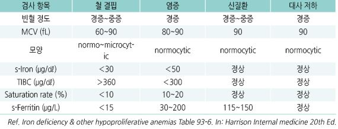
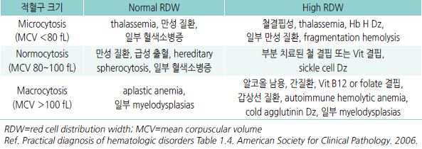

# 빈혈 Anemia

## 일반 사항
- WHO 진단 기준 [Hb] : 성인 남 ＜13 g/㎗, 여 ＜12 g/㎗

- 성별/연령의 참고치에서 2 표준편차 이하

#### Hg (g/㎗)/ Hct (%) 평균값
- 청소년 : Hb 13/ Hct 40

- 남성 : Hb 16(±2)/ Hct 47(±6)

- 여성 : 월경기- 13(±2)/40(±6); 임신- 12(±2)/37(±6); 폐경기- 14(±2)/42(±6)

## 원인
- 영양 결핍 : 철(가장 흔함), Vit B9(엽산), Vit B12(코발라민)

- 만성 질환 : 암, HIV 감염, RA, 신장 질환, 크론병

- Aplastic anemia : 감염, 약물, 자가면역 질환, 독성 물질 노출

- 백혈병, myelofibrosis, sickle cell anemia, thalassemia, malaria

- 용혈, 출혈

### 위험 인자
- 영양 섭취 부족, 편식, 채식주의자

- 연령 : 급성장기, 고령

- 여성 : 폐경 전, 임신/수유, 과다 월경

- 가족력

- 빈번한 헌혈

- 시설/병원 입소자

- 알코올 남용, 약물

- 약물 상용 : NSAID, 제산제(특히 PPI)

- 위장관 질환 : 소화성 궤양, IBD

- 감염

- 만성 질환 : 암, 신장 질환, 간질환, 혈액 질환, 면역 질환

## 임상 양상
- 종종 무증상 : 서서히 진행되는 경우 심해지기 전까지는(Hb ＜7~8 g/㎗) 자각 증상 없음(특히 젊은층); 지속되면 전신의

    심각한 문제를 일으킴

- 피로, 무기력, 운동 능력 저하, 빈호흡, 빈맥(특히 운동 시)

- 어지럼(lightheadedness), 두통, 불안정, 집중력 장애

- 입마름, 수족 냉증, 월경 이상

- 창백, 구각구순염, 혀 유두 위축, 숟가락 손톱(koilonychia), 부서지는 손톱, 탈모

- 림프절증, 간비장 비대, 골 압통(특히 흉골, ant tibia)

## 진단
- 빈혈에 대한 다른 원인이 없으면서 Cr ＞2 ㎎/㎗인 경우에는 신장 문제에 의한 빈혈 고려

- 손을 활짝 폈을 때 손바닥 손금 색조가 주변 피부색보다 창백하면 Hb ＜8 g/㎗ 추정

### 검사
- 빈혈 검사 : CBC(RBC, Hb, Hct, RDW, MCV, MCH, MCHC), 철, ferritin, TIBC

- LFT, RFT, TSH

- 대변 guaiac 검사, 기생충 검사

- 위/대장 내시경 검사

- 골수 생검 : 혈액 검사로 원인을 찾지 못함, 혈구 감소, 기저 골수 이상 의심 시 고려

#### Hb/Hct 정상 범위에 대한 고려 상황
- 임신부, 운동선수 : 혈장량의 증가로 산소 운반 능력이 정상 상태 임에도 Hb나 Hct가 정상치보다 낮게 나타날 수 있음

- 탈수 상태 : 산소 운반 능력이 저하 상태임에도 혈장의 농축으로 Hb나 Hct가 정상으로 보일 수 있음

- 고소 지역 생활자 : 낮은 고도 지역 생활자보다 Hb이나 Hct 값이 높음

- 흡연자 : CO의 영향으로 Hct가 증가함(빈혈의 기준값을 보다 높게 설정해야 함)

### Hypoproliferative Anemia 감별
    

### RBC 용적에 따른 감별
    

### 선별 검사
- 청소년 및 가임기 여성 : 5~10년마다 Hb 또는 Hct 검사

  •다음의 경우 매년 검사 : 과다 월경, 적은 철분 섭취, 철분 결핍 병력

- 임신 여성 : 첫 방문 시 검사

- 남성 및 폐경기 여성 : 규정된 선별 검사 일정 없음

## 

## ￭ 철결핍빈혈 Iron Deficiency Anemia
    (☞ p.1026)

- hypochromic microcytic anemia; 가장 흔한 빈혈 형태 

- 혈청 ferritin ＜15 ng/㎖

    TIBC ＞360 ㎍/㎗

    혈청 Fe ＜30 ㎍/㎗

    transferrin saturation rate(=혈청 철÷TIBC) ＜10%

## 

## ￭ 만성 질환 빈혈 Anemia of Chronic Disease

### 일반 사항
- 만성 전신 감염, 염증, 악성 종양 중에 발생하는 빈혈

- 두 번째로 흔한 빈혈 형태

- normocytic, normochromic, hypoproliferative anemia

- 증상 : 원인 질환에 의한 증상 및 빈혈의 일반적인 증상

### 원인

#### 기전
- functional iron 결핍 → RBC 생산 감소

- proinflammatory cytokine(IL, TNF, BMP, INF; 만성 질환에서 출현) → iron homeostasis 변화, erythropoietin 생성 및 작용

    억제, hepcidin 생성 증가(장내 철분 흡수 방해)

- inflammatory cytokine에 의한 erythrophagocytosis 증가, oxidative damage, RBC 수명 단축

#### 원인 또는 위험 인자
- 급만성 감염 : HIV, HCV, 농양, 결핵, 골수염, 진균 감염, 기생충 감염

- 만성 질환 : RA, SLE, sarcoidosis, temporal arteritis, IBD, SIRS, 간/신/심장 질환

- 악성 종양

- 고령(cytokine dysregulation, 대사 저하)

- 대사 저하 : 영양 결핍(단백질), 갑상선 질환, 당뇨병, Addison병

### 진단
- Hb : 감소( ＜8 g/㎗는 드묾)

- MCV : 80~100 fL (normocytosis)

- 혈청 철 : 감소(＜50)

- ferritin : 정상 또는 증가(30~200 ㎍/L)

- TIBC : 감소(＜300)

- Vit B12, folate : 감소(섭취/흡수 저하)

- reticulocyte count : 감소(reticulocyte index ＜20,000~25,000/㎕)

Management

#### Erythropoietin stimulating agent(ESA)
- 유전공학적으로 세포 배양을 통하여 만들어진 erythropoietin; 골수에서 RBC 생성을 자극 

- 종류 : epoetin alfa(Epogen, Procrit),  darbepoetin alfa(Aranesp)

- 대상 : Hb ＜10 g/㎗인 만성 신부전, RA, IBD, HIV, 일부 암(보험주의)

- 부작용 : 심혈관계 합병증 증가, 혈전색전증 증가, 일부 암의 악화, 사망률 증가

#### Iron
- 대상 : 철분 결핍 동반, erythropoietin에 대하여 저항

- 경구 철분제 : ferrous sulfate (✽철분의 장내 흡수율이 저하되어 있어 효과 저하) (☞ p.1028)

- IV 철분제 : ferric gluconate. iron sucrose, iron dextran, ferumoxytol

#### 수혈
- 대상 : 생명을 위협하는 심한 빈혈

- ＜7 g/㎗인 경우 대부분 수혈 치료가 필요

### 모니터링
- Hb ＜12 g/㎗로 유지; Hb을 정상 수준으로 유지하면 사망률이 상승함

- 3개월마다 transferrin saturation 및 ferritin을 모니터링

## 

## ￭ Vit B12 결핍 Cobalamin Deficiency

### 일반 사항
- CNS의 myelination 및 기능 유지에 필수 요소

- 1일 요구량 3~5 ㎍, 체내 저장량 2~5 ㎎(약 3년 필요량에 해당)

- 흡수 과정 : 위산에 의해 음식에서 분해되고 내인자에 결합되어 회장 말단부에서 흡수

- 결핍 시 영향 : 빈혈(서서히 진행; megaloblastic anemia), methylmalonic acid↑(신경막에 영향을 미치는 fatty acid 합성

    이상), homocysteine↑(신경 독성), 심한 경우 골수 기능 장애(WBC↓, 혈소판↓)

- 유병률 : 1~2%; 고령- 10~15%

### 원인
- 섭취 부족 : 엄격한 채식주의자

- 위장관 이상(흡수 장애 유발) : 내인자 결핍(pernicious anemia), 위축성 위염, 무위산증, 제산제/위산 분비 억제제 장기 복용,

    전위 절제술, 회장 말단부 절제, 크론병, 췌장 이상, 기생충 감염

- 흡수를 저해하는 약물의 장기 투여 : PPI, H2 차단제, metformin, neomycin

- 복합 : 음주, 고령

### 임상 양상
- 피로, 허약, 창백, 우울

- 설염 : 혀가 밋밋해지고 붉어지며 통증, 미각 이상

- 위장 장애 : 식욕 부진, 설사

- 신경 장애 : 감각 이상, 조화 운동 불능/낙상, 반사 저하, 근육 긴장 저하, 신경정신 이상, 치매

  •6개월 내 치료가 이루어지면 CNS 증상은 회복될 수 있음

### 진단
- MCV ＞100 fL, RDW↑, reticulocyte↓

- Vit B12 검사

- Schilling test

- 고령자 등 고위험군에서 매년 Vit B12 screening 고려

---

## Management

### 치료 방침
- 함유 식품 섭취 : 모든 동물성 식품(예: 소간, meats, 생선, 유제품, 계란) (✽채소/과일에는 없음)

- 일부 환자에서는 장 점막 위축으로 인하여 엽산이 동시에 부족하므로 처음 수개월간 folic acid를 함께 투여; 1 ㎎ qd [폴산]

### Cobalamin
- 경구제 : methylcobalamin 0.5 ㎎ tid [메치코발]

- 주사제 : 중증에서 고려; IM or deep SC (IV는 금지); cobamamide [액티나마이드 주]

  •1회 100~1000 ㎍을 qd ×6~7d → 임상적 호전 및 reticulocyte 반응이 있으면 격일 ×7회

    → 3~4일 마다 ×2~3wk (이 시기에 보통 hematologic value가 정상화됨) → 월 1회 유지

  •또는 100~1000 ㎍을 1주간 매일 → 1달간 매주 → 이후 매달 투여

  •주사제로 교정 후 경구제로 이어갈 수 있음; mecobalamin 0.5 ㎎ bid

### 모니터링
- 치료 직후 증상 개선(well being)을 느낌

- 저칼륨혈증이 치료 초기 수일간 발생할 수 있음(특히 심한 빈혈에서 발생)

- 활발한 reticulocytosis가 5~7일 후, 혈액학적 정상화는 2개월 후 이루어짐

## 

## ￭ 엽산 결핍 Folate Deficiency, Vit B9

### 일반 사항
- DNA/RNA 합성, 단백질 대사, homocysteine 분해 작용, RBC 생성에 기여; 태아 성장에 필수

- 1일 요구량 50~100 ㎍, 체내 저장량 5 ㎎(2~3개월 필요량에 해당)

- 유병률 : 일반적인 식사를 하는 건강한 상태에서는 거의 발생하지 않음(예외: 임신부)

### 원인
- 엽산 필요량↑/소실↑ : 임신, 수유, 건선, 암, 만성 용혈, IBD, homocystinuria, 소변 소실 과다(예: CHF, 활동성 간질환)

- 엽산 섭취↓/흡수↓ : 고령, 알코올 남용, 너무 익힌 음식, gluten induced enteropathy, 셀리악병, IBD, short bowel syndrome;

    Vit B12 결핍에 의한 위장 점막 megaloblastosis

- 약물 : 항경련제(예: phenytoin, barbiturate), DMARD, nitrofurantoin, trimethoprim

### 임상 양상
- Vit B12 결핍 증상과 유사; 엽산 결핍만 있는 경우 신경학적 이상은 없음

- 체중 증가 지연, 식욕 부진, 창백, 만성 설사, 호흡기 감염, 출혈 경향

### 진단
- megaloblastic anemia : MCV ＞100 fL, RDW↑, reticulocyte↓

- RBC folic acid ＜150 ng/㎖

---

## Management

### 함유 식품 섭취
- 짙은 녹색 잎채소(예: 시금치, 상추, 아스파라거스, 브로콜리), 콩류, 해바라기 씨, 신선한 과일, 전곡류, 간, 해산물, 계란

### Folic acid
- 1(~5) ㎎/d ×1~4개월 또는 검사로 치료가 확인될 때까지 투여 [폴산]

- 확진이 되지 않은 경우 저용량 folate(0.1 ㎎/d)를 투여하고 72시간 후 혈액학적 반응을 평가;

    활발한 reticulocytosis는 5~7일 후, 혈액학적 정상화는 2개월 후 이루어짐(Vit B12 교정 때와 유사)

- 주의 : Vit B12 결핍 환자에서 folate 투여가 혈액학적 반응을 만들어 신경 손상의 진행을 차폐할 수 있으므로 엽산 투여 시

    Vit B12 검사가 필요(검사가 나올 때까지 Vit B12를 병용)

> **질병코드**
D63 달리 분류된 만성 질환에서의 빈혈

E53.8 기타 명시된 비타민 B군의 결핍증

D52.9 상세불명의 엽산결핍빈혈
