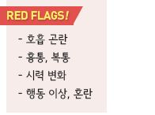
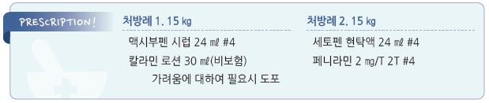

# 홍역 Measles

## 일반 사항

* measles virus 감염에 의한 급성 열성 발진성 질환
* 초기에는 감기 등 다른 호흡기 바이러스 질환들과 구별하기 어려움
* 잠복기 : 7~~21일(평균 10~~12일)
* 전염 기간 : 발진 3일 전(전구기)\~발진 출현 후 4일
*   전염 경로 : 호흡기 분비물 비말 감염(droplet aerosol)(✽기침/재채기 후 2시간 동안 방안 공기에 존재)

    → 호흡기를 통하여 침입, 점막에서 증식
* 경과 : 대부분 자연 치유, 대증 치료로 완화
* 한 명의 환자가 발생하여도 유행으로 판단하여 대처
*   합병증 : 1세 미만 및 20세 이후 발병 시 흔함; 중이염(가장 흔함; 3\~9%), 비부비동염, 기관지염, 세기관지염, croup,

    폐렴(1\~6%; 가장 흔한 사망 원인), 설사, 구토, 충수염, 뇌염(0.1%)

## 원인

* 원인균 : measles virus

### 위험 인자

* 감염 위험 : 부적절한 백신 접종, 유행 지역 여행
* 중증 위험 : 임신, ＜5세, ＞20세, 면역 저하, 영양 결핍, Vit A 결핍

## 임상 양상

### 전구기

* 발진 전 3\~5일간; 전염력이 강함
* 미열 → 기침, 콧물, 결막염(3 Cs = cough, coryza, conjunctivitis) → 발진기까지 점차 악화
*   Koplik spot : 하악 제1대구치에 대응하는 볼 점막의, 주위에 충혈이 있는 회백색의 2~~3 ㎜의 반점; 발진 발생 전 1~~4일에

    출현하여 12\~18시간 내 빠르게 소실

### 발진기

* 미열 등 증상 시작 3\~5일 후 발진 출현
* 발열 : 발진 출현 후 급격한 체온 상승(종종 ＞40℃); 발진 후 ＞3일 지속 시 합병증 발생 의심
* 기침 : 10(\~14)일까지 지속
* 심한 경우에 림프절병증(특히 경부, 후두부) 발생
* 동반 증상 : 무른 변, 처짐, 보챔, photophobia, 인후통, 두통, 복통

#### 발진 특징

* 홍반구진성(flat red spot, 홍반 정점에 작은 돌출); 발진들이 서로 융합할 수 있음
*   경과 : 얼굴(주로 이마(hairline 주위), 귀 뒤, 목 윗부분) → 몸통/상지(24시간 내 얼굴, 목, 팔 및 몸통 상부에 발생)

    → 2일째 대퇴부 → 3일째 발 → 출현 순서대로 7일에 걸쳐 점차 소실
* 회복 되면서 종종 표피가 벗겨짐(손발은 벗겨지지 않음)

## 진단

* 유행 시기의 임상 소견으로 진단 (☞ p.845)
* viral culture : 혈액, 비강/구인두/비인두 도말, 결막 분비물, 소변에서 measles virus 검출
* s-IgM Ab : 발진 1\~2일 후 출현하여 1개월 동안 관찰됨; 발진 발생 ＜72시간에는 위음성 가능성이 있음
* s-IgG Ab : 발진 7일 & 2\~4주 후 측정 비교 시 ≥4배 상승; 발진 후 1주 내에는 검출 안 됨
* lymphocyte 약간↓, ESR/CRP 정상
* 간 효소↑, 췌장 amylase↑
* 흉부 X선 : 폐렴 감별이 필요한 경우 시행

***

## Management

## 비-약물 치료

* 안정, 수분 공급
* 마스크 착용

## 약물 치료

#### 해열제

* acetaminophen : 10~~15 ㎎/㎏ q4~~6hr, 최대 5회/d; ≥3개월 연령 허가

\[세토펜 현탁액]\(32 ㎎/㎖. 0.4 ㎖/㎏ qid 또는 1.5\~2 ㎖/㎏/d #4)

* ibuprofen : 5~~10 ㎎/㎏ q6~~8hr, 최대 40 ㎎/㎏/d; ≥6개월 연령 허가

\[부루펜 시럽]\(20 ㎎/㎖. 0.25~~0.5 ㎖/㎏ tid~~qid 또는 1.5 ㎖/㎏/d #3\~4)

* 심한 발열 시 AAP 또는 ibuprofen 중 한 가지를 기본 투여하는 사이에 다른 것을 투여할 수 있음

#### Vit A

* 합병증 및 사망률을 감소시킴
* ＜6개월- 5만 IU, 6\~11개월- 10만 IU, ≥1세- 20만 IU; qd ×2d

#### 항바이러스제

* 유효한 항바이러스제는 없음
* 중증의 면역 결핍 환아에서 ribavirin을 고려 할 수 있으나 효과 입증 안 됨 (✽FDA 비승인)

#### 항생제

* 폐렴, 중이염 등 동반 시 고려

## 예방 및 관리

* 수동 면역 : 모체에서 받은 수동 면역이 출생 후 6개월간 유효
* 능동 면역 : 감염 후 면역 효과가 평생 지속됨
* 예방접종

### 사회 격리

* 발진 출현 후 4일간 출근/등교 제한

### 접촉자 조치

*   백신 접종을 하지 않았거나 면역성이 입증되지 않은 경우 : 접촉 72시간 내 MMR 또는 접촉 6일 내 면역 글로불린을 주사

    → 백신이나 면역 글로불린 주사를 하지 못한 경우에는 환경 내 마지막 환자의 발진 발생 후 2주까지 사회 격리
* 가정에서 환자는 마스크를 착용하고 있으며 면역성이 있는 사람(예: 백신 접종 완료자)만 접촉

#### 백신

* 대상 : 생후 6개월 이상 (☞ p.1118)
* 생후 6개월\~12개월에 백신을 접종한 경우에는 생후 12개월 이후에 일반 일정과 동일하게 2회 접종을 시행

#### 면역 글로불린

* 대상 : 고위험군; 6\~12개월, 임신부, 심한 면역 저하
* 노출 6일 이내 투여
* 용법 : 0.25 ㎖/㎏ IM; 면역저하자 0.5 ㎖/㎏, 최대 15 ㎖

> **질병코드** B05 홍역

