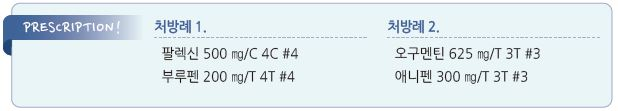

# 이하선염 Parotitis

## 일반 사항
- 여러 가지 원인에 의한 이하선의 염증

- 제균 작용이 없는 serous 액을 생성 분비하기 때문에 다른 침샘보다 감염에 취약함

- 경과 : 보통 자연 치유

- 의뢰 대상 : 중증(예: 화농성 이하선염), 만성, 재발성

### 위험 인자
- 침 정체 : 탈수, 쇠약, 식욕 부진, 거식증, 자가면역 질환(예: Sjögren syndrome)

- 면역 저하, 화학요법, 방사선 치료, 영양실조, 알코올 남용, 결핵

- 조산아, 저체중 출산아

- 부정 교합, 불결한 구강 위생

- 유전, 침샘 기관의 선천적 구조 이상

## 원인 및 임상 양상

### 감염
- 갑자기 발생

- 국소 통증, 부종; 침 분비 유발 음식(매운 음식, 신 음식)이나 저작에 의해 증상 악화

- 국소 부종으로 인하여 trismus, mandible angle 둔화, 귓바퀴의 후상방 이동

#### 바이러스
- 전신 감염으로 시작 → 이하선에 localize → 이하선 염증 및 부종 발생 → 직접 접촉, 공기 전염

- 원인균 : paramyxovirus, parainfluenza virus types 1 & 3, influenza A, coxsackie virus, Epstein-Barr virus(EBV) ,

    cytomegalovirus(CMV), adenovirus (☞ p.1042)

- 소아 이하선염의 가장 흔한 원인

- 전구 증상 : malaise, 식욕 부진, 두통, 근육관절통, 발열

- 보통 양측 이환

- 국소 열감 또는 홍반 없음; Stensen duct 개구부에서의 고름 배출 없음

#### 세균
- 원인균 : S. aureus , anaerobes(oral flora), S. pneumoniae

- 고령자, 신생아(특히 조산아), 수술 후 호발

- 보통 편측 이환

- 국소 경결, 열감, 홍반; 간혹 Stensen duct 개구부에서의 고름 배출

- 전신 발열

#### 진균
- 원인균 : Candida (만성, 입원 환자), Actinomyces (외상력, 충치)

### 비-감염

#### Juvenile recurrent parotitis
- 원인 불명

- 보통 편측 이환

- 통증, 부종; 2차 감염 시 농성 분비물 발생

- 2주 내 회복

- 재발성 : 보통 3~6세에 첫 번째 발생하여 사춘기까지 재발

#### 비감염성 전신 질환
- 양측 이환

#### 물리적 폐쇄
- 원인 : 침돌증, ductal stenosis, 외상

- 편측 이환

** 침돌증(Sialolithiasis)**

- 급성 부종, 통증; 식사에 의해 악화

- 재발성; submandibular gland에 보다 흔하게 발생

#### 약물
- 항콜린제, 항히스타민제, 이뇨제, TCA, 요오드(조영제), 항정신병제(특히 phenylbutazone, thioridazine, clozapine),

    L-asparaginase

#### 기타
- pneumoparotitis : 부는 직업(예: 유리 가공), 잠수부 등에서 이하선 duct에 air trap이 발생

### 만성
- 편측 또는 양측 이하선의 재발성 또는 만성 비압통성 부종

- 주로 중년(40~60세) 이환

- 원인 : Sjögren syndrome, sarcoidosis, HIV, 결핵

- 경과 : 수 주~수년 지속 후 완화

## 진단
- 이하선 부위의 부종 및 압통으로 진단

### 검사
- 배양 검사 : Stensen duct 또는 병소에 대한 needle aspiration

- CBC, amylase : 세균성 감염에서 상승

- mumps 검사 : 볼거리 의심 시 시행

- 농양 형성(파동, 병소 발적, 열감) 의심 시 초음파, CT 검사 고려

---

## Management

## 비-약물 치료 및 예방
- 온찜질 및 마사지

- 금연, 음주 제한

- 적절한 수분 섭취

- 침 분비 유도 : 저작 운동(고형식 식사), 신맛 사탕 빨아 먹기

- 구강 위생 관리

## 약물 치료

### 항생제
1. Staphylococcus 에 대한 경험적 선택으로 7~10일간 치료; 적절한 수분 공급 및 항생제 치료 시 48시간 내 완화 시작

    (☞ p.901)

  •dicloxacillin : 500 ㎎ qid

  •cephalexin : 500 ㎎ qid [팔렉신]

2. 5~7일 내 호전되지 않으면 duct 분비물로 배양 검사, 결과가 나올 때까지 다른 항생제 투여

  •amoxicillin/clav. : amox 875 ㎎ bid [아모크라 듀오]

  •clindamycin : 300~450 ㎎ qid [훌그램]

- 화농성 이하선염에 대해서는 nafcillin, vancomycin 등의 주사제 치료(의뢰 고려)

### 기타
- 진통제, 해열제 : ibuprofen [부루펜], naproxen [아나프록스]

- 침 분비 자극 : pilocarpine [살라겐], cevimeline

- cortisone irrigation : juvenile recurrent parotitis에서 sialendoscopy를 이용하여 시행

- duct ligation, ductoplasty, parotidectomy, sclerotherapy : 만성, 재발성에서 고려

> **질병코드**
K11.2 타액선염

