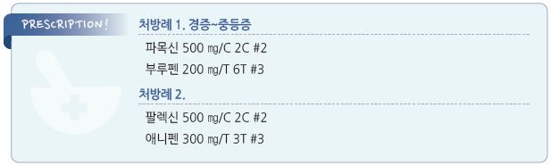

# 림프관염 Lymphangitis

- 피부 손상 또는 국소 외상에 기인한 lymphatic channel의 급만성 염증

## 원인
- 원인균 : GABH Streptococcus (가장 흔함), S. aureus

### 위험 인자
- lymphatic drainage 장애(예: 수술, 방사선 치료)

- 당뇨병, steroid 장기 사용, 면역 저하

- 말초혈관 카테터 유치, IV 약물 남용

- 물림, 피부 곰팡이 감염(무좀), 수두 감염, 기타 피부 손상

## 임상 양상

#### 국소 증상
- lymphatic channel을 따라 국소 림프절까지 이어지는 줄 형태의 발적, 압통, 열감

- 파동성, 종창, 화농성 분비물

#### 전신 증상
- malaise, 식욕 저하

- 발열, 오한

- 두통, 근육통

## 진단
- CBC

- blood 또는 wound culture

- lymphangiography : lymphedema 시 고려

---

## Management

## 약물 치료
- 경험적 항생제 투여

- amoxicillin : 500~875 ㎎ bid [파목신]

- ceftriaxone : 1~2 g IV/IM 1회 [트리악손]

- cephalexin : 500 ㎎ bid [팔렉신]

- azithromycin : 500 ㎎ qd ×1d → 250 ㎎/d qd ×4d; Pc/cepha 알레르기 시 선택 [지스로맥스]

### 대증 치료
- ibuprofen : 400~800 ㎎ tid [부루펜]

- acetaminophen : 650~1,300 ㎎ tid [타이레놀]

## 예방
- 벌레 물림 주의(곤충 퇴치)

- 적절한 상처 관리

> **질병코드**
I89 림프관 및 림프절의 기타 비감염성 장애

I89.1 림프관염 

