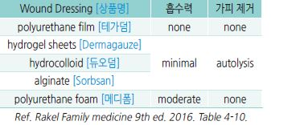
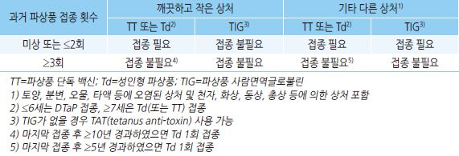

# 상처 관리 Wound Care


### 세척

* 오염된 상처에 대하여 시행
* 생리 식염수 또는 수돗물 이용
* 세척 압력 : 7 psi (19 G 바늘의 35 ㎖ 주사기 사용)

※ 깨끗한 상처에 대한 높은 압력의 세척은 오히려 세균의 확산을 유발할 수 있음

### 소독 (국소 항균제)

* 70% isopropyl alcohol : 살균 효과가 빠름. 단, 살균 효과가 지속되지 않음

> ✽알코올의 살균 작용은 병원균의 단백질을 변성시킴으로써 일어나며, 단백질은 물이 있을 때 더 빨리 변성되기 때문에 순수

> ```
> ethyl alcohol보다 70% 용액의 살균력이 더 우수함.
> ```

*   chlorhexidine 2% : 약한 항균 작용 \[헥시딘 액]

    •혈액 또는 혈청 단백이 존재하는 상황에서도 효과가 있으며 상피 재생을 저해하지 않음
*   povidone-iodine : 살균 작용 \[베타딘 액]

    •혈액 또는 혈청 단백이 존재하는 상처에서는 효과 저하

    •부작용 : 세포 독성, 세포 증식 저해, 화학적 화상, 통증

    •금기 : 넓은 범위 사용, ＜2세, 임신/수유, 갑상선 질환
* Poloxamer-188 : 상처 안쪽 및 점막 세척 가능
*   alcohol + {povidone-iodine or chlorhexidine} 병용 시 알코올의 빠른 작용과 chlorhexidine의 지속 작용으로 각각의 단독

    사용보다 효과적임
*   주의 : benzalkonium chloride, povidone, 과산화수소, 아세트산 등은 fibroblast 및 상피 조직에 대한 독성 작용이 있어

    치유를 방해할 수 있으므로 감염이 발생한 경우에 한하여 제한적으로 사용하고, 상처 안쪽에 대한 사용은 피하며

    재상피화 징후가 나타날 때는 적용을 중지함; chlorhexidine도 상처 안쪽 사용은 피함

### 변연 절제 (Debridement)

* 대상 : 오염된 고르지 못한 상처에 대하여 시행
* 효과 : 치유 및 회복 촉진, 흉터 감소

### 봉합

*   1차 봉합 보류 대상 : 물림, 빠른 속도에 의한 손상, 흙/쓰레기/하수/분변 오염; 철저한 세척 소독을 시행하며 특별한 경우를

    제외하고는 1차 봉합은 피함

### 조직 접착제 (Tissue Adhesive)

* 봉합에 비해 처치에 소요되는 시간이 짧고 통증이 덜함. 빠른 샤워가 가능
* 적절한 선택 시 2 ㎝ 이내 상처에서 봉합과 동일한 결과
* 지혈이 된 상태에서 사용하지 않으면 피가 고일 수 있고 흉터가 안 좋을 수 있음
* 대상 : 장력이 낮고 깨끗한 열상
*   제외 대상 : 경계가 고르지 않은 상처, 땀이 많은 부위, 털이 많은 부위, 지혈이 필요한 경우, 물림, 오염, 움직임이 큰 곳(예:

    고정하지 않은 관절)
* 보통 3분 이내 최고 장력에 도달함; 상처 부위에 연고를 사용하는 경우에는 접착제의 접착력이 저하될 수 있음
* 접착제 \[Dermabond], 접착테이프 \[Steri-Strip]

### 드레싱

*   깊은 상처(예: 욕창)의 경우 dead space가 없도록

    주의하며 필요시 식염수에 적신 거즈 등으로 packing
* 습윤 드레싱 : 콜라겐 합성과 혈관 형성, 상처 치유 촉진

### 기타

*   상처 치유에 영향을 주는 요인 : 흡연, 고령, 당뇨병,

    빈혈, 영양 결핍, 악성 종양, 약물(steroid, NSAID,

    면역억제제)
* 모발 제거 : 시술에 방해되지 않는 한 모발 제거가 반드시 필요하지는 않음
* Keloid : 어두운 피부색 환자, 흉곽 중앙, 볼, 귓불, 10\~20세, 화상 상처에서 호발

### 흉터 감소 도구들의 효과 (비보험)

* Centella asiatica : 현미경적 효과는 있으나 육안적 흉터 감소 효과는 불분명함 \[마데카솔]
*   양파 추출물, 헤파린, 알란토인 복합체 : 흉터 예방에 대한 일부 효과가 있으나(silicon sheet보다 열등),

    이미 발생한 켈로이드에 대한 효과는 불분명함 \[콘투락투벡스 겔]
* Silicon sheet : 흉터 또는 켈로이드에 대한 예방 및 치료에 대하여 일부 효과가 있음 \[켈로코트 겔, 스카클리닉]

※ 양파 추출물 복합제와 silicon sheet 병용 시 보다 효과적일 가능성이 있음

### 파상풍 백신

```
(☞ p.1114)


```

*   tetanus toxoid 함유 백신을 ≥3회 이상 접종한 경력의 ＜7세에서 마지막 접종이 ＞5년된 경우 깨끗하고 작은 것 이외의

    상처 발생 시 DTaP 접종 \[CDC]
