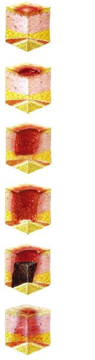
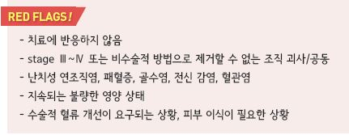
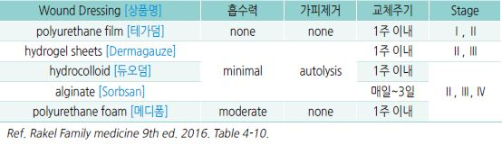
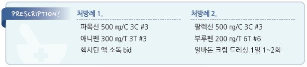

# 압박 궤양/손상 Pressure Ulcer/Injury


## 일반 사항

* 피부 표면과 골(융기부) 사이에 압력이나 마찰이 가해져 발생한 국소 피부 &/or 연조직 손상
* 압박되는 부위보다 피부 상태가 더 중요할 수 있음

### International NPUAP/EPUAP pressure ulcer classification system

```
(2014)
```

#### stage Ⅰ: Non-blanchable erythema

* 피부 유지, 국소 홍반(압박으로 옅어지지 않음)
* 국소 통증, firm, soft, 온도 변화(따듯하거나 차가움)
* 보통 bony prominence를 덮고 있는 부위에 발생

#### stage Ⅱ: Partial thickness skin loss

* 진피의 얕은 부분 소실
* 광택이 나거나 건조한, 붉은 바닥의 얕은 궤양(slough 없음)
* 터지거나 터지지 않은 장액성 물집

#### stage Ⅲ: Full thickness skin loss

* 진피 전층 손실
* 피하지방 노출(근육이나 골은 노출되지 않음)
* slough가 있으면 손상된 깊이를 정확히 판단하지 못할 수 있음

#### stage Ⅳ: Full thickness tissue loss

* 근육이나 골이 노출되는 깊은 손상
* 주위 조직(예: 근육, joint capsule)까지 확장될 수 있음
* 상처 바닥에 slough &/or eschar가 있을 수 있음

#### Unstageable: Depth unknown

* 전층 손실
*   궤양 바닥이 slough &/or eschar로 덮여 있음; slough 및 eschar를 제거할 때까지

    실제 깊이 및 단계를 결정할 수 없음

#### Suspected deep tissue injury: Depth unknown

* 기저 연조직 손상에 의한 자주색 또는 적갈색의 손상되지 않은 피부 또는 혈액성 수포
* 통증, 단단, 무감각, boggy, 온도 변화 등이 선행할 수 있음
* 짙은 색의 상처 바닥, 얇은 eschar, 조직의 추가 손상이 발생할 수 있음

### 호발 부위

* 앙와위 : 발뒤꿈치, 천골, 팔꿈치, 견갑골, 뒷머리
* 복와위 : 팔꿈치, 턱, 가슴, 생식기, 무릎, 발가락
* 측와위 : 귀, 어깨, 팔꿈치(외측), 고관절 부위, 무릎(내/외측), 발목, 발뒤꿈치
* 앉은 자세 : 머리, 어깨, 천골, 엉덩이, 발뒤꿈치

## 원인

* Stages Ⅰ\~Ⅱ : 지속적인 압력, 습기, 전단력, 마찰; 강한 압박이나 저산소증이 없어도 발생할 수 있음
* Stages Ⅲ\~Ⅳ : 압박 및 저산소증

위험 인자

* 습한 피부, 체온 상승, 고령, 지각 감각 손상
* 이동성/활동 제한, 감각 저하, 의식 저하, 요실금, 변실금
* 피부 관류 장애 : 혈관 질환, 당뇨병, 빈혈, 흡연, 탈수
* 영양 결핍(저알부민혈증), 전신 건강 상태 불량
* 관리자의 부적절한 관리
* pressure injury 발생 병력

※ 영양 결핍과 낮은 BMI는 나쁜 예후의 척도가 됨

## 진단

### 신체검사

* blanchable or non-blanchable erythema, 피부 온도, 부종, 피부 색(색상표 활용)

### 검사

* 분비물/조직 배양 검사, 골 생검 : 선택적 시행
* CBC, 혈액 배양, X선, MRI : 전신 감염 또는 깊은 조직 감염 시 고려
* 영양 평가 : 영양/칼로리 섭취량, 혈청 단백질/알부민, 빈혈
* ankle-brachial index, 도플러 초음파 : 하지 상처에 대하여 고려



***

## Management

### 치료 방침

1. 압력 최소화, 잦은 체위 변경
2. 통증 관리
3. 영양 및 hydration : 적절한 영양 공급(단백질, Vit, 칼로리, 수분 등)
4. 병변 관리, 괴사 조직 제거
5. 습윤 유지(습윤 드레싱)
6. 육아 조직 및 상피 조직 형성 촉진
7. 감염 관리, 청결/건조 상태 유지, 요실금/변실금 관리

* 2주 내 회복되는 징후가 없으면 재평가 및 치료 계획 수정

### 단계별 관리

* stage Ⅰ : 예방(피부 보호); transparent thin film(polyurethane film) 드레싱
* stage Ⅱ : 습윤 드레싱; transparent film(hydrocolloid)
*   stages Ⅲ\~Ⅳ :

    ① 괴사 조직 제거.

    ② 삼출성 병변에 대하여 흡수성 드레싱(Ca alginate, foam, hydrofiber), 건조 병변에 대하여

    습윤 드레싱(hydrocolloid, hydrogel),

    ③ 감염 치료

### 치유 평가 (Pressure ulcer scale for healing)

```
[National Pressure Ulcer Advisory Panel]
```

*   배점 (https://www.sralab.org/sites/default/files/2017-06/push3.pdf)

    •면적(가장 긴 길이×폭; ㎠) : 0=0점, ＜0.3=1점, \~0.6=2점, \~1.0=3점, \~2.0=4점, \~3.0=5점,

    \~4.0=6점, \~8.0=7점, \~12=8점, \~24.0=9점, ＞24=10점

    •삼출물 : none=0점, light=1점, moderate=2점, heavy=3점

    •조직 형태 : sloughing 또는 necrosis 평가; closed=0점, epithelial tissue=1점, granulation tissue=2점, slough=3점,

    necrotic tissue=4점
* 총점 감소는 회복, 증가는 악화를 의미

### 체위 변경, 압력 최소화

#### 자세/체위 관리

* 자주 체위 변경 : 2시간마다. 들어서 변경(끌지 않음)
*   누운 자세 : 좌/우 30도 기울임 자세(90도 측면 누임보다 기울임이 유리), 필요에 따라 엎드린 자세(장시간 유지는 피함);

    침대 머리 부분은 가능한 한 평평하게 함; 환자가 침대 레일과 닿지 않도록 충분히 넓은 침대 선택
*   앉은 자세 : 제한된 시간 동안 적절한 의자/휠체어에 앉아 있음(침대를 벗어남), 다리는 받쳐 올리고 기울어진 의자(reclined

    chair), 똑바로 앉을 때는 발바닥이 바닥/받침에 닿도록 함(무릎 각도는 ＜90도); 앞으로 미끄러지지 않도록 주의,

    오래 앉아 있을 때는 압력이 완화되도록 움직임 교육

#### 도구 사용

* 발포 고무/공기/물/겔 등이 들어 있는 매트리스; 앉아 있을 때 쿠션
* 공중 그네

#### 회피

* 피해야 하는 자세 : 직각으로 옆으로 누움, 머리 부위가 30o 이상 올려짐, semi-recumbent
* 돌출 부위 마사지
* 도넛 모양의 도구(도넛 부위에 압력이 집중됨)
* 화학 제품에 대한 피부 직접 노출

### 통증 관리 : 진통제

* ibuprofen : 400\~800 ㎎ tid \[부루펜]
* naproxen : 275 tid\~500 ㎎ bid \[낙센]

### 영양, hydration

* 수분 : 30 ㎖/㎏/d
* 칼로리 : 30\~35 ㎉/㎏/d
* 단백질 : 1.25\~1.5 g/㎏/d
* Vit C, Zn : 고용량 투여 시 유효하다는 보고가 있음
* 철저한 혈당 관리

### 세척/소독

* 생리 식염수로 매일 시행
*   세포 독성이 있는 소독제 : fibroblast 및 상피 조직에 대한 독성 작용으로 치유를 방해할 수 있으므로 감염이 발생한 경우에

    한하여 제한적으로 사용

    •benzalkonium chloride, povidone, 과산화수소, acetic acid (☞ p.1056)

### 괴사 조직 제거 또는 절제

*   wet-to-dry 드레싱 : 적신 거즈 적용 → 건조해진 거즈를 제거할 때 괴사 조직이 함께 떨어져 나옴

    •거즈 드레싱은 wet-to-dry 드레싱 때에만 적용함

    •조직이 심하게 제거되면 회복이 지연될 수 있음

    •교체 시 통증이 있거나 상처 바닥이 깨끗해지고 건조해지면 중단
*   수치료(hydrotherapy) : 걸쭉한 삼출물 및 괴사 조직 제거 목적으로 적용

    •19 G 바늘 또는 혈관 카테터 주사기, water-jet 등을 사용

    •기구의 분출구가 상처에 너무 가까이 위치하지 않도록 주의
*   자가용해법 : 밀폐 드레싱으로 상처 내에 존재하는 자가 용해를 일으키는 효소를 보존

    •thin film, hydrocolloid 등을 사용하여 분비물이 적고 감염되지 않은 stage Ⅰ\~Ⅱ에 적용
*   효소법 : papain, urea, collagenase 등으로 괴사 조직을 소화시킴

    •정상 조직을 손상시킬 수 있음

    •감염 시 금기
*   dextranomer : highly dextran polymer 구슬

    •삼출물, 세균, 오염 물질이 구슬에 흡수됨. 육아 조직 형성 및 상처 치유를 촉진

    •1일 1회\~수회 상처에 도포하고 거즈로 덮음
*   외과적 제거 : 두꺼운 딱지 및 괴사 조직을 외과적으로 제거

    •발뒤꿈치 등에 있는 안정된(홍반이나 파동 없이 건조하고 붙어 있는) 가피는 제거하지 않음

### 습윤 드레싱

* 효과 : 콜라겐 합성, 혈관 형성, 상처 치유 촉진
*   깊은 욕창(stage Ⅲ, Ⅳ)의 경우 dead space가 없도록 주의하며 필요시 식염수로 적신 거즈 등으로 packing(거즈로 드레싱을

    하는 경우 거즈가 마르지 않도록 주의해야 함)
*   습윤 드레싱 소재

    

### 감염 관리

* 필요시 조직 배양 검사 시행
*   모든 욕창에는 피부 균주 또는 분변 균주가 존재하며 이것이 감염을 의미하는 것은 아니므로 상처 표면 배양 검사는 도움이

    거의 되지 않음

#### 항생제

* 감염 소견이 있는 경우 선택
* 국소 항생제 : 2주간 도포 : silver sulfadiazine \[실마진 크림], chlorhexidine [헥시딘 액](%EC%86%8C%EB%8F%85%EC%95%A1/)
* 전신적 항생제 (☞ p.901)

#### 감염 의심 소견

* 치유 지연, 2주간의 적절한 치료에도 불구하고 호전되지 않음
*   큰 크기 &/or 깊은 병소, wound breakdown/dehiscence, 괴사 조직, friable granulation tissue, wound bed에 pocketing

    or bridging
* 삼출물 증가 또는 성상 변화, 통증 증가, 악취, 주변 조직 온도 상승

#### Biofilm 의심 소견

* 적절한 항생제로 치료 실패 또는 치유 지연
* 삼출물 증가
* poor granulation or friable hypergranulation 증가
* low level erythema &/or low level chronic inflammation
* 2차 감염 징후

> ✽biofilm : 세균 스스로 생성한 다당체를 매개로 인접한 세균이 응집하여 막을 형성한 상태

#### 감염 확산 의심 소견

* 치유 지연
* wound breakdown/dehiscence, 경결
* 주위로 확산되는 홍반; 주변 피부의 crepitus, fluctuance, discoloration; lymphangitis
* malaise, lethargy, confusion, delirium, anorexia

### 기타

* growth factor/platelet-rich plasma : 육아 및 상피 조직 형성 촉진 주장; 증거 부족
* electrical stimulation : stage Ⅲ/Ⅳ. 또는 난치성 stage Ⅱ 병변에 대하여 고려(치유 촉진)
* negative pressure wound therapy : stage Ⅲ/Ⅳ에서 초기에 고려(크기/깊이 감소)
* high frequency 또는 non-contact low frequency ultrasound therapy : 증거 부족
* 수술 : full-thickness wound에 대하여 고려; 봉합, 피부 이식, musculocutaneous flap, free flap

## 예방

* 압력을 줄여주는 도구(예: air-fluid bed) 사용; 부분적으로 압박이 가해지는 제품 주의
* 가능한 한 홍반 부위가 압박을 받지 않는 자세를 취함
* 압박 궤양 위험이 있는 부위를 마사지 또는 세게 문지르지 않음(특히 고령에서 주의)
* 피부 청결 유지, 개별적인 용변 관리 계획 수립; 요/변실금 발생 시 즉시 처리
* 중성 피부 세정제 사용; 알칼리성 제품 사용 회피
*   피부 보호막 제품을 사용하여 과도한 습기 노출로부터 피부를 보호(✽습기가 욕창 발생 위험을 높임)

    \[보소미]\(zinc oxide 연고), \[카빌론]\(피부 방수액/스프레이) (비보험)
* 피부 손상 위험을 줄이기 위하여 피부가 지나치게 건조한 경우 보습제 고려 (☞ p.867)
* 필요시 뼈의 돌출부(예: 뒤꿈치, 천골부)에 polyurethane foam 적용 고려
* 압박 손상 가능성이 있는 사람에 대하여 영양 평가 시행 및 관리(고칼로리, 고단백질, 영양제)

> **질병코드** L89 욕창궤양 및 압박부위


